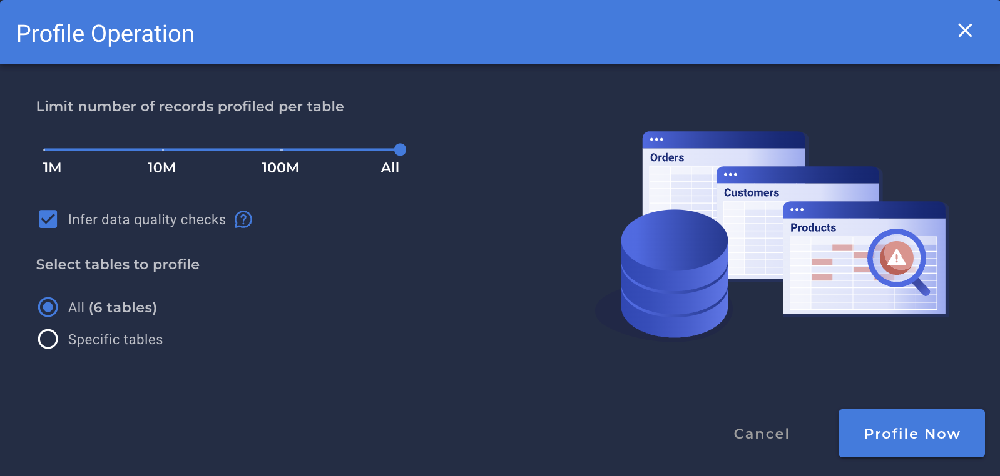
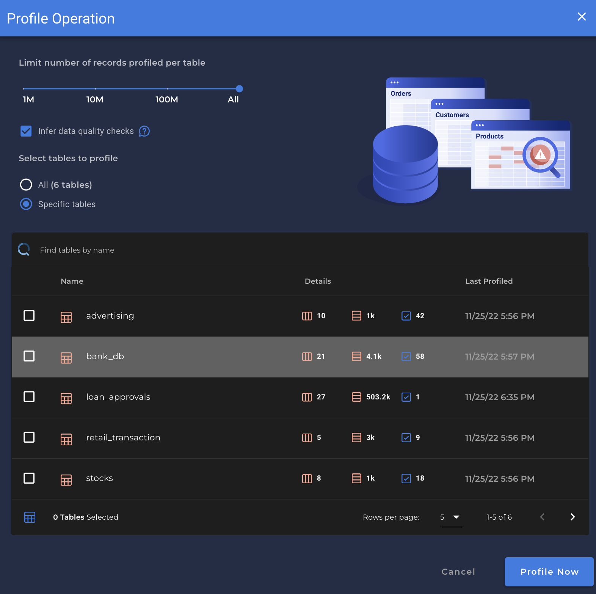

# Profile Operation

* A `Profile Operation` where no limits are explicitly set and an attempt is made to analyze every available record in all available Containers. Full Profiles provide the benefit of generating metadata with 100% fidelity at the cost of maximum compute time.

* The Profile Operation is executed on a Datastore to analyze the named collections of data (e.g. tables, views, files, topics) within it. The operation will:

    * Identify the fields within the collection.
    * Gather statistical data about each field according to its declared or inferred type.
    * Submit that metadata to the Qualytics Inference Engine to produce appropriate data quality checks.
    * Tested the inferred data quality checks against actual source data to tune desired sensitivities.

!!! note
    * A new Profile Operation can be executed at any time to update the trained data quality checks produced by the Inference Engine.

---
# Operation Configuration

A Profile Operation can be configured with the following options:

* `Record limit` - To profile only a subset of the available data.
* `Disable Check Inference` - To update field metadata without adjusting or infering data quality checks.
* `Target selection`
    - You can select to all tables.
    - Or target only a subset of the available named collections.

    
