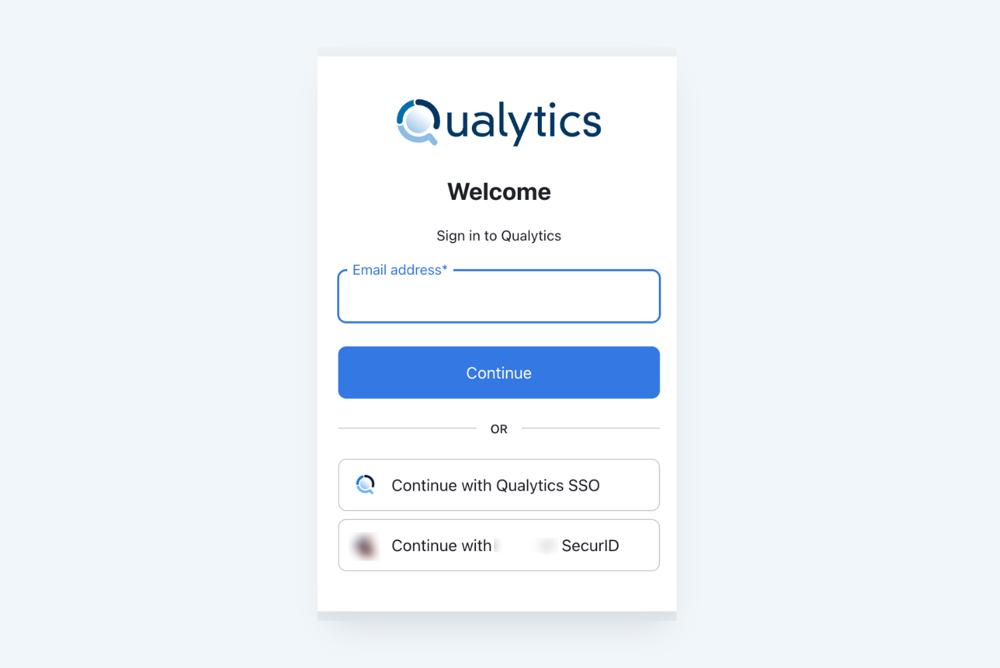
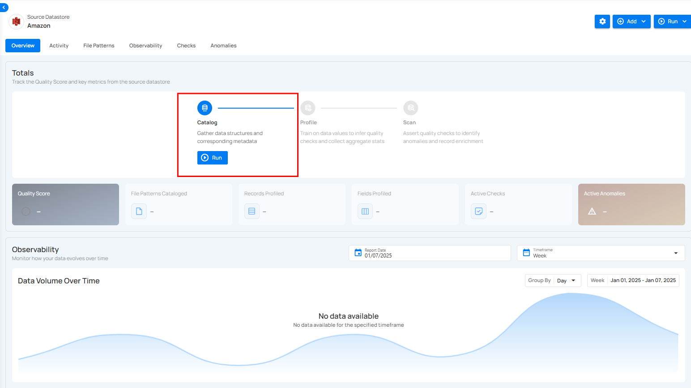
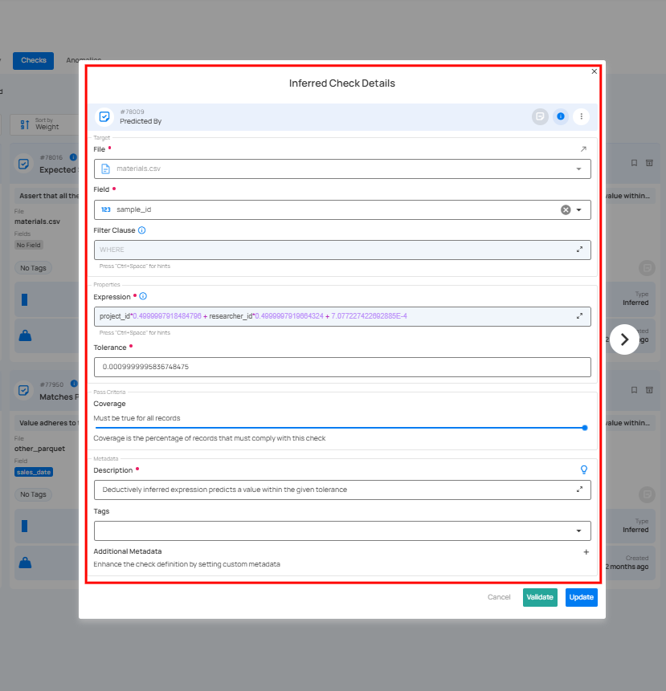
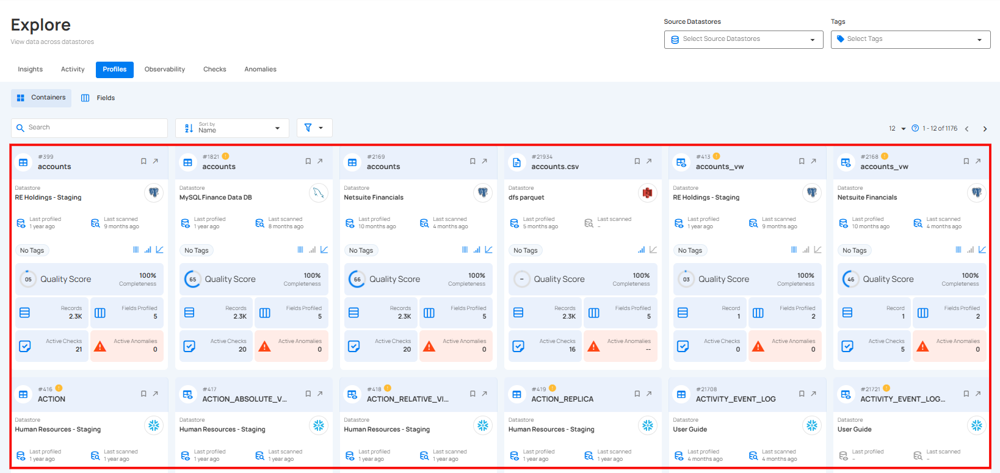
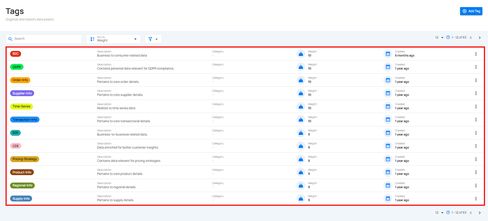
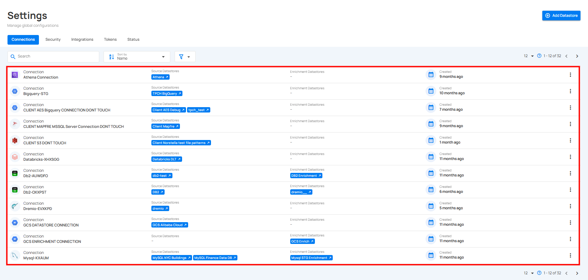
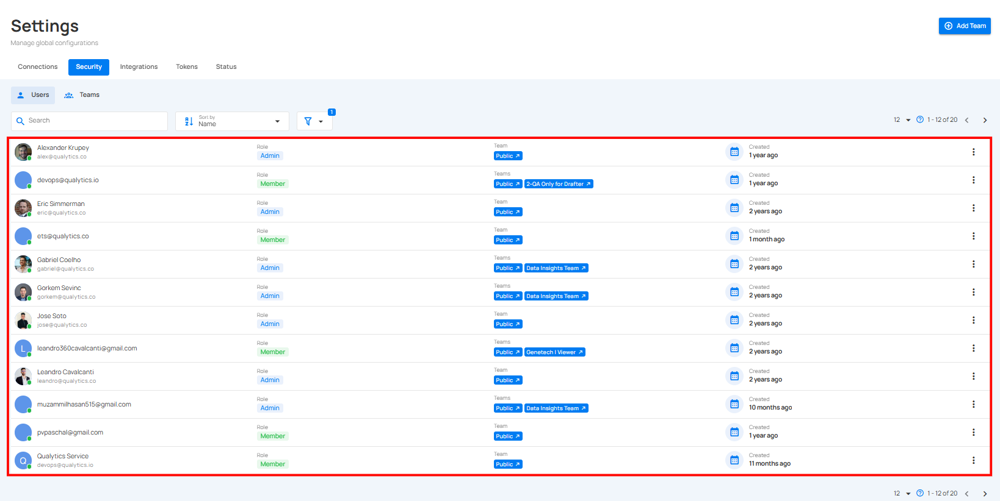

# Quick Start Guide

Welcome to Qualytics! This guide will help you quickly get up and running with the platform, from initial setup through your first data quality operations. Whether you're a business user or technical administrator, you'll find everything needed to start managing data quality at scale.

Let's get started 🚀

## Deployment Access

Each Qualytics deployment is a single-tenant, dedicated cloud instance, configured to your organization's requirements. Your deployment will be accessible via a custom URL (e.g., `https://acme.qualytics.io`), with corresponding API documentation at `/api/docs`.

## Onboarding Process

The [Qualytics onboarding process](./onboarding.md) ensures your environment is perfectly tailored to your needs:

### 1. Screening and Criteria Gathering

Our team works with you to understand your specific needs, including:

- Evaluating sample data requirements.
- Identifying primary success criteria.
- Exploring relevant use cases for your environment.
- Determining deployment specifications.

### 2. Environment Setup

Based on your requirements, we:

- Create your custom deployment URL.
- Configure your preferred cloud provider and region.
- Set up initial security parameters.
- Establish integration endpoints.

### 3. User Access

Once deployment is complete:

- Team members receive email invitations.
- Roles are assigned based on your specifications.
- Access credentials are securely distributed.

!!!tip
    Please check your spam folder if you don't see the invite.

See [our onboarding page](./onboarding.md) for a more detailed view of what to expect during onboarding!

## Signing In

Qualytics supports two authentication methods:

### Method 1: Direct Credentials

Ideal for:

- Initial platform evaluation.
- Proof of Concept (POC) phases.
- Environments without SSO integration.

### Method 2: Enterprise SSO

For production deployments:

- Integrates with your organization's Identity Provider.
- Supports standard SSO protocols.
- Provides seamless access management.

## Getting Started Checklist

To begin using Qualytics, you'll complete these key steps:

1. Connect Your First Datastore.
2. Run Initial Profile Operation.
3. Review Generated Quality Checks.
4. Configure Monitoring & Alerts.

Let's walk through each step in detail.

## Understanding Datastores

In Qualytics, a Datastore represents your data source connection. Qualytics supports any Apache Spark-compatible data source, including:

### JDBC Datastores

- Traditional relational databases (RDBMS).
- Data warehouses.
- Analytical databases.

### Distributed File System (DFS) Datastores

- Cloud storage (AWS S3, Azure Blob, GCP).
- Raw files (CSV, XLSX, JSON, Avro, Parquet).
- Local file systems.

## Connecting Your First Datastore

### Adding a Source Datastore

1. From the main menu, select "Add Source Datastore":

   

2. Select your datastore type.
3. Provide connection details.
4. Test connectivity.
5. Configure an Enrichment Datastore (strongly recommended).

!!!warning
    While optional, not configuring an Enrichment Datastore limits platform capabilities.

### Enrichment Datastores

An Enrichment Datastore serves as the storage location for:

- Anomaly detection results.
- Metadata and profiling information.
- Quality check outcomes.
- Historical analysis data.

You can either:

1. Configure a new Enrichment Datastore.
2. Select an existing Enrichment Datastore from the dropdown.

## Core Operations

After connecting your datastore, three fundamental operations manage data quality:

### 1. Catalog Operation

The first step in understanding your data:

- Systematically collects data structures.
- Analyzes existing metadata.
- Prepares for profiling and scanning.
- Runs automatically on datastore creation.

### 2. Profile Operation

The Profile operation performs deep analysis of your data:

- Generates comprehensive metadata.
- Calculates statistical measures:
    - Basic metrics (type, min/max, and lengths).
    - Advanced analytics (skewness, kurtosis, and correlations).
    - Value distributions and patterns.
- Automatically infers data quality rules.
- Uses machine learning for pattern detection.

Our profiling engine analyzes:

- Field types and patterns.
- Value distributions.
- Statistical relationships.
- Data quality patterns.
- Structural consistency.

The engine uses machine learning to:

- Identify column data types.
- Discover relationships.
- Generate quality rules.
- Detect anomaly patterns.

### 3. Scan Operation

The Scan operation actively monitors data quality:

- Asserts all defined quality checks.
- Identifies anomalies and violations.
- Records results in the Enrichment Datastore.
- Generates quality scores.

The first scan runs as a "Full" scan to establish baselines. After completion, you can review:

- Start and finish times.
- Records processed.
- Anomalies detected.
- Quality scores.

## Managing Data Quality

### Quality Checks

Qualytics uses two types of quality checks:

#### 1. Inferred Checks

- Automatically generated during profiling.
- Cover 80-90% of common quality rules.
- Based on statistical analysis and ML.
- Continuously refined through operation.

#### 2. Authored Checks

- Manually created by users.
- Support complex business rules.
- Use Spark SQL or Scala UDFs.
- Can be templated and shared.

## Platform Navigation

### Explore Dashboard

The Explore interface provides comprehensive visibility:

#### 1. Insights

- Overview of anomaly detection.
- Quality monitoring metrics.
- Filterable by source, tags, and dates.

  
  
#### 2. Activity

- Operation history and status.
- Data volume heatmaps.
- Anomaly tracking.

  

#### 3. Profiles

Unified view of all data assets:

- Tables and Views.
- Computed Assets.
- Field-level Details.

  

#### 4. Observability

Monitor platform health and performance:

- Volume metrics.
- Quality trends.
- System health.

  

#### 5. Checks

Unified view of all data quality validations across datastores:

- Active, Draft, Favorite, and Archived checks.
- Filter by Source Datastore, Tags, or Importance.
- View validation results by table and field, including pass/fail status and anomaly counts.

  

#### 6. Anomalies

Centralized view of all detected data issues across datastores:

- Filter anomalies by status — Open, Active, Acknowledged, or Archived.
- View details including datastore, table, affected fields, rules triggered, and detection date.
- Track anomaly trends and weights to prioritize investigation and resolution.

  
 
## Configuration & Management

### Tags

Organize and prioritize:

- Categorize data assets.
- Drive notifications.
- Weight importance.

  

### Flows

Automate and streamline:

- Trigger actions based on specific events.
- Manage workflows efficiently.
- Monitor and track execution status.

  

### Platform Settings

Access key configuration areas:

1. **Connections**
    - Manage datastores.
    - Configure integrations.

      

2. **Security**
    - User management.
    - Role assignments.

      

3. **Integrations**
    - External tool setup.
    - API configuration.

      

4. **Status**
    - Deployment status.
    - Analytics engine management.

      

## Next Steps

Now that you're familiar with the Qualytics basics, consider:

1. Setting up additional datastores.
2. Creating custom quality checks.
3. Configuring notifications.
4. Exploring advanced features.

For detailed information on any topic, explore the relevant sections in our documentation.