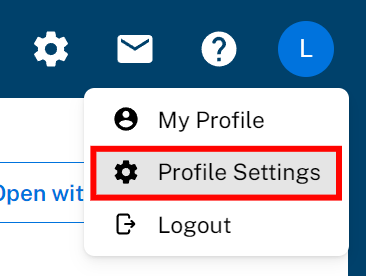
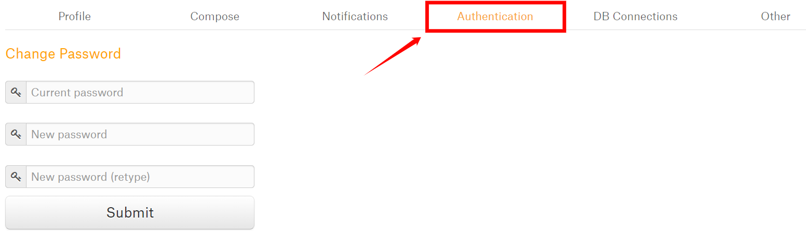
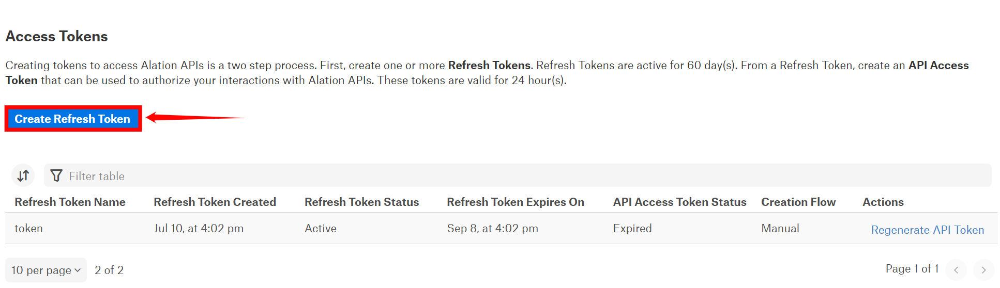
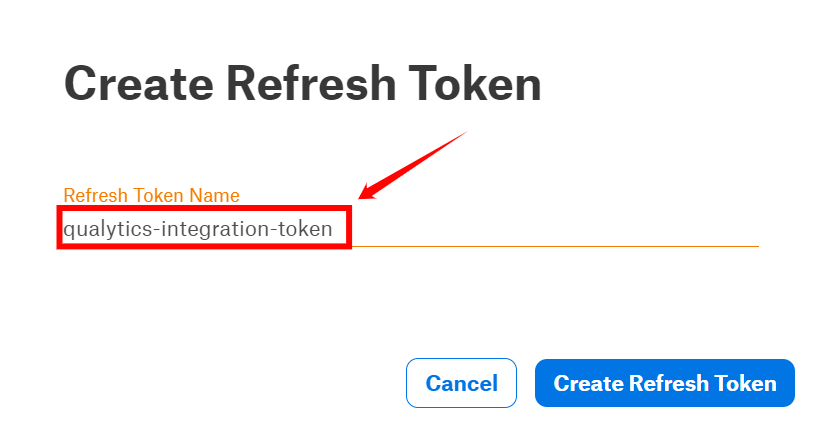
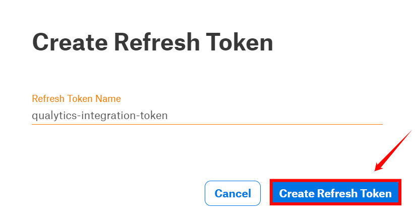
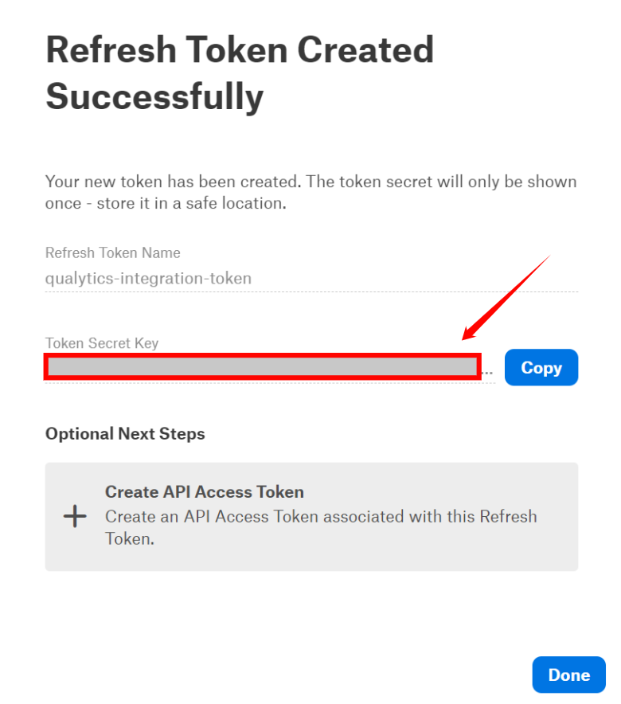
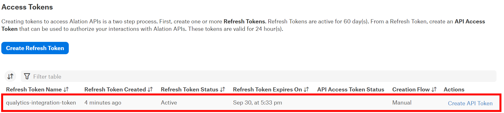
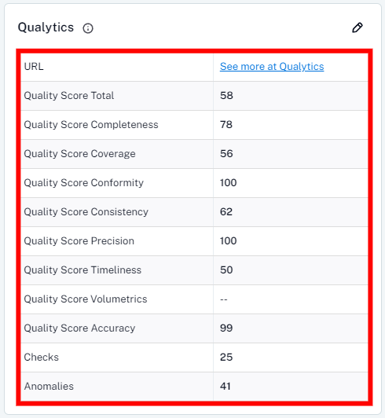
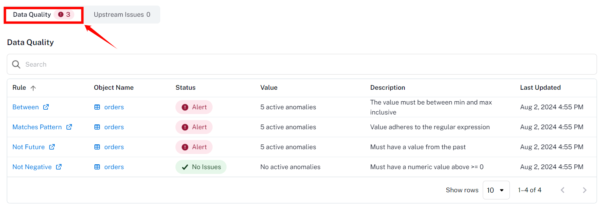

# Alation

Integrating Alation with Qualytics, allows you to pull metadata from Alation to Qualytics and push Qualytics metadata to Alation. Once integrated, Qualytics can stay updated with key changes in Alation, like metadata updates and anomaly alerts which helps to ensure data quality and consistency. Qualytics updates only active checks, and metadata updates in Qualytics occur if the Event-Driven option is enabled or can be triggered manually using the **"Sync"** button. During sync, Qualytics can replace existing tags in Alation or skip duplicate tags to avoid conflicts. The setup is simple—just provide a refresh token for communication between the systems.

Let’s get started 🚀

## Alation Setup

### Create Refresh Token

Before setting up Alation Integration in Qualytics, you have to generate a Refresh token. This allows Qualytics to access Alation's API and keep data in sync between the two platforms.

**Step 1**: Navigate to the **"Profile Settings"**.

**Step 2:** Select the **"Authentication"** tab.

**Step 3:** Click on the **"Create Refresh Token"** button.

**Step 4:** Enter a **name** for the token.

**Step 5:** After entering the name for the token, click on **"Create Refresh Token"**.

**Step 6:** Your **"refresh"** token has been generated successfully. Please Copy and save it securely.

{: style="height:450px;width:450px;"}

**Step 7:** Here you can view the token that is successfully added to the access tokens list.

## Add Alation Integration

**Step 1:**  Log in to your Qualytics account and click the **"Settings"** button on the left side panel of the interface.

**Step 2:** You will be directed to the **Settings** page, then click on the **"Integration"** tab.

**Step 3:** Click on the **"Add Integration"** button.

**Step 4:** Complete the configuration form by choosing the **Alation** integration type.

|REF.|FIELDS |ACTIONS|
| ---| ----- | ----- |
| 1. |Name (Required)| Provide a name for the integration. |
| 2. | Type (Required) | Choose the type of integration from the dropdown menu. Currently, 'Atlan' is selected |
| 3. | URL (Required) | Enter the full address of the Alation instance, for example,  https://instance.alationcloud.com. |
| 4. | Refresh Token (Required) | Enter the refresh token required to access the Alation API. |
| 5. | User ID (Required) | Provide the user ID associated with the generated token. |
| 6. | Domains | Select specific domains to filter assets for synchronization.  - Acts as a filtering mechanism to sync specific assets  - Uses domain information from the data catalog (e.g. Sales ). Only assets under the selected domains will synchronize.|
| 7. | Event Driven | If enabled, operations, archiving anomalies, and checks will activate the integration sync. |
| 8. | Overwrite Tags | If enabled, Alation tags will override Qualytics tags in cases of conflicts (when tags with the same name exist on both platforms). |

**Step 5:** Click on the **Save** button to integrate Alation with Qualytics. 

**Step 6:** Here you can view the **new integration** appearing in Qualytics.

                 
## Synchronization

The Alation synchronization supports both push and pull operations. This includes pulling metadata from Alation to Qualytics and pushing Qualytics metadata to Alation. During the syncing process, the integration pulls tags assigned to data assets in Alation and assigns them to Qualytics assets as an **external tag.**

!!! note 
    Tag synchronization requires **manual** triggering.

**Step 1:** To sync tags, simply click the **"Sync"** button next to the relevant integration card.

**Step 2:** After clicking the **Sync** button, you will have the following options:

- **Pull Alation Metadata**  
- **Push Qualytics Metadata**

Specify whether the synchronization will pull metadata, push metadata, or do both.

**Step 3:** After selecting the desired options, click on the **"Start"** button.

**Step 4:** After clicking the **Start** button, the synchronization process between Qualytics and Alation begins. This process pulls metadata from Alation and pushes Qualytics metadata, including tags, quality scores, anomaly counts, asset links, and many more.

**Step 5:** Once synchronization is complete, the mapped assets from **Alation** will display an external tag.

## Alerts

When Qualytics detects anomalies, alerts are sent to the assets in Alation, showing the number of active anomalies and providing a link to view them.

## Metadata

The Quality Score Total, the "Qualytics 8" metrics (completeness, coverage, conformity, consistency, precision, timeliness, volume, and accuracy), and counts of checks and anomalies per asset identified by Qualytics are pushed to Alation. This enables users to analyze assets based on data profiling and scanning metrics. A link to the asset in Qualytics is also provided.

## Data Health

On the Alation tables page, there's a tab called “Data Health” where Qualytics displays insights from data quality checks in a table format, showing the current status based on the number of anomalies per check.

| Column| Description |
| ----- | ----- |
| Rule  | The type of data quality check rule |
| Object Name |  The Table Name |
| Status | The check status can be either "Alert" if there are active anomalies or "No Issues" if no active anomalies exist for the check.   |
| Value | The current amount of active anomalies |
| Description | The data quality check description |
| Last Updated | The last synced timestamp |
