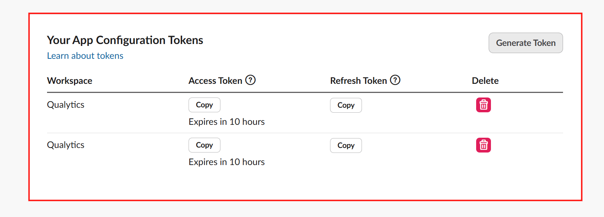
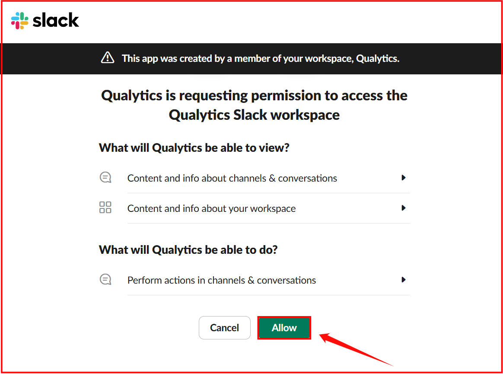

# Slack

Slack integration in Qualytics enables seamless communication by connecting your Slack workspace with data quality updates and notifications. It involves generating and applying Slack API tokens, authorizing the integration, and providing options to modify and manage the connection effortlessly.

Let's get started 🚀

## Navigation to Integration

**Step 1:** Log in to your Qualytics account and click the **"Settings"** button on the left side panel of the interface.

**Step 2:** By default, Connections tab will open. Click on the **Integrations** tab .

## Connect Slack Integration

Connect Slack by generating tokens, configuring connection properties, and authorizing the integration using OAuth for secure communication and seamless app configuration.

**Step 1 :**Click on the **Connect** button next to Slack to connect to the Slack Integration.

A modal window titled **"Add Slack Integration"** appears. Fill in the connection properties to connect to Slack.

**Step 2:**First, generate the access and refresh tokens through the Slack API by signing in.

Alternatively, hover over the **?** icon and click on the **Go to Slack Tokens.**

You will be automatically redirected to the Slack token page, where you can copy the **access token** for creating and configuring apps and the **refresh token** for rotating the access token.

**Step 3:**Fill out the copied connection properties of slack integration :

| No. | Field Name | Description |
| :---- | :---- | :---- |
| 1. | Access Token | Enter the generated access token. |
| 2. | Refresh Token | Enter the generated refresh token. |

**Step 4:** Click the **Create** button to apply the access and refresh tokens and proceed with authorizing the Slack integration.

Once the integration is successfully created, a confirmation message will appear on the screen stating, **"The Integration has been successfully created."**

**Step 5:**Click the **Authorize** button to complete the Slack integration using OAuth authentication.

**Step 6:**After clicking the Authorize button, a window appears requesting permission to access the Slack workspace. Click the **Allow** button to grant the required permissions.

A message appears confirming that the integration has been successfully authorized.

## Manage Slack Integration

Managing Slack integration involves editing or disconnecting the integration to ensure seamless communication and synchronization between platforms. Users can easily modify integration settings, reauthorize the connection, or disconnect the integration if required.

### Edit Integration

Editing Slack integration allows modifications to the existing configuration to ensure that the integration functions according to updated requirements. Users can update Slack details, reauthorize the connection, and apply necessary changes seamlessly

**Step 1:**Click on the **vertical ellipses(⋮)** next to the Connected button and select the **Edit** option.

**Step 2:**A modal window **Edit Slack Integration** will appear providing you with options to edit the connection properties.

**Step 3 :**After editing the connection properties of the slack integration, click on the **Update** button to apply the changes.

A confirmation message will appear on the screen displaying “**The Integration has been successfully updated**”.

**Step 4:**Click on the **Authorize** button to update the authorization details.

A confirmation message will appear on the screen displaying “**The Integration has been successfully authorized**”.

### Disconnect Integration

Disconnecting the Slack integration removes all associated synced assets and disables further data exchange between the platforms. To ensure a smooth disconnection process, follow the steps below to terminate the integration safely and confirm the action.

**Step 1 :** Click on the **vertical ellipses(⋮)** next to the connected button and select the **Disconnect** option to disconnect the integration.

**Step 2:**A modal window **Disconnect Integration** will appear allowing you to disconnect the slack integration.

**Step 3:**Click on the **Disconnect** button to proceed.

!!! note    
    This action will delete all synced assets by this integration. 

A confirmation message will appear on the screen displaying **“The Integration has been successfully disconnected”.**

