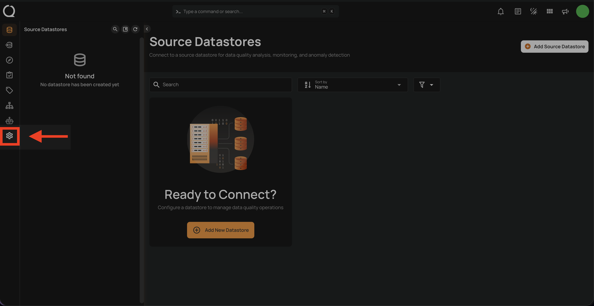
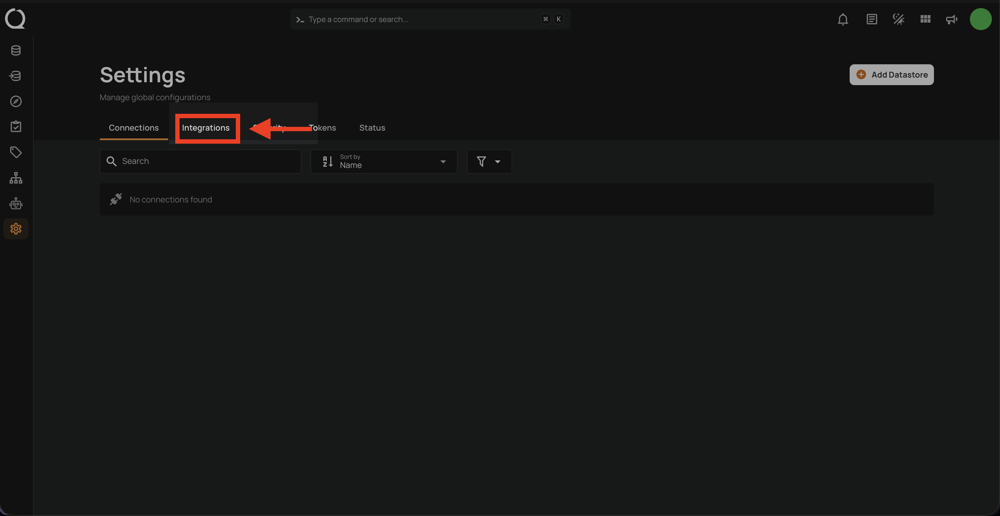
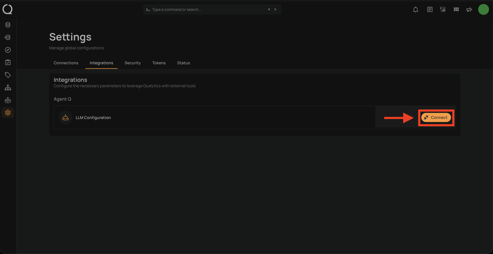
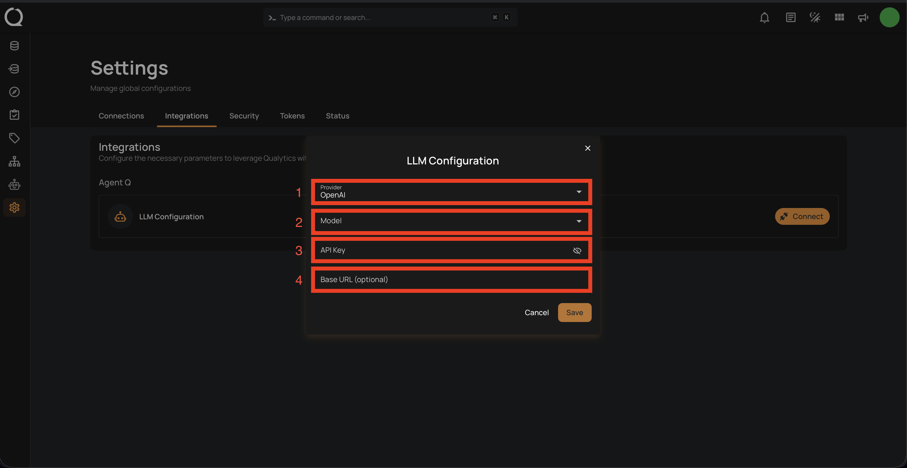
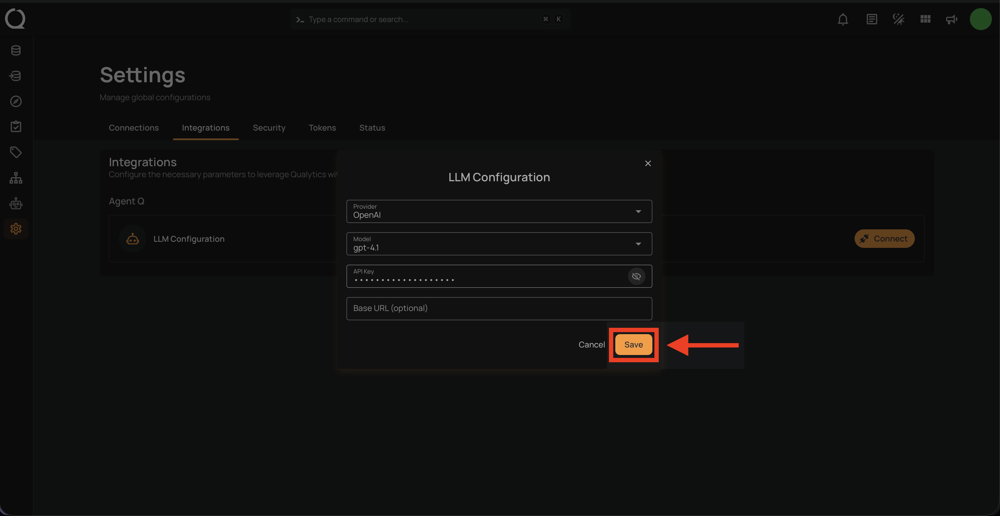
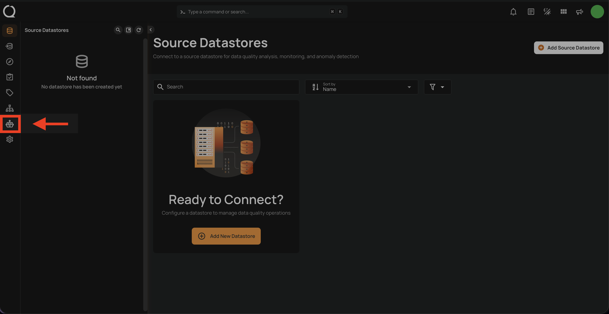
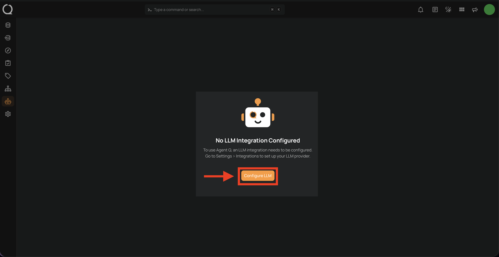
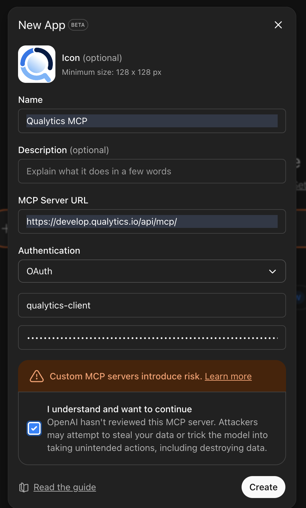

# Add Agent Q Integration

Agent Q requires an LLM (Large Language Model) provider to power its AI capabilities. This guide walks you through the full setup from the moment you log in to Qualytics.

## Prerequisites

- A Qualytics account with **Member** role or higher.
- An API key from a [supported LLM provider](#supported-llm-providers).

## Integration

### Via Settings

**Step 1:** After logging in, click the **Settings** icon (gear) in the bottom-left sidebar.



**Step 2:** The Settings page opens on the **Connections** tab by default. Click the **Integrations** tab.



**Step 3:** Under the **Agent Q** section, click the **Connect** button next to **LLM Configuration**.



**Step 4:** The **LLM Configuration** modal opens. Fill in the fields:

| Field | Description |
|-------|-------------|
| **Provider** | Select your LLM provider from the list (e.g., OpenAI, Anthropic, Google Gemini). |
| **Model** | Choose a model available under the selected provider. You can also type a custom model name if your provider supports it. |
| **API Key** | Enter the API key from your LLM provider. This is stored securely and never returned by the API. |
| **Base URL** *(optional)* | Provide a custom endpoint URL for OpenAI-compatible providers (e.g., Ollama, OpenRouter, LiteLLM). Leave blank for standard providers. |



**Step 5:** Fill in your credentials and click **Save** to complete the configuration.



!!! info
    When you save, Qualytics automatically validates your API key and tests the connection to the provider. If the key is invalid or the provider is unreachable, you will see an error before the configuration is stored. Qualytics also checks whether your provider supports web search — if it does, Agent Q can optionally search the Qualytics documentation to answer platform-related questions.

Once saved, Agent Q is ready to use. See [How to Use Agent Q](../overview.md){:target="_blank"} for next steps.

### Via Agent Q Page

**Step 1:** Click **Agent Q** in the left sidebar to open the Agent Q page.



**Step 2:** Click the **Configure LLM** button. You will be redirected to **Settings** > **Integrations**.



**Step 3:** Under the **Agent Q** section, click the **Connect** button next to **LLM Configuration**.


**Step 4:** The **LLM Configuration** modal opens. Fill in the fields:

| Field | Description |
|-------|-------------|
| **Provider** | Select your LLM provider from the list (e.g., OpenAI, Anthropic, Google Gemini). |
| **Model** | Choose a model available under the selected provider. You can also type a custom model name if your provider supports it. |
| **API Key** | Enter the API key from your LLM provider. This is stored securely and never returned by the API. |
| **Base URL** *(optional)* | Provide a custom endpoint URL for OpenAI-compatible providers (e.g., Ollama, OpenRouter, LiteLLM). Leave blank for standard providers. |


**Step 5:** Fill in your credentials and click **Save** to complete the configuration.


Once saved, Agent Q is ready to use. See [How to Use Agent Q](../overview.md){:target="_blank"} for next steps.

## LLM Configuration per User

Each Qualytics user configures their own LLM provider independently. One user can use OpenAI while another uses Anthropic — both will have Agent Q available simultaneously using their respective configurations and API keys. Your API costs are your own responsibility.

## Supported LLM Providers

| Provider | Example Models |
|----------|---------------|
| **OpenAI** | gpt-4o, gpt-4-turbo, o1, o3-mini |
| **Anthropic** | claude-sonnet-4, claude-opus-4, claude-3-5-sonnet |
| **Google Gemini** | gemini-2.0-flash, gemini-1.5-pro, gemini-1.5-flash |
| **Amazon Bedrock** | Region-specific model IDs |
| **Groq** | llama-3.3-70b, llama-3.1-8b, mixtral-8x7b |
| **Mistral** | mistral-large, mistral-medium, codestral |
| **Cohere** | command-r-plus, command-r |
| **DeepSeek** | deepseek-chat, deepseek-coder |
| **Ollama** | Any locally-hosted model (requires Base URL) |
| **OpenRouter** | Any model via OpenRouter (requires Base URL) |
| **LiteLLM** | Any model via LiteLLM proxy (requires Base URL) |
| **Perplexity** | sonar-pro, sonar |
| **Fireworks** | Any Fireworks-hosted model |
| **GitHub Models** | GitHub-hosted models |
| **Hugging Face** | Inference endpoint models |
| **Together AI** | Any Together AI model |
| **Cerebras** | llama-3.3-70b, llama-3.1-8b |

!!! note
    You must provide your own API key for the selected provider. Qualytics does not supply LLM API keys — you control your provider choice and associated costs.

## Connecting External AI Clients

Beyond the built-in Agent Q experience, you can connect external AI clients directly to the Qualytics MCP server. This allows tools like ChatGPT, Claude Desktop, and Cursor to interact with your data quality infrastructure using the same MCP capabilities as Agent Q — no separate setup required beyond your API token.

### Prerequisites

- A **Qualytics Personal API Token (PAT)**. Navigate to **Settings** > **Tokens** and click **Generate Token**. See [Tokens](../../../tokens/overview-of-tokens.md){:target="_blank"} for detailed instructions.
- Your **Qualytics instance URL** (e.g., `https://your-company.qualytics.io`).

The MCP service endpoint is:

```
https://your-qualytics-instance.qualytics.io/mcp
```

!!! tip
    Configuring an LLM provider in Qualytics (the sections above) is **not required** for external clients — each client brings its own LLM. Only your Qualytics API token is needed.

### ChatGPT

**Step 1:** In ChatGPT, navigate to **Apps** and select **Create app**.

**Step 2:** Complete the form as shown below:

{: style="height:600px"}

| Field | Value |
|-------|-------|
| **MCP Server URL** | `https://<your-qualytics-instance>.qualytics.io/mcp/` |
| **OAuth Secret** | Your Qualytics API token |

**Step 3:** After creating the app, ChatGPT will prompt you to authorize the connection. Paste the **same Qualytics API token** when prompted.

{: style="height:400px"}

!!! note
    The OAuth Secret and the authorization prompt both require the same Qualytics API token.

### Claude Desktop

Add the following to your Claude Desktop configuration file:

=== "macOS"
    File location: `~/Library/Application Support/Claude/claude_desktop_config.json`

    ```json
    {
      "mcpServers": {
        "qualytics": {
          "command": "npx",
          "args": [
            "-y",
            "mcp-remote",
            "https://your-qualytics-instance.qualytics.io/api/mcp/",
            "--header",
            "Authorization: Bearer YOUR_API_TOKEN"
          ]
        }
      }
    }
    ```

=== "Windows"
    File location: `%APPDATA%\Claude\claude_desktop_config.json`

    ```json
    {
      "mcpServers": {
        "qualytics": {
          "command": "cmd",
          "args": [
            "/c",
            "npx",
            "mcp-remote",
            "https://your-qualytics-instance.qualytics.io/api/mcp/",
            "--header",
            "Authorization: Bearer YOUR_API_TOKEN"
          ]
        }
      }
    }
    ```

Replace `your-qualytics-instance` with your Qualytics hostname and `YOUR_API_TOKEN` with your Personal API Token.

!!! info
    Claude Desktop uses the `mcp-remote` package to connect to remote MCP servers. It is installed automatically via `npx` on first use — no manual installation required.

### Cursor

Add the following to your Cursor MCP configuration:

```json
{
  "mcpServers": {
    "qualytics": {
      "url": "https://your-qualytics-instance.qualytics.io/api/mcp/",
      "headers": {
        "Authorization": "Bearer YOUR_API_TOKEN"
      }
    }
  }
}
```

Replace `your-qualytics-instance` with your Qualytics hostname and `YOUR_API_TOKEN` with your Personal API Token.

### Other MCP-Compatible Clients

Any client that supports the [Model Context Protocol](https://modelcontextprotocol.io/) can connect to Qualytics using these details:

| Setting | Value |
|---------|-------|
| **Server URL** | `https://your-qualytics-instance.qualytics.io/api/mcp/` |
| **Authentication** | `Authorization: Bearer YOUR_API_TOKEN` header |
| **Protocol** | MCP (Model Context Protocol) |

For a full list of available tools and capabilities, see the [MCP Deep Dive](../deep-dive/mcp.md){:target="_blank"}.
