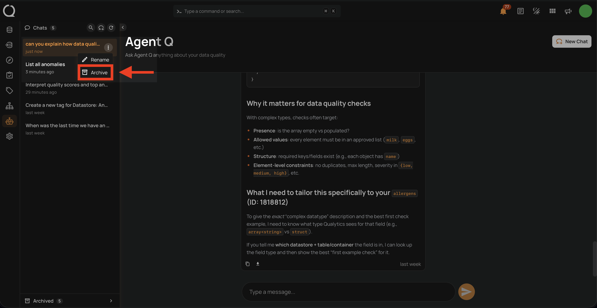
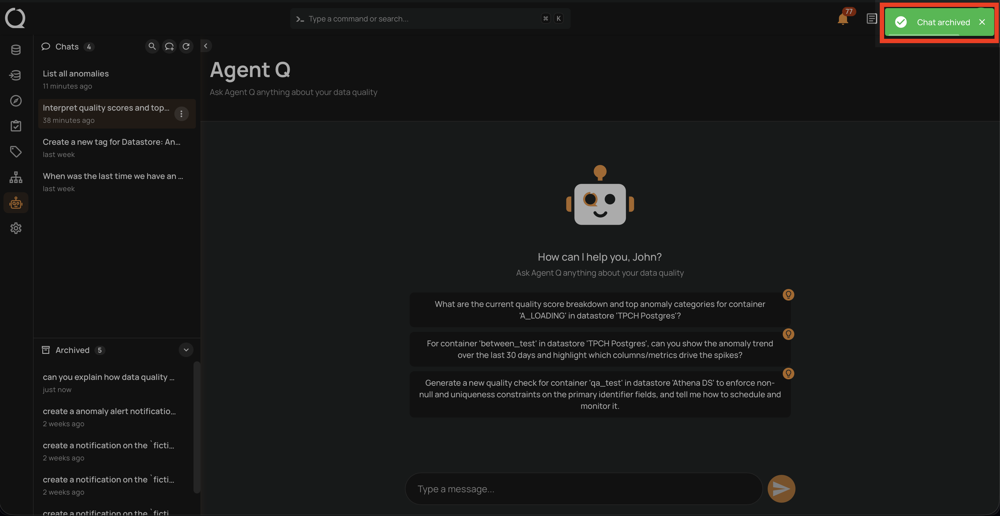

# Archive a Conversation

Archiving moves a session out of the active **Chats** list into the **Archived** section. Archived sessions are read-only — you can still view their history, but cannot send new messages until restored.

!!! info
    Conversation management — including archiving sessions — is only available from the **Agent Q** full-page view. The floating chat does not support this action.

## Steps

**Step 1:** In the sidebar, hover over the conversation you want to archive. Click the **⋮** menu next to it and select **Archive**.

**Step 2:** A confirmation toast **"Chat archived"** appears in the top-right corner and the conversation moves to the **Archived** section at the bottom of the sidebar.

!!! info
    If you archive the conversation you are currently viewing, you are automatically redirected to the Agent Q empty state. Archived sessions are read-only — you can view the history but cannot send new messages until the session is restored.

!!! tip
    Changed your mind? You can [restore](./restore-a-conversation.md){:target="_blank"} an archived conversation at any time to move it back to the active list.
