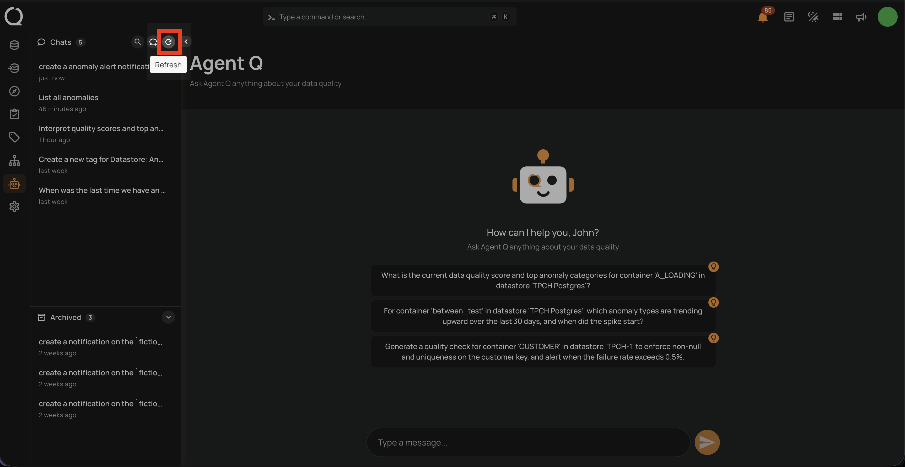
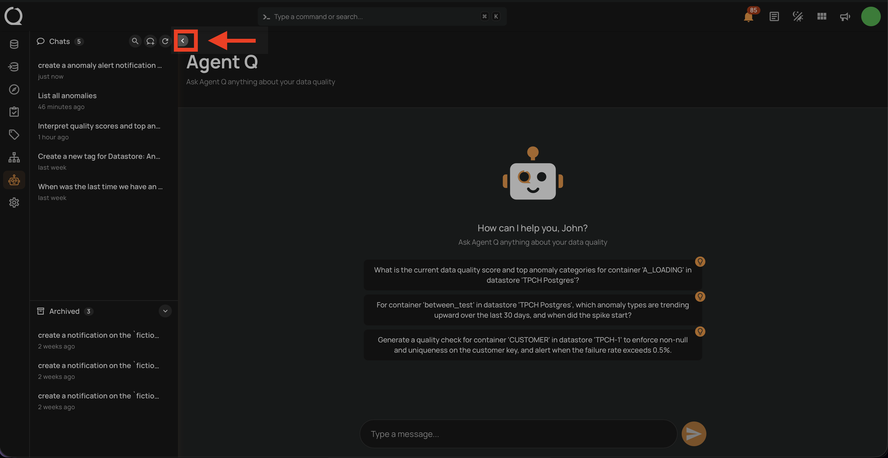
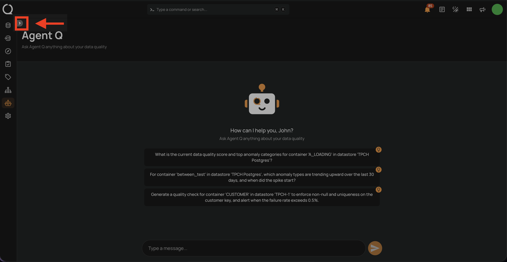
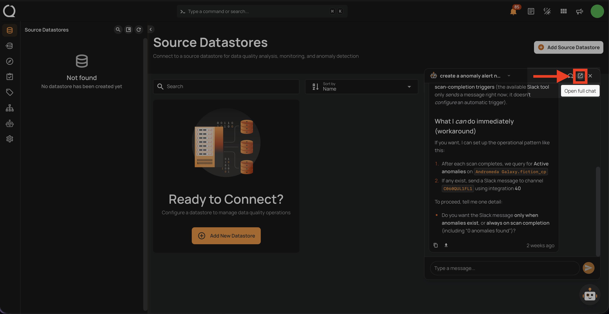
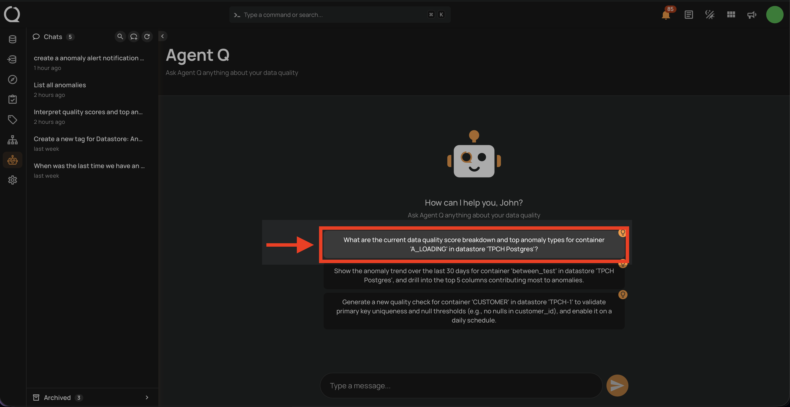
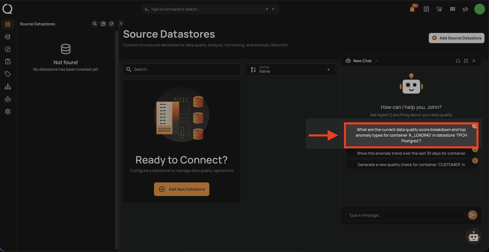
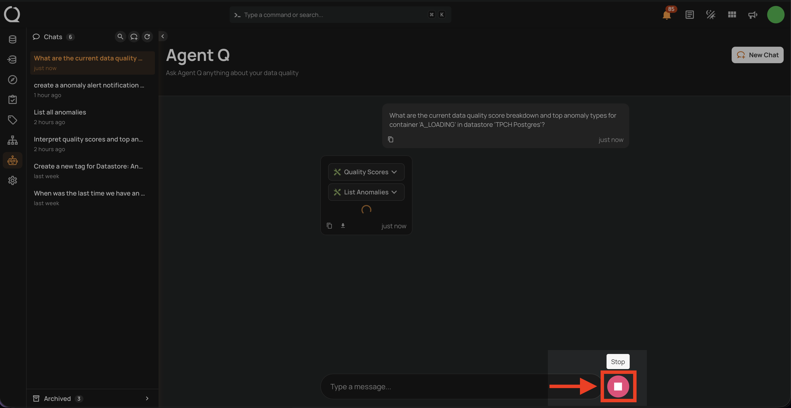
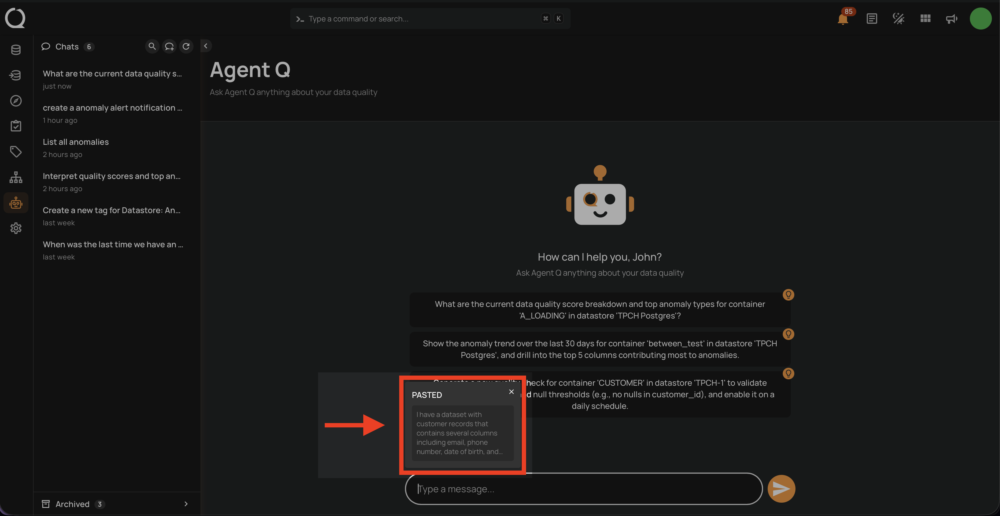

# Chat Interface Tips

Quick reference for common interface actions in Agent Q.

## Refresh the Chat List

If you don't see a recently created conversation in the sidebar, click the **Refresh** icon at the top of the **Chats** list to reload the session list.

## Collapse the Chat Sidebar

To give more space to the chat area, click the **Collapse** icon in the sidebar toolbar. The Chats list slides out of view and the chat area expands to fill the full width.

## Expand the Chat Sidebar

When the sidebar is collapsed, click the **Expand** icon on the left edge to bring the Chats list back into view.

## Expand the Floating Chat to Full Page

While using the floating chat widget, click the **Open full chat** icon in the floating chat header to open the current conversation in the full-page Agent Q view.

## Use Chat Suggestions

When starting a new conversation, Agent Q displays a set of personalized prompt suggestions based on your data assets and common workflows. Click any suggestion to use it as your opening message — it is inserted into the input field and sent automatically.

This works both in the full-page view and in the floating chat widget.

## Stop a Response

Click the **Stop** button (red circle) that appears beside the input box while Agent Q is generating. The response stops immediately, and whatever Agent Q produced so far is preserved as a partial response with a "Stopped" indicator.

## Paste Large Content

When you paste text of 200 characters or more into the input, Agent Q captures it as an attachment rather than inserting it into the input field. The pasted content appears as a removable panel above the input box labeled **PASTED**. It is included with your message when you send it, giving Agent Q full context while keeping the input clean.

