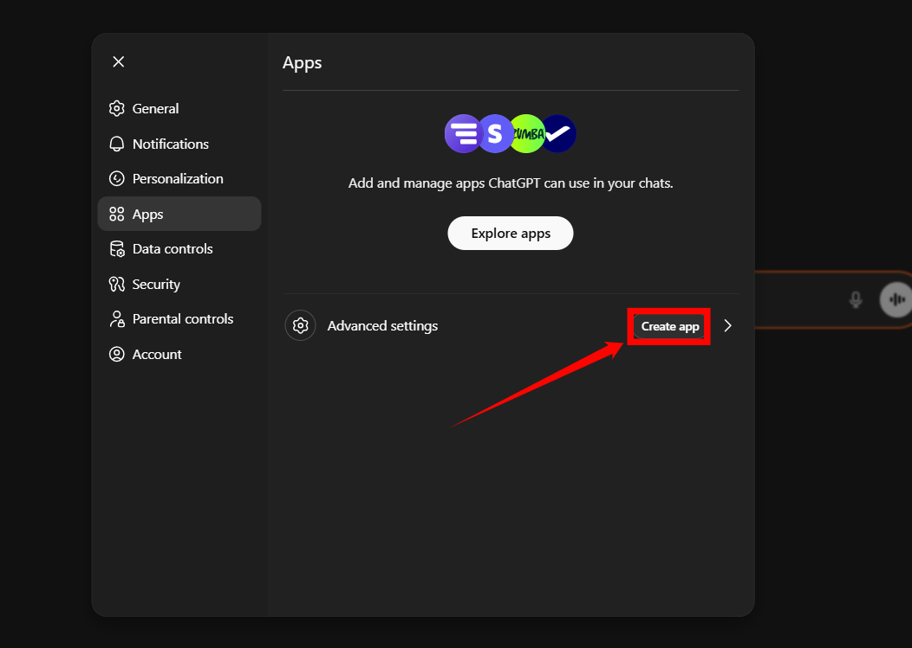
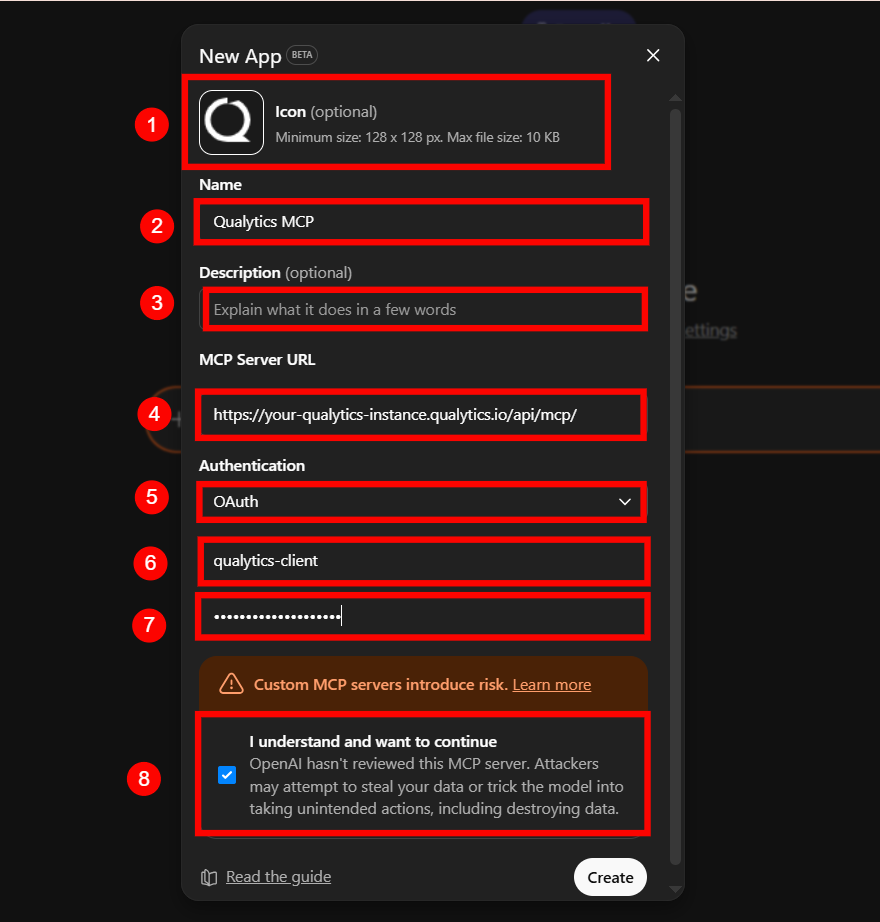
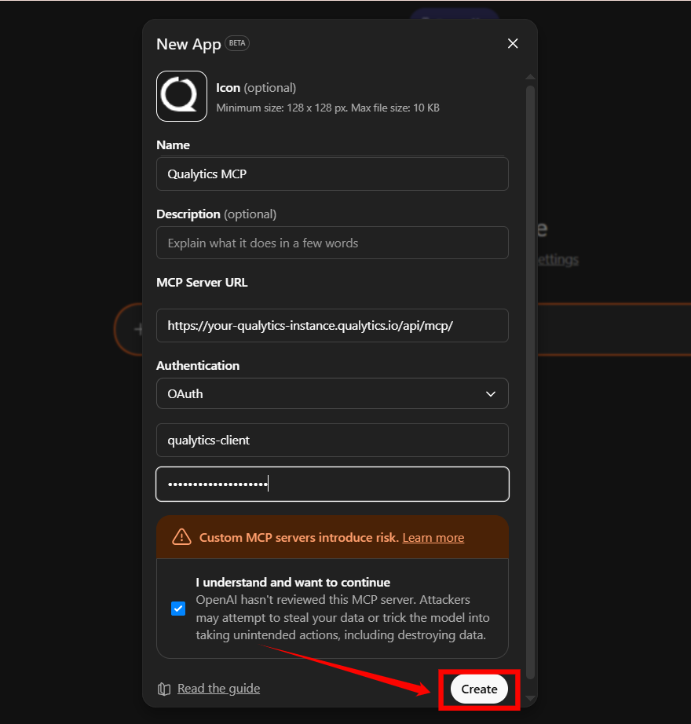

# Connecting External AI Clients

Beyond the built-in Agent Q experience, you can connect external AI clients directly to the Qualytics MCP server. This allows tools like ChatGPT, Claude Desktop, and Cursor to interact with your data quality infrastructure using the same MCP capabilities as Agent Q — no separate setup required beyond your API token.

## Prerequisites

- A **Qualytics Personal API Token (PAT)**. Navigate to **Settings** > **Tokens** and click **Generate Token**. See [Tokens](../../../tokens/overview-of-tokens.md){:target="_blank"} for detailed instructions.
- Your **Qualytics instance URL** (e.g., `https://your-company.qualytics.io`).

The MCP service endpoint is:

```
https://your-qualytics-instance.qualytics.io/api/mcp/
```

!!! tip
    Configuring an LLM provider in Qualytics is **not required** for external clients — each client brings its own LLM. Only your Qualytics API token is needed. To configure Agent Q's built-in chat, see [Add Integration](./add-agent-q-integration.md){:target="_blank"}.

## ChatGPT

**Step 1:** Log in to your ChatGPT account and click on your **profile icon** in the bottom-left corner of the screen.


**Step 2:** After clicking the profile icon, a dropdown menu will appear. Click **Settings**.


**Step 3:** A modal window will appear. Click **Apps** to manage and create new app connections.


**Step 4:** In the **Apps** section, click **Create app** to start creating a new app connection.



A **New App** modal window will appear. Enter the required details:

| No. | Field | Description | Example |
|-----|-------|------------|---------|
| 1 | **Icon** | *(Optional)* Upload an icon for the app (128 × 128 px, max 10 KB). | Qualytics logo |
| 2 | **Name** | Enter a unique name to identify this app connection. | Qualytics MCP |
| 3 | **Description** | Provide a short summary explaining what this integration does. | Connects ChatGPT to Qualytics MCP for data quality operations. |
| 4 | **MCP Server URL** | Enter your Qualytics MCP endpoint URL. | `https://your-qualytics-instance.qualytics.io/api/mcp/` |
| 5 | **Authentication** | Select the authentication method. | OAuth |
| 6 | **OAuth Client ID** | Enter the OAuth client ID provided for your instance. | qualytics-client |
| 7 | **OAuth Client Secret** | Paste your Qualytics API token. | `<Your Qualytics API Token>` |
| 8 | **Confirmation Checkbox** | Select "I understand and want to continue" to proceed. | Checked |



**Step 5:** Once all the details are filled in, click **Create** to complete the app setup.



After creating the app, ChatGPT will prompt you to authorize the connection. When prompted, paste the **same Qualytics API token** again.

{: style="height:400px"}

!!! note
    The OAuth Client Secret and the authorization prompt both require the same Qualytics API token.

## Claude Desktop

Claude Desktop supports MCP servers as Custom Connectors. To add the Qualytics MCP server:

1. Open **Settings** in Claude Desktop.
2. Navigate to the **Connectors** section.
3. Click **Add Custom Connector**.
4. Configure the connector with the following details:
      - **Name**: `Qualytics`
      - **URL**: `https://your-qualytics-instance.qualytics.io/api/mcp/`
      - **Authentication**: Enter your Qualytics API token.
5. Click **Save** to enable the connector.

Replace `your-qualytics-instance` with your Qualytics hostname.

Once configured, Qualytics tools will be available in your Claude Desktop conversations.

## Claude Code

Use the `claude mcp add` command to register the Qualytics MCP server:

```bash
claude mcp add --transport http qualytics \
  https://your-qualytics-instance.qualytics.io/api/mcp/ \
  --header "Authorization: Bearer YOUR_API_TOKEN"
```

Replace `your-qualytics-instance` with your Qualytics hostname and `YOUR_API_TOKEN` with your Personal API Token.

To share the configuration with your team, add the `--scope project` flag, which stores the configuration in a `.mcp.json` file in your project directory.

## Cursor

Add the following to your Cursor MCP configuration:

```json
{
  "mcpServers": {
    "qualytics": {
      "url": "https://your-qualytics-instance.qualytics.io/api/mcp/",
      "headers": {
        "Authorization": "Bearer YOUR_API_TOKEN"
      }
    }
  }
}
```

Replace `your-qualytics-instance` with your Qualytics hostname and `YOUR_API_TOKEN` with your Personal API Token.

## VS Code (GitHub Copilot)

Add the Qualytics MCP server to your VS Code workspace or user settings. Create or edit the `.vscode/mcp.json` file in your workspace:

```json
{
  "servers": {
    "qualytics": {
      "type": "http",
      "url": "https://your-qualytics-instance.qualytics.io/api/mcp/",
      "headers": {
        "Authorization": "Bearer YOUR_API_TOKEN"
      }
    }
  }
}
```

Replace `your-qualytics-instance` with your Qualytics hostname and `YOUR_API_TOKEN` with your Personal API Token.

Once configured, Qualytics tools and resources will be available in GitHub Copilot Chat.

## Windsurf

Edit your Windsurf MCP configuration file at `~/.codeium/windsurf/mcp_config.json`:

```json
{
  "mcpServers": {
    "qualytics": {
      "serverUrl": "https://your-qualytics-instance.qualytics.io/api/mcp/",
      "headers": {
        "Authorization": "Bearer YOUR_API_TOKEN"
      }
    }
  }
}
```

Replace `your-qualytics-instance` with your Qualytics hostname and `YOUR_API_TOKEN` with your Personal API Token.

You can also add MCP servers through the Windsurf **Settings** > **Cascade** > **MCP Servers** panel.

## Amazon Q Developer

Add the Qualytics MCP server to your Amazon Q Developer configuration. Edit `~/.aws/amazonq/mcp.json` for global configuration:

```json
{
  "mcpServers": {
    "qualytics": {
      "type": "http",
      "url": "https://your-qualytics-instance.qualytics.io/api/mcp/",
      "headers": {
        "Authorization": "Bearer YOUR_API_TOKEN"
      }
    }
  }
}
```

Replace `your-qualytics-instance` with your Qualytics hostname and `YOUR_API_TOKEN` with your Personal API Token.

For workspace-scoped configuration, place the file at `.amazonq/mcp.json` in your project directory.

## Other MCP-Compatible Clients

Any client that supports the [Model Context Protocol](https://modelcontextprotocol.io/) can connect to Qualytics using these details:

| Setting | Value |
|---------|-------|
| **Server URL** | `https://your-qualytics-instance.qualytics.io/api/mcp/` |
| **Authentication** | `Authorization: Bearer YOUR_API_TOKEN` header |
| **Protocol** | MCP (Model Context Protocol) |

For a full list of available tools and capabilities, see the [MCP Deep Dive](../deep-dive/mcp.md){:target="_blank"}.
