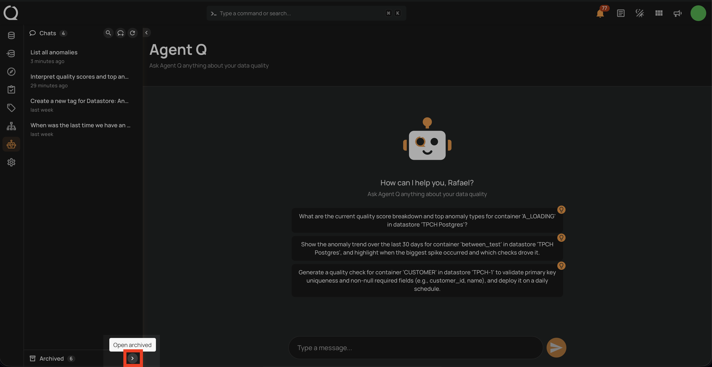
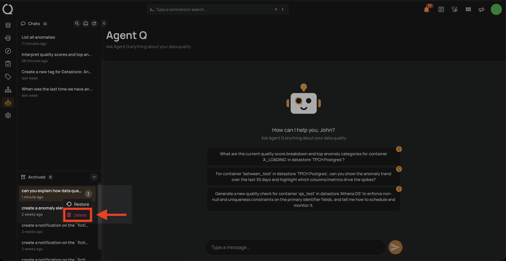
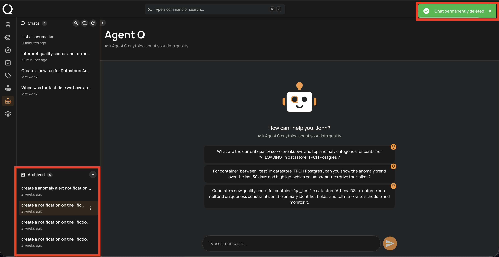

# Delete a Conversation

Permanently deleting a session removes it and all its message history. This action cannot be undone.

!!! info
    Conversation management — including deleting sessions — is only available from the **Agent Q** full-page view. The floating chat does not support this action.

!!! warning
    Only **archived** conversations can be permanently deleted. Active conversations must be [archived](./archive-a-conversation.md){:target="_blank"} first before they can be deleted.

## Steps

**Step 1:** In the Agent Q page, click the **Open archived** button at the bottom of the sidebar to expand the **Archived** section.

**Step 2:** Locate the conversation you want to delete. Click the **⋮** menu next to it and select **Delete**.

**Step 3:** A confirmation toast **"Chat permanently deleted"** appears in the top-right corner and the conversation is removed from the **Archived** list.

