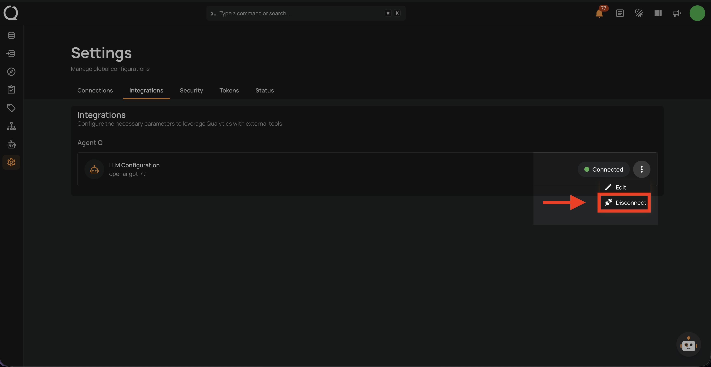
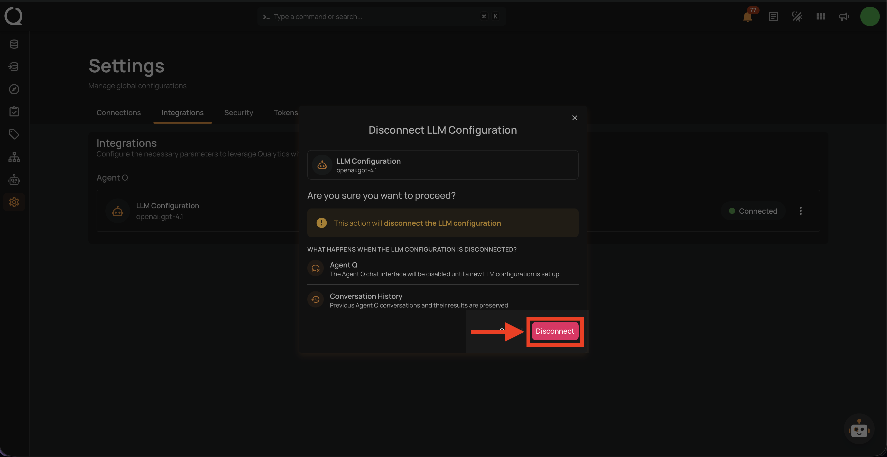
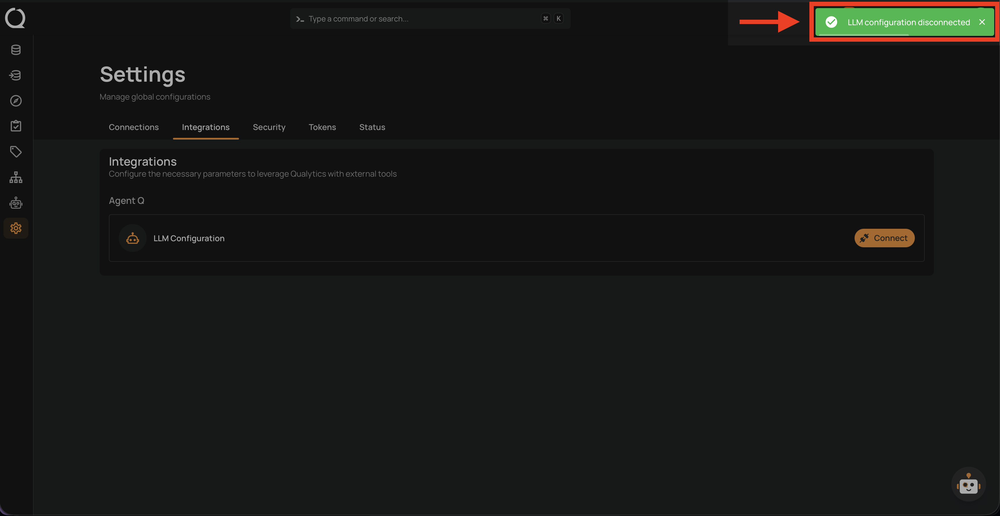

# Remove Agent Q Integration

Removing the LLM configuration disconnects Agent Q from your LLM provider. Agent Q will no longer be available for your account until a new provider is configured.

## Steps

**Step 1:** After logging in, click the **Settings** icon (gear) in the bottom-left sidebar.

**Step 2:** The Settings page opens on the **Connections** tab by default. Click the **Integrations** tab.

**Step 3:** Under the **Agent Q** section, click the **⋮** menu next to **LLM Configuration** and select **Disconnect**.

**Step 4:** A confirmation dialog opens showing what will happen when the LLM configuration is disconnected. Click **Disconnect** to confirm.

**Step 5:** A confirmation toast **"LLM configuration disconnected"** appears and the **LLM Configuration** row returns to the **Connect** state.

!!! warning
    Disconnecting the LLM provider will immediately disable Agent Q for your account. Your conversation history is preserved and will be available again once you [add a new integration](add-agent-q-integration.md){:target="_blank"}.
