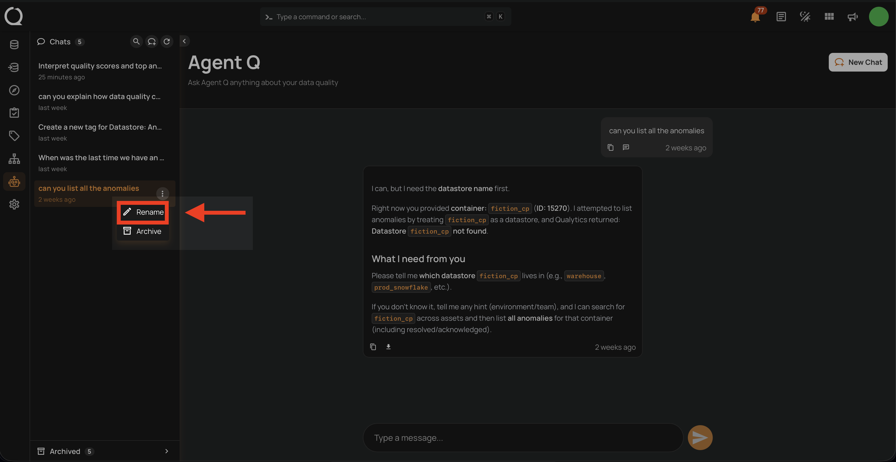
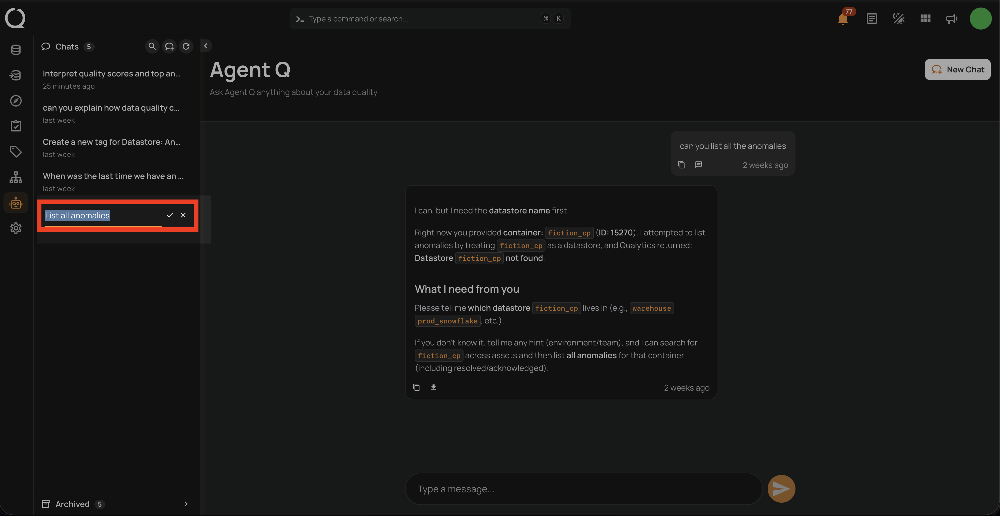
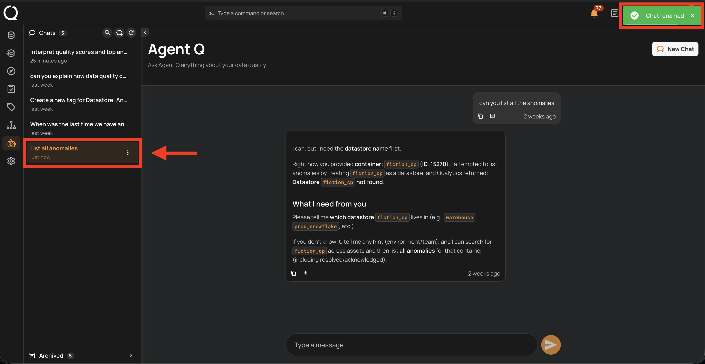

# Rename a Conversation

Renaming a session gives it a descriptive title to make it easier to find in your history.

!!! info
    Conversation management — including renaming sessions — is only available from the **Agent Q** full-page view. The floating chat does not support this action.

## Steps

**Step 1:** In the sidebar, hover over the conversation you want to rename. Click the **⋮** menu next to it and select **Rename**.

**Step 2:** An inline input field appears with the current title pre-filled. Type the new name, then press **Enter** or click the **✓** button to save. To cancel, press **Esc** or click the **✕** button.

!!! info "Title constraints"
    - Maximum **40 characters**
    - All characters are allowed — no special character restrictions
    - Leading and trailing spaces are trimmed automatically
    - The title cannot be empty or whitespace-only — saving an empty field cancels the rename

**Step 3:** A confirmation toast **"Chat renamed"** appears in the top-right corner and the updated title is reflected in the sidebar.

