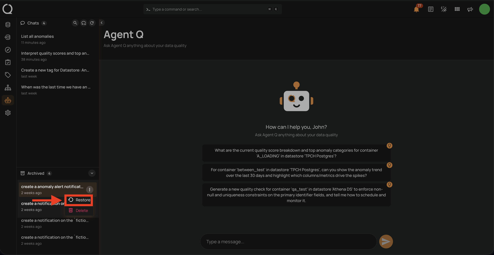
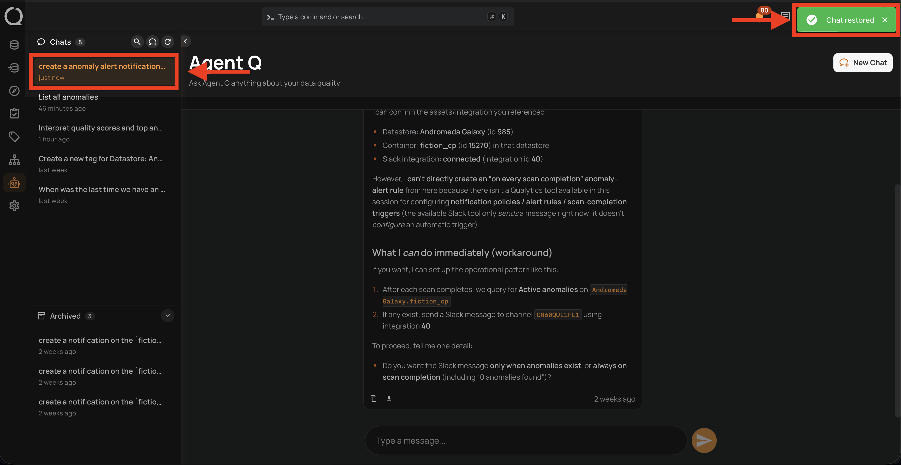

# Restore a Conversation

Restoring an archived session moves it back to the active **Chats** list, making it available for new messages again.

!!! info
    Conversation management — including restoring archived sessions — is only available from the **Agent Q** full-page view. The floating chat does not support this action.

## Steps

**Step 1:** In the Agent Q page, click the **Open archived** button at the bottom of the sidebar to expand the **Archived** section.

**Step 2:** Locate the conversation you want to restore. Click the **⋮** menu next to it and select **Restore**.

**Step 3:** A confirmation toast **"Chat restored"** appears in the top-right corner and the conversation moves to the top of the active **Chats** list.

