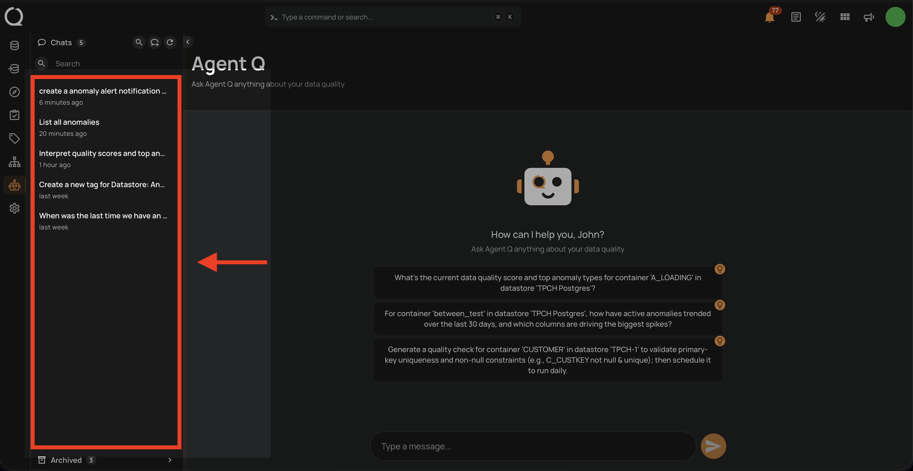
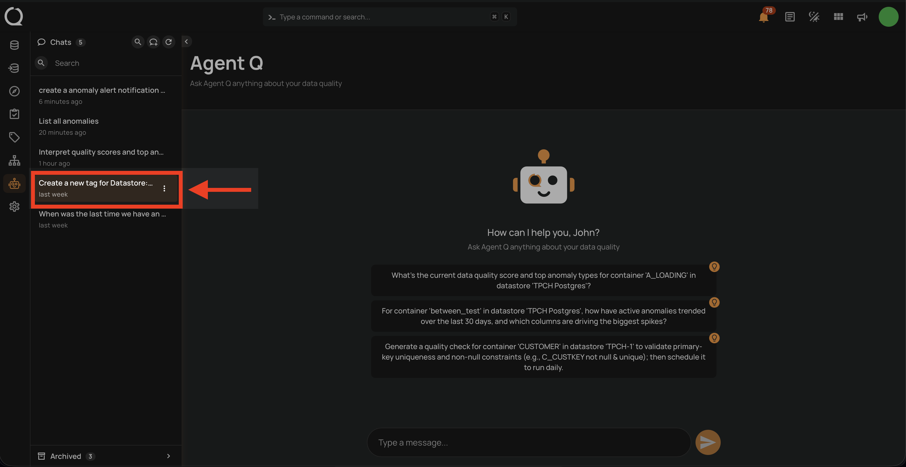
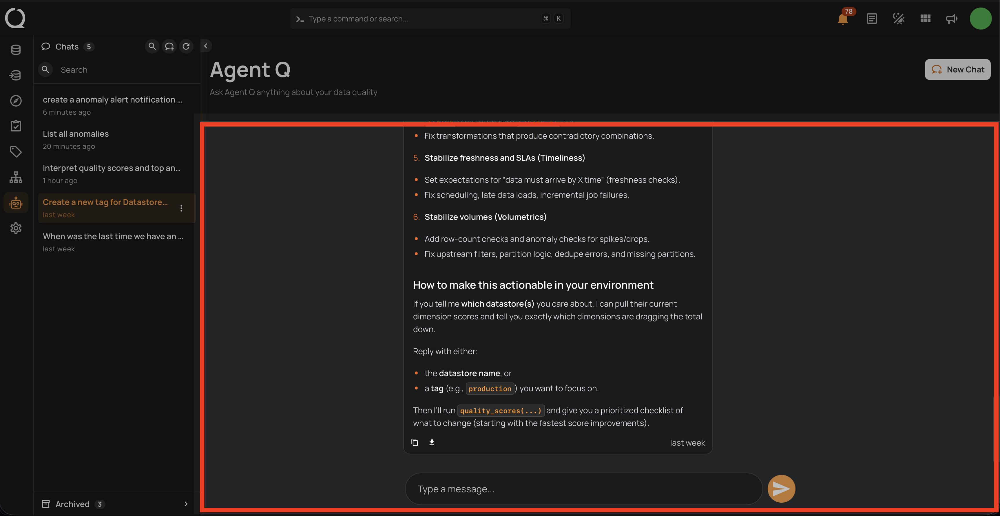
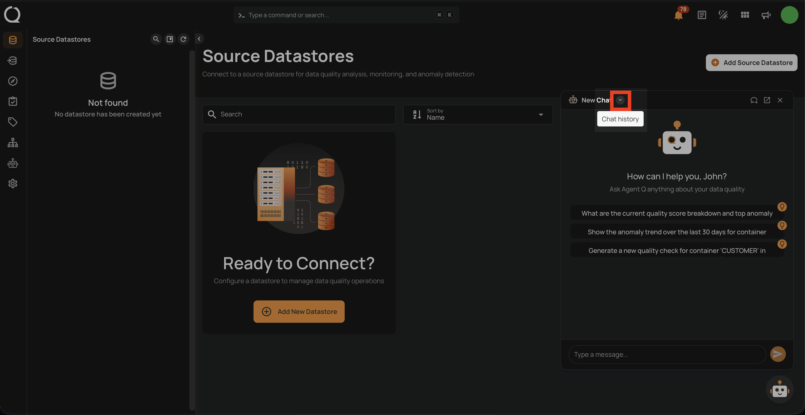
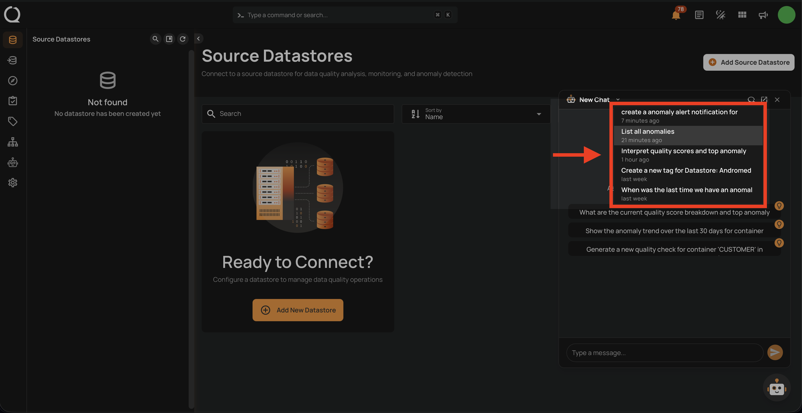
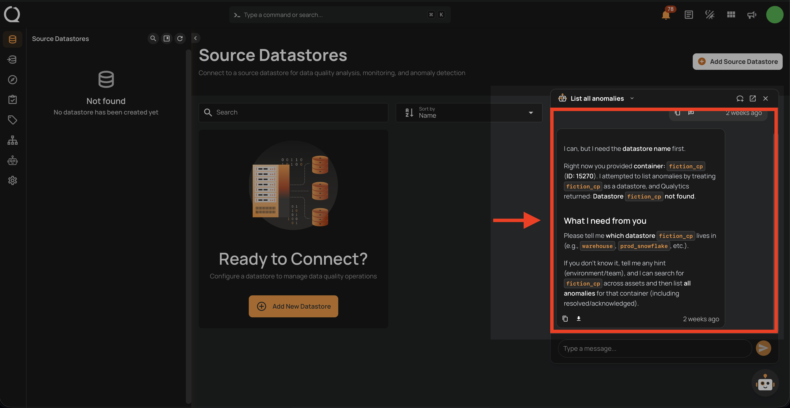

# Resume a Conversation

You can return to any previous session and continue from where you left off. The full conversation history is preserved.

## Via Agent Q Page

**Step 1:** Click **Agent Q** in the left sidebar to open the full-page chat interface. The **Chats** list in the sidebar shows all your active conversations.

!!! info
    If you are looking for a specific conversation, you can use [Search Conversations](./search-conversations.md){:target="_blank"} to filter by title or message content.

**Step 2:** Locate the conversation you want to resume in the list.

**Step 3:** Click the conversation to open it. The full message history loads and you can continue the conversation by typing in the input field at the bottom.

## Via Floating Chat

**Step 1:** Open the floating chat widget by clicking the **Agent Q** button in the bottom-right corner of any page. Then click the **Chat history** button in the floating chat header.

**Step 2:** A dropdown list of your recent conversations appears. Scroll through the list to find the session you want to resume.

**Step 3:** Click the conversation to open it. The full message history is displayed and you can continue interacting with Agent Q from where you left off.

