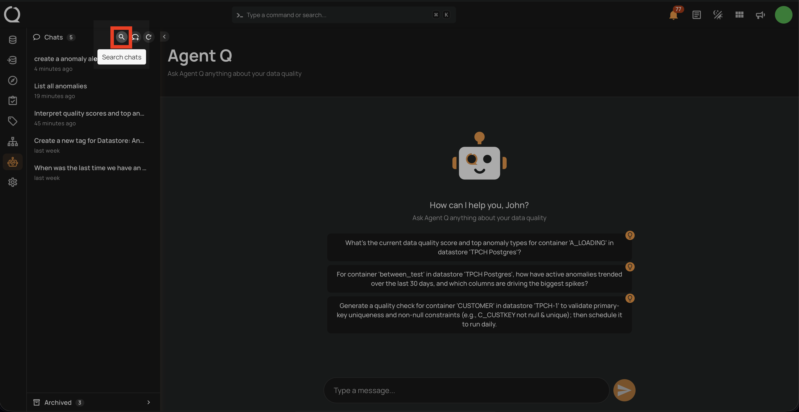
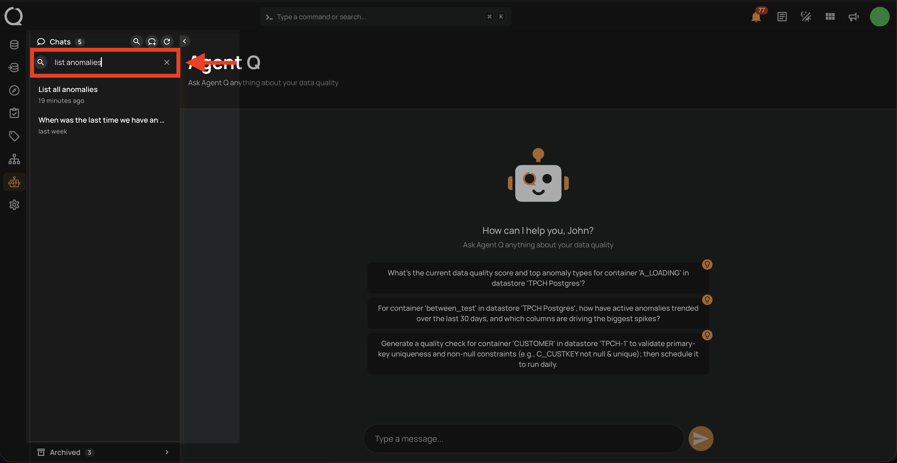

# Search Conversations

The search feature filters your active sessions by title or message content, making it easy to find a specific conversation in a long history.

!!! info
    Search is only available from the **Agent Q** full-page view. The floating chat does not support this action.

## Steps

**Step 1:** In the sidebar, click the **magnifying glass** icon in the **Chats** header toolbar. A search input field appears below the header.

**Step 2:** Type to filter sessions by title or message content. Results update as you type. To clear the filter, click the **✕** button inside the search field or delete the text manually. Click the magnifying glass icon again to close the search panel.

## Behavior

| Aspect | Detail |
| :--- | :--- |
| **Search scope** | Searches both session titles and message content |
| **Results limit** | Up to **20 results** are shown — pagination is disabled during search |
| **Empty query** | Clearing the field resets the list to all active sessions |
| **Archived sessions** | Not included in search results |
