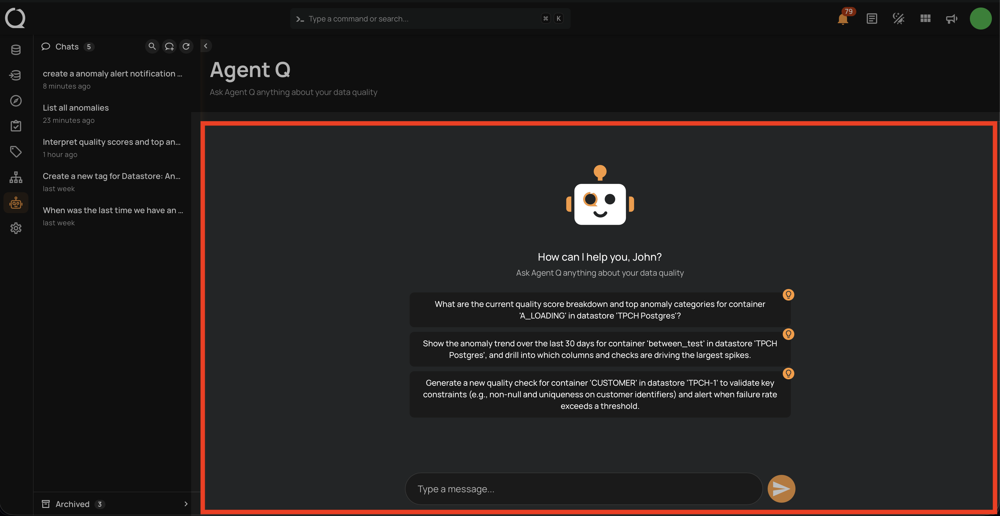
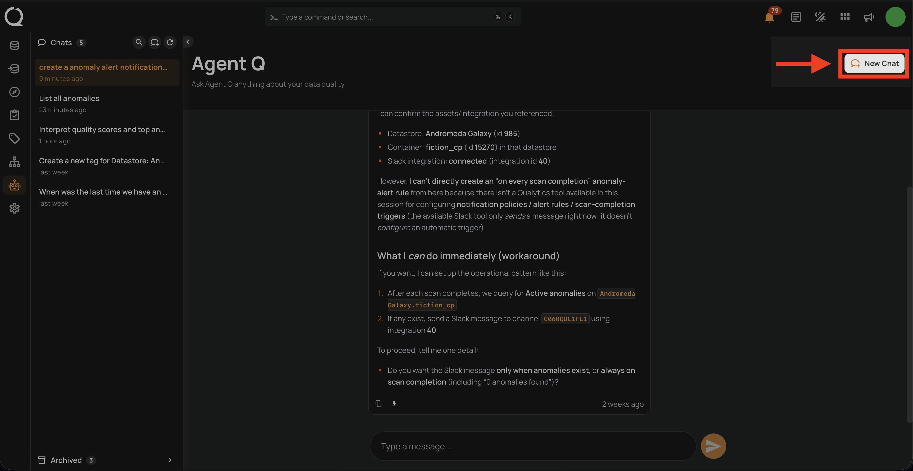
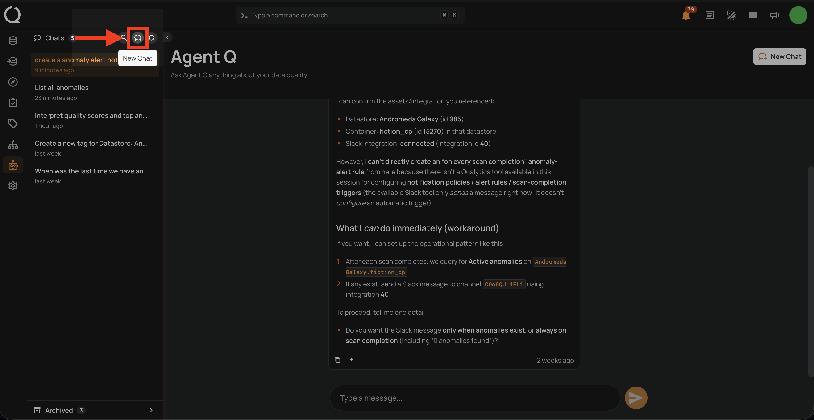
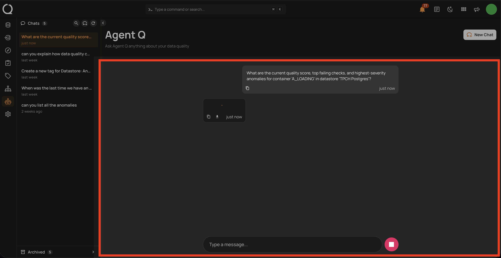
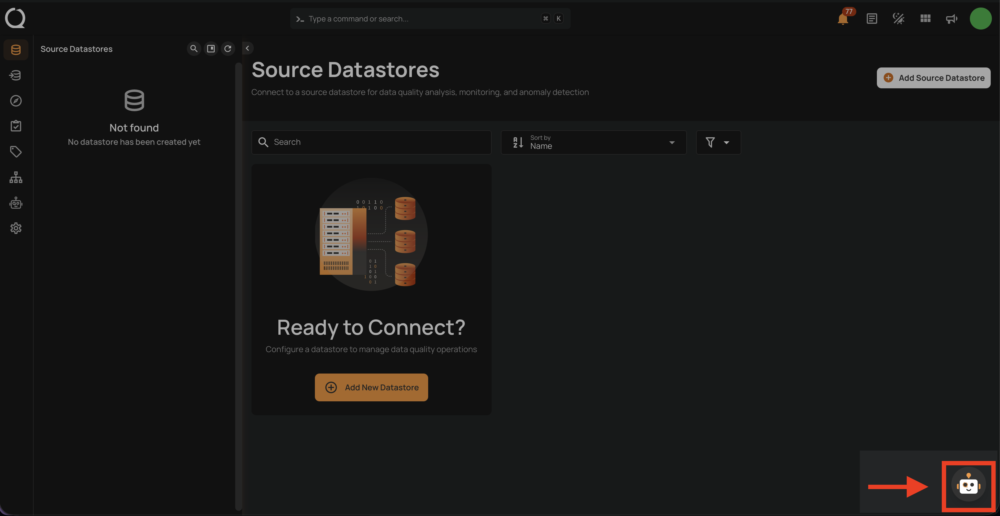
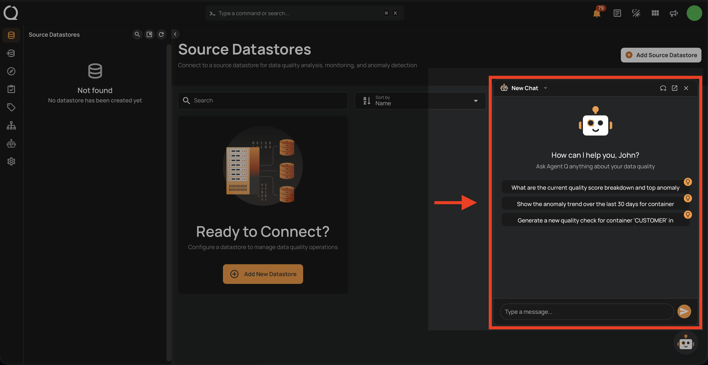
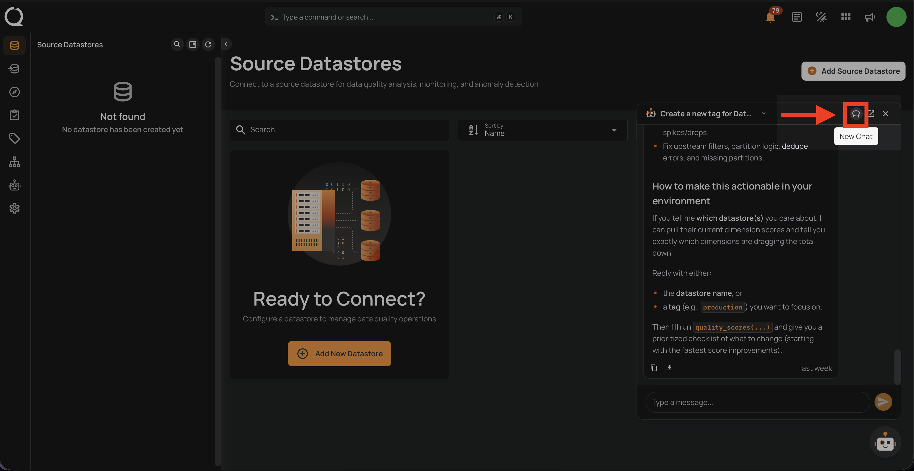
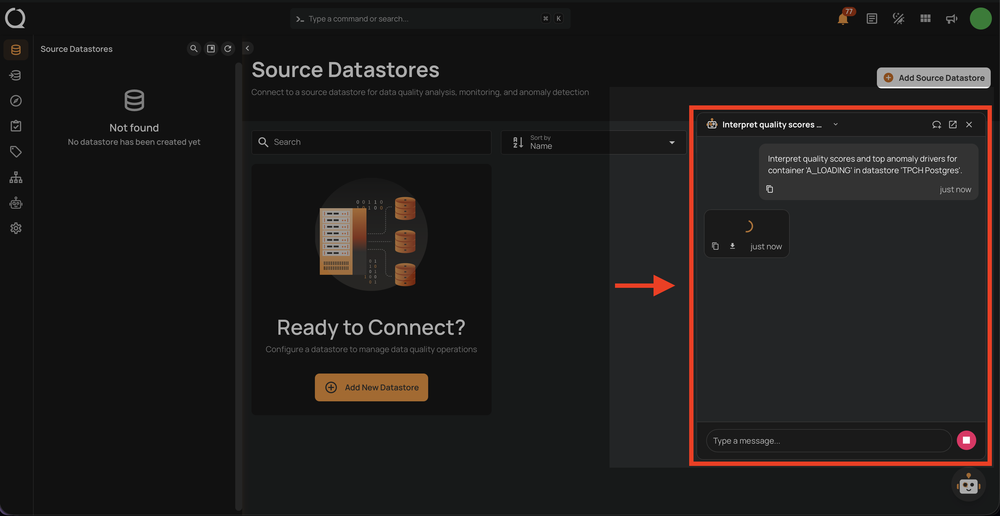

# Start a New Conversation

Starting a new conversation clears the current chat and opens the empty state with smart suggestions. The session is not saved until you send your first message — at that point, it is automatically created with an AI-generated title based on your opening prompt. You can change this title at any time from the [Rename a Conversation](./rename-a-conversation.md){:target="_blank"} page.

## Via Agent Q Page

**Step 1:** Click **Agent Q** in the left sidebar to open the full-page chat interface. From the empty state, you can start a conversation by typing directly in the chat input at the bottom.

**Step 2 *(optional)*:** If there is already an active conversation open, click the **New Chat** button in the top-right corner of the chat area to open a fresh session.

!!! note
    You can also click the **New Chat** button that appears directly in the sidebar toolbar at the top of the **Chats** list.

**Step 3:** A new empty state opens with personalized smart suggestions. Type your message in the input field to start interacting with Agent Q.

## Via Floating Chat

**Step 1:** On any page in the application, click the **Agent Q** button in the bottom-right corner to open the floating chat.

**Step 2:** The floating chat window opens. You can start interacting with Agent Q right away by typing in the input field. When using the floating chat on specific pages, Agent Q automatically detects the context of the page you are on and uses it in the conversation.

**Step 3 *(optional)*:** If the floating chat already has an existing conversation in progress, a **New Chat** button appears in the floating chat header. Click it to open a fresh session.

