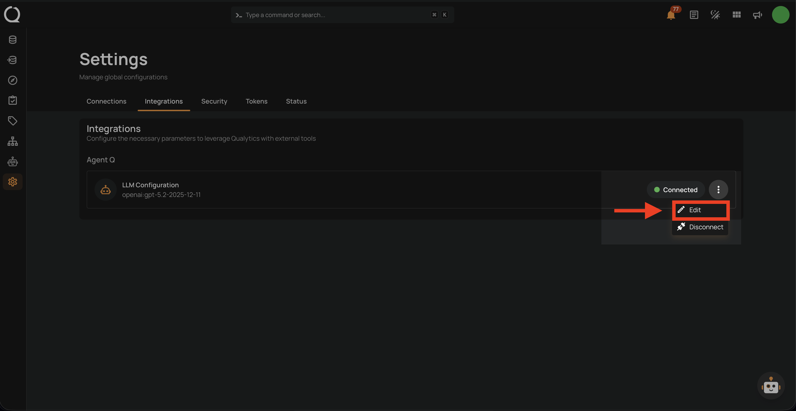
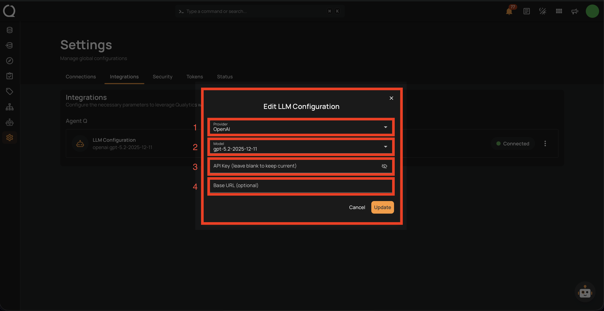
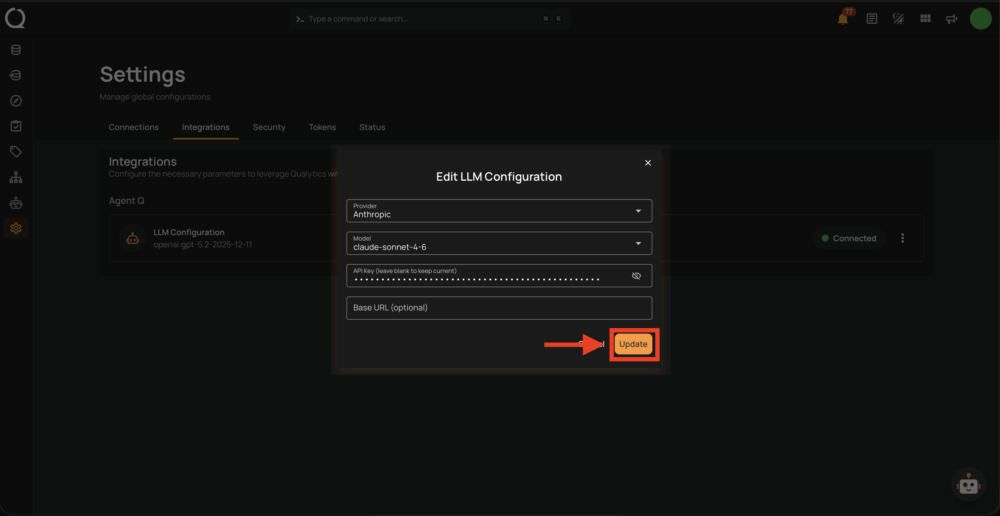
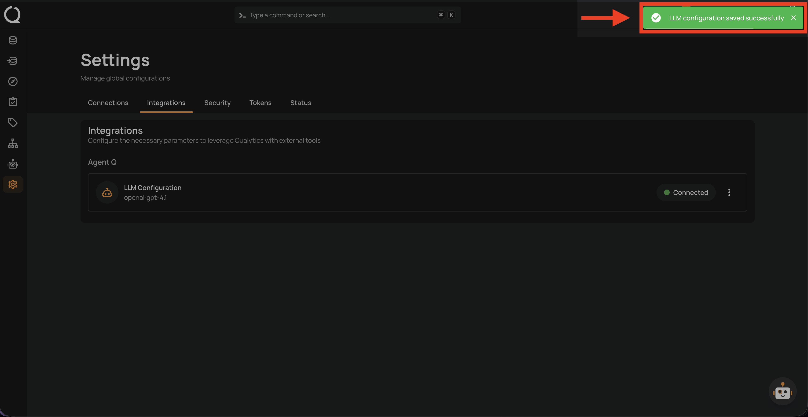

# Update Agent Q Integration

You can change your LLM provider, model, or API key at any time without losing your Agent Q history.

## Steps

**Step 1:** After logging in, click the **Settings** icon (gear) in the bottom-left sidebar.

**Step 2:** The Settings page opens on the **Connections** tab by default. Click the **Integrations** tab.

**Step 3:** Under the **Agent Q** section, click the **⋮** menu next to **LLM Configuration** and select **Edit**.

**Step 4:** The **Edit LLM Configuration** modal opens with your current settings pre-filled. Update any field you want to change:

| Field | Description |
|-------|-------------|
| **Provider** | Select a different LLM provider. |
| **Model** | Choose a different model or type a custom model name. |
| **API Key** | Enter a new API key. Leave blank to keep the current key unchanged. |
| **Base URL** *(optional)* | Update the custom endpoint URL, or clear it to use the provider's default. |

**Step 5:** Make your changes and click **Update** to apply them.

**Step 6:** A confirmation toast **"LLM configuration saved successfully"** appears and the **LLM Configuration** row updates to reflect the new provider and model.

!!! info
    Qualytics re-validates your API key on every save. If the new key is invalid or the provider is unreachable, the update will not be applied and you will see an error.
