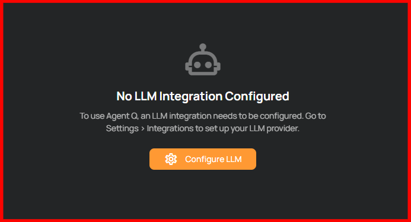
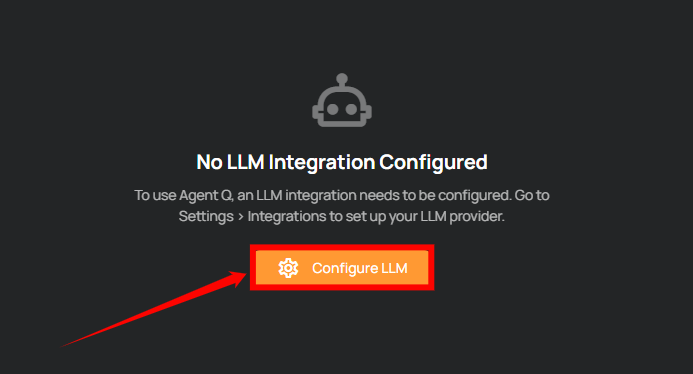
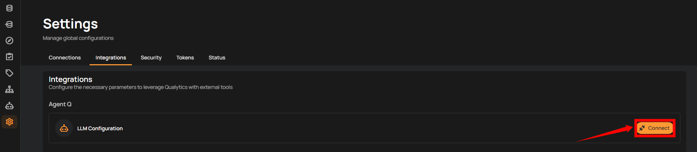
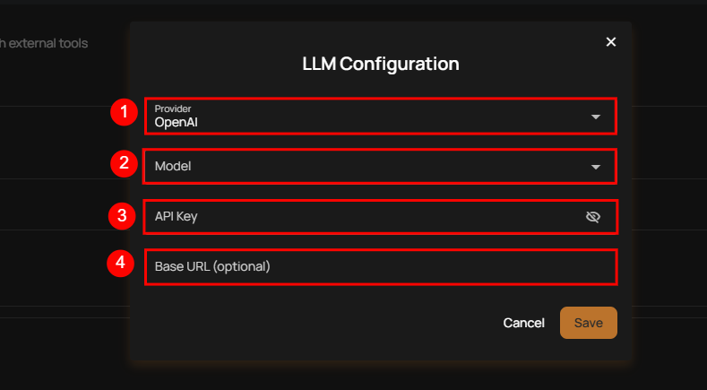
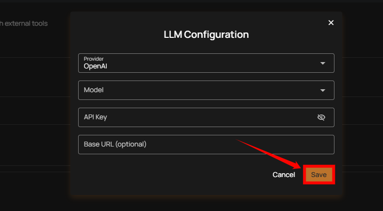
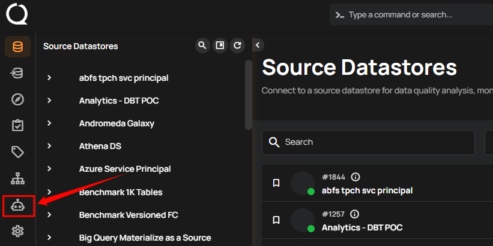
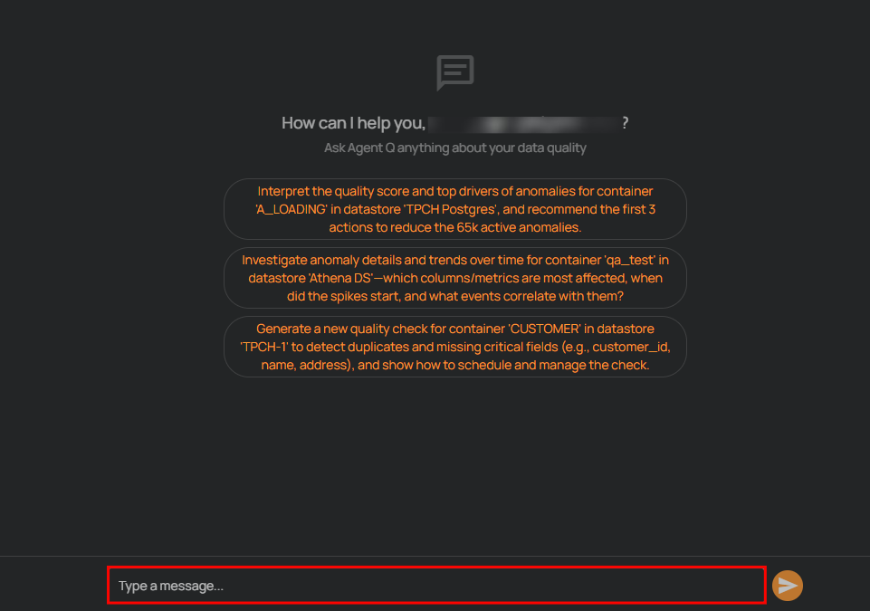
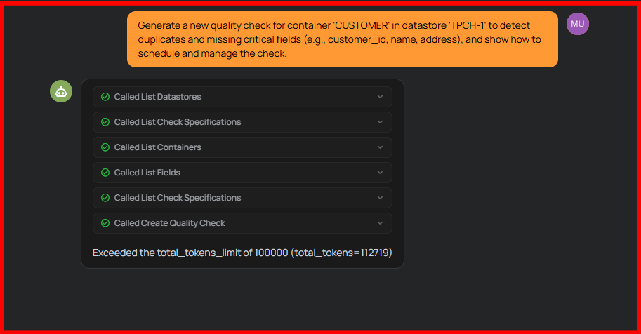

# Agent Q Quickstart

Agent Q is the AI assistant powered by MCP (Model Context Protocol). It allows you to interact with your data using natural language directly inside the platform. Instead of navigating multiple screens, you can simply ask questions or request actions in chat.

## Before You Start (LLM Setup Required)

Agent Q requires an LLM provider to be configured. If no provider is configured, you will see:

**"No LLM Integration Configured"**

### To Configure an LLM Provider:

**Step 1:** Click on the **Configure LLM** button to connect an LLM provider and enable Agent Q.

**Step 2:** After clicking **Configure LLM**, you will be navigated to the **Integrations** tab under **Settings**. Click the **Connect** button next to **LLM Configuration** to connect your LLM provider.

**Step 3:** A modal window will appear for **LLM Configuration**. Fill out the following details:

| No. | Field Name           | Description |
|-----|----------------------|-------------|
| 1   | Provider             | Select the LLM provider you want to use (e.g., OpenAI, Anthropic, etc.). |
| 2   | Model                | Choose the model available under the selected provider. |
| 3   | API Key              | Enter your API key provided by the selected LLM provider. |
| 4   | Base URL (optional)  | Provide a custom base URL if required by your provider (optional). |

After entering the required details, click **Save** to complete the configuration.

Once saved, Agent Q is ready to use.

## Supported LLM Providers

Agent Q supports the following LLM providers:

| No. | Provider Name        |
|-----|----------------------|
| 1   | OpenAI               |
| 2   | Anthropic            |
| 3   | Amazon Bedrock       |
| 4   | Cerebras             |
| 5   | Cohere               |
| 6   | DeepSeek             |
| 7   | Fireworks            |
| 8   | GitHub Models        |
| 9   | Google Gemini        |
| 10  | Google Vertex AI     |
| 11  | Grok                 |
| 12  | Groq                 |
| 13  | Heroku               |
| 14  | Hugging Face         |
| 15  | LiteLLM              |
| 16  | Mistral              |
| 17  | Moonshot AI          |
| 18  | Ollama               |
| 19  | OpenRouter           |
| 20  | Perplexity           |
| 21  | Together AI          |
| 22  | xAI                  |

!!! note
    You must provide your own API key for the selected provider.

## How to Use Agent Q

**Step 1:** Click on **Agent Q** from the left sidebar to open the AI assistant.

**Step 2:** The Agent Q chat interface will open. Type your request in the message box at the bottom and press **Enter** to start interacting with the assistant.

You can ask things like:

- "Create a quality check for this table."
- "Why did anomaly volume increase last week?"
- "Validate this SQL query."
- "Show top anomaly drivers."
- "Create a computed table from this dataset."

## What Happens After You Send a Request?

Agent Q will:

- Understand your request
- Execute the required steps using MCP tools
- Show real-time progress indicators
- Display detailed results
- Allow you to expand inputs and outputs for transparency  

You can continue the conversation to refine results or ask follow-up questions.

## What Agent Q Can Help You With

Agent Q can assist with:

- Exploring connected datastores
- Validating SQL queries
- Creating computed tables
- Building and managing quality checks
- Investigating anomalies
- Analyzing quality scores and trends  

Each response shows the actions taken, so you can clearly see how the result was generated.

Agent Q helps you perform data quality tasks faster by combining natural language interaction with guided workflows.
