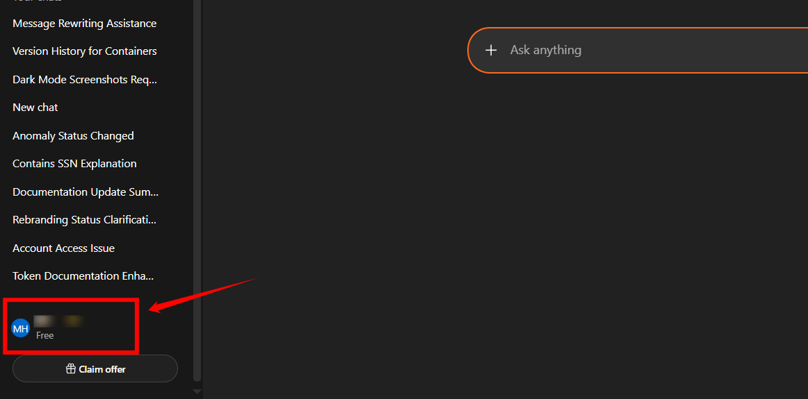
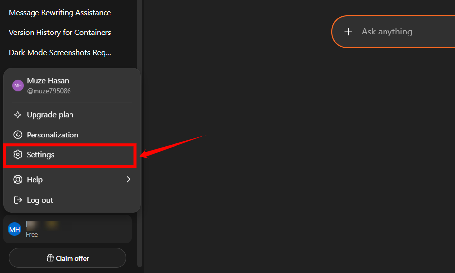
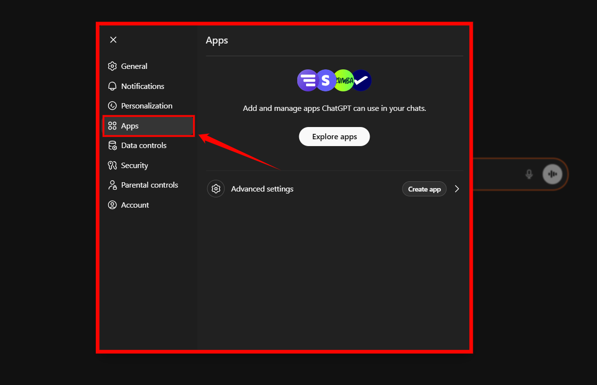
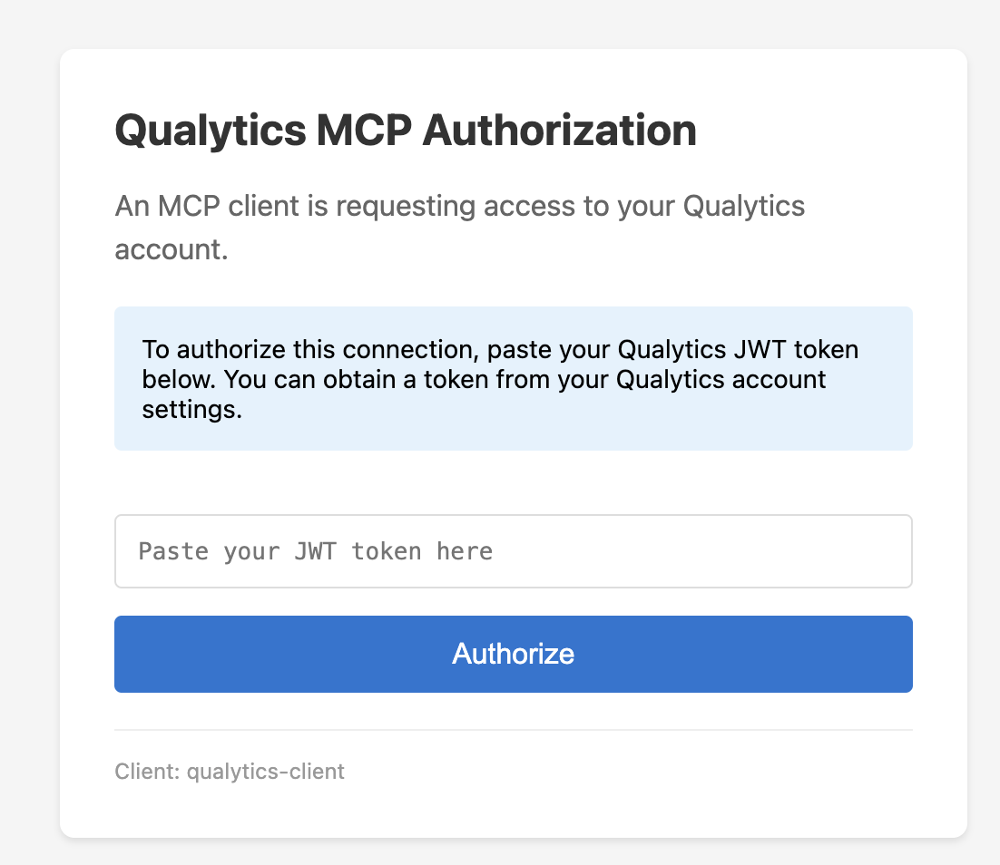

# Model Context Protocol (MCP)

The Qualytics platform exposes an MCP (Model Context Protocol) service that enables AI assistants and LLM-powered applications to interact directly with your data quality infrastructure. This integration allows you to manage data quality through natural language conversations—exploring datastores, creating transformations, building quality checks, and investigating anomalies without writing code or navigating complex interfaces.

## What is MCP?

The [Model Context Protocol](https://modelcontextprotocol.io/) is an open standard that enables AI assistants to securely connect to external data sources and tools. By exposing Qualytics functionality through MCP, you can use AI-powered tools like Claude Desktop, Cursor, or custom LLM applications to manage data quality workflows conversationally.

## Endpoint

The MCP service is available at your Qualytics instance URL:

```
https://your-qualytics-instance.qualytics.io/mcp
```

## Authentication

The MCP service uses the same authentication mechanism as the Qualytics API. You'll need a Personal API Token (PAT) to authenticate requests.

To generate a token:

1. Navigate to **Settings** > **Tokens** in your Qualytics instance
2. Click **Generate Token**
3. Copy and securely store the generated token

For detailed instructions, see [Tokens](../../tokens/overview-of-tokens.md).

## Capabilities

This video demonstrates the power of one-shot prompting using the Qualytics MCP server

<div style="position: relative; padding-bottom: 56.25%; height: 0;"><iframe src="https://www.loom.com/embed/4b204d88eef6467aa3548fb1d9847710" frameborder="0" webkitallowfullscreen mozallowfullscreen allowfullscreen style="position: absolute; top: 0; left: 0; width: 100%; height: 100%;"></iframe></div>

### Datastore Exploration

When you connect an AI assistant to Qualytics via MCP, it gains the ability to explore your data landscape and understand the structure of your datastores. This enables conversations like:

- *"What tables are in our sales database?"*
- *"Show me the schema for the customer_orders table"*
- *"What fields are available in the transactions container?"*

The AI assistant retrieves schema information, field definitions, and metadata to help you understand your data without manually navigating the Qualytics UI or writing queries. This is particularly valuable when onboarding to unfamiliar datasets or when you need quick answers about data structure during analysis.

**Business Use Cases:**

- **Data Discovery**: New team members can conversationally explore available data assets and understand what information is accessible
- **Ad-hoc Analysis Preparation**: Analysts can quickly understand table structures before building reports or dashboards
- **Documentation Support**: Generate descriptions of data assets by asking the AI to summarize what it finds in your datastores

### Query Validation

Before running queries against production systems, you can ask the AI assistant to validate your SQL. The assistant executes queries with limits through the Qualytics service account to verify syntax, table/column existence, and permissions.

- *"Can you check if this query will work against our Snowflake warehouse?"*
- *"Validate this SQL before I use it in my ETL pipeline"*
- *"Does the service account have access to the finance schema?"*

**Business Use Cases:**

- **Development Workflow**: Validate queries during development without risking production impact
- **Permission Auditing**: Verify what data the Qualytics service account can access
- **SQL Debugging**: Get immediate feedback on query errors with AI-assisted explanations

### Data Transformations

One of the most powerful capabilities is creating computed assets through conversation. Instead of manually configuring transformations in the UI, you can describe what you need in plain language.

#### Computed Tables (JDBC Datastores)

For databases with SQL support, you can create stored queries that execute in the source database using its native dialect:

- *"Create a computed table that aggregates daily sales by region from the transactions table"*
- *"Build me a view that joins customers with their most recent orders"*
- *"Set up a transformation that filters the events table to only include completed transactions from this quarter"*

The AI understands your database dialect and generates appropriate SQL. The resulting computed table becomes a new container in Qualytics that you can profile and scan for quality issues.

**Business Use Cases:**

- **Derived Metrics**: Create aggregated views for KPI tracking without modifying source systems
- **Data Preparation**: Build filtered or transformed datasets for downstream analysis
- **Business Logic Encapsulation**: Encode complex business rules into reusable computed tables

#### Computed Files (DFS Datastores)

For file-based sources like S3, ADLS, or GCS, transformations are applied using Spark SQL:

- *"Transform our raw CSV files to only include records where status is 'active'"*
- *"Create a computed file that casts the amount column to decimal and renames customer_id to cust_id"*
- *"Filter the parquet files to exclude test data based on the environment flag"*

**Business Use Cases:**

- **Data Lake Curation**: Create clean, transformed views of raw landing zone data
- **Schema Standardization**: Normalize field names and types across different file sources
- **Data Filtering**: Remove test data, PII, or irrelevant records before profiling

#### Cross-Datastore Joins

Perhaps the most powerful transformation capability is joining data across completely different systems:

- *"Join the customer table from our PostgreSQL database with the order events from S3"*
- *"Combine Snowflake sales data with the product catalog stored in BigQuery"*
- *"Create a unified view of transactions from our legacy Oracle system and the new cloud warehouse"*

The AI configures the join to execute in Spark, loading data from both sources and combining them without requiring you to build ETL pipelines or manually move data.

**Business Use Cases:**

- **360° Customer Views**: Combine customer data scattered across CRM, data warehouse, and data lake
- **Cross-System Reconciliation**: Compare data between systems during migrations or audits
- **Unified Analytics**: Enable analysis across organizational data silos without infrastructure changes

### Quality Check Management

You can create and manage data quality checks through natural conversation, without needing to understand the specifics of each rule type:

- *"Make sure the email field in the customers table is never null"*
- *"Add a check that order_total is always between 0 and 1,000,000"*
- *"Verify that ship_date is always after order_date"*
- *"Create a check that ensures the status field only contains 'pending', 'shipped', or 'delivered'"*
- *"Add validation that the phone_number field matches a valid US phone format"*

The AI assistant translates your intent into the appropriate quality check configuration, selecting the right rule type and setting up the necessary parameters.

**Business Use Cases:**

- **Rapid Quality Framework Setup**: Quickly establish quality checks across new datasets through conversation
- **Business Rule Implementation**: Translate business requirements directly into quality checks without technical translation
- **Compliance Validation**: Set up checks for regulatory requirements by describing them in plain language
- **Data Contract Enforcement**: Define expectations for data produced by upstream systems

### Anomaly Investigation

When quality issues are detected, you can investigate them conversationally:

- *"Tell me about the anomalies found in yesterday's scan"*
- *"What's wrong with anomaly 12345?"*
- *"Explain the business impact of the data quality issues in the orders table"*
- *"Which quality checks are failing most frequently?"*

The AI retrieves comprehensive anomaly details including the failed checks, affected records count, and contextual information. It can then help you understand the business implications and suggest remediation approaches.

**Business Use Cases:**

- **Incident Triage**: Quickly understand the scope and impact of data quality issues
- **Root Cause Analysis**: Investigate patterns in anomalies to identify upstream problems
- **Stakeholder Communication**: Generate plain-language explanations of technical issues for business audiences
- **Remediation Planning**: Get AI-assisted suggestions for addressing data quality problems

### Quality Trends & Insights

Analyze data quality trends over time to understand how your quality posture is evolving:

- *"How has the quality score for our orders table changed over the past month?"*
- *"Show me the trend of anomaly volume across all datastores"*
- *"What are the top anomaly drivers in our production database?"*

The AI retrieves time-series quality metrics, operation execution insights, and trend analysis to help you identify patterns and measure improvement.

**Business Use Cases:**

- **Quality Reporting**: Generate quality trend reports for management and stakeholders
- **Improvement Tracking**: Measure the impact of quality initiatives over time
- **Proactive Monitoring**: Spot declining quality trends before they become critical

### Global Search & Asset Discovery

Search across your entire data landscape to find specific assets, tables, fields, or quality checks:

- *"Find all tables related to customer data across all our datastores"*
- *"Search for any containers named 'transactions'"*
- *"What quality checks mention revenue?"*

**Business Use Cases:**

- **Impact Analysis**: Quickly find all assets affected by a schema change or data issue
- **Audit Support**: Locate specific data assets during compliance reviews
- **Cross-Team Discovery**: Find data assets managed by other teams across shared infrastructure

### Operational Actions

Trigger and monitor data operations, manage tags, send notifications, and create tickets through conversation:

- *"Run a profile operation on the customers table"*
- *"Tag the orders and transactions tables as 'finance-critical'"*
- *"Send a notification to the data-engineering Slack channel about the quality issue"*
- *"Create a Jira ticket for the null values in the merchant_id field"*

**Business Use Cases:**

- **Workflow Automation**: Trigger profiling and scanning operations conversationally
- **Asset Organization**: Manage tags and metadata across your data assets
- **Incident Response**: Create tickets and send notifications directly from quality investigations
- **Cross-Platform Integration**: Connect quality events to your existing alerting and ticketing systems

## Client Configuration

### ChatGPT

**Step 1:** Log in to your ChatGPT account and click on your **profile icon** in the bottom-left corner of the screen.



**Step 2:** After clicking the profile icon, a dropdown menu will appear. Click **Settings**.



**Step 3:** A modal window will appear. Click **Apps** to manage and create new app connections.



**Step 4:** In the **Apps** section, click **Create app** to start creating a new app connection.


A **New App** modal window will appear. Enter the required details:

| No. | Field | Description | Example |
|-----|-------|------------|----------|
| 1 | **Icon** | (Optional) Upload an icon for the app (128 × 128 px, max 10 KB). | Qualytics logo (128 × 128 px) |
| 2 | **Name** | Enter a unique name to identify this app connection. | Qualytics MCP |
| 3 | **Description** | Provide a short summary explaining what this integration does. | Connects ChatGPT to Qualytics MCP for data quality operations. |
| 4 | **MCP Server URL** | Enter your Qualytics MCP endpoint URL. | https://your-qualytics-instance.qualytics.io/api/mcp/ |
| 5 | **Authentication** | Select the authentication method. | OAuth |
| 6 | **OAuth Client ID** | Enter the OAuth client ID provided for your instance. | qualytics-client |
| 7 | **OAuth Client Secret** | Paste your Qualytics API token. | `<Your Qualytics API Token>` |
| 8 | **Confirmation Checkbox** | Select “I understand and want to continue” to proceed with the connection. | Checked |


**Step 5:** Once all the details are filled in, click **Create** to complete the app setup.


After creating the app, ChatGPT will prompt you to authorize the connection. When prompted, paste the **same Qualytics API token** again.

{: style="height:400px"}

!!! note
    The OAuth Secret and the authorization prompt both require the same Qualytics API token.

### Claude Desktop

Claude Desktop supports MCP servers as Custom Connectors. To add the Qualytics MCP server:

1. Open **Settings** in Claude Desktop
2. Navigate to the **Connectors** section
3. Click **Add Custom Connector**
4. Configure the connector with the following details:
      - **Name**: `Qualytics`
      - **URL**: `https://your-qualytics-instance.qualytics.io/api/mcp/`
      - **Authentication**: Enter your Qualytics API token
5. Click **Save** to enable the connector

Once configured, Qualytics tools will be available in your Claude Desktop conversations.

### Claude Code

Use the `claude mcp add` command to register the Qualytics MCP server:

```bash
claude mcp add --transport http qualytics \
  https://your-qualytics-instance.qualytics.io/api/mcp/ \
  --header "Authorization: Bearer YOUR_API_TOKEN"
```

To share the configuration with your team, add the `--scope project` flag, which stores the configuration in a `.mcp.json` file in your project directory.

### Cursor

Add the following to your Cursor MCP configuration:

```json
{
  "mcpServers": {
    "qualytics": {
      "url": "https://your-qualytics-instance.qualytics.io/api/mcp/",
      "headers": {
        "Authorization": "Bearer YOUR_API_TOKEN"
      }
    }
  }
}
```

### VS Code (GitHub Copilot)

Add the Qualytics MCP server to your VS Code workspace or user settings. Create or edit the `.vscode/mcp.json` file in your workspace:

```json
{
  "servers": {
    "qualytics": {
      "type": "http",
      "url": "https://your-qualytics-instance.qualytics.io/api/mcp/",
      "headers": {
        "Authorization": "Bearer YOUR_API_TOKEN"
      }
    }
  }
}
```

Once configured, Qualytics tools and resources will be available in GitHub Copilot Chat.

### Windsurf

Edit your Windsurf MCP configuration file at `~/.codeium/windsurf/mcp_config.json`:

```json
{
  "mcpServers": {
    "qualytics": {
      "serverUrl": "https://your-qualytics-instance.qualytics.io/api/mcp/",
      "headers": {
        "Authorization": "Bearer YOUR_API_TOKEN"
      }
    }
  }
}
```

You can also add MCP servers through the Windsurf Settings > Cascade > MCP Servers panel.

### Amazon Q Developer

Add the Qualytics MCP server to your Amazon Q Developer configuration. Edit `~/.aws/amazonq/mcp.json` for global configuration:

```json
{
  "mcpServers": {
    "qualytics": {
      "type": "http",
      "url": "https://your-qualytics-instance.qualytics.io/api/mcp/",
      "headers": {
        "Authorization": "Bearer YOUR_API_TOKEN"
      }
    }
  }
}
```

For workspace-scoped configuration, place the file at `.amazonq/mcp.json` in your project directory.

## Example Conversations

### Setting Up Quality Monitoring for a New Dataset

> **You**: We just connected a new PostgreSQL database called "ecommerce_prod". Can you help me understand what's in there and set up some basic quality checks?
>
> **AI**: I found 12 tables in the ecommerce_prod datastore. The main ones appear to be `customers`, `orders`, `order_items`, `products`, and `inventory`. Would you like me to describe the schema for any of these in detail?
>
> **You**: Yes, tell me about the orders table and suggest some quality checks.
>
> **AI**: The orders table has 15 fields including order_id, customer_id, order_date, ship_date, status, and total_amount. Based on the schema, I'd recommend these quality checks:
>
> - order_id should be unique
> - customer_id should not be null
> - total_amount should be positive
> - ship_date should be after order_date when both are present
> - status should be one of your valid status values
>
> Want me to create these checks?

### Investigating a Data Quality Alert

> **You**: We got an alert about anomalies in the transactions table. What's going on?
>
> **AI**: I found 3 anomalies from the last scan. The most significant is a "Not Null" check failure on the `merchant_id` field—247 records have null values where this field is expected to be populated. This started appearing after the batch that loaded at 2:00 AM. The affected records all have source_system = 'legacy_import'. Would you like me to show you the specific check that's failing or help investigate the source of these null values?

### Building Cross-System Analytics

> **You**: I need to analyze customer lifetime value but our customer data is in Salesforce (synced to Snowflake) and our transaction data is in our PostgreSQL operational database. Can you help?
>
> **AI**: I can create a computed join that combines data from both sources. I'll join the customer table from your Snowflake datastore with the transactions table from PostgreSQL on customer_id. What fields do you need in the result? At minimum I'd suggest customer details, total transaction count, total spend, and first/last transaction dates.
>
> **You**: That sounds right. Also filter out any test customers.
>
> **AI**: I've created a computed join called "customer_lifetime_value" that combines the data and excludes records where the customer email contains "test" or the customer_type is "internal". The join is now available as a container in Qualytics. Would you like me to set up quality checks on this new dataset or run a profile to understand the data distribution?
