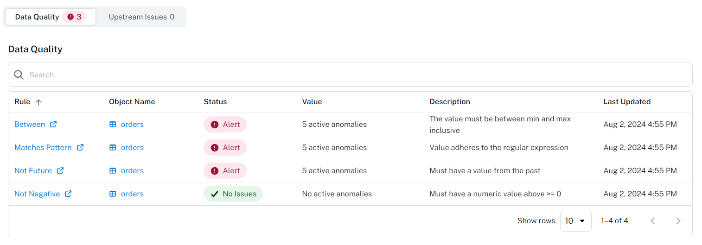

# Alation

## Setup

### Create Refresh Token

Before setting up an Alation integration in Qualytics it is necessary to create a refresh token in order to enable Qualytics to reach Alation's API to synchronize assets between both platforms.

**Step 1:** Go to **Profile Settings**.

**Step 2:** Navigate to the **Authentication** tab.

**Step 3:** Click on **Create Refresh Token**.

**Step 4:** Define a token name.

**Step 5:** Make sure to copy the token generated and keep it somewhere safe.

### Add Alation Integration

**Step 1:** Go to the Qualytics' **Settings** page and navigate to the **Integrations** tab

    
**Step 2:** Click the **Add Integration** button

**Step 3:** Fill up the configuration form selecting the `Alation` integration type.

| REF. | FIELDS                 | ACTIONS                                                                 |
|------|------------------------|-------------------------------------------------------------------------|
| 1️.  | Name (Required)         | Specify the name of the integration |
| 2️.  | URL (Required)          | The Alation instance address. |
| 3️.  | Refresh Token (Required) | The refresh token used to reach Alation API. |
| 4.  | User Id (Required) | The user id from which the token was generated. |
| 5.  | Event Driven | If enabled, the integration sync will be triggered by the operations' execution (profile and scans), only impacting the operations' target assets. |
| 6.  | Overwrite Tags | If enabled, Alation tags will be prioritized over Qualytics tags when there are conflicting tags (tags with the same name in both sides). |

!!!info
    To find the **User Id** navigate to **My Profile** page where the user id will appear in the URL.  
    e.g (https://`instance`.alationcloud.com/app/user/`user-id`/queries)

**Step 4:** Click the **Save** button to create the Atlan integration. You will see the new integration created in Qualytics

## Synchronization

The Alation synchronization happens both ways, by pulling tags from Alation and assigning to Qualytics assets, as well as, pushing Qualytics metadata and data quality insights to Alation.

### Tags

During a sync, the Alation integration pulls tags assigned to data assets in Alation and assigns them as external tags on the corresponding assets in Qualytics.

### Alerts

When anomalies are identified by Qualytics, alerts are pushed to the assets in Alation informing how many active anomalies have been identified with a link to navigate to the respective anomalies.

### Metadata

The Quality Score Total, the Qualytics 8 and the count of checks and anomalies per asset measured and identified by Qualytics are pushed to Alation enabling users to analyze their assets based on metrics produced by our data profiling and scanning operations.

### Data Health

In Alation, each asset has a Data Health tab which Qualytics leverages to present in a tabular manner insights of our data quality checks and their current status based on the count of anomalies per check. 

