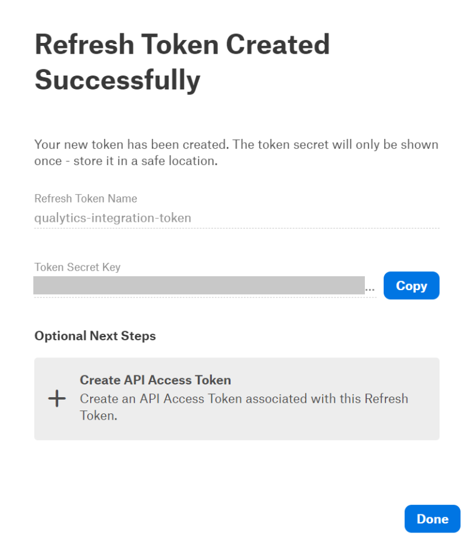

# Alation

## Setup

### Create Refresh Token

Before setting up an Alation integration in Qualytics, it is necessary to create a refresh token to enable Qualytics to access Alation's API and synchronize assets between both platforms.

**Step 1**: Go to **Profile Settings**.

**Step 2**: Navigate to the **Authentication** tab.

**Step 3**: Click on **Create Refresh Token**.

**Step 4**: Define a token name.

{ width=450}

**Step 5**: Ensure you copy the generated token and store it in a safe place.

{ width=450}

### Add Alation Integration

**Step 1**: Go to the Qualytics' **Settings** page and navigate to the **Integrations** tab

{ width=650}
{ width=650}
    
**Step 2**: Click the **Add Integration** button

**Step 3**: Fill out the configuration form selecting the `Alation` integration type.

{ width=550}

| REF. | FIELDS                 | ACTIONS                                                                 |
|------|------------------------|-------------------------------------------------------------------------|
| 1️.  | Name (Required)         | Specify the name of the integration |
| 2️.  | URL (Required)          | The Alation whole instance address. e.g https://`instance`.alationcloud.com |
| 3️.  | Refresh Token (Required) | The refresh token used to reach Alation API. |
| 4.  | User Id (Required) | The user id from which the token was generated. |
| 5.  | Event Driven | If enabled, the integration sync will be triggered by operations, archiving anomalies and checks. |
| 6.  | Overwrite Tags | If enabled, Alation tags will take priority over Qualytics tags when there are conflicting tags (tags with the same name on both sides). |

!!!info
    To find the **User Id** navigate to **My Profile** page where the user id will appear in the URL.  
    e.g https://`instance`.alationcloud.com/app/user/`user-id`/queries

**Step 4**: Click the **Save** button to create the Atlan integration. You will see the new integration created in Qualytics

## Synchronization

The Alation synchronization supports both push and pull operations. This includes pulling tags from Alation and assigning them to Qualytics assets, as well as pushing Qualytics metadata and data quality insights to Alation.

### Tags

During a sync, the Alation integration pulls tags assigned to data assets in Alation and assigns them as **external tags** on the corresponding assets in Qualytics.

!!!info
    Tags synchronization **requires manual triggering**

**Step 1**: To perform tags synchronization, click the **Sync** button on the respective integration card.

{ width=80}

**Step 2**: Define if the synchronization will pull tags and push metadata or both.  

**Step 3**: Wait for Qualytics to create external tags and assign them to the respective Qualytics assets.

### Alerts

When Qualytics identifies anomalies, alerts are sent to the assets in Atlan, indicating the number of active anomalies and providing a link to view the respective anomalies.

### Metadata

The Quality Score Total, the Qualytics 8 (completeness, coverage, conformity, consistency, precision, timeliness, volume, and accuracy), and the count of checks and anomalies per asset identified by Qualytics are pushed to Alation. This allows users to analyze their assets based on metrics produced by our data profiling and scanning operations. Additionally, a link to the respective asset in Qualytics is provided.

### Data Health

In the Alation tables page a tab called **Data Health** can be found which is leveraged by Qualytics to present in a tabular manner insights of our data quality checks and their current status based on the count of anomalies per check. 

| Column | Description |
|-----------------------|-------------|
| Rule | The data quality check rule type|
| Object Name | The table name |
| Status | The check status which can be either `Alert` if there active anomalies or `No Issues` if no active anomalies exists for the check |
| Value  | The current amount of active anomalies |
| Description | The data quality check description |
| Last Updated | The last synced timestamp |