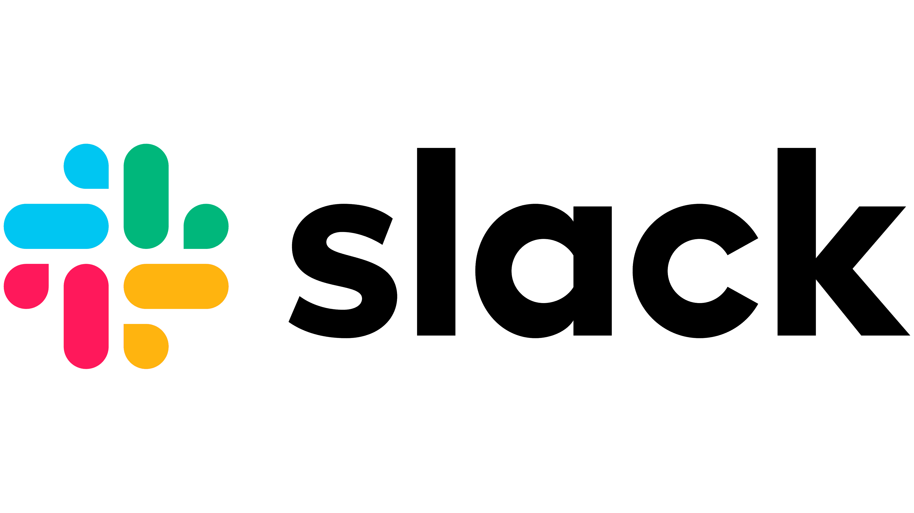
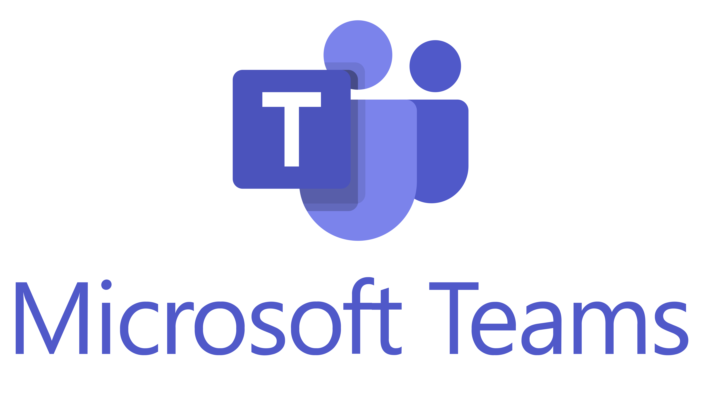

# Alerting Integrations Overview

Alerting integrations connect Qualytics to external messaging and incident management platforms, enabling real-time notifications about data quality events. By setting up these integrations in **Settings > Integrations**, you allow [Flow notification actions](../../../flows/notifications/overview.md) to route alerts to the channels and services your teams already use.

## Why Alerting Integrations Matter

In data quality management, timely awareness of issues is just as important as detecting them. Alerting integrations ensure that the right people are notified through the right channel when something happens — whether it's an anomaly detected during a scan, an operation failure, or a routine status update.

With Alerting Integrations, you can:

- **Deliver instant notifications** when data quality issues are detected, without requiring users to log in to Qualytics.
- **Leverage existing workflows** by routing alerts to the platforms your teams already monitor daily.
- **Categorize by urgency** using severity levels (PagerDuty) or color-coded results (Slack, Teams) to help responders prioritize.
- **Take action without switching tools** — acknowledge anomalies, add comments, or view details directly from Slack.
- **Configure once, use everywhere** — set up the integration at the platform level, then reference it across multiple Flows.

## Available Integrations

| Integration | Description |
| :--- | :--- |
| **Slack** | Send rich, interactive Block Kit messages to Slack channels with action buttons for viewing, acknowledging, and commenting. |
| **Microsoft Teams** | Post Adaptive Card notifications to Teams channels with color-coded results and structured layouts. |
| **PagerDuty** | Trigger PagerDuty incidents via Events API v2 with configurable severity, custom details, and routing key overrides. |

### Slack

<figure markdown="span">

  {: style="height:200px"}

</figure>

Integrate Qualytics with Slack to send real-time alerts directly to your Slack channels. The Slack integration uses a bot token to post messages, allowing teams to stay on top of data quality events without switching tools. Once connected, you can select any channel the bot has access to when configuring Flow notification actions.

For more details, refer to the [Slack Integration](./slack.md) documentation.

### Microsoft Teams

<figure markdown="span">

  {: style="height:200px"}

</figure>

Connect Microsoft Teams to receive automated Adaptive Card alerts about operations, anomalies, and threshold-based events directly in your team channels. The integration uses webhooks to post structured messages with color-coded operation results.

For more details, refer to the [Microsoft Teams Integration](./msft_teams.md) documentation.

### PagerDuty

<figure markdown="span">

  {: style="height:200px"}

</figure>

Connect PagerDuty to trigger real-time incidents based on data quality events, enabling your on-call teams to respond quickly to critical anomalies and operational issues. The integration uses the Events API v2, routing events via a Routing Key to the appropriate PagerDuty service and escalation policy.

For more details, refer to the [PagerDuty Integration](./pagerduty/overview.md) documentation.