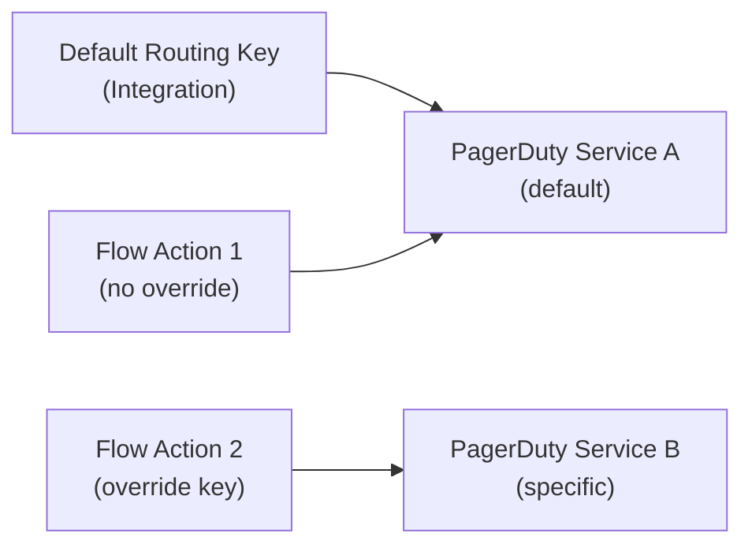

# PagerDuty Deep Dive

This page provides an in-depth look at how Qualytics manages PagerDuty integration behind the scenes — from event construction and routing to severity mapping and deduplication.

## Architecture Overview

Qualytics communicates with PagerDuty through the **Events API v2**, a REST-based API that PagerDuty provides for programmatic incident management. There are two event endpoints involved:

| Endpoint | Purpose | Creates Incidents? |
| :--- | :--- | :--- |
| `/v2/enqueue` | Send trigger, acknowledge, or resolve events | Yes |
| `/v2/change/enqueue` | Send change events (used for validation) | No |

When a Flow action sends a PagerDuty notification, Qualytics constructs a **trigger event** and posts it to `/v2/enqueue`. When validating a Routing Key during integration setup, Qualytics sends a **change event** to `/v2/change/enqueue`, which safely validates the key without creating an incident.

## Event Structure

Every PagerDuty event sent by Qualytics follows this structure:

```json
{
  "routing_key": "your-routing-key",
  "event_action": "trigger",
  "dedup_key": "unique-event-identifier",
  "client": "Qualytics",
  "client_url": "https://your-instance.qualytics.io",
  "payload": {
    "summary": "Anomaly detected in orders (Production DWH): unexpected null values",
    "timestamp": "2026-03-12T10:30:00Z",
    "severity": "error",
    "source": "https://your-instance.qualytics.io",
    "component": "orders",
    "class": "anomaly",
    "custom_details": {
      "datastore": "Production DWH",
      "container": "orders",
      "check_type": "is_not_null"
    }
  },
  "links": [
    {
      "href": "https://your-instance.qualytics.io/anomalies/12345",
      "text": "Event Details"
    }
  ]
}
```

### Event Fields Explained

| Field | Description |
| :--- | :--- |
| `routing_key` | The Integration Key that routes the event to a specific PagerDuty service. Can be overridden per Flow action. |
| `event_action` | Always `trigger` for Qualytics events. This creates a new incident or groups with an existing one if the `dedup_key` matches. |
| `dedup_key` | A unique identifier for the event. PagerDuty uses this to deduplicate events — if an open incident already exists with the same key, a new incident is not created. |
| `client` | Always `Qualytics`. Displayed in the PagerDuty incident timeline. |
| `client_url` | Your Qualytics instance URL. Provides a clickable link in PagerDuty back to the platform. |
| `payload.summary` | The rendered notification message. Composed using the message template configured in the Flow action. |
| `payload.severity` | The severity level: `info`, `warning`, `error`, or `critical`. Controls PagerDuty's urgency and notification behavior. |
| `payload.source` | The origin of the event — set to your Qualytics instance URL. |
| `payload.component` | The affected component — typically the container name (e.g., table or file name). |
| `payload.class` | The event class — categorizes the type of event (e.g., `anomaly`, `operation`, `partition_scan`). |
| `payload.custom_details` | Additional context attached to the incident. Includes system-generated details plus any custom key-value pairs configured in the Flow action. |
| `links` | A direct link back to the relevant resource in the Qualytics UI. |

## Severity Mapping

PagerDuty severity levels control how incidents are prioritized and which notification rules apply. Qualytics allows you to set the severity level per Flow action:

| Severity | PagerDuty Behavior | Recommended Use |
| :--- | :--- | :--- |
| **Info** | Low urgency — may not page on-call depending on service configuration | Informational events, routine completions, status updates |
| **Warning** | Moderate urgency — follows service notification rules | Potential issues that need attention but are not immediately critical |
| **Error** | High urgency — triggers notifications based on escalation policy | Significant data quality issues requiring prompt resolution |
| **Critical** | Highest urgency — immediate notification via all configured channels | Severe incidents demanding immediate response (e.g., critical pipeline failures) |

!!! tip
    PagerDuty's behavior for each severity level depends on your service's **urgency settings** and **notification rules**. Configure your PagerDuty service appropriately to match the alerting behavior you expect from each severity level.

## Routing and Routing Key Override

By default, all PagerDuty events are routed using the **Routing Key** configured in the integration settings. This key maps to a specific PagerDuty service.

However, you may want different types of events to go to different PagerDuty services. For example:

- Critical anomaly alerts → Production Incidents service
- Operational status updates → Data Platform Notifications service

To support this, each PagerDuty notification action in a Flow can include a **Routing Key Override**. When set, the override key is used instead of the default integration key for that specific action.



## Event Deduplication

PagerDuty uses the `dedup_key` field to prevent duplicate incidents. Qualytics assigns a unique event identifier to each notification, which ensures:

- The same event does not create multiple incidents if retried
- Related events can be grouped under the same incident if they share a dedup key

The dedup key is generated from the event's unique internal identifier (such as the operation ID or anomaly ID), ensuring consistency across retries.

## Message Templates

PagerDuty event summaries are rendered from configurable message templates. These templates support variable interpolation using the `{{ variable_name }}` syntax. Available variables include:

| Variable | Description |
| :--- | :--- |
| `{{ flow_name }}` | The name of the Flow that triggered the notification |
| `{{ operation_type }}` | The type of operation (e.g., Catalog, Profile, Scan) |
| `{{ operation_result }}` | The result of the operation (e.g., Success, Failure) |
| `{{ datastore_name }}` | The name of the affected datastore |
| `{{ container_name }}` | The name of the affected container |
| `{{ anomaly_message }}` | The anomaly description message |
| `{{ anomaly_status }}` | The anomaly status (e.g., Active, Acknowledged) |

!!! info
    PagerDuty summaries are **plain text** (unlike Slack Block Kit or Microsoft Teams Adaptive Cards). The message template is rendered as a single-line summary that appears as the incident title in PagerDuty.

## Custom Details

Custom Details allow you to attach additional key-value pairs to PagerDuty incidents. These appear in the incident's **Custom Details** section and provide extra context for responders.

Qualytics automatically populates some custom details based on the event type:

| Event Type | Auto-populated Details |
| :--- | :--- |
| Anomaly | Datastore, container, check type |
| Operation | Datastore, operation type, result |
| Partition Scan | Datastore, container, partition info |

You can add additional custom details through the Flow action configuration. These are merged with the auto-populated details, giving responders a complete picture of the event context.

## Connection Validation

When you create or update a PagerDuty integration, Qualytics validates the Routing Key by sending a **Change Event** to PagerDuty's `/v2/change/enqueue` endpoint.

Change Events are specifically designed for informational purposes and **do not create incidents**. This makes them ideal for connection validation — Qualytics can confirm that the Routing Key is valid and the PagerDuty service is reachable without triggering any alerts.

| Validation Result | HTTP Status | Meaning |
| :--- | :--- | :--- |
| Success | 202 | Routing Key is valid, PagerDuty service is reachable |
| Invalid Key | 400/401 | The Routing Key is incorrect or revoked |
| Network Error | 502 | Cannot reach PagerDuty API |

## Comparison with Other Alerting Integrations

| Feature | PagerDuty | Slack | Microsoft Teams |
| :--- | :--- | :--- | :--- |
| **Authentication** | Routing Key | OAuth tokens | Azure App + OAuth |
| **Message format** | Plain text summary | Block Kit (rich) | Adaptive Cards (rich) |
| **Routing** | Routing Keys → Services | Channels | Teams → Channels |
| **Channel selection** | No (key-based) | Yes (channel picker) | Yes (channel picker) |
| **Severity support** | Native (info/warn/error/critical) | Via message content | Via message content |
| **Incident management** | Native (trigger/ack/resolve) | N/A | N/A |
| **Deduplication** | Native (dedup_key) | N/A | N/A |
| **Per-action override** | Routing Key override | Channel override | Channel override |
