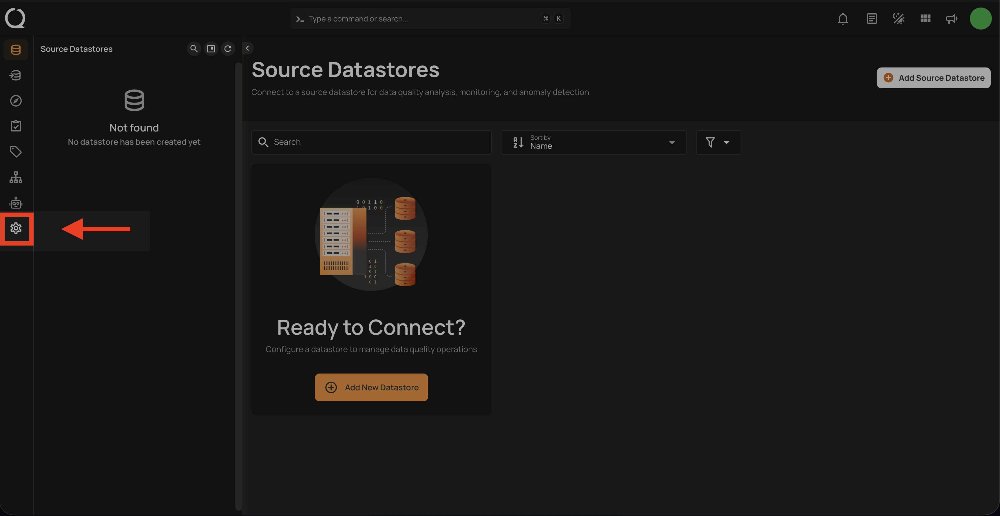
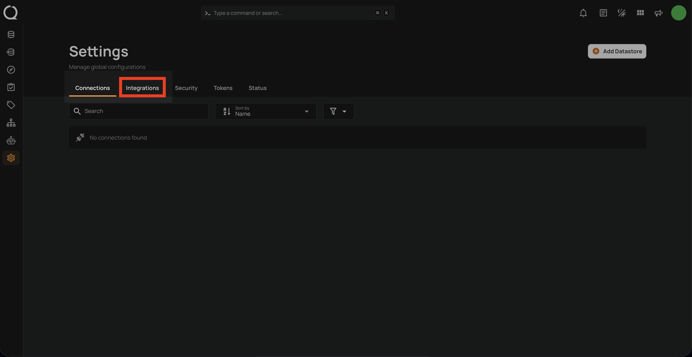
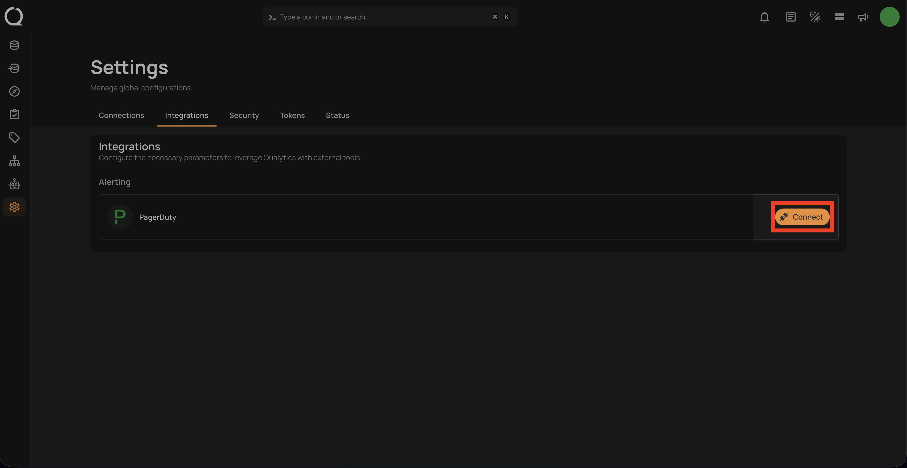
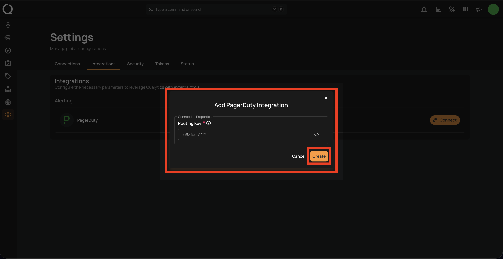
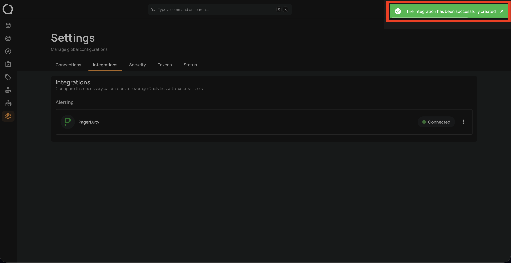

# Add PagerDuty Integration

This guide walks you through connecting PagerDuty to Qualytics. Before starting, you'll need a **Routing Key** (Integration Key) from a PagerDuty service with an Events API v2 integration.

## Prerequisites

### Creating a PagerDuty Service with Events API v2

If you don't already have a PagerDuty service configured with Events API v2, follow these steps:

**Step 1:** Log in to your <a href="https://app.pagerduty.com" target="_blank" rel="noopener">PagerDuty account</a> and navigate to **Services** from the top navigation menu.

**Step 2:** Click **+ New Service** to create a new service (or select an existing service where you want to receive Qualytics alerts).

**Step 3:** Fill in the service details:

- **Name**: Enter a descriptive name (e.g., *Qualytics Data Quality Alerts*).
- **Escalation Policy**: Select or create an escalation policy that determines who gets notified.

**Step 4:** Under **Integrations**, search for and select **Events API v2**, then click **Create Service**.

### Retrieving the Routing Key

**Step 1:** After the service is created, you'll be redirected to the service's **Integrations** tab.

**Step 2:** Locate the **Events API v2** integration and copy the **Integration Key**. This is the **Routing Key** you'll need for the Qualytics integration.

!!! tip
    You can also find the Integration Key later by navigating to **Services > [Your Service] > Integrations > Events API v2**.

---

## Navigation to Integration

**Step 1:** Log in to your Qualytics account and click the **"Settings"** button on the left side panel of the interface.

**Step 2:** By default, Connections tab will open. Click on the **Integrations** tab.

## Connect PagerDuty Integration

**Step 1:** Click on the **Connect** button next to PagerDuty to connect to the PagerDuty Integration.

A modal window titled **"Add PagerDuty Integration"** appears. Fill in the connection properties to connect to PagerDuty.

**Step 2:** Fill out the required connection property and click the **Create** button to validate the Routing Key and create the PagerDuty integration.

| No. | Field Name | Description |
| :---- | :---- | :---- |
| 1. | Routing Key | The **Integration Key** (Routing Key) from your PagerDuty Events API v2 integration. Find it in your PagerDuty service under **Integrations > Events API v2**. |

!!! note
    Qualytics validates your Routing Key by sending a test change event to PagerDuty. This validation does not create an incident in your PagerDuty service.

Once the integration is successfully created, a confirmation message will appear on the screen stating, **"The Integration has been successfully created."**

