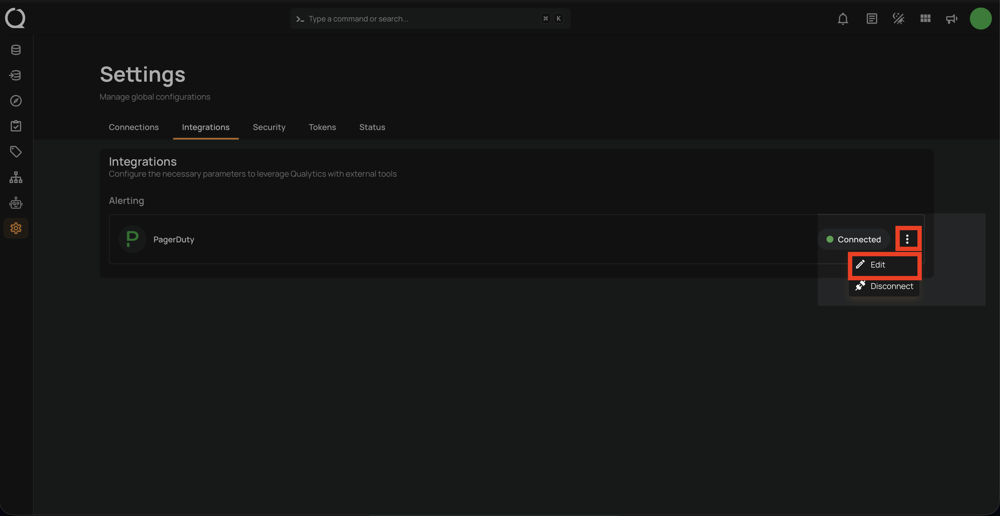
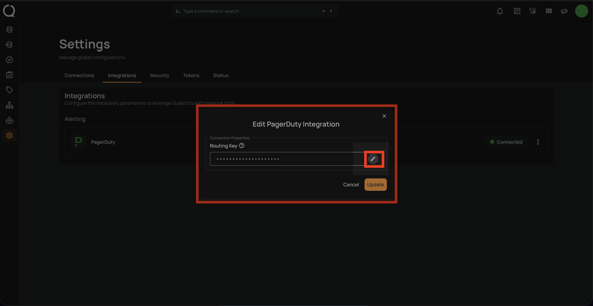
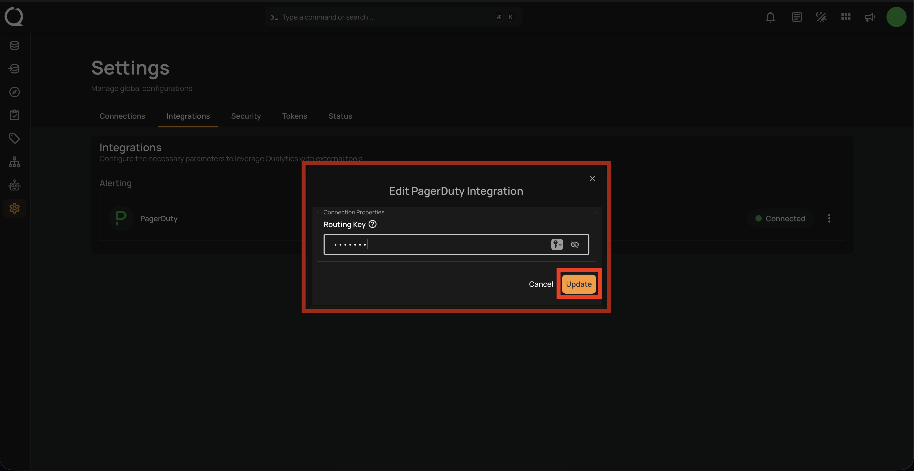
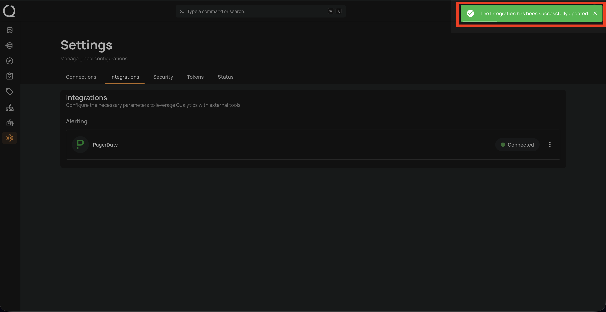

# Edit PagerDuty Integration

Editing the PagerDuty integration allows you to update the Routing Key, for example when the key has been rotated or you want to route events to a different PagerDuty service.

## Edit Integration

**Step 1:** Click on the **vertical ellipses(⋮)** next to the Connected button and select the **Edit** option.

**Step 2:** A modal window **Edit PagerDuty Integration** will appear providing you with options to edit the connection properties.

**Step 3:** After editing the connection properties of the PagerDuty integration, click on the **Update** button to apply the changes.

!!! note
    Qualytics validates the updated Routing Key before saving the changes. If the key is invalid, the update will fail with an error.

A confirmation message will appear on the screen displaying **"The Integration has been successfully updated"**.

