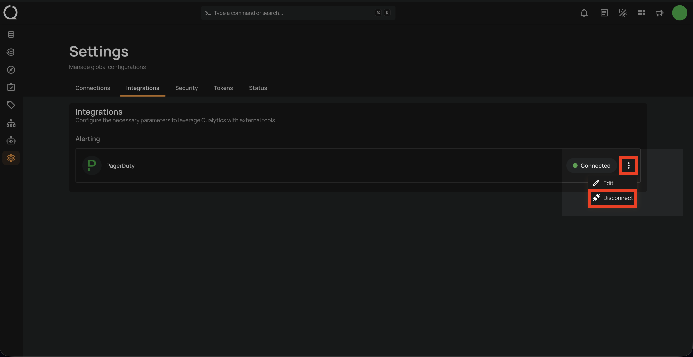
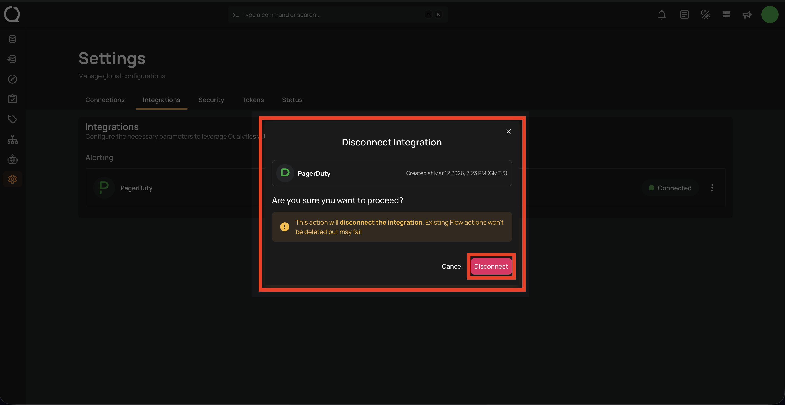
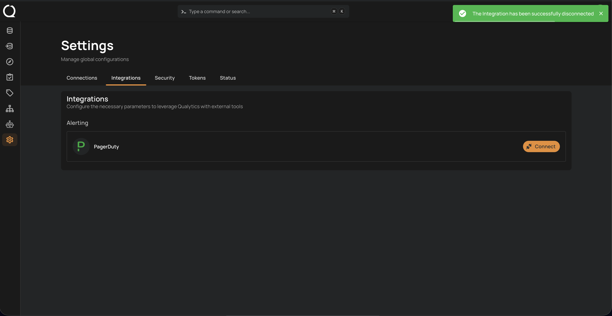

# Remove PagerDuty Integration

Disconnecting the PagerDuty integration will remove its connection from your platform. Any existing workflows, notifications, or Flow actions relying on PagerDuty may stop working, though they won't be deleted. Make sure to review any dependent Flows before proceeding.

## Disconnect Integration

**Step 1:** Click on the **vertical ellipses(⋮)** next to the connected button and select the **Disconnect** option to disconnect the integration.

**Step 2:** A modal window **Disconnect Integration** will appear. Click on the **Disconnect** button to proceed.

!!! warning
    This action will remove the PagerDuty integration. Any Flows using PagerDuty notifications will no longer be able to deliver alerts to your PagerDuty service.

A confirmation message will appear on the screen displaying **"The Integration has been successfully disconnected"**.

