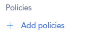
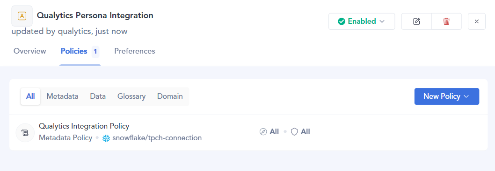
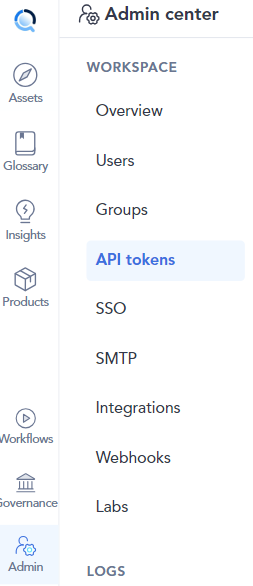
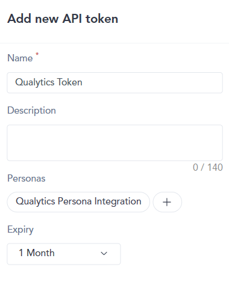
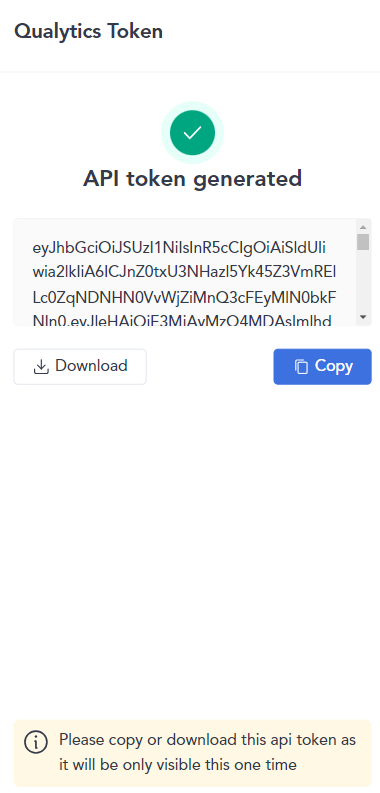
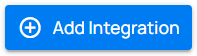
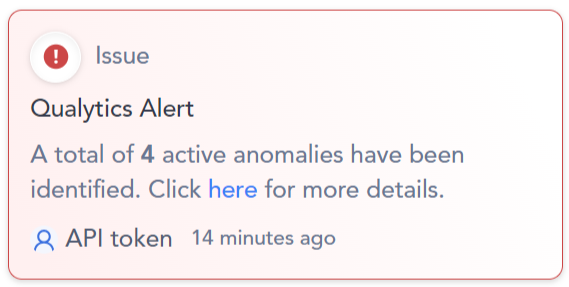

# Atlan

## Setup

### Create Atlan Persona and Policy

Before initiating the integration process, it’s advisable to set up an Atlan persona. This persona enables you to grant the necessary access for Qualytics's API token to the metadata and data of the connections you plan to integrate. Although the persona can be created simultaneously with the API token, establishing it beforehand simplifies the process, allowing you to directly associate it with the token later.

Keep in mind that enabling Atlan for a data source requires that you first authorize the API token with access to the requisite metadata and data. This is done through policies set within the persona for the Atlan connection that matches the Qualytics data source, and it must be done for each data source you intend to integrate.

**Step 1**: Go to **Governance** and **Personas**.

{: style="height:450px"}

**Step 2**: Click in **New Persona**.

**Step 3**: Add a name and description and click in **Create**.

**Step 4**: You will see a section similar to this.

**Step 5**: Click on **Add policies** to add a new policy or create one if none exists.

**Step 6**: You will see the Policies section, click in **New Policy** and choose **Metadata policy**.

**Step 7**: Type the name, select the connection, and customize the permissions and assets that will have Qualytics access.

{: style="height:450px"}

{: style="height:450px"}

**Step 8**: After the policy creation, you can see that it is now included in the **Policy** section.

### Create Atlan Personal Access Token

After creating the persona, you need to create a personal access token.

**Step 1**: Go to **API tokens** in Admin center.

{: style="height:450px"}

**Step 2**: Click in **Generate API token**.

**Step 3**: Add a name, description and the **Persona** you created before.

**Step 4**: Click the **Save** button and store it in a secure location.

{: style="height:450px"}

### Add Atlan Integration

**Step 1**: Go to the settings section of Qualytics and select the **Integrations** tab.

    
**Step 2**: Click the **Add Integration** button.

**Step 3**: Give your new integration a descriptive name, select `Atlan` type, type the URL and the personal access token from the persona you created in Atlan.

**Step 4**: Click the **Save** button to create the Atlan integration. You will see the new integration created in Qualytics.

## Synchronization

The Atlan synchronization supports both push and pull operations. This includes pulling tags from Alation and assigning them to Qualytics assets, as well as pushing Qualytics metadata to Atlan.

### Tags

During a sync, the Atlan integration pulls tags assigned to data assets in Atlan and assigns them as **external tags** on the corresponding assets in Qualytics.

!!!info
    Tags synchronization **requires manual triggering**

**Step 1**: To perform tags synchronization, click the **Sync** button on the respective integration card.

{ width=80}

**Step 2**: Define if the synchronization will pull tags and push metadata or both.  

**Step 3**: Wait for Qualytics to create external tags and assign them to the respective Qualytics assets.

**Step 4**: Check the logs to review the assets that were mapped from Atlan to Qualytics.

**Step 5**: After synchronization, the mapped assets will display an external tag.

!!!note
    In order for a data asset's tags to be synchronized, the token you used when creating the Qualytics integration must have the appropriate permissions (ability to read tags from that asset) in Atlan.

### Alerts

When Qualytics identifies anomalies, alerts are sent to the assets in Atlan, indicating the number of active anomalies and providing a link to view the respective anomalies.

### Metadata

The Quality Score Total, the Qualytics 8 (completeness, coverage, conformity, consistency, precision, timeliness, volume, and accuracy), and the count of checks and anomalies per asset identified by Qualytics are pushed to Atlan. This allows users to analyze their assets based on metrics produced by our data profiling and scanning operations. Additionally, a link to the respective asset in Qualytics is provided.

