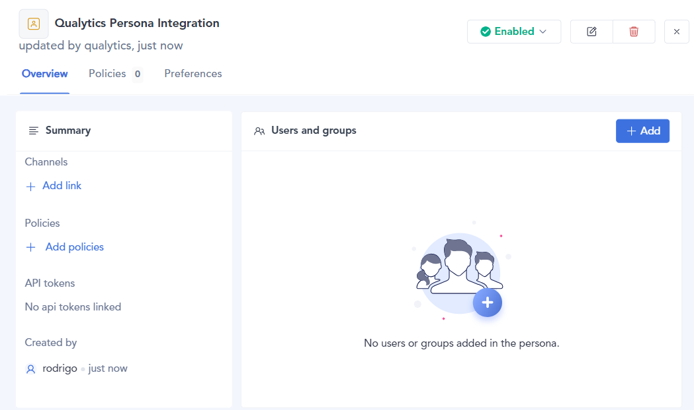
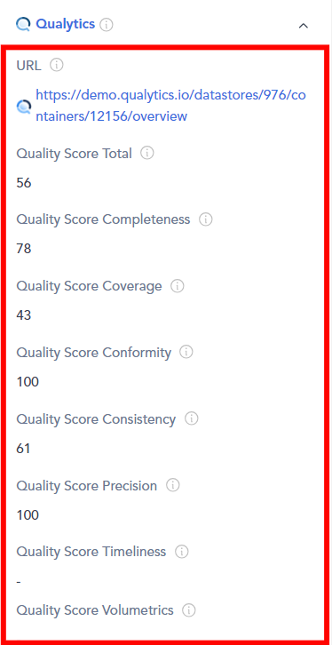

# Atlan

Integrating Atlan with Qualytics allows for easy push and pull of metadata between the two platforms. Specifically, Qualytics "pushes" its metadata to the data catalog and "pulls" metadata from the data catalog. Once connected, Qualytics automatically updates when key events happen in Atlan, such as metadata changes, anomaly updates, or archiving checks. This helps maintain data quality and consistency. During the sync process, Qualytics can either replace existing tags in Atlan or skip assets that have duplicate tags to avoid conflicts. Setting it up is simple—you just need to provide an API token to allow smooth communication between the systems.

Let’s get started 🚀

## Atlan Setup

### Create an Atlan persona and policy

Before starting the integration process, it is recommended that you set up an Atlan persona. It allows access to the necessary data and metadata. While you can create this persona simultaneously as your API token, it's easier if you create it first. That way, you can link the persona directly to the token later.

Before using Atlan with your data source, authorize the API token with access to the needed data and metadata. You do this by setting up policies within the persona for the Atlan connection that matches your Qualytics data source. Remember, you will need to do this for each data source you want to integrate.

**Step 1.** Navigate to Governance, then select **“Personas”**.

**Step 2**: Click on **“+ New Persona Button”**.

**Step 3:** Enter a **Name** and **Description** for a new persona, then click the **“Create”** button.

**Step 4:** Here your new Atlan persona has been created.

**Step 5**: After creating a new Atlan persona you have to create policies to authorize the personal access token. Click on **"Add Policies"** to create a new policy or to add one if there isn't any available.

**Step 6**: Click on **"New Policy"** and select **"Metadata Policy"** from the dropdown menu.

**Step 7:** Enter a **"name"**, and choose the **"connection"**.  

**Step 8:** Customize the permissions and assets that Qualytics will access.

**Step 9**: Once the policy is created, you’ll see it listed in the Policies section.

## **Create Atlan Personal Access Token**

After you’ve created the persona, the next step is to create a personal access token.

**Step 1:** Navigate to the **API Tokens** section in the Admin Center.

**Step 2:** Click on **"Generate API Token"** button.

**Step 3**: Enter a **name** and **description**, and select the persona you created earlier.

**Step 4:** Click the **"Save"** button and make sure to store the token in a secure location.

## Add Atlan Integration

Integrating Atlan with Qualytics enhances your data management capabilities, allowing seamless synchronization between the two platforms. This guide will walk you through the steps to add the Atlan integration efficiently. By following these steps, you can configure essential settings, provide necessary credentials, and customize synchronization options to meet your organization’s needs.

**Step 1:** Log in to your Qualytics account and click the **"Settings"** button on the left side panel of the interface.  

**Step 2:** You will be directed to the **Settings** page, then click on the **"Integration"** tab.

**Step 3:** Click on the **“Add Integration”** button.

**Step 4:**  Fill out the configuration form selecting the **"Atlan"** integration type.

|   REF. | FIELDS | ACTIONS |
|--------|--------|---------|
| 1️. | Name (Required) | Provide a detailed description of the integration. |
| 2. | Type (Required) | Choose the type of integration from the dropdown menu. Currently, 'Atlan' is selected |
| 3. | URL (Required) | The complete address for the Atlan instance, for example: [https://your-company.atlan.com](https://your-company.atlan.com). |
| 4. | Token (Required) | Provide the authentication token needed to connect to Atlan. |
| 5. | Event Driven | If enabled, the integration sync will be activated by operations, archiving anomalies, and checks. |
| 6. | Overwrite Tags | If enabled, Atlan tags will have precedence over Qualytics tags in cases of conflicts (when tags with the same name exist on both platforms). |

**Step 5:**  Click on the **Save** button to set up the Atlan integration. 

**Step 6:** Once the Atlan integration is set up with Qualytics, it will appear in Qualytics as a new integration. 

## Synchronization

The Atlan synchronization supports both push and pull operations. This includes pulling metadata from Atlan to Qualytics and pushing Qualytics metadata to Atlan. During the syncing process, the integration pulls tags assigned to data assets in Atlan and assigns them to Qualytics assets as an **external tag.**

!!! note 
    Tag synchronization requires **manual** triggering.

**Step 1:** To sync tags, simply click on the **"Sync"** button next to the relevant integration card.

**Step 2:** After clicking the **"Sync"** button, you will have the following options:

- **Pull Atlan Metadata**  
- **Push Qualytics Metadata**

Specify whether the synchronization will pull metadata, push metadata, or do both.

**Step 3:** After selecting the desired options, click on the **"Start"** button.

**Step 4:** After clicking the **Start** button, the synchronization process between Qualytics and Atlan begins. This process pulls metadata from Atlan and pushes Qualytics metadata, including tags, quality scores, anomaly counts, asset links, and many more.

**Step 5:** Review the logs to verify which assets were successfully mapped from Atlan to Qualytics.

**Step 6:** Once synchronization is complete, the mapped assets from **"Atlan"** will display an external tag.   

**Step 7:** When Qualytics detects anomalies, alerts are sent to the assets in Atlan, displaying the number of active anomalies and including a link to view the corresponding details

## Metadata  

The Quality Score Total, along with the Qualytics 8 metrics (completeness, coverage, conformity, consistency, precision, timeliness, volume, and accuracy), and the count of checks and anomalies per asset identified by Qualytics, are pushed.

