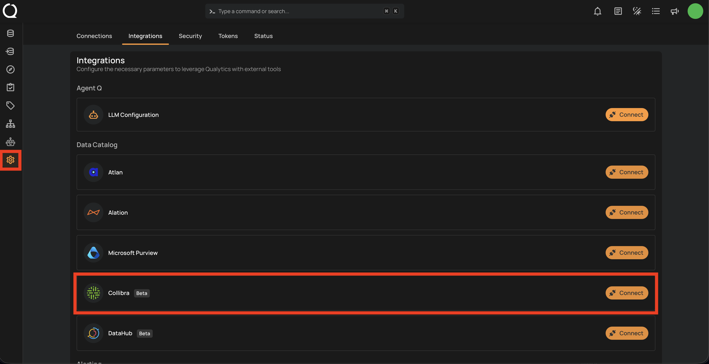
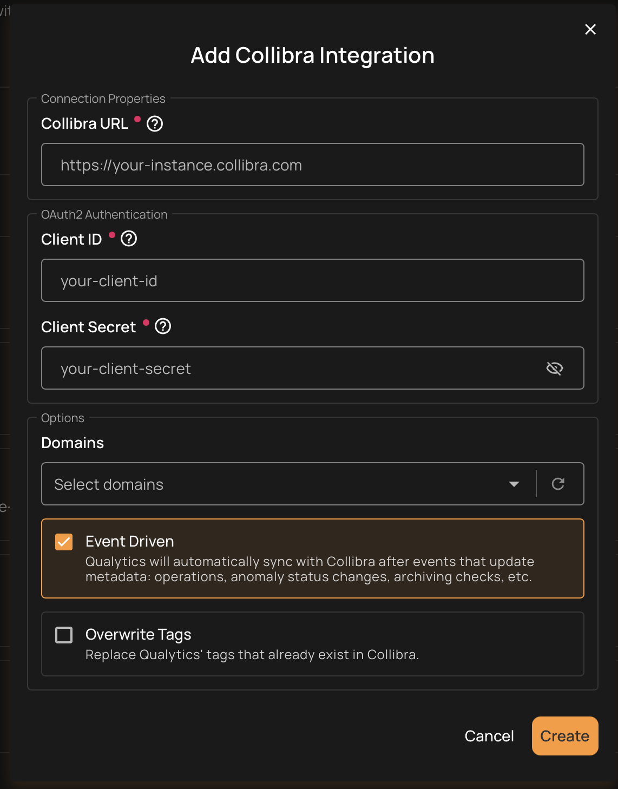
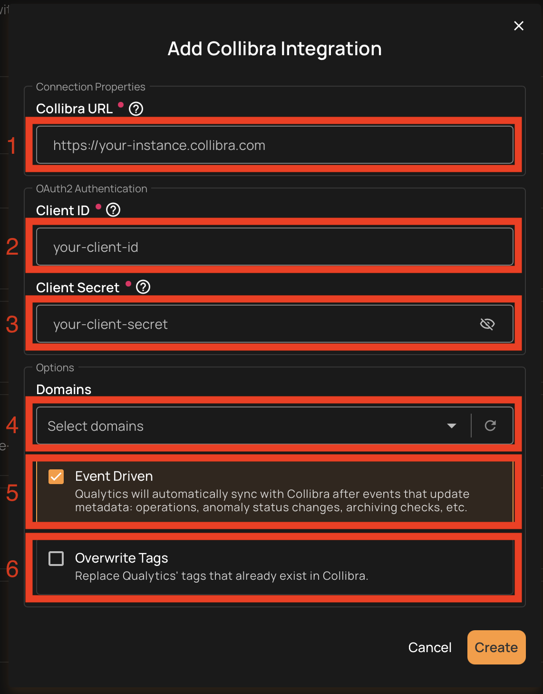
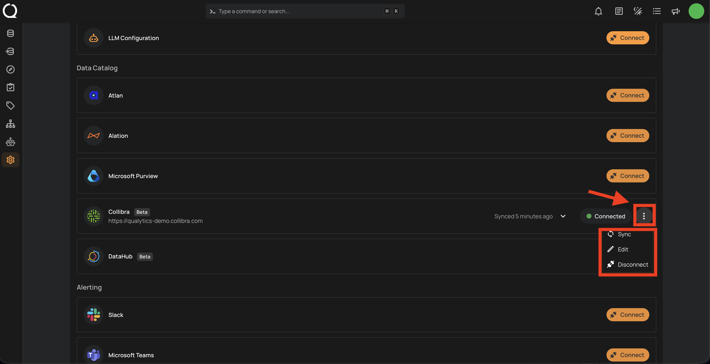
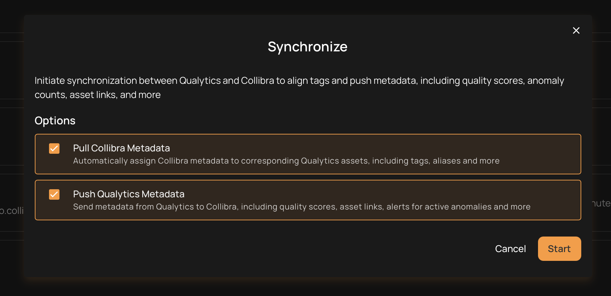

# Collibra

!!! info "Beta Integration"
    The Collibra integration is currently in **Beta**. Functionality may evolve based on feedback. Please review the [Known Limitations](#known-limitations) before getting started. If you encounter any issues or have suggestions, we'd love to hear from you — reach out to the Qualytics [support team](mailto:support@qualytics.ai) so we can make this integration even better.

Integrating Collibra with Qualytics brings your data quality insights directly into your governance workflows. Once connected, Qualytics keeps Collibra up to date with quality scores, anomaly details, and check results, while also pulling tags from Collibra back into Qualytics. Updates can happen automatically whenever key events occur, like completed scans or new anomalies, so your teams always have the latest quality context without extra manual work.

Let's get started 🚀

## Prerequisites

Before you begin, make sure you have the following:

- Access to a Collibra Data Intelligence Platform instance
- An **Admin** role in Collibra (needed to create an application for the connection)
- Network access between your Collibra instance and Qualytics

## Collibra Setup

Before connecting to Qualytics, you'll need to create an application in Collibra that Qualytics can use to communicate securely. This will give you a **Client ID** and **Client Secret** that you'll enter later in Qualytics.

### Register an Application

**Step 1:** Sign in to your Collibra instance as an administrator.

**Step 2:** Go to **Settings** (the gear icon), then select **OAuth Applications** under the Security section.

**Step 3:** Click **Register Application** and fill in the details:

| Field | Value |
| :---- | :---- |
| Name | `Qualytics Integration` (or any name you prefer) |
| Grant Type | Client Credentials |

**Step 4:** After registering, Collibra will show you the **Client ID** and **Client Secret**. Copy both values and save them somewhere secure.

!!! warning "Important"
    The Client Secret may only be shown once. Make sure to save it immediately. You'll need both the Client ID and Client Secret to complete the setup in Qualytics.

!!! info "Automatic Connection Renewal"
    Collibra connections expire after a few minutes, but Qualytics renews them automatically in the background. You don't need to worry about manually refreshing anything.

## Qualytics Configuration

### Navigation to Integration

**Step 1:** Log in to your Qualytics account and click the **"Settings"** button on the left side panel of the interface.

**Step 2:** Click on the **Integrations** tab.

### Connect Collibra Integration

**Step 1:** Click on the **Connect** button next to Collibra.

A modal window titled **"Add Collibra Integration"** will appear, asking you to fill in your connection details.

**Step 2:** Fill in the following connection details:

| REF. | Field | Required | Description |
| :---- | :---- | :---- | :---- |
| 1. | **Collibra URL** | Yes | Your Collibra web address (e.g., `https://your-instance.collibra.com`). Just the main URL, no extra paths needed. |
| 2. | **Client ID** | Yes | The Client ID you copied from Collibra during the setup above. |
| 3. | **Client Secret** | Yes | The Client Secret you copied from Collibra. This is stored securely (encrypted) in Qualytics. |
| 4. | **Domains** | No | Choose the Collibra domains that contain the assets you want to sync. Only assets within these domains will be matched with your Qualytics resources. If no domains are selected, all domains are searched. |
| 5. | **Event Driven** | No | When turned on, Qualytics will automatically send updates to Collibra whenever scans complete, anomalies are detected, or checks are archived (default: on). For more details, see [Event Driven](./overview.md#event-driven){:target="_blank"}. |
| 6. | **Overwrite Tags** | No | When turned on, existing Qualytics tags with the same name are converted into external tags managed by the Collibra integration. When turned off, the existing Qualytics tag is left unchanged and the Collibra tag is skipped (default: off). For more details, see [Overwrite Tags](./overview.md#overwrite-tags){:target="_blank"}. |

**Step 3:** Click the **Create** button.

Qualytics will verify the connection by testing your credentials against Collibra. If everything checks out, the integration will appear in your list as **Connected**.

!!! tip "Choosing Domains"
    In Collibra, assets are organized into Communities and Domains. When setting up the integration, pick the domains that contain the databases, tables, and columns you want to keep in sync with Qualytics.

## Domain Filters

Domain filters control **which Collibra assets** Qualytics will look at during synchronization. Understanding how they work is key to getting the sync configured correctly.

### How Domain Filters Work

In Collibra, assets (databases, tables, columns) are organized under **Domains**, which sit inside **Communities**. When you set up the Collibra integration in Qualytics, you select one or more domains. During sync, Qualytics will **only** search for matching assets within those selected domains — everything outside them is ignored.

### When to Use Domain Filters

Use domain filters when you want to:

- **Focus on specific areas** — For example, if your Collibra instance has hundreds of domains but you only care about syncing quality data for your production databases, select just those domains.
- **Avoid noise** — Filtering prevents Qualytics from trying to match assets in domains that are unrelated to your data quality workflows (e.g., sandbox or test domains with no real data assets).
- **Speed up sync** — A narrower domain scope means fewer assets to search through, which makes the sync faster.

### When to Remove or Broaden Domain Filters

Remove or expand your domain filter if:

- **Nothing is syncing** — This is the most common issue. If you selected a domain that has no databases, tables, or columns in it, Qualytics won't find any assets to match and the sync will complete with no results. Check your selected domains in Collibra and make sure they actually contain the assets you expect.
- **Only some datastores are syncing** — Your assets may be spread across multiple domains. Add the missing domains to your filter to pick up the rest.
- **You're unsure which domains to pick** — You can temporarily select all available domains to let Qualytics find every possible match, then narrow it down later once you know which domains contain your target assets.

!!! warning "Common Pitfall"
    If you select a domain that is empty or contains no data assets (databases, tables, or columns), the sync will complete successfully but **no resources will be matched or updated**. Always verify that your selected domains contain the assets that correspond to your Qualytics datastores.

### How to Change Your Domain Filter

**Step 1:** Go to **Settings** > **Integrations** and click the **Edit** button (pencil icon) on your Collibra integration.

**Step 2:** In the **Domains** field, add or remove domains as needed. You can search by domain name to find the right ones.

**Step 3:** Click **Save**, then run a manual sync to verify the updated filter is working as expected.

!!! tip "Finding the Right Domains"
    If you're not sure which Collibra domains contain your assets, open Collibra and browse your Communities and Domains. Look for the domains that hold the databases, schemas, and tables that match the datastores you've set up in Qualytics.

## Synchronization

Once connected, you can sync data between Qualytics and Collibra in two directions:

- **Pull** brings information from Collibra into Qualytics (like tags)
- **Push** sends Qualytics quality results to Collibra (like scores and anomaly counts)

### What Gets Synced

| Direction | What | Description |
| :---- | :---- | :---- |
| **Pull** (Collibra → Qualytics) | Tags | Tags on Collibra assets are imported into Qualytics as **external tags**, keeping your governance labels visible in both platforms. |
| **Pull** (Collibra → Qualytics) | Asset Info | Basic asset details and the sync timestamp are saved in Qualytics for reference. |
| **Push** (Qualytics → Collibra) | Quality Score | An overall data quality score (0-100) for the asset. |
| **Push** (Qualytics → Collibra) | Anomaly Count | How many active data quality issues exist for the asset. |
| **Push** (Qualytics → Collibra) | Check Count | How many quality checks are actively monitoring the asset. |
| **Push** (Qualytics → Collibra) | Qualytics Link | A direct link back to the asset in Qualytics so users can jump straight to the details. |

### How Qualytics Matches Assets

During sync, Qualytics automatically matches your resources to the corresponding assets in Collibra based on their names:

| Your Qualytics Resource | Matches These Collibra Assets |
| :---- | :---- |
| **Datastore** | Database, Schema, Data Set |
| **Container** (table) | Table, View, Dataset |
| **Field** (column) | Column, Data Element, Field, Attribute |

The matching works by comparing names in a `database.schema.table.column` pattern. For example, if you have a Qualytics datastore connected to `sales_db.public`, it will look for a Collibra asset with the same naming structure in your selected domains.

!!! note
    Currently, only database-type datastores are supported for catalog sync. File-based datastores are not yet included.

### Manual Sync

You can trigger a sync at any time to pull the latest information from Collibra or push your quality results.

**Step 1:** Click the vertical ellipsis (three dots) next to the Collibra integration and select **Sync** from the dropdown.

**Step 2:** Choose what you'd like to sync:

- **Pull Collibra Metadata** - Brings tags and asset information from Collibra into Qualytics
- **Push Qualytics Metadata** - Sends quality scores, anomaly counts, check counts, and links to Collibra

You can select one or both options.

**Step 3:** Click the **"Start"** button.

**Step 4:** The sync process will begin. Qualytics goes through your datastores and matches their tables and columns to the corresponding Collibra assets. Once complete, you can review the sync logs to see which assets were successfully matched.

!!! note
    Pulling tags from Collibra requires a **manual sync**. Even with Event Driven turned on, tag imports only happen when you manually trigger a sync.

### Cancel Sync

If a sync is taking longer than expected, you can stop it at any time.

Click the vertical ellipsis (three dots) next to the Collibra integration and select **Cancel Sync**. The process will stop gracefully after finishing the current datastore.

## Metadata in Collibra

When Qualytics pushes quality results to Collibra, it adds custom attributes to your Collibra assets. These are created automatically during the first sync if they don't already exist.

### Attributes Added to Collibra Assets

| Attribute | Description |
| :---- | :---- |
| **Qualytics Quality Score** | The overall quality score (0-100) calculated by Qualytics |
| **Qualytics Anomaly Count** | The number of active data quality issues detected |
| **Qualytics Check Count** | The number of active quality checks monitoring the asset |
| **Qualytics URL** | A clickable link to view the asset directly in Qualytics |

These attributes appear at every level of your data:

- **Datastores** - Overall quality score and totals across all tables
- **Tables** - Quality score and counts specific to each table
- **Columns** - Quality score and counts specific to each column

## External Tags

When you pull metadata from Collibra, any tags on Collibra assets are imported into Qualytics as **external tags**. These are visually distinct from regular Qualytics tags, so you can easily tell which labels came from your governance catalog.

How external tags work:

- Tags from Collibra are automatically linked to the matching Qualytics resource (datastore, table, or column)
- If a tag is removed from a Collibra asset, it will also be removed from Qualytics on the next sync
- Tags that no longer exist in Collibra are automatically cleaned up
- External tags on tables do **not** automatically carry over to their columns

!!! tip
    Use the **Overwrite Tags** setting to control what happens when both platforms have tags with the same name. When off, the existing Qualytics tag is kept and the Collibra tag is skipped. When on, the existing tag is converted into an external tag managed by Collibra. For more details, see [Overwrite Tags](./overview.md#overwrite-tags){:target="_blank"}.

## Known Limitations

As a Beta integration, there are some limitations to be aware of:

| Limitation | Details |
| :---- | :---- |
| **Database-type datastores only** | Only database datastores (e.g., PostgreSQL, Snowflake, SQL Server) are supported for sync. File-based datastores are not yet included. |
| **Push-only for event-driven sync** | When Event Driven is turned on, Qualytics only pushes data to Collibra. Pulling tags from Collibra still requires a manual sync. |
| **Name-based asset matching** | Qualytics matches assets by comparing names (database, schema, table, column). If naming conventions differ between Collibra and your datastores, some assets may not match automatically. |
| **No column-level tag pull for all catalogs** | Tags are pulled at the datastore, table, and column level, but the depth of tag coverage depends on how your Collibra assets are tagged. |
| **Single sync at a time** | Only one sync can run at a time per integration. If a sync is already in progress, you'll need to wait for it to finish or cancel it before starting a new one. |
| **No custom attribute mapping** | The attributes pushed to Collibra (Quality Score, Anomaly Count, Check Count, URL) are fixed. Custom attribute mapping is not yet supported. |

!!! info
    We're actively improving the Collibra integration based on customer feedback. If you run into a limitation that impacts your workflow, please reach out to the Qualytics [support team](mailto:support@qualytics.ai) so we can prioritize it.

## Troubleshooting

### Common Issues

| Issue | Possible Cause | What to Do |
| :---- | :---- | :---- |
| **Authentication Failed** | Incorrect credentials | Double-check that the Client ID and Client Secret are correct. Make sure the application is still active in Collibra. |
| **Sync Completes but Nothing Appears in Collibra** | Wrong domains selected | Make sure the domains you selected actually contain the assets that correspond to your Qualytics datastores. |
| **Sync Failed** | Connection issue | Confirm that your Collibra URL is correct and that Qualytics can reach it over the network. |
| **Some Assets Not Updated** | No matching assets found | Check that the asset names in Collibra (databases, schemas, tables, columns) match the names used in your Qualytics datastores. |
| **New Attributes Not Showing in Collibra** | Permission issue | Make sure the Collibra application you registered has permission to create and modify attributes on assets. |
| **Sync Takes Too Long** | Too many assets in scope | Narrow your domain selection to focus on the most important assets. You can always cancel and retry with a smaller scope. |

!!! tip
    You can view detailed sync logs by clicking on the Collibra integration card. The logs show a summary for each datastore, including how many tables, columns, and tags were synced, along with any errors.
