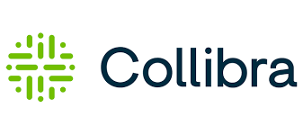

# Collibra

## Overview

The **Collibra** integration allows **Qualytics** to sync data quality metadata with Collibra, making quality context available directly within governance workflows. Data quality checks, anomalies, and related metadata are aligned with governed assets to support informed decision-making.

### Key Benefits

- **Unified Governance View**: Surface data quality insights directly in Collibra alongside business glossaries and data catalogs
- **Automated Metadata Sync**: Push quality check results and anomaly information to governed assets automatically
- **Event-Driven Updates**: Optionally sync metadata changes in real-time as quality events occur
- **Domain-Scoped Integration**: Target specific Collibra domains for precise metadata placement

## Qualytics Configuration

### Navigation to Integration

**Step 1:** Log in to your Qualytics account and click the **"Settings"** button on the left side panel of the interface.

**Step 2:** Click on the **Integrations** tab.

### Connect Collibra Integration

**Step 1:** Click on the **Connect** button next to Collibra to connect to the Collibra Integration.

A modal window titled **"Add Collibra Integration"** appears. Fill in the connection properties.

**Step 2:** Fill in the following connection properties:

| Field | Required | Description |
|-------|----------|-------------|
| **Collibra URL** | Yes | Your Collibra instance URL (e.g., `https://your-instance.collibra.com`) |
| **Client ID** | Yes | The OAuth2 Client ID from your registered Collibra application |
| **Client Secret** | Yes | The OAuth2 Client Secret from your registered Collibra application |
| **Domains** | Yes | Target Collibra domains where quality metadata will be synced |
| **Event Driven** | No | Automatically sync metadata when quality events occur such as anomalies detected or checks updated (default: enabled) |
| **Overwrite Tags** | No | When enabled, replaces existing Qualytics-related tags in Collibra. When disabled, tags are merged (default: disabled) |

!!! tip "Automatic Token Management"
    Qualytics uses the OAuth2 client credentials flow to automatically request and renew access tokens, ensuring uninterrupted synchronization without manual token management.

**Step 3:** Click the **Create** button to validate and store the credentials.

## Manual Sync

After the integration is configured, you can synchronize metadata between Qualytics and Collibra.

**Step 1:** Click the vertical ellipsis next to the Collibra integration and select **Sync** from the dropdown.

**Step 2:** Select the synchronization options and click **Start**.

## Troubleshooting

### Common Issues

| Issue | Cause | Solution |
|-------|-------|----------|
| **Authentication Failed** | Invalid or expired credentials | Verify the Client ID and Client Secret are correct and the OAuth application is active in Collibra |
| **Domain Not Found** | Insufficient permissions | Verify service account has Domain Read permission |
| **Sync Failed** | Network connectivity | Verify Collibra API URL is accessible from Qualytics |
| **Assets Not Updated** | Domain mismatch | Confirm selected domains contain the target assets |
