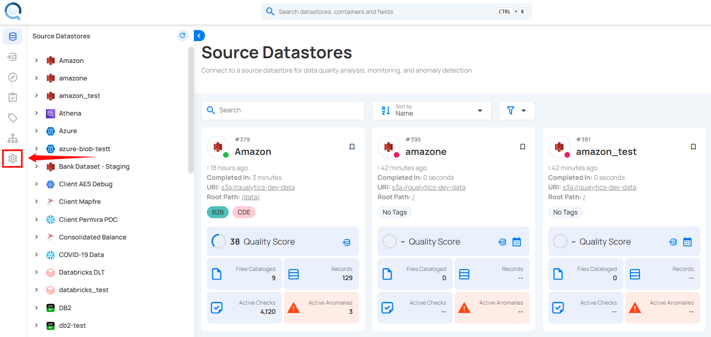

# Data Catalog Integrations

The Qualytics platform seamlessly integrates with enterprise data catalogs, enabling organizations to:

- Surface data quality insights directly within existing catalog tools
- Automatically sync metadata between platforms in real-time
- Leverage data catalog tags for quality classification
- Push quality alerts and anomaly notifications to catalog users
- Maintain consistent metadata across platforms
- Track data quality metrics within your data governance framework

These catalog integrations ensure that data quality insights are readily available to users within their preferred data discovery and governance platforms.

## Setting Up Catalog Integration

Navigate to Settings > Integration to configure your data catalog connection:

## Supported Data Catalogs

Currently, Qualytics supports integration with the following data catalog platforms:

### Atlan

The Atlan integration enables bidirectional metadata synchronization, providing:

- Automated metadata push from Qualytics to Atlan
- Real-time metadata pull from Atlan to Qualytics
- Automatic updates based on key events
- Flexible tag management options
- Simple API-based authentication

For detailed configuration steps, see the [**Atlan**](./atlan.md){target="_blank} documentation.

### Alation

The Alation integration supports comprehensive metadata exchange:

- Bidirectional metadata synchronization
- Real-time quality metric updates
- Selective synchronization of active checks
- Configurable tag conflict resolution
- Token-based secure authentication

For detailed configuration steps, see the [**Alation**](./alation.md){target="_blank} documentation.

### Microsoft Purview

The Microsoft Purview integration connects Qualytics with Azure’s native data governance platform.

Key capabilities include:

- Synchronization of data quality metadata with Purview
- Visibility of quality context alongside cataloged assets
- Automated updates based on Qualytics operations
- This integration appears as Connected once successfully configured in Qualytics.

For detailed configuration steps, see the [**Microsoft Purview**](./purview.md){target="_blank} documentation.

### Collibra

The Collibra integration enables metadata synchronization between Qualytics and Collibra, allowing data quality insights to be surfaced directly within Collibra’s governance workflows.

Key capabilities include:

- Synchronization of data quality metadata from Qualytics to Collibra.
- Visibility of data quality context alongside governed assets.
- Alignment between data quality checks and governance policies.

For detailed configuration steps, see the [**Collibra**](./collibra.md){target="_blank} documentation.

### DataHub

The DataHub integration connects Qualytics with DataHub to make data quality insights available within DataHub’s data discovery experience.

Key capabilities include:

- Syncing data quality metadata into DataHub
- Enabling quality-aware data discovery for analytics and engineering teams
- Maintaining consistency between Qualytics checks and cataloged assets

For detailed configuration steps, see the [**DataHub**](./datahub.md){target="_blank} documentation.

## Synchronization Options

Qualytics provides flexible synchronization methods to match your workflow:

### Manual Sync

Trigger complete metadata synchronization on-demand:

For detailed steps, see the [**Synchronization**](atlan.md/#synchronization){target="_blank} section.

### Event Driven

Enable automatic synchronization based on platform events:

| Event  | Description |
| :---- | :---- |
| Run an Operation (Profile Or Scan) | Sync all target containers for the operation. |
| Archive an Anomaly (including bulk) | Sync the container in which the anomaly was identified. |
| Archive a Check ( including bulk) | Sync the container to which the check belongs. |
