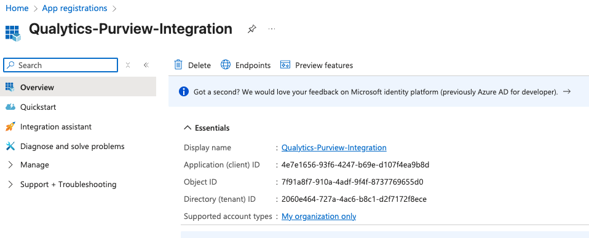
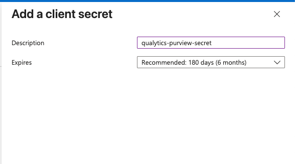

# Microsoft Purview Integration

Integrating Microsoft Purview with Qualytics enables seamless metadata synchronization between the two platforms. Once connected, Qualytics can push quality scores, anomaly data, and metadata to your Purview catalog, providing a unified view of data quality across your organization.

Let's get started 🚀

## Prerequisites

Before you begin, ensure that:

- You already have a Microsoft Purview account

- You have permission to:
    - Create App Registrations in Microsoft Entra ID
    - Assign roles in the Purview governance portal (Collections)

## Azure Setup

Before connecting Purview to Qualytics, you need to create a service principal in Azure and configure the necessary permissions.

### Create a Service Principal

Qualytics uses a service principal to securely authenticate with Microsoft Purview APIs.

**Step 1:** Sign in to the [Azure portal](https://portal.azure.com){target="_blank"}.


**Step 2:** Navigate to **Microsoft Entra ID** and select **App registrations** from the left sidebar.


**Step 3:** Click **New registration**.


**Step 4:** Fill in the registration form with the following details:

| Field | Value |
| :---- | :---- |
| Name | `Qualytics-Purview-Integration` (or any descriptive name) |
| Supported account types | Accounts in this organizational directory only (Single tenant) |


**Step 5:** Click **Register**. After registration, save the **Application (client) ID** — you will need this later.




### Generate a Client Secret

**Step 1:** In the app registration, go to **Certificates & secrets** in the left sidebar.


**Step 2:** Click **New client secret**, provide a description, select an expiration period, and click **Add**.




<!-- Screenshot: Add a client secret dialog -->

**Step 3:** Copy the **Value** immediately and store it securely.


!!! warning "Important"
    The client secret value is shown only once. Store it securely. This value is your `client_secret`.

### Configure API Permissions

**Step 1:** In the app registration, open **API permissions** from the left sidebar and click **Add a permission**.


**Step 2:** Search for and select **Microsoft Purview**, then add the following permissions:

| Permission Type | Permission Name |
| :---- | :---- |
| Delegated permissions | `Purview.DelegatedAccess` |
| Application permissions | `Purview.ApplicationAccess` |


**Step 3:** Click **Add permissions**, then click **Grant admin consent** and confirm the action.


## Purview Setup

After creating the service principal, you need to assign the appropriate roles in the Purview governance portal.

### Assign Collection Roles

**Step 1:** Open the [Microsoft Purview governance portal](https://purview.microsoft.com){target="_blank"}.


**Step 2:** Select **Data Map** from the navigation, then click **Collections**.


**Step 3:** Select the **root collection** (the top-level collection with the same name as your Purview account).


**Step 4:** Open the **Role assignments** tab and assign the following roles to the service principal:

| Role | Purpose |
| :---- | :---- |
| Data Curator | Access Catalog data plane |
| Data Source Administrator | Access Scanning data plane |
| Collection Admin | Access Account & Metadata policy data planes |
| Policy Author | Access DevOps policies API |


!!! note
    You may assign roles to a sub-collection instead of the root collection, but API access will be limited to that scope.

### Gather Connection Details

**Step 1:** In the Azure portal, open your Purview account and go to **Settings and properties**.


**Step 2:** Copy the **Atlas endpoint** and remove `/catalog` from the end of the URL.

**Example:**

```
https://<purview-tenant-id>-api.purview-service.microsoft.com
```

**Step 3:** Copy the **Managed Identity tenant ID** from the same page.

## Add Purview Integration

Now you can configure the integration in Qualytics using the credentials you gathered.

**Step 1:** Log in to your Qualytics account and click **Settings** on the left side panel.

<!-- Screenshot: Qualytics Settings navigation -->

**Step 2:** Click on the **Integration** tab.

<!-- Screenshot: Settings > Integration tab -->

**Step 3:** Click the **Connect** button next to Microsoft Purview.

<!-- Screenshot: Connect button for Purview -->

A modal window titled **Add Purview Integration** appears. Fill in the connection properties:

| REF. | Field | Description |
| :---- | :---- | :---- |
| 1. | Purview Account URL | The Atlas endpoint without `/catalog` (e.g., `https://your-account.purview.azure.com`) |
| 2. | Tenant ID | The Managed Identity tenant ID from your Purview account |
| 3. | Client ID | The Application (client) ID from your app registration |
| 4. | Client Secret | The client secret value you generated |


**Step 4:** Click **Save** to create the integration.


**Step 5:** Once the integration is set up, it will appear in your integrations list.


!!! success "Integration Complete"
    Your Microsoft Purview account is now successfully connected to Qualytics and ready for catalog, scanning, and governance operations.

## Synchronization

After the integration is configured, you can synchronize metadata between Qualytics and Purview.

**Step 1:** Click the vertical ellipsis next to the Purview integration and select **Sync** from the dropdown.


**Step 2:** Select the synchronization options and click **Start**.


## Troubleshooting

| Issue | Solution |
| :---- | :---- |
| Authentication failed | Verify that the Client ID and Client Secret are correct and the secret has not expired |
| Insufficient permissions | Ensure all required roles are assigned to the service principal in Purview |
| Invalid endpoint | Confirm the Purview Account URL does not include `/catalog` at the end |
| Tenant mismatch | Verify the Tenant ID matches your Azure Active Directory tenant |

!!! tip
    If you encounter persistent issues, check the Azure portal for any error messages in the app registration's sign-in logs.
