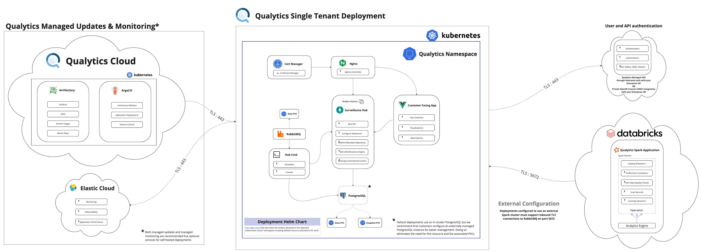

# Compute Integrations

The Qualytics platform offers flexible compute deployment options to optimize performance and resource utilization:

-  Leverage existing Kubernetes infrastructure for seamless deployment
-  Scale compute resources dynamically based on workload demands
-  Deploy the data plane to external Spark environments
-  Maintain data sovereignty and security compliance
-  Take advantage of cloud-native performance optimizations

These compute integration options ensure that Qualytics can adapt to your infrastructure requirements while maximizing performance and cost efficiency.

## Running Qualytics Data Plane on kubernetes

The Qualytics platform's default deployment unifies control and data planes within a single Kubernetes cluster, 
simplifying infrastructure management through a declarative approach. 
This architecture enables dynamic scaling with cost-optimized spot instances while maintaining seamless 
coordination between platform components.

 Alternatively, we support deploying the Qualytics data plane to any external Spark cluster 
 (external to the kubernetes cluster running the Qualytics control plane). 

## Running Qualytics Data Plane on Databricks

Deploying the Qualytics data plane within your Databricks account will allow our analytics engine to leverage 
Photon acceleration while ensuring that all data transfer & compute occurs inside your Databricks deployment.

## Running Qualytics Data Plane on GCP Dataproc

Similarly, the Qualytics data plane can be deployed to Google Cloud's Dataproc to leverage Dataproc serverless and other 
Dataproc optimizations in support of the Qualytics analytics engine.   

