# Alation

Integrating Alation with Qualytics, allows you to pull metadata from Alation to Qualytics and push Qualytics metadata to Alation. Once integrated, Qualytics can stay updated with key changes in Alation, like metadata updates and anomaly alerts which helps to ensure data quality and consistency. Qualytics updates only active checks, and metadata updates in Qualytics occur if the Event-Driven option is enabled or can be triggered manually using the **"Sync"** button. During sync, Qualytics can replace existing tags in Alation or skip duplicate tags to avoid conflicts. The setup is simple—just provide a refresh token for communication between the systems.

Let’s get started 🚀

## Alation Setup

### Create Refresh Token

Before setting up Alation Integration in Qualytics, you have to generate a Refresh token. This allows Qualytics to access Alation's API and keep data in sync between the two platforms.

**Step 1**: Navigate to the **"Profile Settings"**.

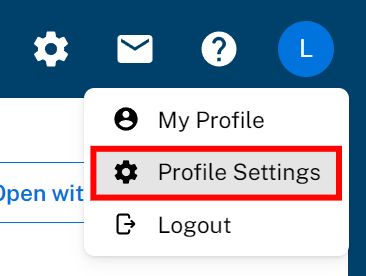

**Step 2:** Select the **"Authentication"** tab.

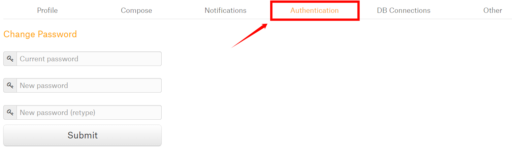

**Step 3:** Click on the **"Create Refresh Token"** button.

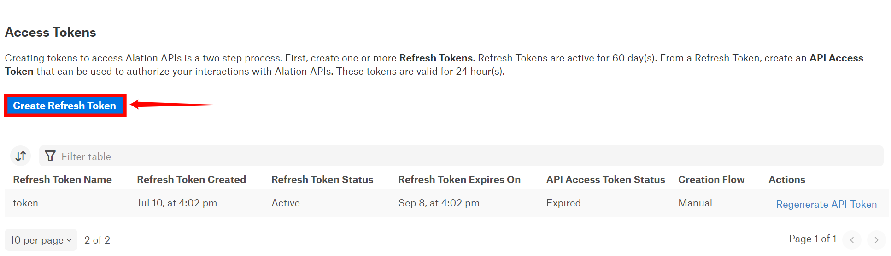

**Step 4:** Enter a **name** for the token.

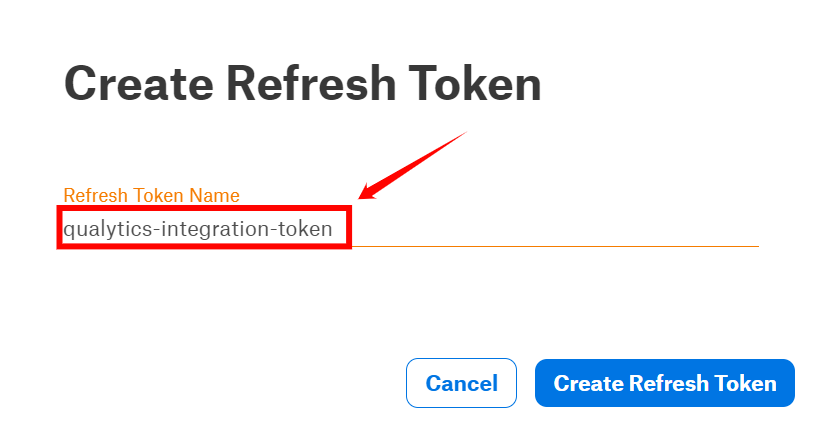

**Step 5:** After entering the name for the token, click on **"Create Refresh Token"**.

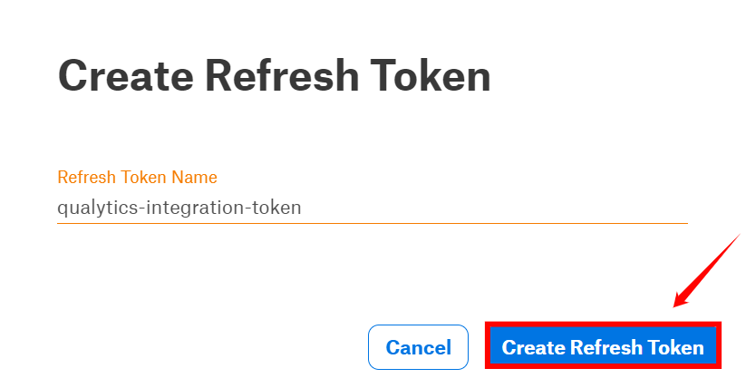

**Step 6:** Your **"refresh"** token has been generated successfully. Please Copy and save it securely.

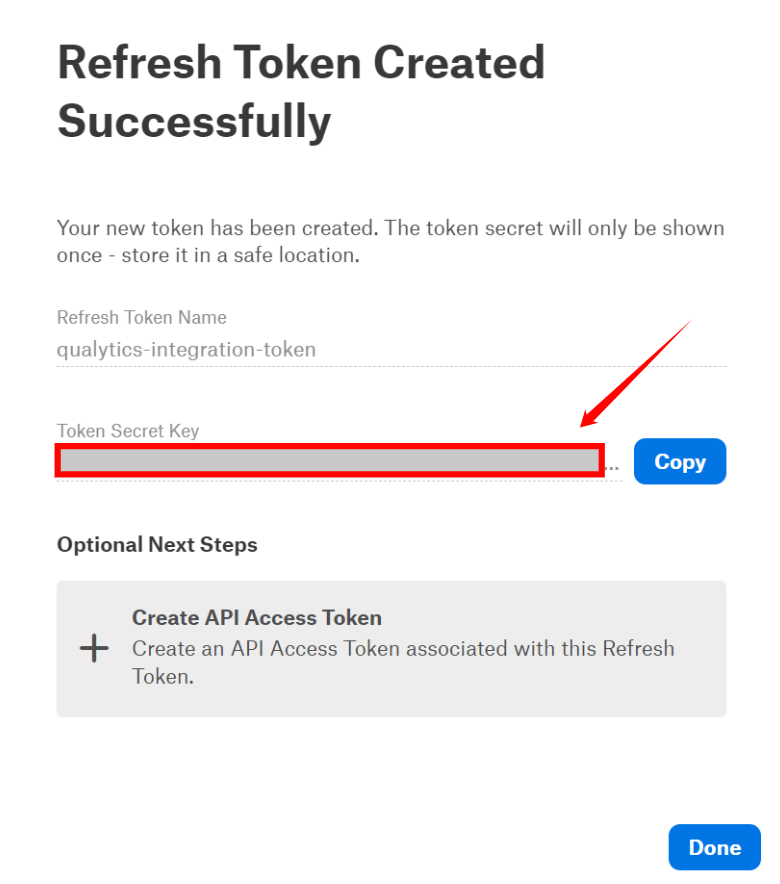{: style="height:450px;width:450px;"}

**Step 7:** Here you can view the token that is successfully added to the access tokens list.

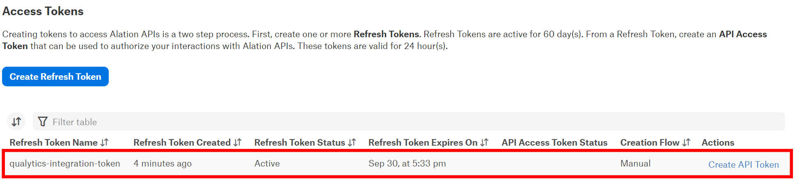

## Add Alation Integration

**Step 1:**  Log in to your Qualytics account and click the **"Settings"** button on the left side panel of the interface.

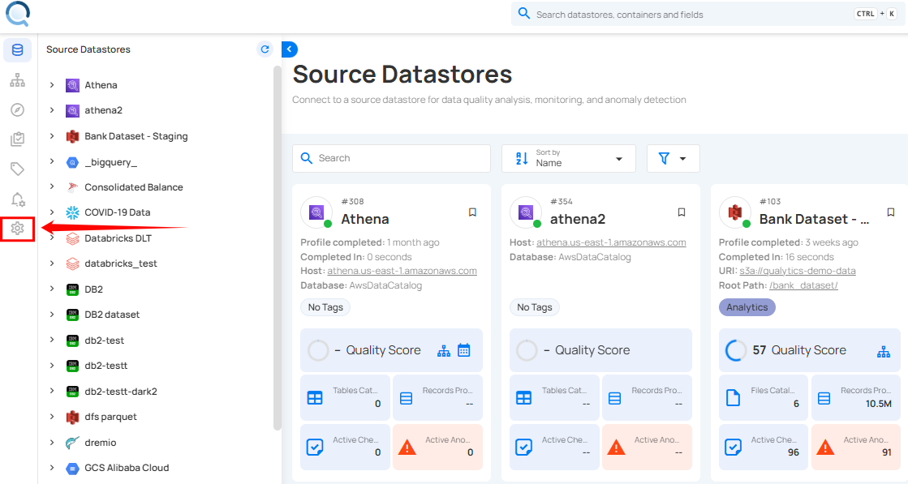

**Step 2:** You will be directed to the **Settings** page, then click on the **"Integration"** tab.

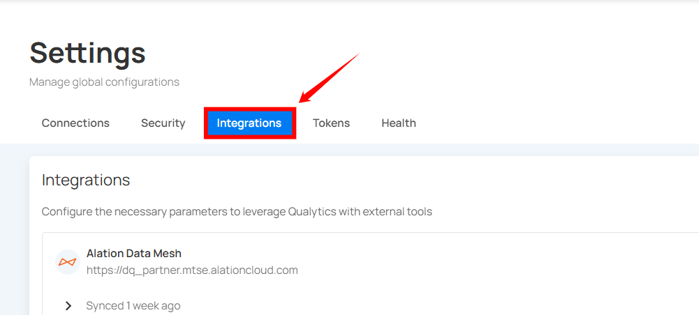

**Step 3:** Click on the **"Add Integration"** button.

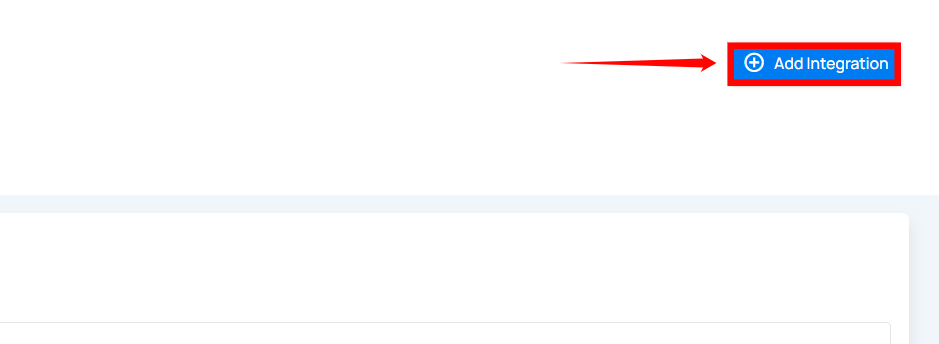

**Step 4:** Complete the configuration form by choosing the **Alation** integration type.

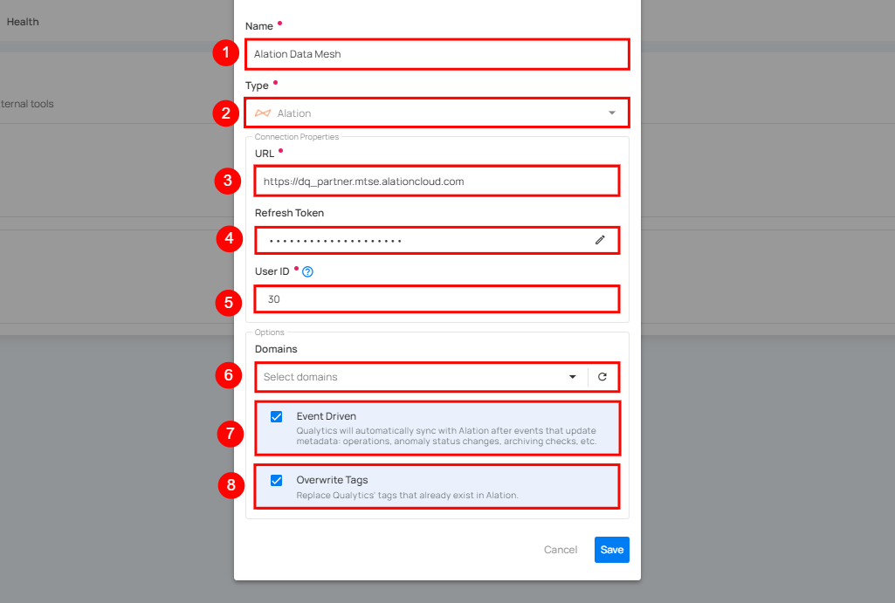

|REF.|FIELDS |ACTIONS|
| ---| ----- | ----- |
| 1. |Name (Required)| Provide a name for the integration. |
| 2. | Type (Required) | Choose the type of integration from the dropdown menu. Currently, 'Atlan' is selected |
| 3. | URL (Required) | Enter the full address of the Alation instance, for example,  https://instance.alationcloud.com. |
| 4. | Refresh Token (Required) | Enter the refresh token required to access the Alation API. |
| 5. | User ID (Required) | Provide the user ID associated with the generated token. |
| 6. | Domains | Select specific domains to filter assets for synchronization.  - Acts as a filtering mechanism to sync specific assets  - Uses domain information from the data catalog (e.g. Sales ). Only assets under the selected domains will synchronize.|
| 7. | Event Driven | If enabled, operations, archiving anomalies, and checks will activate the integration sync. For more details, see [Event Driven](./overview.md#event-driven){:target="_blank"}. |
| 8. | Overwrite Tags | If enabled, Alation tags will override Qualytics tags in cases of conflicts (when tags with the same name exist on both platforms). For more details, see [Overwrite Tags](./overview.md#overwrite-tags){:target="_blank"}. |

**Step 5:** Click on the **Save** button to integrate Alation with Qualytics. 

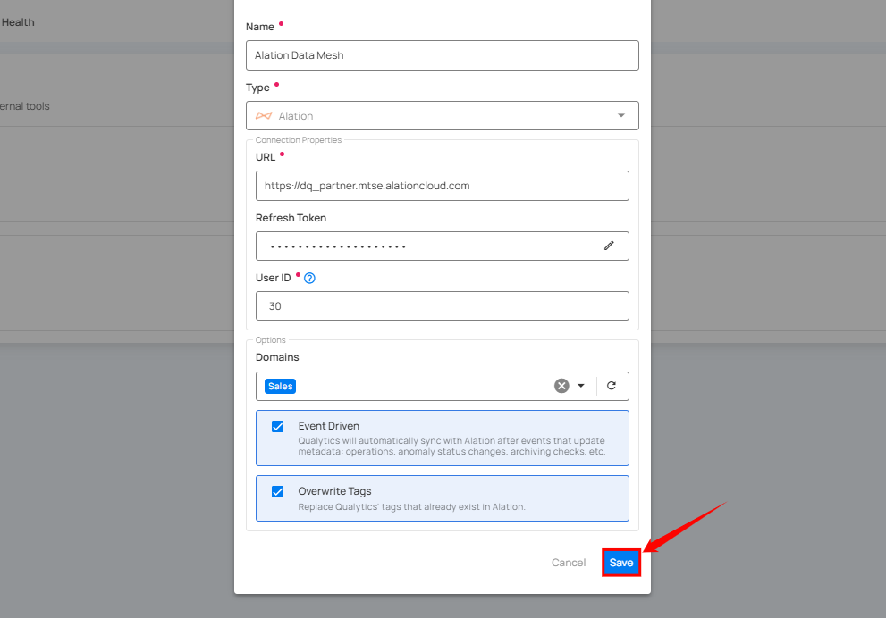

**Step 6:** Here you can view the **new integration** appearing in Qualytics.

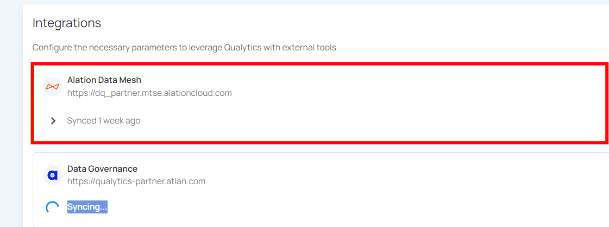

## Domain Filters

Domain filters control **which Alation assets** Qualytics will look at during synchronization. Understanding how they work is key to getting the sync configured correctly.

### How Domain Filters Work

In Alation, data assets (data sources, schemas, tables, columns) are organized under **Data Sources**, which can be grouped by **Domains**. When you set up the Alation integration in Qualytics, you select one or more domains. During sync, Qualytics will **only** search for matching assets within those selected domains — everything outside them is ignored.

### When to Use Domain Filters

Use domain filters when you want to:

- **Focus on specific areas** — For example, if your Alation instance has many data sources but you only care about syncing quality data for your production databases, select just the domains that contain those data sources.
- **Avoid noise** — Filtering prevents Qualytics from trying to match assets in domains that are unrelated to your data quality workflows (e.g., sandbox or test data sources).
- **Speed up sync** — A narrower domain scope means fewer assets to search through, which makes the sync faster.

### When to Remove or Broaden Domain Filters

Remove or expand your domain filter if:

- **Nothing is syncing** — This is the most common issue. If you selected a domain that has no data sources, schemas, tables, or columns in it, Qualytics won't find any assets to match and the sync will complete with no results. Check your selected domains in Alation and make sure they actually contain the assets you expect.
- **Only some datastores are syncing** — Your assets may be spread across multiple domains. Add the missing domains to your filter to pick up the rest.
- **You're unsure which domains to pick** — You can temporarily select all available domains to let Qualytics find every possible match, then narrow it down later once you know which domains contain your target assets.

!!! warning "Common Pitfall"
    If you select a domain that is empty or contains no data assets (data sources, schemas, tables, or columns), the sync will complete successfully but **no resources will be matched or updated**. Always verify that your selected domains contain the assets that correspond to your Qualytics datastores.

### How to Change Your Domain Filter

**Step 1:** Go to **Settings** > **Integrations** and click the **Edit** button (pencil icon) on your Alation integration.

**Step 2:** In the **Domains** field, add or remove domains as needed. You can search by domain name to find the right ones.

**Step 3:** Click **Save**, then run a manual sync to verify the updated filter is working as expected.

!!! tip "Finding the Right Domains"
    If you're not sure which Alation domains contain your assets, open Alation and browse your Data Sources and Domains. Look for the domains that hold the databases, schemas, and tables that match the datastores you've set up in Qualytics.

## Synchronization

Once connected, you can sync data between Qualytics and Alation in two directions:

- **Pull** brings information from Alation into Qualytics (like tags)
- **Push** sends Qualytics quality results to Alation (like scores and anomaly counts)

### What Gets Synced

| Direction | What | Description |
| :---- | :---- | :---- |
| **Pull** (Alation → Qualytics) | Tags | Tags on Alation assets are imported into Qualytics as **external tags**, keeping your governance labels visible in both platforms. |
| **Push** (Qualytics → Alation) | Quality Score | An overall data quality score (0-100) for the asset. |
| **Push** (Qualytics → Alation) | Anomaly Count | How many active data quality issues exist for the asset. |
| **Push** (Qualytics → Alation) | Check Count | How many quality checks are actively monitoring the asset. |
| **Push** (Qualytics → Alation) | Qualytics Link | A direct link back to the asset in Qualytics so users can jump straight to the details. |

### How Qualytics Matches Assets

During sync, Qualytics automatically matches your resources to the corresponding assets in Alation based on their names:

| Your Qualytics Resource | Matches These Alation Assets |
| :---- | :---- |
| **Datastore** | Data Source, Schema |
| **Container** (table) | Table |
| **Field** (column) | Column, Attribute |

The matching works by comparing names in a `database.schema.table.column` pattern. For example, if you have a Qualytics datastore connected to `inventory_db.dbo`, it will look for an Alation asset with the same naming structure in your selected domains.

!!! note
    Currently, only database-type datastores are supported for catalog sync. File-based datastores are not yet included.

### Manual Sync

You can trigger a sync at any time to pull the latest information from Alation or push your quality results.

!!! note
    Tag synchronization requires **manual** triggering.

**Step 1:** To sync tags, simply click the **"Sync"** button next to the relevant integration card.

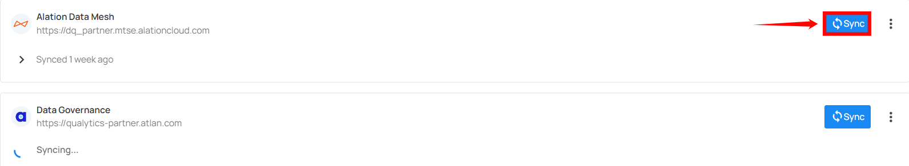

**Step 2:** After clicking the **Sync** button, you will have the following options:

- **Pull Alation Metadata**
- **Push Qualytics Metadata**

Specify whether the synchronization will pull metadata, push metadata, or do both.

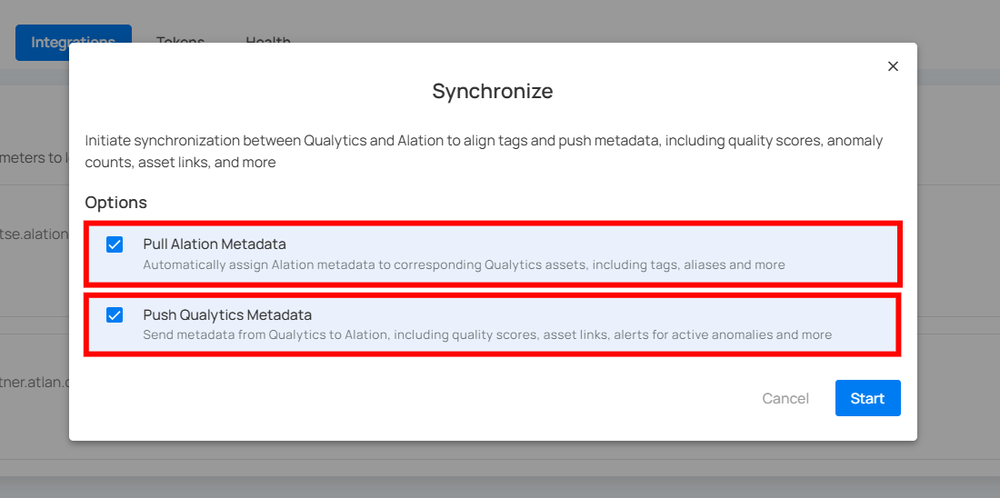

**Step 3:** After selecting the desired options, click on the **"Start"** button.

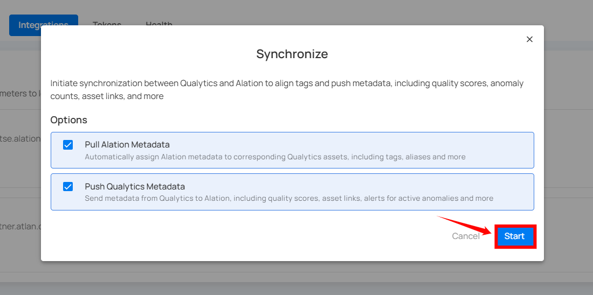

**Step 4:** After clicking the **Start** button, the synchronization process between Qualytics and Alation begins. This process pulls metadata from Alation and pushes Qualytics metadata, including tags, quality scores, anomaly counts, asset links, and many more.

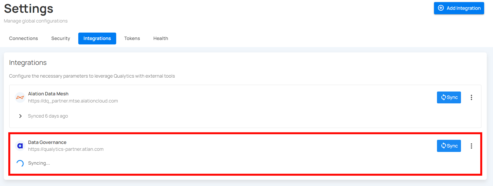

**Step 5:** Once synchronization is complete, the mapped assets from **Alation** will display an external tag.

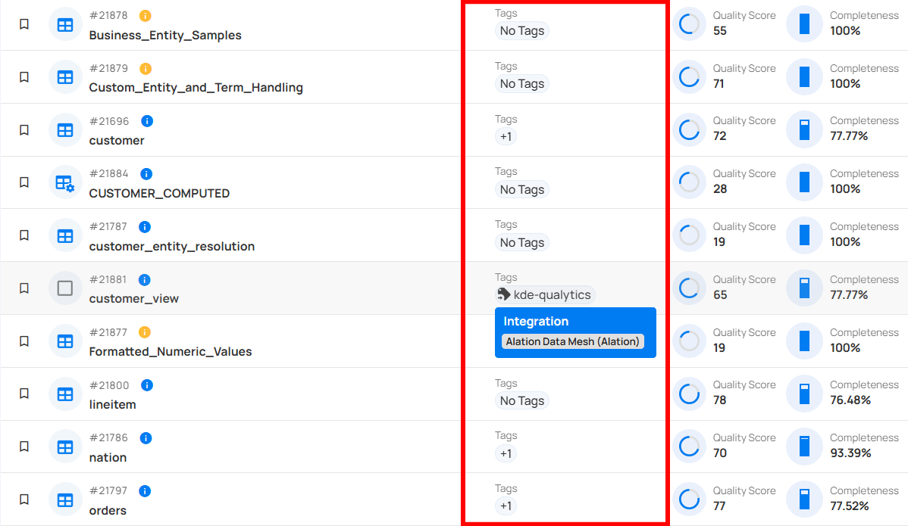

!!! note
    Pulling tags from Alation requires a **manual sync**. Even with Event Driven turned on, tag imports only happen when you manually trigger a sync.

### Cancel Sync

If a sync is taking longer than expected, you can stop it at any time.

Click the vertical ellipsis (three dots) next to the Alation integration and select **Cancel Sync**. The process will stop gracefully after finishing the current datastore.

## Alerts

When Qualytics detects anomalies, alerts are sent to the assets in Alation, showing the number of active anomalies and providing a link to view them.

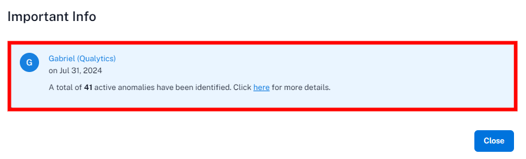

## Metadata in Alation

When Qualytics pushes quality results to Alation, it adds custom fields to your Alation assets. These are created automatically during the first sync if they don't already exist.

### Attributes Added to Alation Assets

| Attribute | Description |
| :---- | :---- |
| **Qualytics Quality Score** | The overall quality score (0-100) calculated by Qualytics |
| **Qualytics Anomaly Count** | The number of active data quality issues detected |
| **Qualytics Check Count** | The number of active quality checks monitoring the asset |
| **Qualytics URL** | A clickable link to view the asset directly in Qualytics |

The Quality Score Total, along with the Qualytics 8 metrics (completeness, coverage, conformity, consistency, precision, timeliness, volume, and accuracy), and the count of checks and anomalies per asset identified by Qualytics, are pushed. A link to the asset in Qualytics is also provided.

These attributes appear at every level of your data:

- **Datastores** - Overall quality score and totals across all tables
- **Tables** - Quality score and counts specific to each table
- **Columns** - Quality score and counts specific to each column

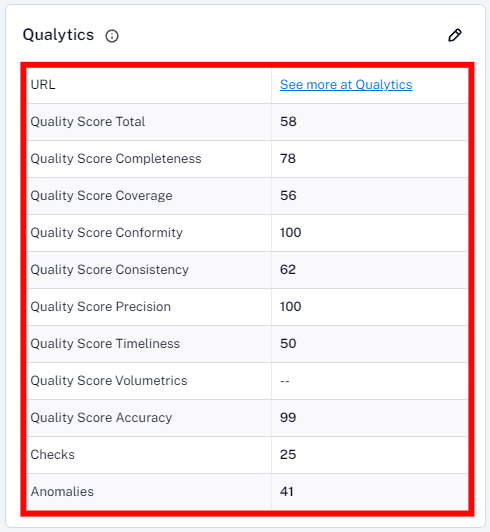

## Data Health

On the Alation tables page, there's a tab called “Data Health” where Qualytics displays insights from data quality checks in a table format, showing the current status based on the number of anomalies per check.

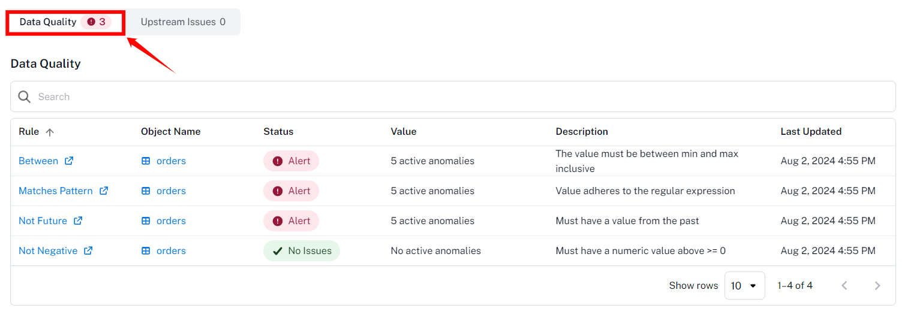

| Column| Description |
| ----- | ----- |
| Rule  | The type of data quality check rule |
| Object Name |  The Table Name |
| Status | The check status can be either "Alert" if there are active anomalies or "No Issues" if no active anomalies exist for the check.   |
| Value | The current amount of active anomalies |
| Description | The data quality check description |
| Last Updated | The last synced timestamp |

## External Tags

When you pull metadata from Alation, any tags on Alation assets are imported into Qualytics as **external tags**. These are visually distinct from regular Qualytics tags, so you can easily tell which labels came from your data catalog.

How external tags work:

- Tags from Alation are automatically linked to the matching Qualytics resource (datastore, table, or column)
- If a tag is removed from an Alation asset, it will also be removed from Qualytics on the next sync
- Tags that no longer exist in Alation are automatically cleaned up
- External tags on tables do **not** automatically carry over to their columns

!!! tip
    Use the **Overwrite Tags** setting to control what happens when both platforms have tags with the same name. When off, the existing Qualytics tag is kept and the Alation tag is skipped. When on, the existing tag is converted into an external tag managed by Alation. For more details, see [Overwrite Tags](./overview.md#overwrite-tags){:target="_blank"}.

## Known Limitations

| Limitation | Details |
| :---- | :---- |
| **Database-type datastores only** | Only database datastores (e.g., PostgreSQL, Snowflake, SQL Server) are supported for sync. File-based datastores are not yet included. |
| **Push-only for event-driven sync** | When Event Driven is turned on, Qualytics only pushes data to Alation. Pulling tags from Alation still requires a manual sync. |
| **Name-based asset matching** | Qualytics matches assets by comparing names (database, schema, table, column). If naming conventions differ between Alation and your datastores, some assets may not match automatically. |
| **No column-level tag pull for all catalogs** | Tags are pulled at the datastore, table, and column level, but the depth of tag coverage depends on how your Alation assets are tagged. |
| **Single sync at a time** | Only one sync can run at a time per integration. If a sync is already in progress, you'll need to wait for it to finish or cancel it before starting a new one. |
| **No custom attribute mapping** | The attributes pushed to Alation (Quality Score, Anomaly Count, Check Count, URL) are fixed. Custom attribute mapping is not yet supported. |

## Troubleshooting

### Common Issues

| Issue | Possible Cause | What to Do |
| :---- | :---- | :---- |
| **Authentication Failed** | Invalid or expired refresh token | Verify that the refresh token is still valid and has not been revoked. Generate a new one in Alation if needed. |
| **Sync Completes but Nothing Appears in Alation** | Wrong domains selected | Make sure the domains you selected actually contain the assets that correspond to your Qualytics datastores. |
| **Sync Failed** | Connection issue | Confirm that your Alation URL is correct and that Qualytics can reach it over the network. |
| **Some Assets Not Updated** | No matching assets found | Check that the asset names in Alation (data sources, schemas, tables, columns) match the names used in your Qualytics datastores. |
| **User ID Mismatch** | Wrong user ID provided | Confirm that the User ID entered matches the account that generated the refresh token. |
| **Sync Takes Too Long** | Too many assets in scope | Narrow your domain selection to focus on the most important assets. You can always cancel and retry with a smaller scope. |

!!! tip
    You can view detailed sync logs by clicking on the Alation integration card. The logs show a summary for each datastore, including how many tables, columns, and tags were synced, along with any errors.

## Examples

### Asset Matching Example

The following example shows how Qualytics maps a SQL Server database to Alation assets during synchronization.

**Source database:** SQL Server datastore `inventory_db.dbo` containing a table `products` with a column `sku`.

During sync, Qualytics matches resources using the naming hierarchy:

| Qualytics Resource | Name | Matched Alation Asset | Alation Asset Type |
| :---- | :---- | :---- | :---- |
| Datastore | `inventory_db.dbo` | `inventory_db` → `dbo` | Data Source → Schema |
| Container | `products` | `products` | Table |
| Field | `sku` | `sku` | Column |

Qualytics walks through each level of the hierarchy — Data Source, Schema, Table, Column — and matches by name within the selected domains.

### End-to-End Sync Scenario

This example walks through a complete synchronization workflow between Qualytics and Alation.

**Step 1: Connect the integration**

Set up the Alation integration with your refresh token and User ID, then select the relevant domains (e.g., the "Inventory" domain containing your production data sources).

**Step 2: Run a manual pull sync**

Trigger a pull sync from Alation. Qualytics scans the selected domains and matches Alation assets to your datastores. Tags assigned to Alation assets (e.g., `Sensitive`, `Business Critical`) appear in Qualytics as external tags on the matched datastores, tables, and columns.

**Step 3: Run a scan in Qualytics**

Execute a scan operation on your datastores. Qualytics evaluates your quality checks and generates quality scores, anomaly counts, and check counts for each table and column.

**Step 4: Run a push sync**

Trigger a push sync (or let Event Driven handle it automatically). Qualytics sends the following metadata to the matched Alation assets:

- **Quality Score** (0-100) at the datastore, table, and column level
- **Anomaly Count** per asset
- **Check Count** per asset
- **Qualytics URL** linking back to the asset in Qualytics

**Step 5: View results in Alation**

In Alation, navigate to the matched table (e.g., `products`). The custom fields section shows the Qualytics quality score, anomaly count, check count, and a direct link to view the asset in Qualytics. On the Data Health tab, you can see individual check statuses with anomaly counts and descriptions.
