# Atlan

Integrating Atlan with Qualytics allows for easy push and pull of metadata between the two platforms. Specifically, Qualytics "pushes" its metadata to the data catalog and "pulls" metadata from the data catalog. Once connected, Qualytics automatically updates when key events happen in Atlan, such as metadata changes, anomaly updates, or archiving checks. This helps maintain data quality and consistency. During the sync process, Qualytics can either replace existing tags in Atlan or skip assets that have duplicate tags to avoid conflicts. Setting it up is simple—you just need to provide an API token to allow smooth communication between the systems.

Let's get started 🚀

## Atlan Setup

### Create an Atlan persona and policy

Before starting the integration process, it is recommended that you set up an Atlan persona. It allows access to the necessary data and metadata. While you can create this persona simultaneously as your API token, it's easier if you create it first. That way, you can link the persona directly to the token later.

Before using Atlan with your data source, authorize the API token with access to the needed data and metadata. You do this by setting up policies within the persona for the Atlan connection that matches your Qualytics data source. Remember, you will need to do this for each data source you want to integrate.

**Step 1.** Navigate to Governance, then select **"Personas"**.

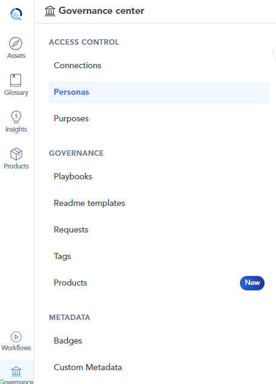

**Step 2**: Click on **"+ New Persona Button"**.

**Step 3:** Enter a **Name** and **Description** for a new persona, then click the **"Create"** button.

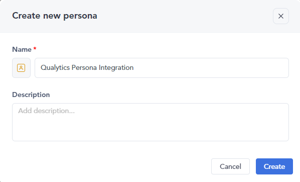

**Step 4:** Here your new Atlan persona has been created.

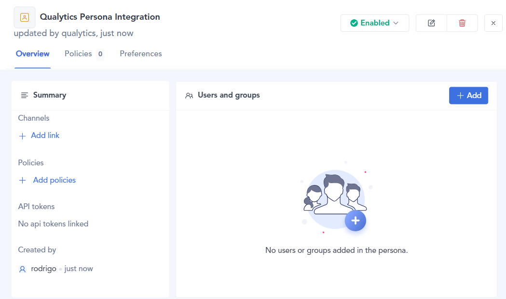

**Step 5**: After creating a new Atlan persona you have to create policies to authorize the personal access token. Click on **"Add Policies"** to create a new policy or to add one if there isn't any available.

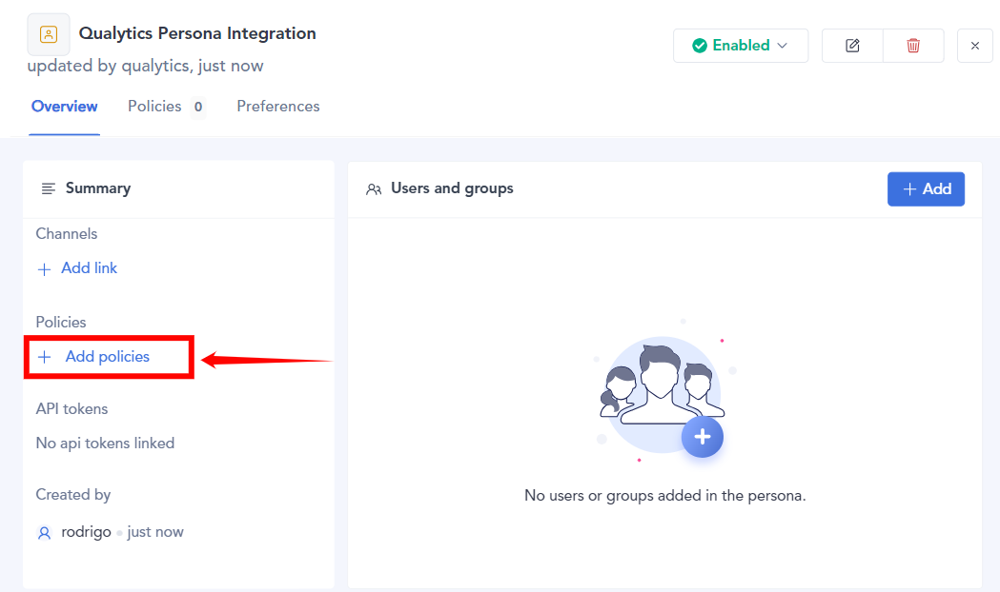

**Step 6**: Click on **"New Policy"** and select **"Metadata Policy"** from the dropdown menu.

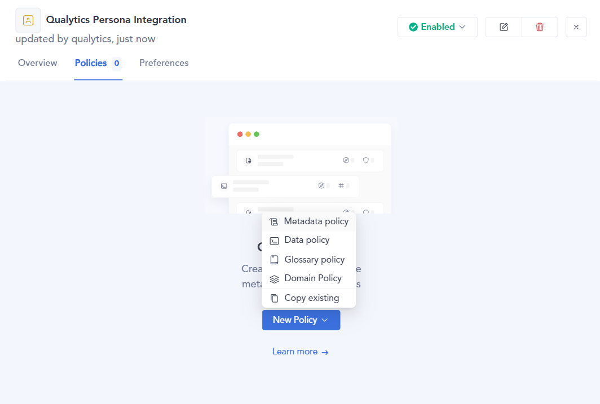

**Step 7:** Enter a **"name"**, and choose the **"connection"**.

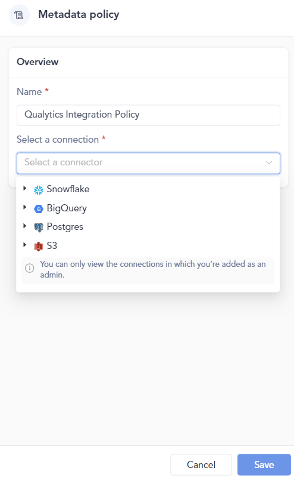

**Step 8:** Customize the permissions and assets that Qualytics will access.

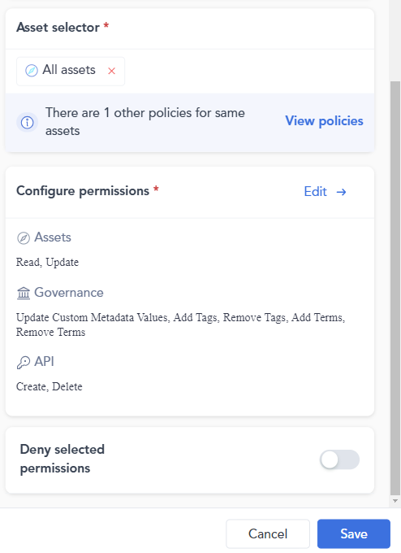

**Step 9**: Once the policy is created, you'll see it listed in the Policies section.

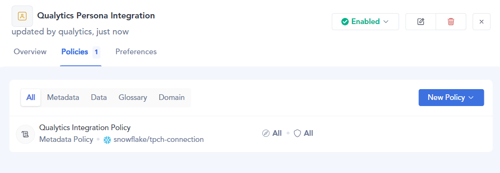

## **Create Atlan Personal Access Token**

After you've created the persona, the next step is to create a personal access token.

**Step 1:** Navigate to the **API Tokens** section in the Admin Center.

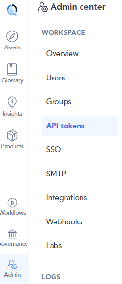

**Step 2:** Click on **"Generate API Token"** button.

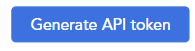

**Step 3**: Enter a **name** and **description**, and select the persona you created earlier.

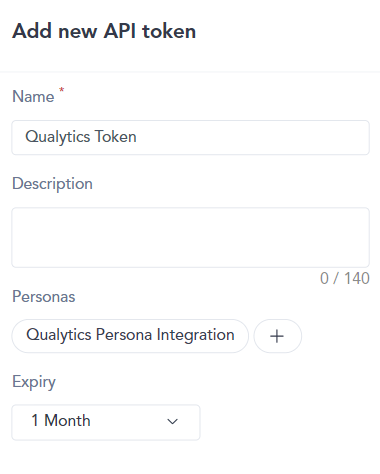

**Step 4:** Click the **"Save"** button and make sure to store the token in a secure location.

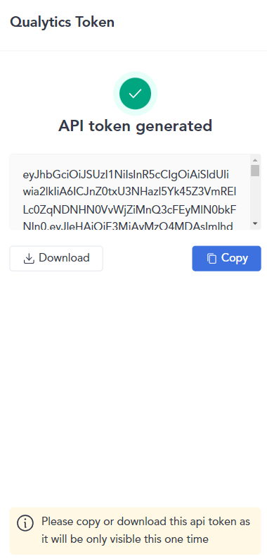

## Add Atlan Integration

Integrating Atlan with Qualytics enhances your data management capabilities, allowing seamless synchronization between the two platforms. This guide will walk you through the steps to add the Atlan integration efficiently. By following these steps, you can configure essential settings, provide necessary credentials, and customize synchronization options to meet your organization's needs.

**Step 1:** Log in to your Qualytics account and click the **"Settings"** button on the left side panel of the interface.

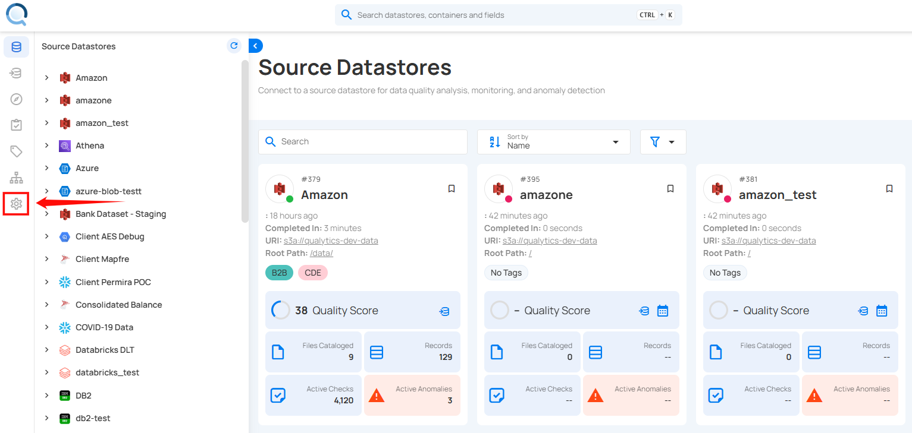

**Step 2:** You will be directed to the **Settings** page, then click on the **"Integration"** tab.

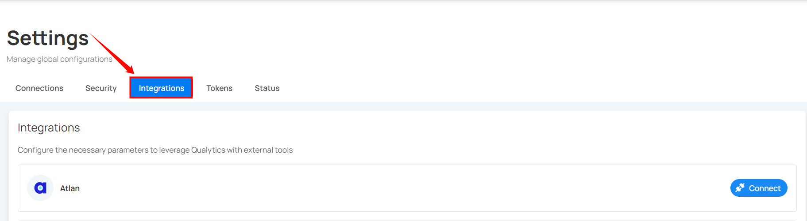

**Step 3:** Click on the **Connect** button next to Atlan to connect to the Atlan Integration.

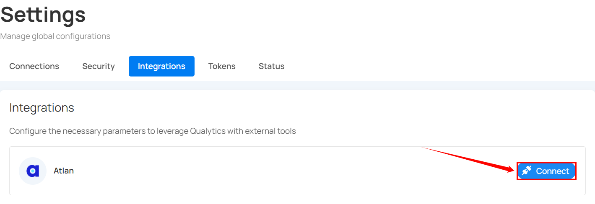

A modal window titled **Add Atlan Integration** appears.

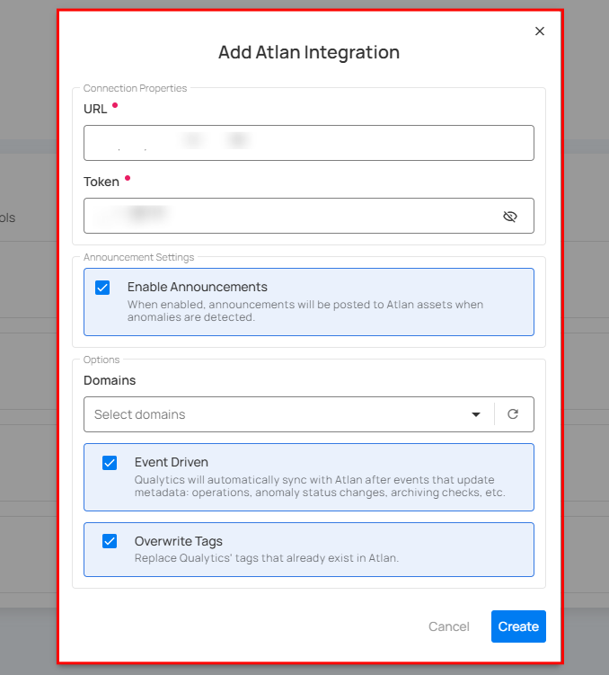

 Fill in the connection properties to connect to Atlan.

|   REF. | FIELDS | ACTIONS |
|--------|--------|---------|
| 1. | URL (Required) | The complete address for the Atlan instance, for example: [https://your-company.atlan.com](https://your-company.atlan.com). |
| 2. | Token (Required) | Provide the authentication token needed to connect to Atlan.|
| 3. | Enable Announcements | If enabled, announcements will be automatically posted to Atlan assets whenever anomalies are detected.|
| 4. | Domains | Select specific domains to filter assets for synchronization.  - Acts as a filtering mechanism to sync specific assets  - Uses domain information from the data catalog (e.g. Sales ). Only assets under the selected domains will synchronize.|
| 5. | Event Driven | If enabled, the integration sync will be activated by operations, archiving anomalies, and checks. For more details, see [Event Driven](./overview.md#event-driven){:target="_blank"}. |
| 6. | Overwrite Tags | If enabled, Atlan tags will have precedence over Qualytics tags in cases of conflicts (when tags with the same name exist on both platforms). For more details, see [Overwrite Tags](./overview.md#overwrite-tags){:target="_blank"}. |

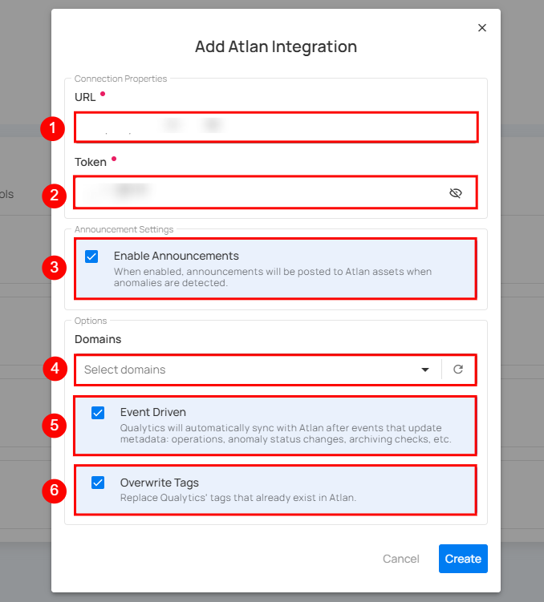

**Step 4:**  Click on the **Create** button to set up the Atlan integration.

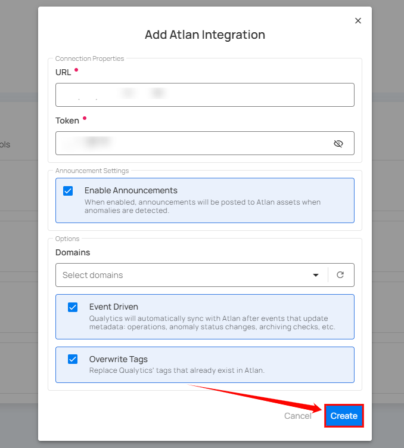

**Step 5:** Once the Atlan integration is set up with Qualytics, it will appear in Qualytics as a new integration.

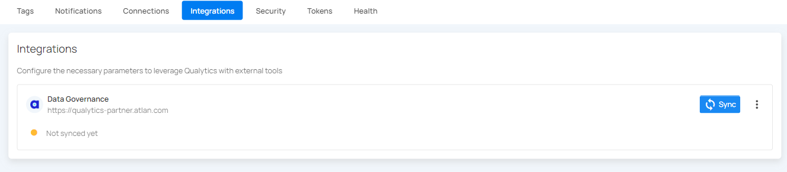

## Domain Filters

Domain filters control **which Atlan assets** Qualytics will look at during synchronization. Understanding how they work is key to getting the sync configured correctly.

### How Domain Filters Work

In Atlan, assets (databases, schemas, tables, columns) are organized under **Connections**, which can be grouped by **Domains**. When you set up the Atlan integration in Qualytics, you select one or more domains. During sync, Qualytics will **only** search for matching assets within those selected domains — everything outside them is ignored.

### When to Use Domain Filters

Use domain filters when you want to:

- **Focus on specific areas** — For example, if your Atlan instance has many connections but you only care about syncing quality data for your production databases, select just the domains that contain those connections.
- **Avoid noise** — Filtering prevents Qualytics from trying to match assets in domains that are unrelated to your data quality workflows (e.g., sandbox or test connections).
- **Speed up sync** — A narrower domain scope means fewer assets to search through, which makes the sync faster.

### When to Remove or Broaden Domain Filters

Remove or expand your domain filter if:

- **Nothing is syncing** — This is the most common issue. If you selected a domain that has no databases, schemas, tables, or columns in it, Qualytics won't find any assets to match and the sync will complete with no results. Check your selected domains in Atlan and make sure they actually contain the assets you expect.
- **Only some datastores are syncing** — Your assets may be spread across multiple domains. Add the missing domains to your filter to pick up the rest.
- **You're unsure which domains to pick** — You can temporarily select all available domains to let Qualytics find every possible match, then narrow it down later once you know which domains contain your target assets.

!!! warning "Common Pitfall"
    If you select a domain that is empty or contains no data assets (databases, schemas, tables, or columns), the sync will complete successfully but **no resources will be matched or updated**. Always verify that your selected domains contain the assets that correspond to your Qualytics datastores.

### How to Change Your Domain Filter

**Step 1:** Go to **Settings** > **Integrations** and click the **Edit** button (pencil icon) on your Atlan integration.

**Step 2:** In the **Domains** field, add or remove domains as needed. You can search by domain name to find the right ones.

**Step 3:** Click **Save**, then run a manual sync to verify the updated filter is working as expected.

!!! tip "Finding the Right Domains"
    If you're not sure which Atlan domains contain your assets, open Atlan and browse your Connections and Domains. Look for the domains that hold the databases, schemas, and tables that match the datastores you've set up in Qualytics.

## Synchronization

Once connected, you can sync data between Qualytics and Atlan in two directions:

- **Pull** brings information from Atlan into Qualytics (like tags)
- **Push** sends Qualytics quality results to Atlan (like scores and anomaly counts)

### What Gets Synced

| Direction | What | Description |
| :---- | :---- | :---- |
| **Pull** (Atlan → Qualytics) | Tags | Tags on Atlan assets are imported into Qualytics as **external tags**, keeping your governance labels visible in both platforms. |
| **Push** (Qualytics → Atlan) | Quality Score | An overall data quality score (0-100) for the asset. |
| **Push** (Qualytics → Atlan) | Anomaly Count | How many active data quality issues exist for the asset. |
| **Push** (Qualytics → Atlan) | Check Count | How many quality checks are actively monitoring the asset. |
| **Push** (Qualytics → Atlan) | Qualytics Link | A direct link back to the asset in Qualytics so users can jump straight to the details. |

### How Qualytics Matches Assets

During sync, Qualytics automatically matches your resources to the corresponding assets in Atlan based on their names:

| Your Qualytics Resource | Matches These Atlan Assets |
| :---- | :---- |
| **Datastore** | Connection, Schema |
| **Container** (table) | Table, View |
| **Field** (column) | Column |

The matching works by comparing names in a `database.schema.table.column` pattern. For example, if you have a Qualytics datastore connected to `sales_db.public`, it will look for an Atlan asset with the same naming structure in your selected domains.

!!! note
    Currently, only database-type datastores are supported for catalog sync. File-based datastores are not yet included.

### Manual Sync

You can trigger a sync at any time to pull the latest information from Atlan or push your quality results.

!!! note
    Tag synchronization requires **manual** triggering.

**Step 1:** To sync tags, click the vertical ellipsis next to Atlan and select **Sync** from the dropdown.

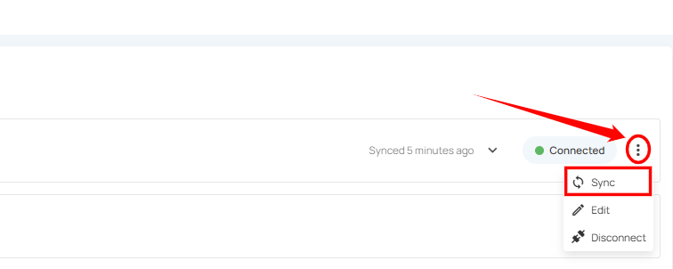

**Step 2:** After clicking the **"Sync"** button, you will have the following options:

- **Pull Atlan Metadata**
- **Push Qualytics Metadata**

Specify whether the synchronization will pull metadata, push metadata, or do both.

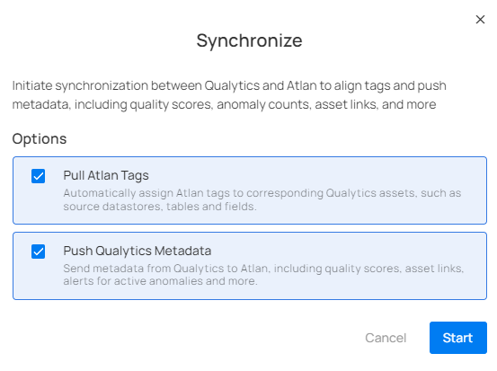

**Step 3:** After selecting the desired options, click on the **"Start"** button.

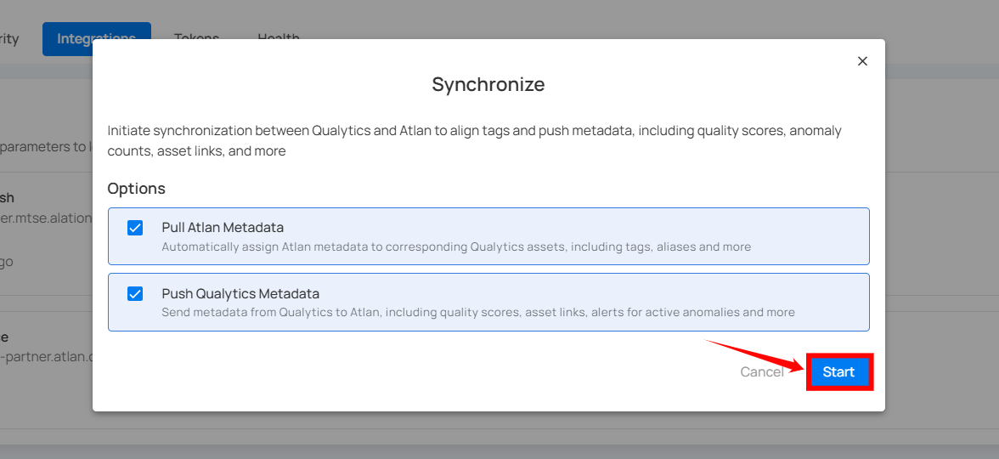

**Step 4:** After clicking the **Start** button, the synchronization process between Qualytics and Atlan begins. This process pulls metadata from Atlan and pushes Qualytics metadata, including tags, quality scores, anomaly counts, asset links, and many more.

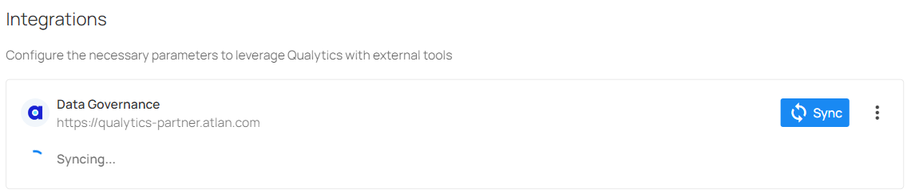

**Step 5:** Review the logs to verify which assets were successfully mapped from Atlan to Qualytics.

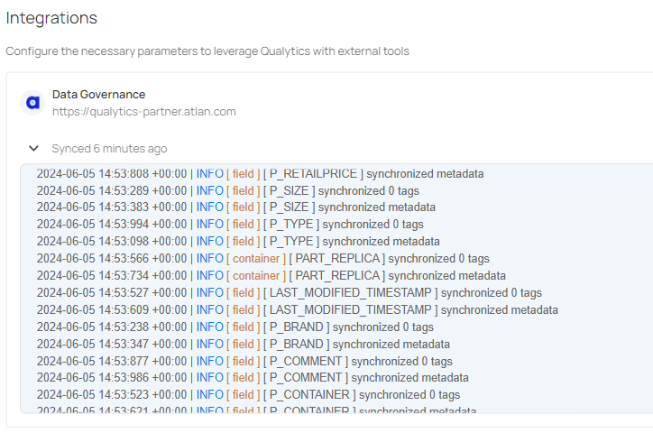

**Step 6:** Once synchronization is complete, the mapped assets from **"Atlan"** will display an external tag.

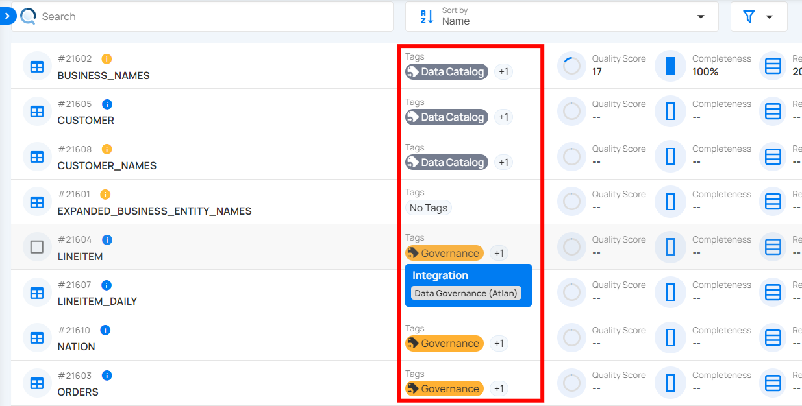

**Step 7:** When Qualytics detects anomalies, alerts are sent to the assets in Atlan, displaying the number of active anomalies and including a link to view the corresponding details

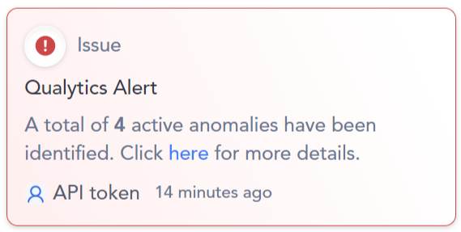

!!! note
    Pulling tags from Atlan requires a **manual sync**. Even with Event Driven turned on, tag imports only happen when you manually trigger a sync.

### Cancel Sync

If a sync is taking longer than expected, you can stop it at any time.

Click the vertical ellipsis (three dots) next to the Atlan integration and select **Cancel Sync**. The process will stop gracefully after finishing the current datastore.

## Metadata in Atlan

When Qualytics pushes quality results to Atlan, it adds custom metadata to your Atlan assets. These are created automatically during the first sync if they don't already exist.

### Attributes Added to Atlan Assets

| Attribute | Description |
| :---- | :---- |
| **Qualytics Quality Score** | The overall quality score (0-100) calculated by Qualytics |
| **Qualytics Anomaly Count** | The number of active data quality issues detected |
| **Qualytics Check Count** | The number of active quality checks monitoring the asset |
| **Qualytics URL** | A clickable link to view the asset directly in Qualytics |

The Quality Score Total, along with the Qualytics 8 metrics (completeness, coverage, conformity, consistency, precision, timeliness, volume, and accuracy), and the count of checks and anomalies per asset identified by Qualytics, are pushed.

These attributes appear at every level of your data:

- **Datastores** - Overall quality score and totals across all tables
- **Tables** - Quality score and counts specific to each table
- **Columns** - Quality score and counts specific to each column

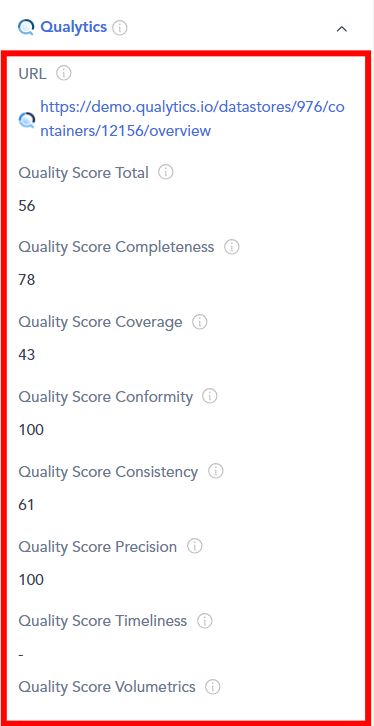

## External Tags

When you pull metadata from Atlan, any tags on Atlan assets are imported into Qualytics as **external tags**. These are visually distinct from regular Qualytics tags, so you can easily tell which labels came from your data catalog.

How external tags work:

- Tags from Atlan are automatically linked to the matching Qualytics resource (datastore, table, or column)
- If a tag is removed from an Atlan asset, it will also be removed from Qualytics on the next sync
- Tags that no longer exist in Atlan are automatically cleaned up
- External tags on tables do **not** automatically carry over to their columns

!!! tip
    Use the **Overwrite Tags** setting to control what happens when both platforms have tags with the same name. When off, the existing Qualytics tag is kept and the Atlan tag is skipped. When on, the existing tag is converted into an external tag managed by Atlan. For more details, see [Overwrite Tags](./overview.md#overwrite-tags){:target="_blank"}.

## Known Limitations

| Limitation | Details |
| :---- | :---- |
| **Database-type datastores only** | Only database datastores (e.g., PostgreSQL, Snowflake, SQL Server) are supported for sync. File-based datastores are not yet included. |
| **Push-only for event-driven sync** | When Event Driven is turned on, Qualytics only pushes data to Atlan. Pulling tags from Atlan still requires a manual sync. |
| **Name-based asset matching** | Qualytics matches assets by comparing names (database, schema, table, column). If naming conventions differ between Atlan and your datastores, some assets may not match automatically. |
| **No column-level tag pull for all catalogs** | Tags are pulled at the datastore, table, and column level, but the depth of tag coverage depends on how your Atlan assets are tagged. |
| **Single sync at a time** | Only one sync can run at a time per integration. If a sync is already in progress, you'll need to wait for it to finish or cancel it before starting a new one. |
| **No custom attribute mapping** | The attributes pushed to Atlan (Quality Score, Anomaly Count, Check Count, URL) are fixed. Custom attribute mapping is not yet supported. |

## Troubleshooting

### Common Issues

| Issue | Possible Cause | What to Do |
| :---- | :---- | :---- |
| **Authentication Failed** | Invalid API token | Double-check that the API token is correct, has not expired, and that the associated persona has the required policies. |
| **Sync Completes but Nothing Appears in Atlan** | Wrong domains selected | Make sure the domains you selected actually contain the assets that correspond to your Qualytics datastores. |
| **Sync Failed** | Connection issue | Confirm that your Atlan URL is correct and that Qualytics can reach it over the network. |
| **Some Assets Not Updated** | No matching assets found | Check that the asset names in Atlan (connections, schemas, tables, columns) match the names used in your Qualytics datastores. |
| **Custom Metadata Not Showing in Atlan** | Permission issue | Make sure the API token's persona has metadata policies that allow creating and modifying custom metadata on assets. |
| **Sync Takes Too Long** | Too many assets in scope | Narrow your domain selection to focus on the most important assets. You can always cancel and retry with a smaller scope. |

!!! tip
    You can view detailed sync logs by clicking on the Atlan integration card. The logs show a summary for each datastore, including how many tables, columns, and tags were synced, along with any errors.

## Examples

### Asset Matching Example

The following example shows how Qualytics maps a PostgreSQL database to Atlan assets during synchronization.

**Source database:** PostgreSQL datastore `sales_db.public` containing a table `customers` with a column `email`.

During sync, Qualytics matches resources using the naming hierarchy:

| Qualytics Resource | Name | Matched Atlan Asset | Atlan Asset Type |
| :---- | :---- | :---- | :---- |
| Datastore | `sales_db.public` | `sales_db` → `public` | Connection → Schema |
| Container | `customers` | `customers` | Table |
| Field | `email` | `email` | Column |

Qualytics walks through each level of the hierarchy — Connection, Schema, Table, Column — and matches by name within the selected domains.

### End-to-End Sync Scenario

This example walks through a complete synchronization workflow between Qualytics and Atlan.

**Step 1: Connect the integration**

Set up the Atlan integration with your API token and select the relevant domains (e.g., the "Sales" domain containing your production database connections).

**Step 2: Run a manual pull sync**

Trigger a pull sync from Atlan. Qualytics scans the selected domains and matches Atlan assets to your datastores. Tags assigned to Atlan assets (e.g., `PII`, `Financial`) appear in Qualytics as external tags on the matched datastores, tables, and columns.

**Step 3: Run a scan in Qualytics**

Execute a scan operation on your datastores. Qualytics evaluates your quality checks and generates quality scores, anomaly counts, and check counts for each table and column.

**Step 4: Run a push sync**

Trigger a push sync (or let Event Driven handle it automatically). Qualytics sends the following metadata to the matched Atlan assets:

- **Quality Score** (0-100) at the datastore, table, and column level
- **Anomaly Count** per asset
- **Check Count** per asset
- **Qualytics URL** linking back to the asset in Qualytics

**Step 5: View results in Atlan**

In Atlan, navigate to the matched table (e.g., `customers`). Under the custom metadata section, you will see the Qualytics quality score, anomaly count, check count, and a direct link to view the asset in Qualytics. If announcements are enabled, any active anomalies also appear as announcements on the asset.
