# Microsoft Purview Integration

Integrating Microsoft Purview with Qualytics enables seamless metadata synchronization between the two platforms. Once connected, Qualytics can push quality scores, anomaly data, and metadata to your Purview catalog, providing a unified view of data quality across your organization.

Let's get started 🚀

## Prerequisites

Before you begin, ensure that:

- You already have a Microsoft Purview account

- You have permission to:
    - Create App Registrations in Microsoft Entra ID
    - Assign roles in the Purview governance portal (Collections)

## Azure Setup

Before connecting Purview to Qualytics, you need to create a service principal in Azure and configure the necessary permissions.

### Create a Service Principal

Qualytics uses a service principal to securely authenticate with Microsoft Purview APIs.

**Step 1:** Sign in to the [Azure portal](https://portal.azure.com){target="_blank"}.

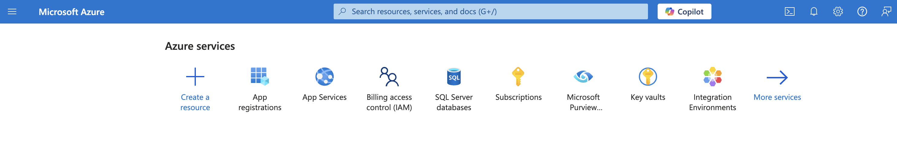

**Step 2:** Navigate to **Microsoft Entra ID** and select **App registrations** from the left sidebar.

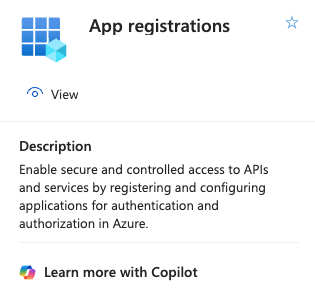

**Step 3:** Click **New registration**.

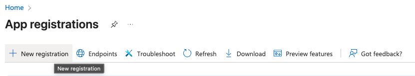

**Step 4:** Fill in the registration form with the following details:

| Field | Value |
| :---- | :---- |
| Name | `Qualytics-Purview-Integration` (or any descriptive name) |
| Supported account types | Accounts in this organizational directory only (Single tenant) |

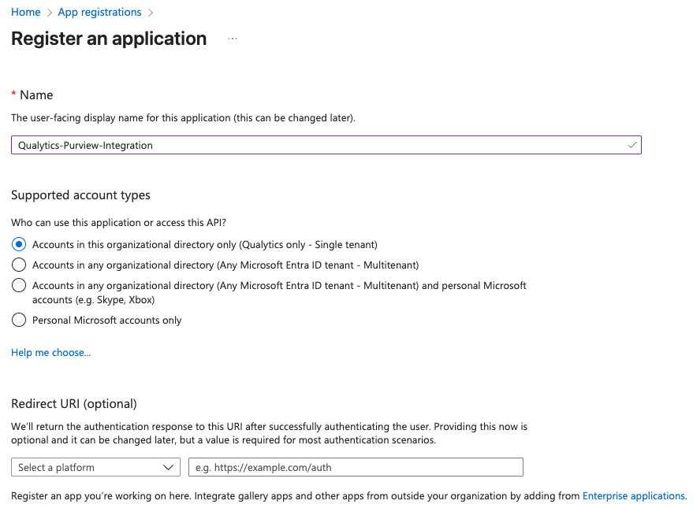

**Step 5:** Click **Register**. After registration, save the **Application (client) ID** — you will need this later.

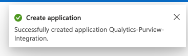

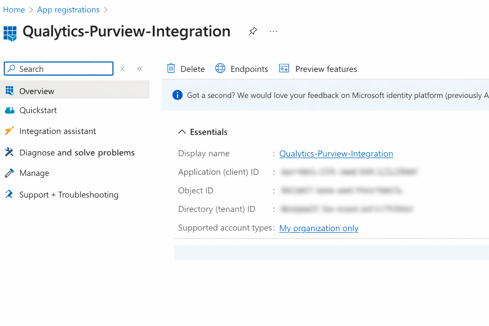{: style="height:300px"}

### Generate a Client Secret

**Step 1:** In the app registration, go to **Certificates & secrets** in the left sidebar.

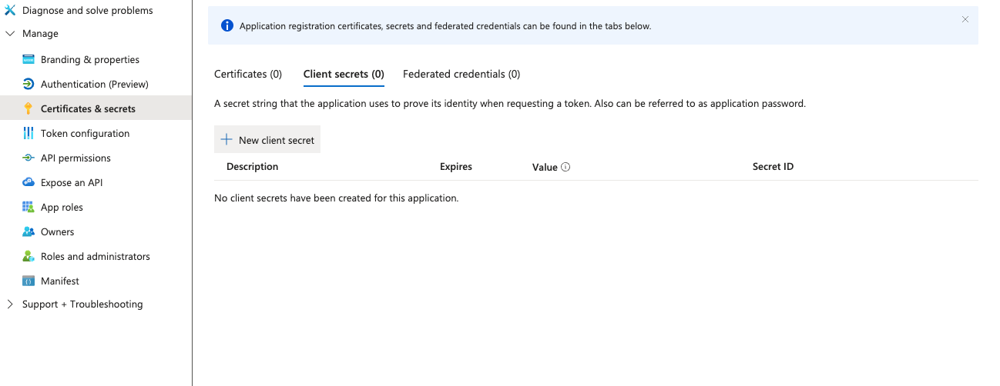


**Step 2:** Click **New client secret**, provide a description, select an expiration period, and click **Add**.

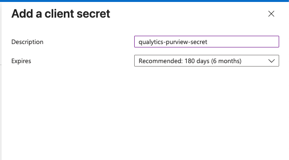

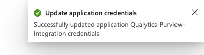

<!-- Screenshot: Add a client secret dialog -->

**Step 3:** Copy the **Value** immediately and store it securely.

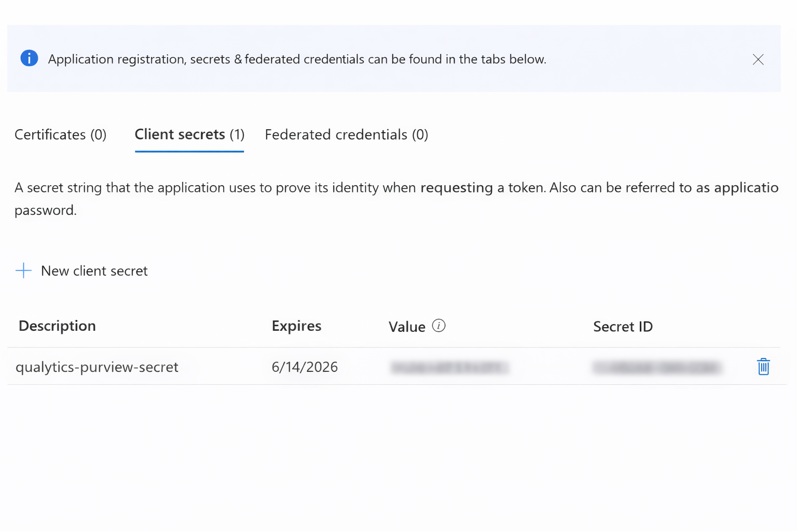{: style="height:300px"}

!!! warning "Important"
    The client secret value is shown only once. Store it securely. This value is your `client_secret`.

### Configure API Permissions

**Step 1:** In the app registration, open **API permissions** from the left sidebar and click **Add a permission**.

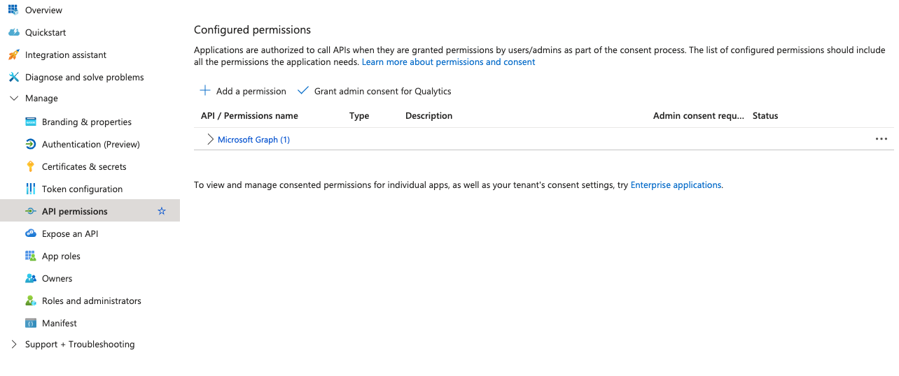

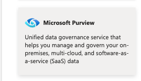

**Step 2:** Search for and select **Microsoft Purview**, then add the following permissions:

| Permission Type | Permission Name |
| :---- | :---- |
| Delegated permissions | `Purview.DelegatedAccess` |
| Application permissions | `Purview.ApplicationAccess` |

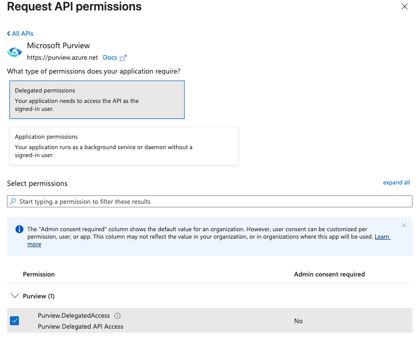

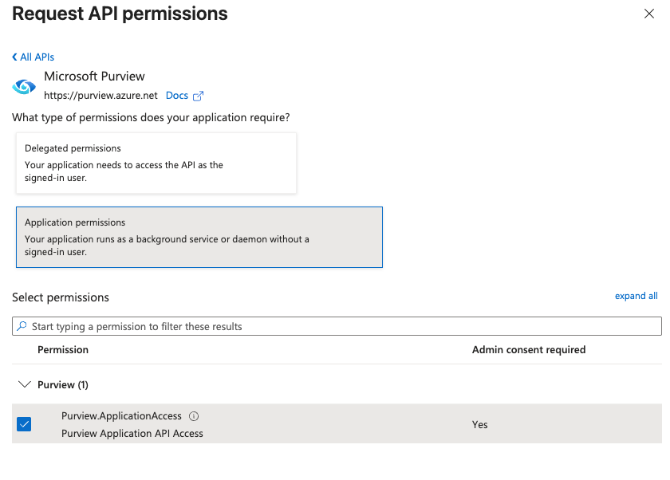

**Step 3:** Click **Add permissions**, then click **Grant admin consent** and confirm the action.

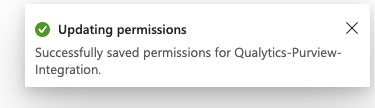

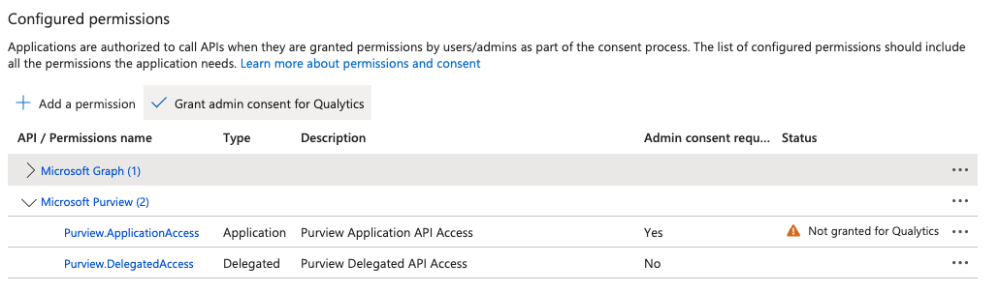

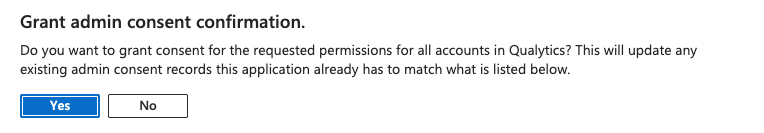

## Purview Setup

After creating the service principal, you need to assign the appropriate roles in the Purview governance portal.

### Assign Collection Roles

**Step 1:** Open the [Microsoft Purview governance portal](https://purview.microsoft.com){target="_blank"}.

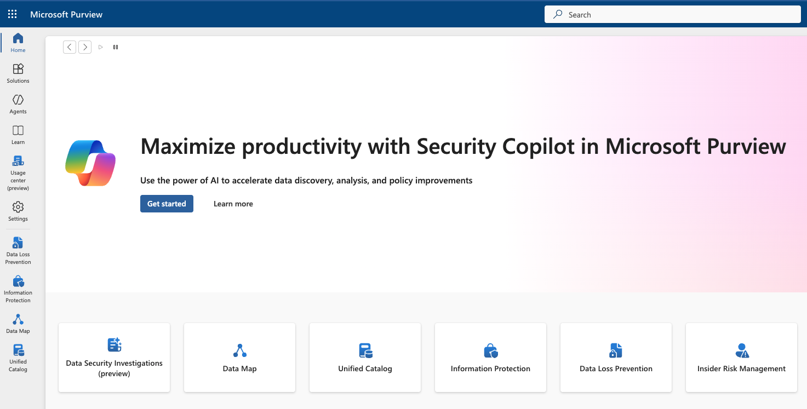

**Step 2:** Select **Data Map** from the navigation, then click **Collections**.

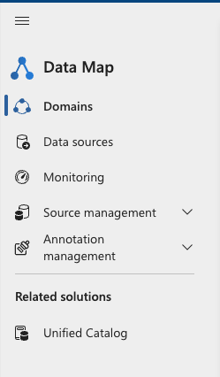

**Step 3:** Select the **root collection** (the top-level collection with the same name as your Purview account).

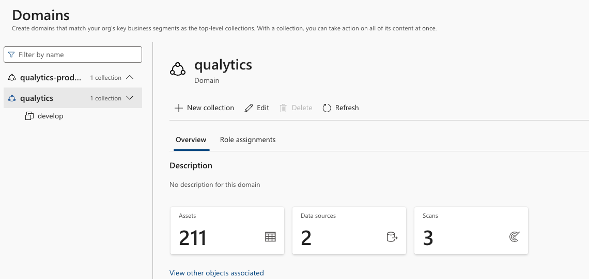

**Step 4:** Open the **Role assignments** tab and assign the following roles to the service principal:

| Role | Purpose |
| :---- | :---- |
| Data Curator | Access Catalog data plane |
| Data Source Administrator | Access Scanning data plane |
| Collection Admin | Access Account & Metadata policy data planes |
| Policy Author | Access DevOps policies API |

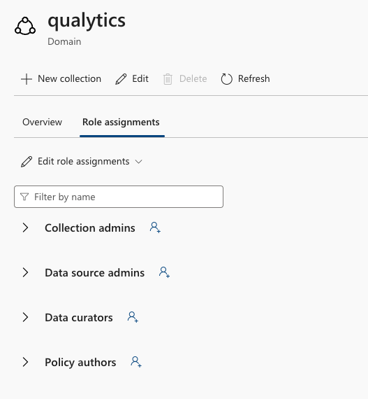

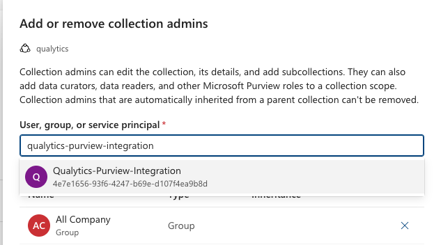

!!! note
    You may assign roles to a sub-collection instead of the root collection, but API access will be limited to that scope.

### Gather Connection Details

**Step 1:** In the Azure portal, open your Purview account and go to **Settings and properties**.

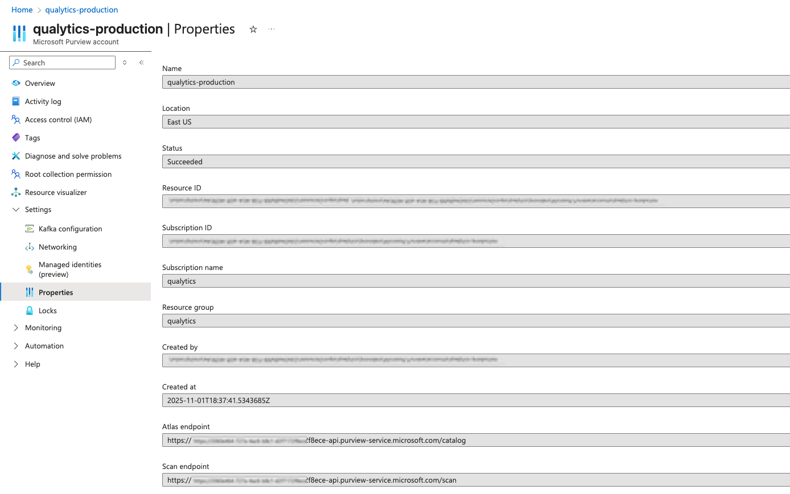

**Step 2:** Copy the **Atlas endpoint** and remove `/catalog` from the end of the URL.

**Example:**

```
https://<purview-tenant-id>-api.purview-service.microsoft.com
```

**Step 3:** Copy the **Managed Identity tenant ID** from the same page.

## Add Purview Integration

Now you can configure the integration in Qualytics using the credentials you gathered.

**Step 1:** Log in to your Qualytics account and click **Settings** on the left side panel.

<!-- Screenshot: Qualytics Settings navigation -->

**Step 2:** Click on the **Integration** tab.

<!-- Screenshot: Settings > Integration tab -->

**Step 3:** Click the **Connect** button next to Microsoft Purview.

<!-- Screenshot: Connect button for Purview -->

A modal window titled **Add Purview Integration** appears. Fill in the connection properties:

| REF. | Field | Description |
| :---- | :---- | :---- |
| 1. | Purview Account URL | The Atlas endpoint without `/catalog` (e.g., `https://your-account.purview.azure.com`) |
| 2. | Tenant ID | The Managed Identity tenant ID from your Purview account |
| 3. | Client ID | The Application (client) ID from your app registration |
| 4. | Client Secret | The client secret value you generated |
| 5. | Domains | Select specific collections or scopes to filter assets for synchronization. Only assets within the selected collections will be matched with your Qualytics resources. If no domains are selected, all collections are searched. |
| 6. | Event Driven | When turned on, Qualytics will automatically send updates to Purview whenever scans complete, anomalies are detected, or checks are archived (default: on). For more details, see [Event Driven](./overview.md#event-driven){:target="_blank"}. |
| 7. | Overwrite Tags | When turned on, existing Qualytics tags with the same name are converted into external tags managed by the Purview integration. When turned off, the existing Qualytics tag is left unchanged and the Purview tag is skipped (default: off). For more details, see [Overwrite Tags](./overview.md#overwrite-tags){:target="_blank"}. |

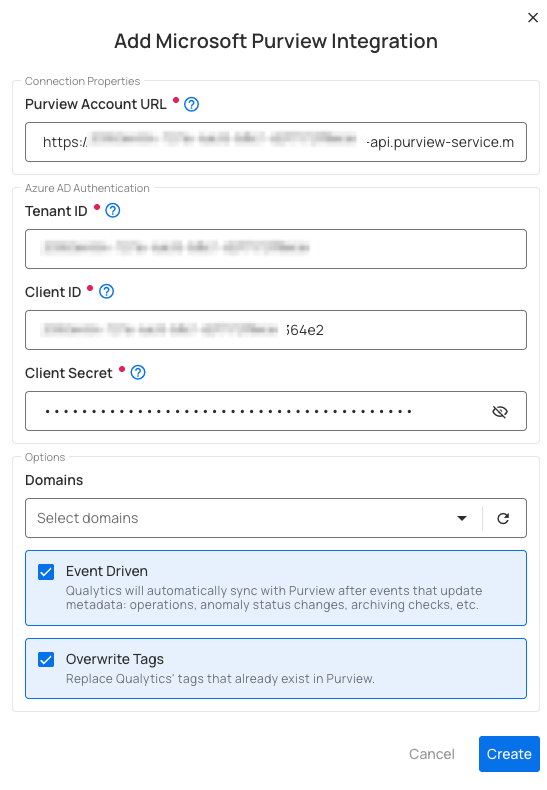

**Step 4:** Click **Save** to create the integration.

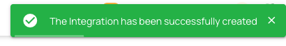

**Step 5:** Once the integration is set up, it will appear in your integrations list.


!!! success "Integration Complete"
    Your Microsoft Purview account is now successfully connected to Qualytics and ready for catalog, scanning, and governance operations.

## Domain Filters

Domain filters control **which Purview assets** Qualytics will look at during synchronization. Understanding how they work is key to getting the sync configured correctly.

### How Domain Filters Work

In Microsoft Purview, assets are organized under **Collections** and can be scoped by classification. When you set up the Purview integration in Qualytics, you select one or more collections. During sync, Qualytics will **only** search for matching assets within those selected collections — everything outside them is ignored.

### When to Use Domain Filters

Use domain filters when you want to:

- **Focus on specific areas** — For example, if your Purview account has many collections but you only care about syncing quality data for your production databases, select just the collections that contain those data sources.
- **Avoid noise** — Filtering prevents Qualytics from trying to match assets in collections that are unrelated to your data quality workflows (e.g., sandbox or development collections).
- **Speed up sync** — A narrower collection scope means fewer assets to search through, which makes the sync faster.

### When to Remove or Broaden Domain Filters

Remove or expand your domain filter if:

- **Nothing is syncing** — This is the most common issue. If you selected a collection that has no data sources, tables, or columns in it, Qualytics won't find any assets to match and the sync will complete with no results. Check your selected collections in Purview and make sure they actually contain the assets you expect.
- **Only some datastores are syncing** — Your assets may be spread across multiple collections. Add the missing collections to your filter to pick up the rest.
- **You're unsure which collections to pick** — You can temporarily select all available collections to let Qualytics find every possible match, then narrow it down later once you know which collections contain your target assets.

!!! warning "Common Pitfall"
    If you select a collection that is empty or contains no data assets (data sources, tables, or columns), the sync will complete successfully but **no resources will be matched or updated**. Always verify that your selected collections contain the assets that correspond to your Qualytics datastores.

### How to Change Your Domain Filter

**Step 1:** Go to **Settings** > **Integrations** and click the **Edit** button (pencil icon) on your Purview integration.

**Step 2:** In the **Domains** field, add or remove collections as needed. You can search by collection name to find the right ones.

**Step 3:** Click **Save**, then run a manual sync to verify the updated filter is working as expected.

!!! tip "Finding the Right Collections"
    If you're not sure which Purview collections contain your assets, open the Purview governance portal and browse the Data Map. Look for the collections that hold the data sources, tables, and columns that match the datastores you've set up in Qualytics.

## Synchronization

Once connected, you can sync data between Qualytics and Purview in two directions:

- **Pull** brings information from Purview into Qualytics (like tags and classifications)
- **Push** sends Qualytics quality results to Purview (like scores and anomaly counts)

### What Gets Synced

| Direction | What | Description |
| :---- | :---- | :---- |
| **Pull** (Purview → Qualytics) | Tags | Classifications and labels on Purview assets are imported into Qualytics as **external tags**, keeping your governance labels visible in both platforms. |
| **Push** (Qualytics → Purview) | Quality Score | An overall data quality score (0-100) for the asset. |
| **Push** (Qualytics → Purview) | Anomaly Count | How many active data quality issues exist for the asset. |
| **Push** (Qualytics → Purview) | Check Count | How many quality checks are actively monitoring the asset. |
| **Push** (Qualytics → Purview) | Qualytics Link | A direct link back to the asset in Qualytics so users can jump straight to the details. |

### How Qualytics Matches Assets

During sync, Qualytics automatically matches your resources to the corresponding assets in Purview based on their names:

| Your Qualytics Resource | Matches These Purview Assets |
| :---- | :---- |
| **Datastore** | Data Source |
| **Container** (table) | Entity (Table, View) |
| **Field** (column) | Column |

The matching works by comparing names in a `database.schema.table.column` pattern. For example, if you have a Qualytics datastore connected to `finance_db.dbo`, it will look for a Purview entity with the same naming structure in your selected collections.

!!! note
    Currently, only database-type datastores are supported for catalog sync. File-based datastores are not yet included.

### Manual Sync

You can trigger a sync at any time to pull the latest information from Purview or push your quality results.

**Step 1:** Click the vertical ellipsis next to the Purview integration and select **Sync** from the dropdown.

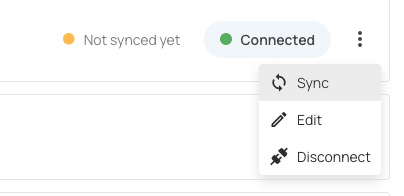

**Step 2:** Select the synchronization options and click **Start**.

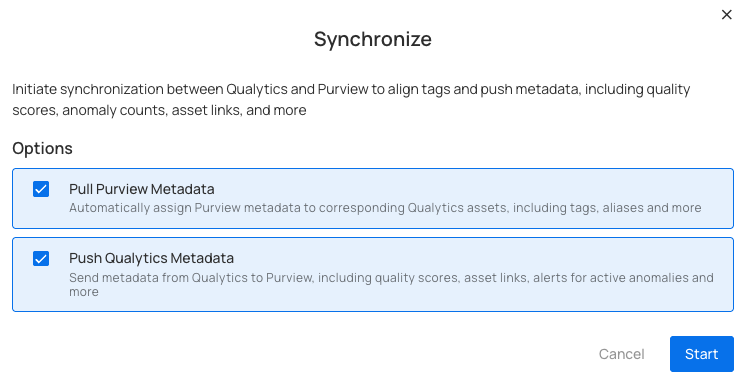

!!! note
    Pulling tags from Purview requires a **manual sync**. Even with Event Driven turned on, tag imports only happen when you manually trigger a sync.

### Cancel Sync

If a sync is taking longer than expected, you can stop it at any time.

Click the vertical ellipsis (three dots) next to the Purview integration and select **Cancel Sync**. The process will stop gracefully after finishing the current datastore.

## Metadata in Purview

When Qualytics pushes quality results to Purview, it adds custom attributes to your Purview assets. These are created automatically during the first sync if they don't already exist.

### Attributes Added to Purview Assets

| Attribute | Description |
| :---- | :---- |
| **Qualytics Quality Score** | The overall quality score (0-100) calculated by Qualytics |
| **Qualytics Anomaly Count** | The number of active data quality issues detected |
| **Qualytics Check Count** | The number of active quality checks monitoring the asset |
| **Qualytics URL** | A clickable link to view the asset directly in Qualytics |

These attributes appear at every level of your data:

- **Datastores** - Overall quality score and totals across all tables
- **Tables** - Quality score and counts specific to each table
- **Columns** - Quality score and counts specific to each column

## External Tags

When you pull metadata from Purview, any classifications and labels on Purview assets are imported into Qualytics as **external tags**. These are visually distinct from regular Qualytics tags, so you can easily tell which labels came from your data catalog.

How external tags work:

- Classifications from Purview are automatically linked to the matching Qualytics resource (datastore, table, or column)
- If a classification is removed from a Purview asset, it will also be removed from Qualytics on the next sync
- Classifications that no longer exist in Purview are automatically cleaned up
- External tags on tables do **not** automatically carry over to their columns

!!! tip
    Use the **Overwrite Tags** setting to control what happens when both platforms have tags with the same name. When off, the existing Qualytics tag is kept and the Purview classification is skipped. When on, the existing tag is converted into an external tag managed by Purview. For more details, see [Overwrite Tags](./overview.md#overwrite-tags){:target="_blank"}.

## Known Limitations

| Limitation | Details |
| :---- | :---- |
| **Database-type datastores only** | Only database datastores (e.g., Azure SQL, Synapse, SQL Server) are supported for sync. File-based datastores are not yet included. |
| **Push-only for event-driven sync** | When Event Driven is turned on, Qualytics only pushes data to Purview. Pulling classifications from Purview still requires a manual sync. |
| **Name-based asset matching** | Qualytics matches assets by comparing names (database, schema, table, column). If naming conventions differ between Purview and your datastores, some assets may not match automatically. |
| **No column-level tag pull for all catalogs** | Tags are pulled at the datastore, table, and column level, but the depth of tag coverage depends on how your Purview assets are classified. |
| **Single sync at a time** | Only one sync can run at a time per integration. If a sync is already in progress, you'll need to wait for it to finish or cancel it before starting a new one. |
| **No custom attribute mapping** | The attributes pushed to Purview (Quality Score, Anomaly Count, Check Count, URL) are fixed. Custom attribute mapping is not yet supported. |

## Troubleshooting

### Common Issues

| Issue | Possible Cause | What to Do |
| :---- | :---- | :---- |
| **Authentication Failed** | Incorrect credentials or expired secret | Verify that the Client ID and Client Secret are correct and the secret has not expired. Generate a new secret in the Azure portal if needed. |
| **Insufficient Permissions** | Missing role assignments | Ensure all required roles (Data Curator, Data Source Administrator, Collection Admin, Policy Author) are assigned to the service principal in Purview. |
| **Invalid Endpoint** | Wrong Purview URL format | Confirm the Purview Account URL does not include `/catalog` at the end. |
| **Tenant Mismatch** | Wrong Tenant ID | Verify the Tenant ID matches your Azure Active Directory tenant. |
| **Sync Completes but Nothing Appears in Purview** | Wrong collections selected | Make sure the collections you selected actually contain the assets that correspond to your Qualytics datastores. |
| **Some Assets Not Updated** | No matching assets found | Check that the asset names in Purview (data sources, tables, columns) match the names used in your Qualytics datastores. |
| **Sync Takes Too Long** | Too many assets in scope | Narrow your collection selection to focus on the most important assets. You can always cancel and retry with a smaller scope. |

!!! tip
    You can view detailed sync logs by clicking on the Purview integration card. The logs show a summary for each datastore, including how many tables, columns, and tags were synced, along with any errors. If you encounter persistent issues, check the Azure portal for any error messages in the app registration's sign-in logs.

## Examples

### Asset Matching Example

The following example shows how Qualytics maps an Azure SQL database to Purview assets during synchronization.

**Source database:** Azure SQL datastore `finance_db.dbo` containing a table `transactions` with a column `amount`.

During sync, Qualytics matches resources using the naming hierarchy:

| Qualytics Resource | Name | Matched Purview Asset | Purview Asset Type |
| :---- | :---- | :---- | :---- |
| Datastore | `finance_db.dbo` | `finance_db` → `dbo` | Data Source → Schema |
| Container | `transactions` | `transactions` | Entity (Table) |
| Field | `amount` | `amount` | Column |

Qualytics walks through each level of the hierarchy — Data Source, Schema, Entity, Column — and matches by name within the selected collections.

### End-to-End Sync Scenario

This example walks through a complete synchronization workflow between Qualytics and Microsoft Purview.

**Step 1: Connect the integration**

Set up the Purview integration with your Client ID, Client Secret, and Tenant ID. Select the relevant collections (e.g., the "Finance" collection containing your production database assets).

**Step 2: Run a manual pull sync**

Trigger a pull sync from Purview. Qualytics scans the selected collections and matches Purview assets to your datastores. Classifications assigned to Purview assets (e.g., `Confidential`, `Financial Data`) appear in Qualytics as external tags on the matched datastores, tables, and columns.

**Step 3: Run a scan in Qualytics**

Execute a scan operation on your datastores. Qualytics evaluates your quality checks and generates quality scores, anomaly counts, and check counts for each table and column.

**Step 4: Run a push sync**

Trigger a push sync (or let Event Driven handle it automatically). Qualytics sends the following metadata to the matched Purview assets:

- **Quality Score** (0-100) at the datastore, table, and column level
- **Anomaly Count** per asset
- **Check Count** per asset
- **Qualytics URL** linking back to the asset in Qualytics

**Step 5: View results in Purview**

In the Purview governance portal, navigate to the matched entity (e.g., `transactions`). Under the asset details, you will see the Qualytics quality score, anomaly count, check count, and a direct link to view the asset in Qualytics.
