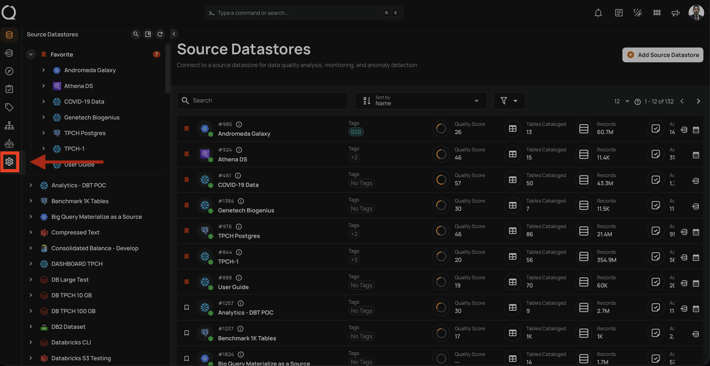
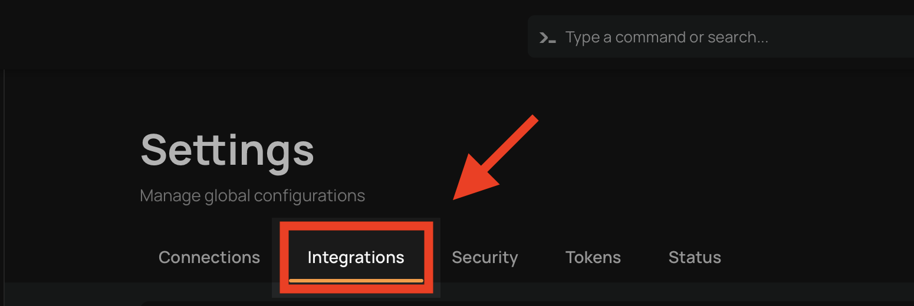
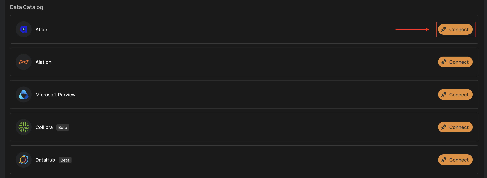
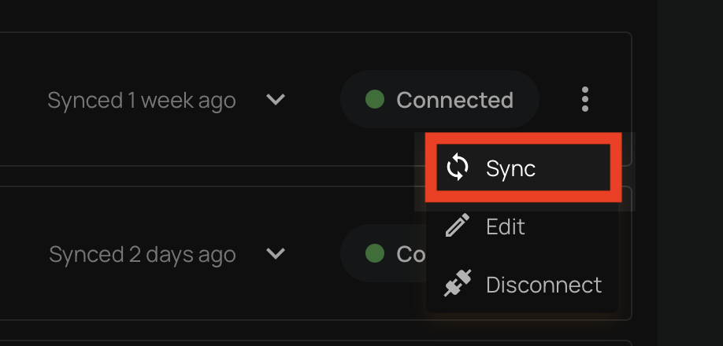
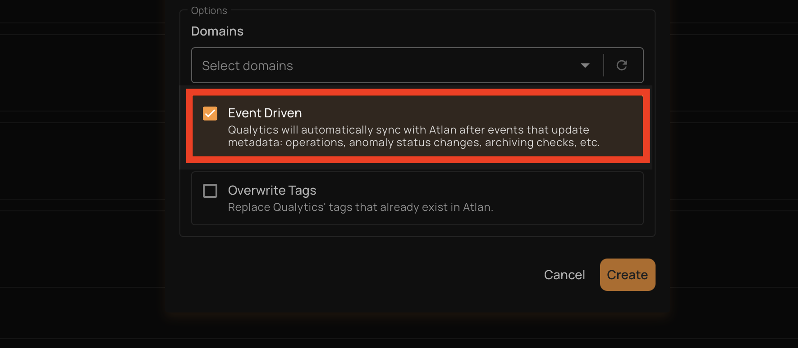
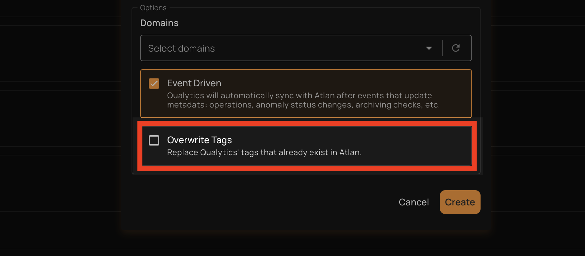

# Data Catalog Integrations

The Qualytics platform seamlessly integrates with enterprise data catalogs, enabling organizations to:

- Surface data quality insights directly within existing catalog tools
- Automatically sync metadata between platforms in real-time
- Leverage data catalog tags for quality classification
- Push quality alerts and anomaly notifications to catalog users
- Maintain consistent metadata across platforms
- Track data quality metrics within your data governance framework

These catalog integrations ensure that data quality insights are readily available to users within their preferred data discovery and governance platforms.

## Setting Up Catalog Integration

Navigate to **Settings**:

Click on **Integrations** tab:
{: style="height:200px"}

Click on **Connect**:
{: style="height:300px"}

## Supported Data Catalogs

Currently, Qualytics supports integration with the following data catalog platforms:

| Catalog | Authentication | Status | Documentation |
| :---- | :---- | :---- | :---- |
| Atlan | API Token | GA | [Setup Guide](./atlan.md){target="_blank"} |
| Alation | Refresh Token | GA | [Setup Guide](./alation.md){target="_blank"} |
| Microsoft Purview | Service Principal (Client ID / Secret) | GA | [Setup Guide](./microsoft-purview.md){target="_blank"} |
| Collibra | OAuth Client Credentials | Beta | [Setup Guide](./collibra.md){target="_blank"} |
| DataHub | Personal Access Token | Beta | [Setup Guide](./datahub.md){target="_blank"} |

### Atlan

The Atlan integration enables bidirectional metadata synchronization, providing:

- Automated metadata push from Qualytics to Atlan
- Real-time metadata pull from Atlan to Qualytics
- Automatic updates based on key events
- Flexible tag management options
- Simple API-based authentication

For detailed configuration steps, see the [**Atlan**](./atlan.md){target="_blank} documentation.

### Alation

The Alation integration supports comprehensive metadata exchange:

- Bidirectional metadata synchronization
- Real-time quality metric updates
- Selective synchronization of active checks
- Configurable tag conflict resolution
- Token-based secure authentication

For detailed configuration steps, see the [**Alation**](./alation.md){target="_blank} documentation.

### Microsoft Purview

The Microsoft Purview integration connects Qualytics with Azure’s native data governance platform.

Key capabilities include:

- Synchronization of data quality metadata with Purview
- Visibility of quality context alongside cataloged assets
- Automated updates based on Qualytics operations
- This integration appears as Connected once successfully configured in Qualytics.

For detailed configuration steps, see the [**Microsoft Purview**](./microsoft-purview.md){target="_blank"} documentation.

### Collibra

The Collibra integration enables metadata synchronization between Qualytics and Collibra, allowing data quality insights to be surfaced directly within Collibra’s governance workflows.

Key capabilities include:

- Synchronization of data quality metadata from Qualytics to Collibra.
- Visibility of data quality context alongside governed assets.
- Alignment between data quality checks and governance policies.

For detailed configuration steps, see the [**Collibra**](./collibra.md){target="_blank} documentation.

### DataHub

The DataHub integration connects Qualytics with DataHub to make data quality insights available within DataHub’s data discovery experience.

Key capabilities include:

- Syncing data quality metadata into DataHub
- Enabling quality-aware data discovery for analytics and engineering teams
- Maintaining consistency between Qualytics checks and cataloged assets

For detailed configuration steps, see the [**DataHub**](./datahub.md){target="_blank} documentation.

## Synchronization Options

Qualytics provides flexible synchronization methods to match your workflow:

### Manual Sync

Trigger complete metadata synchronization on-demand:

{: style="width:750px"}

For detailed steps, see the [**Synchronization**](atlan.md/#synchronization){target="_blank} section.

### Event Driven

When **Event Driven** is enabled on a data catalog integration, Qualytics automatically pushes metadata updates to the connected catalog whenever certain events occur. This is enabled by default for all catalog integrations.

The following events trigger an automatic push:

| Event | What Gets Synced |
| :---- | :---- |
| Quality scores are recorded (after a profile or scan completes) | The affected table is updated in the catalog with the latest scores, anomaly counts, and check counts |
| An anomaly is deleted (including bulk deletes) | The table where the anomaly was found is updated in the catalog |
| A quality check is deleted (including bulk deletes) | The table the check belongs to is updated in the catalog |
| A container scan is deleted | The table associated with the scan is updated in the catalog |

For each event, Qualytics pushes quality scores, active anomaly counts, active check counts, and a link back to the asset in Qualytics. The sync is scoped to the **specific table** affected by the event, not the entire datastore.

!!! note
    Event-driven sync is **push-only** (Qualytics → catalog). It does not pull tags or metadata from the catalog. To pull catalog metadata into Qualytics, use a [manual sync](#manual-sync). Only **table** containers are supported — file-based and computed containers are excluded.

If multiple catalog integrations are connected, each one with Event Driven enabled receives its own independent push. When multiple events occur on the same table within a short window, they are automatically debounced to avoid redundant pushes.

### Overwrite Tags

The **Overwrite Tags** setting controls what happens during a **pull sync** when a tag from the data catalog has the same name as an existing Qualytics tag (global, entity, or lineage).

| Setting | Behavior |
| :---- | :---- |
| **On** | The existing Qualytics tag is converted into an external tag managed by the data catalog integration. The tag keeps all its current asset associations (datastores, tables, columns) but its description and color are updated from the catalog. |
| **Off** (default) | The existing Qualytics tag is left unchanged and the catalog tag is skipped. No duplicate is created. |

!!! note
    This setting only applies to **pull** operations (syncing from the data catalog into Qualytics). It does not affect push operations.

After a pull sync completes, any external tags that are no longer associated with any asset are automatically cleaned up.
