# Integrations

The integrations area supports the continuous synchronization of metadata between your Qualytics deployment and another system. 
Where `Notifications` can be used to push data from Qualytics into another system after a specified event, `Integrations` establish
an on-going two-way synchronization of data with another system.

## Data Catalogs

### Atlan Integration 

#### Creating an Atlan persona and Policy

Before initiating the integration process, it’s advisable to set up an Atlan persona. This persona enables you to grant the necessary access for Qualytics's API token to the metadata and data of the connections you plan to integrate. Although the persona can be created simultaneously with the API token, establishing it beforehand simplifies the process, allowing you to directly associate it with the token later.

Keep in mind that enabling Atlan for a data source requires that you first authorize the API token with access to the requisite metadata and data. This is done through policies set within the persona for the Atlan connection that matches the Qualytics data source, and it must be done for each data source you intend to integrate.

1. Go to `Governance` and `Personas`

    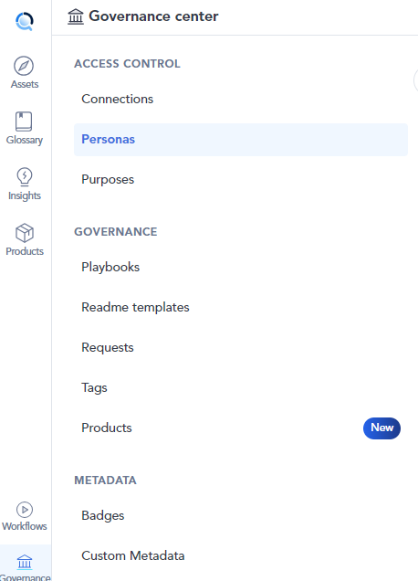{: style="height:450px"}

2. Click in `New Persona`

    

3. Add a name and decription and click in `Create`

    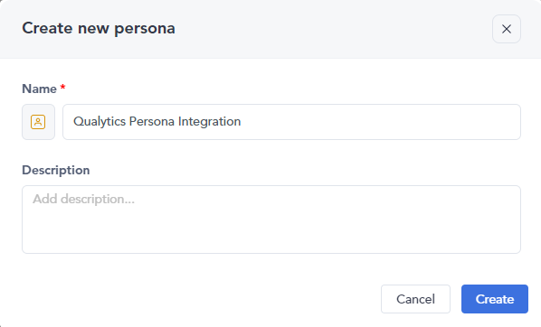

4. You will see a section similar to this

    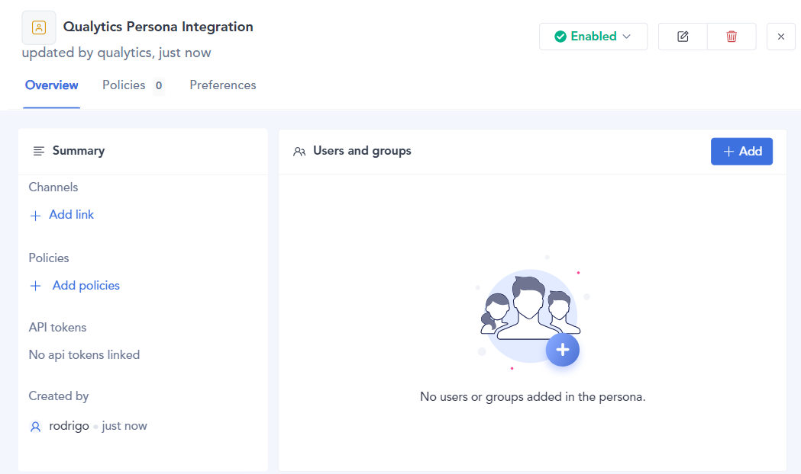

5. Click on `Add policies` to add a new policy or create one if none exists

    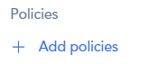

6. You will see the Policies section, click in `New Policy` and choose `Metadata policy`

    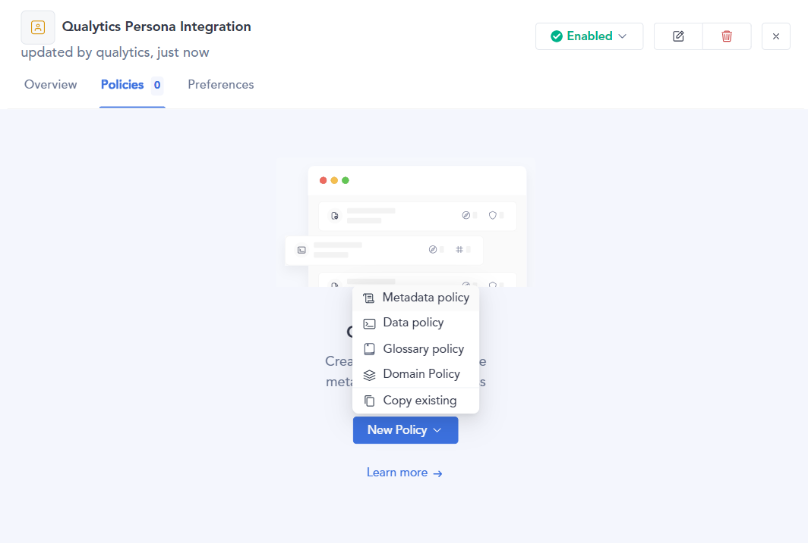

7. Type the name, select the connection, and customize the permissions and assets that will have Qualytics access

    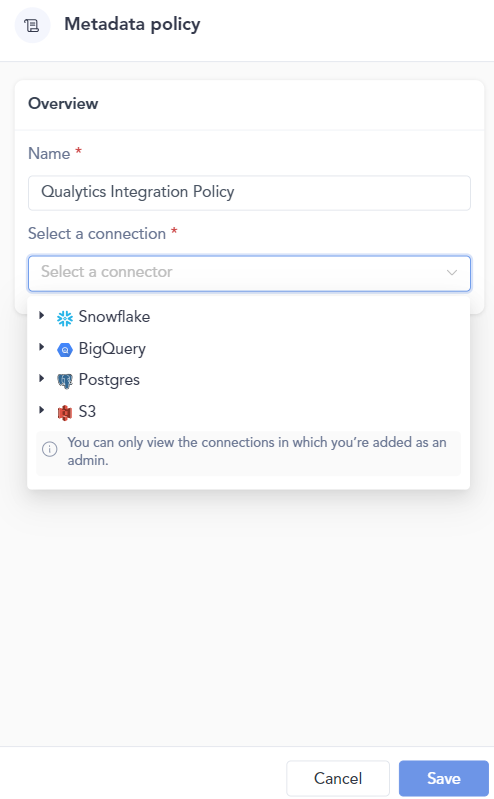{: style="height:450px"}

    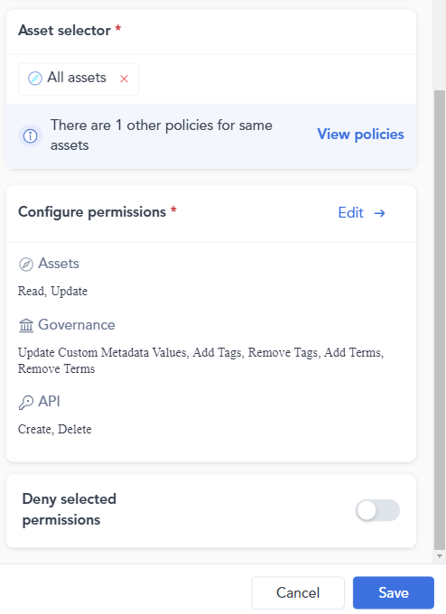{: style="height:450px"}

8. After the policy creation, you can see that it is now included in the `Policy` section

    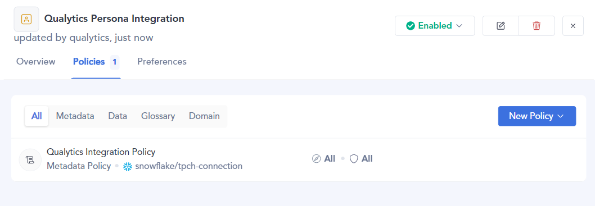

#### Creating an Atlan Personal Access Token

After creating the persona, you need to create a personal access token

1. Go to `API tokens` in Admin center

    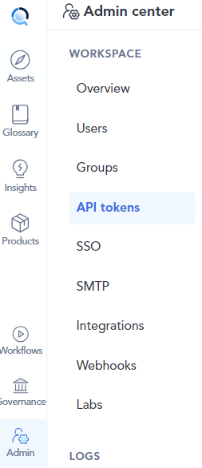{: style="height:450px"}

2. Click in `Generate API token`

    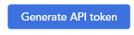

3. Add a name, description and the `Persona` you created before

    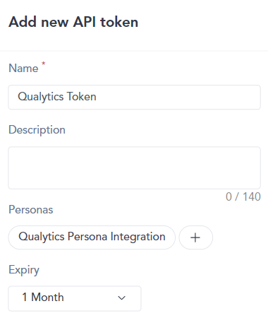

4. Click the `Save` button and store it in a secure location

    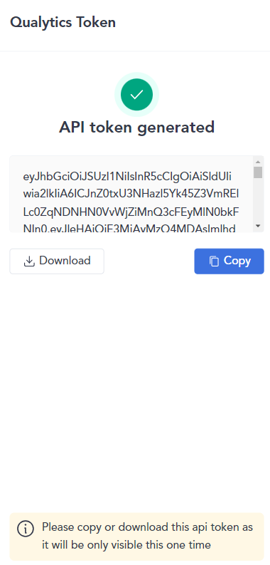{: style="height:450px"}

#### Creating the integration with Qualytics

1. Go to the settings section of Qualytics and select the `Integrations` tab

    
    
    
2. Click the `Add Integration` button

    

3. Give your new integration a descriptive name, select `Atlan` type, type the URL and the personal access token from the persona you created in Atlan

    
    

4. Click the `Save` button to create the Atlan integration. You will see the new integration created in Qualytics

    
    

#### Tag Syncing

During a sync, the Atlan integration pulls tags assigned to data assets in Atlan and assigns them as `external` tags on the corresponding assets in Qualytics. 

1. Click the Sync button and configure your desired settings
    
    

    
    

2. Wait for Qualytics to create external tags and assign them to the respective Qualytics assets

    
    

3. Check the logs to review the assets that were mapped from Atlan to Qualytics

    
    

4. After synchronization, the mapped assets will display an external tag
    
    a. Datastore

    
    

    b. Table

    
    

    c. Field
    
    
    

!!!note
    In order for a data asset's tags to be synchronized, the token you used when creating the Qualytics integration must have the appropriate permissions (ability to read tags from that asset) in Atlan.
    

### Qualytics push of Data Quality Metadata into Atlan

The integration also supports pushing data quality metadata from Qualytics into Atlan, including asset URLs, total scores, and detailed quality factor scores such as completeness, coverage, conformity, consistency, precision, timeliness, volume, and accuracy.
This will happen automatically for any data asset where appropriate permissions have been grated to the integration token.

#### Atlan Alerts and Announcements

After synchronization, Qualytics will issue Atlan `alerts` for tables where anomalies have been identified.

##### Alert in a table

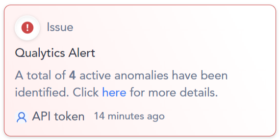

##### Recent Announcements on the Main Page

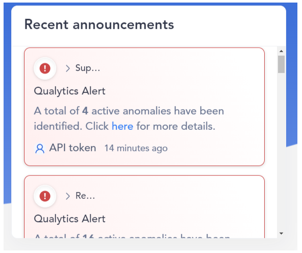

##### Qualytics Custom Metadata inside Atlan

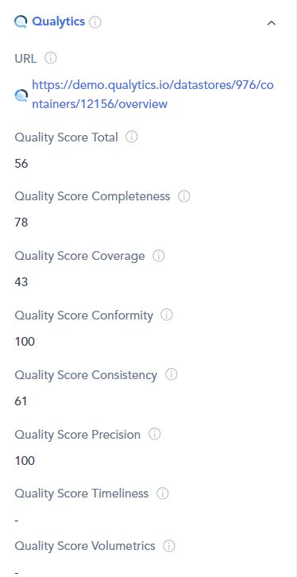

#### Table of custom metadata 

| Property Name                | Description |
|------------------------------|-------------|
| **URL**                      | Correspondent Qualytics asset URL |
| **Quality Score Total**      | The data quality score total |
| **Quality Score Completeness** | Required Fields are all populated with values |
| **Quality Score Coverage**     | Availability and uniqueness of expected records |
| **Quality Score Conformity**   | Alignment of the content to the required standards |
| **Quality Score Consistency**  | Values are the same for all copies and representations |
| **Quality Score Precision**    | Your data is of the expected defined resolution |
| **Quality Score Timeliness**   | Data is available when and where you expect it |
| **Quality Score Volumetrics**  | Data has the same size and shape across similar cycles |

### Alation Integration
- **Coming Soon**: Details about the integration with Alation will be added soon