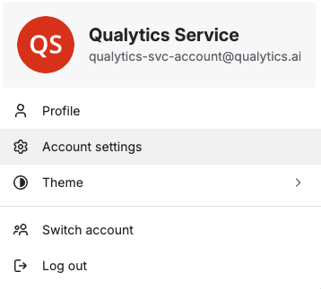
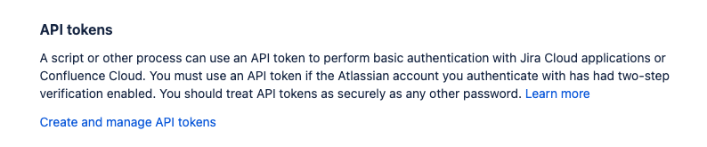
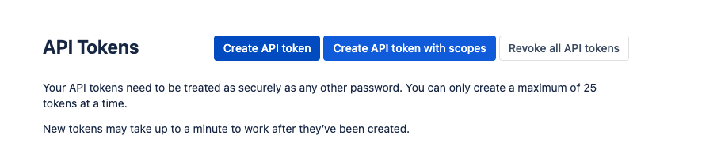
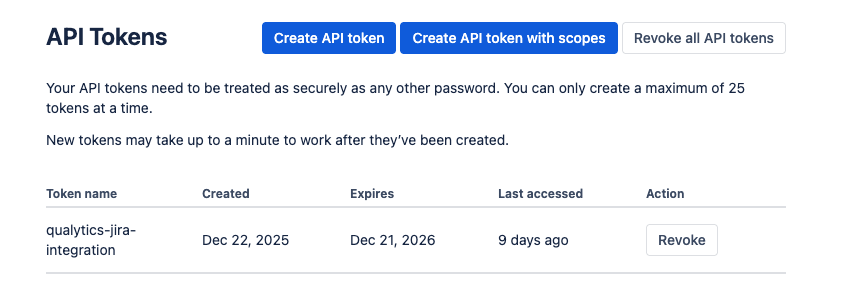
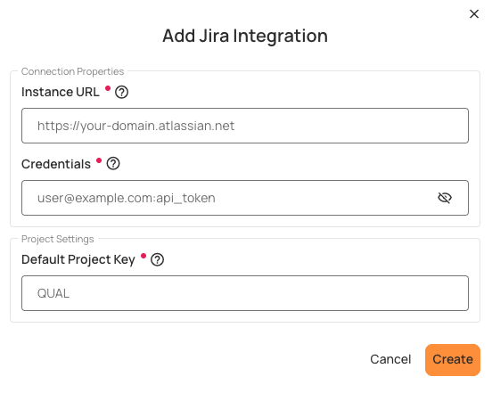
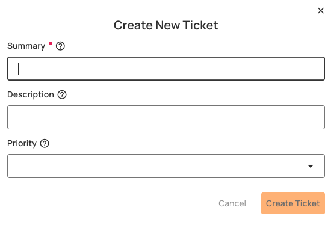
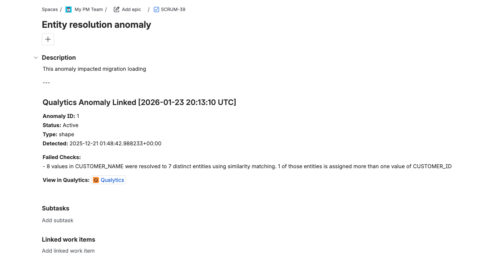
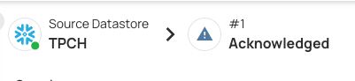

# Jira

The **Jira** integration enables data quality teams to create and link Jira issues directly from data anomalies detected in **Qualytics**. This streamlines the issue resolution workflow by eliminating the need to manually create tickets in Jira and then reference them back in Qualytics.


## Key Benefits

- **Create Issues Directly**: Create Jira issues directly from Qualytics anomalies without leaving the platform
- **Automatic Linking**: Automatic linking between anomalies and tickets for complete traceability
- **Bidirectional Navigation**: Hyperlink from Jira issue back to the source anomaly in Qualytics
- **Status Synchronization**: Anomaly status changes (acknowledge, archive) sync to Jira
- **Comment Syncing**: Comments added in Qualytics are pushed to Jira issue comments

!!! info "Integration Type"
    The current release supports **one-way synchronization** (Qualytics → Jira). Changes made directly in Jira (e.g., issue status changes, comments) are not reflected back in Qualytics at this time.

---

## Prerequisites

Before configuring the Jira integration, ensure the following requirements are met.

### Jira Requirements

| Requirement | Details |
|-------------|---------|
| **Jira Instance** | Active Jira Cloud or Jira Data Center instance |
| **Instance URL Format** | `https://your-domain.atlassian.net` (Cloud) or your Jira Data Center URL |
| **API Access** | REST API must be enabled for the instance |
| **Project Access** | User must have access to the target project(s) |

### Account Requirements

A Jira account with appropriate permissions is required for the integration. This account will be used by Qualytics to authenticate and create/update issues.

| Setting | Recommendation |
|---------|----------------|
| **Email** | The email address associated with your Jira account |
| **API Token** | A personal API token generated from Atlassian account settings |
| **Project Access** | Permission to create and edit issues in the target project(s) |

### Required Jira Permissions

Ensure your account has the following permissions in the target project(s):

| Permission | Purpose |
|------------|---------|
| **Browse Projects** | View project and its issues |
| **Create Issues** | Create new issues in the project |
| **Edit Issues** | Update issue fields and add comments |
| **Add Comments** | Add comments to issues |

---

## Jira Configuration

Complete the following steps in your Jira account before configuring the integration in Qualytics.

### Step 1: Access Account Settings

1. Log in to your Jira account
2. Click on your profile icon in the top-right corner
3. Select **Account settings** (or **Manage account**)



### Step 2: Navigate to Security Settings

1. In your account settings, click on the **Security** tab


### Step 3: Create an API Token

1. Scroll down to find **API token** section
2. Click on **Create and manage API tokens**



3. Click on **Create API token**



4. Enter a label for your token (e.g., `Qualytics Integration`)
5. Click **Create**


6. **Important**: Copy the generated API token immediately and store it securely. You won't be able to see it again.



### Step 4: Gather Configuration Values

Collect the following values needed for Qualytics configuration:

| Value | How to Find | Example |
|-------|-------------|---------|
| **Host URL** | Your Jira instance URL | `https://your-domain.atlassian.net` |
| **Credentials** | Email and API token combined with a colon | `user@company.com:your_api_token` |

---

## Qualytics Configuration

### Navigation to Integration

**Step 1:** Log in to your Qualytics account and click the **"Settings"** button on the left side panel of the interface.

**Step 2:** Click on the **Integrations** tab.

### Connect Jira Integration

**Step 1:** Click on the **Connect** button next to Jira to connect to the Jira Integration.

A modal window titled **"Add Jira Integration"** appears. Fill in the connection properties.



**Step 2:** Enter the following connection properties:

| REF. | Field | Description |
|------|-------|-------------|
| 1 | **Host** (Required) | Enter the complete Jira instance URL (e.g., `https://your-domain.atlassian.net`). Do not include a trailing slash. |
| 2 | **Credentials** (Required) | Enter the credentials in the format `email:api_token` (email and API token separated by a colon). For example: `user@company.com:your_api_token_here` |

!!! warning "Credentials Format"
    The credentials must be entered as `email:api_token` with a colon separator. Use your Jira account email and the API token you generated.

**Step 3:** Click the **Create** button to validate and store the credentials.

Once the integration is successfully created, a confirmation message will appear stating **"The Integration has been successfully created."**


### Test the Connection

After saving, the connection status should show as **Connected**. If you encounter errors, verify:

- Host URL is correct and includes `https://` (no trailing slash)
- Credentials are in the correct format (`email:api_token`)
- API token is valid and not expired
- Account has required permissions in Jira

---

## Integration Behavior & Data Flow

### Data Flow Direction

The current release supports one-way synchronization from Qualytics to Jira:

| Action in Qualytics | Result in Jira |
|---------------------|----------------|
| Create ticket from anomaly | New Issue created |
| Acknowledge anomaly | Comment added to issue with status change |
| Archive anomaly (resolve) | Comment added to issue with resolution status |
| Add comment to anomaly | Comment pushed to Jira issue |
| Link existing ticket | Association created (anomaly details added as comment) |

### What Gets Synced

| Direction | What | How | Status |
|-----------|------|-----|--------|
| Qualytics → Jira | New ticket | Creates issue with anomaly details | :white_check_mark: Active |
| Qualytics → Jira | Anomaly status change | Adds comment (doesn't change issue status) | :white_check_mark: Active |
| Qualytics → Jira | Anomaly comment | Adds comment | :white_check_mark: Active |
| Jira → Qualytics | Issue status | Not synced | :x: Not supported |
| Jira → Qualytics | Issue comments | Not synced | :x: Not supported |
| Jira → Qualytics | Issue closure | Not synced | :x: Not supported |

### Current Limitations

The following actions in Jira are **not** reflected in Qualytics:

| Action in Jira | Effect in Qualytics |
|----------------|---------------------|
| Change issue status (e.g., In Progress, Done) | Not reflected - anomaly status unchanged |
| Add comments | Not reflected - comments do not appear in Qualytics |
| Reassign issue | Not reflected |
| Close or resolve issue | Not reflected - anomaly remains in current state |

---

## Field Mapping Reference

### Issue Fields Supported

When creating a ticket from Qualytics, the following Jira issue fields can be populated:

| Field Name | Jira Field | Required | Notes |
|------------|------------|----------|-------|
| **Summary** | `summary` | Yes | Brief summary of the issue (ticket title) |
| **Description** | `description` | No | Detailed description; auto-populated with anomaly details |
| **Priority** | `priority` | No | Issue priority level |

### Auto-Populated Fields

The following information is automatically included when creating a ticket:

| Field | Auto-Populated Value |
|-------|----------------------|
| **Description** | Anomaly ID, type, status at detection, field/check message, failed checks, hyperlink back to Qualytics anomaly |
| **Comments (on updates)** | Status changes (acknowledge, archive) and comments from Qualytics with timestamps |

---

## Ticket Creation Workflow

### Creating a New Ticket from an Anomaly

**Step 1:** Navigate to a datastore in Qualytics

**Step 2:** Locate an anomaly you want to create a ticket for

**Step 3:** Click on the anomaly to open details

**Step 4:** Find the **"Linked Tickets"** section and click **"Add"** to link or create tickets


**Step 5:** A modal will appear with options to create a new ticket or link an existing one. Select **"New Ticket"**


**Step 6:** Fill in the required and optional fields:



| Field | Description |
|-------|-------------|
| **Summary** | Brief summary of the data quality issue (required) |
| **Description** | Detailed description (auto-populated with anomaly details) |
| **Priority** | Select the appropriate priority level |


**Step 7:** Click **Create** to submit the ticket

When the ticket is created, a link is established between the anomaly and the Jira issue. The issue description will contain the anomaly details, including:

- Anomaly ID and status
- Anomaly type and detection timestamp
- Failed checks information
- Direct link back to the anomaly in Qualytics



The linked ticket will appear in the anomaly's Linked Tickets section:


### Linking an Existing Ticket

If a ticket already exists in Jira, you can link it to an anomaly:

**Step 1:** Open the anomaly in Qualytics

**Step 2:** Click **"Add"** in the Linked Tickets section

**Step 3:** Select **"Link Existing"**

**Step 4:** Search by issue key or summary


**Step 5:** Select the matching issue to link

When linking an existing ticket:

- Anomaly details are added as a comment to the existing issue
- A link is established between the anomaly and the issue

!!! tip
    Multiple tickets can be linked to a single anomaly if needed.

### Viewing Linked Tickets

Once linked, tickets appear in the **"Linked Tickets"** section of the anomaly:


- Click **"View"** to open the ticket directly in Jira
- The issue key, status, and last sync timestamp are displayed

---

## Key Integration Operations

### Create Ticket

Creates a Jira issue from a Qualytics anomaly with:

- **Required fields:** `summary`
- **Optional fields:** `description`, `priority`
- **Auto-included:** Anomaly ID, status, type, failed checks, and link to Qualytics

### Link Existing Ticket

Links an existing Jira issue to an anomaly:

- Adds anomaly details as a comment to the existing issue
- Creates a link between the anomaly and the issue

### Sync Anomaly Status

When anomaly status changes in Qualytics:

- Adds a timestamped comment to the linked Jira issue
- Example: `[2024-01-15 10:30:00 UTC] Qualytics Anomaly Status: Acknowledged`

**Example:** Acknowledging an anomaly in Qualytics:



The status change is reflected in Jira as a comment:


!!! note
    Status changes add comments but do **not** change the issue's status. This preserves your Jira workflow control.

### Sync Comments

When comments are added to anomalies in Qualytics:

- The comment text is synced to linked tickets as Jira comments
- Example: `Comment from Qualytics: <user's comment>`

---

## API Reference

This section provides technical details for administrators and developers who need to understand the underlying API operations.

### Qualytics API Endpoints

For programmatic integration management, the following Qualytics API endpoints are available:

#### Ticketing Integration Endpoints

| Operation | Method | Endpoint | Description |
|-----------|--------|----------|-------------|
| Get Ticketing Form Specification | GET | `/api/integrations/ticketing/form-specification` | Get the form specification for creating tickets |
| Search Tickets | GET | `/api/integrations/ticketing/tickets/search` | Search for tickets in Jira |
| Get Ticket By Id | GET | `/api/integrations/ticketing/tickets/{ticket_id}` | Get a specific ticket by its ID |
| Create Ticket For Anomaly | POST | `/api/integrations/ticketing/anomalies/{anomaly_id}/tickets` | Create a new ticket linked to an anomaly |

#### Anomaly Ticket Link Endpoints

| Operation | Method | Endpoint | Description |
|-----------|--------|----------|-------------|
| Get Anomaly Ticket Links | GET | `/api/anomalies/{anomaly_id}/ticket-links` | Retrieve all ticket links for an anomaly |
| Create Anomaly Ticket Link | POST | `/api/anomalies/{anomaly_id}/ticket-links` | Create a new ticket link for an anomaly |
| Delete Anomaly Ticket Link | DELETE | `/api/anomalies/{anomaly_id}/ticket-links/{link_id}` | Delete a specific ticket link |

---

## Troubleshooting

### Common Issues

| Issue | Resolution |
|-------|------------|
| **Connection failed** | Verify host URL format (`https://your-domain.atlassian.net`), check credentials format (`email:api_token`), confirm account is active |
| **401 Unauthorized** | Incorrect credentials; verify the `email:api_token` format is correct and that API token is not expired |
| **403 Forbidden** | Account lacks required permissions; ensure user has access to the target project |
| **Project not found** | Verify the project key is correct and the user has access to the project |
| **Issue type not found** | Verify the issue type exists in the selected project |
| **Network timeout** | Firewall may be blocking; ensure Qualytics IPs are allowlisted |

### Getting Support

If you encounter issues not covered above, contact Qualytics support:

- **Email**: support@qualytics.co
- **Slack**: Your dedicated customer Slack channel

Please include: Host URL (masked if needed), error messages, and steps to reproduce.

---

## Appendix: Sample Payloads

### Create Ticket Request

When creating a ticket from Qualytics, the following request is sent:

```json
POST /api/integrations/ticketing/anomalies/{anomaly_id}/tickets

{
  "title": "summary of ticket",
  "description": "description of the ticket",
  "priority": "Medium"
}
```

### Create Ticket Response

```json
{
  "ticket": {
    "ticket_id": "10428",
    "ticket_number": "SCRUM-40",
    "title": "summary of ticket",
    "description": "description of the ticket\n ---\n Qualytics Anomaly Linked [2026-01-23 20:22:04 UTC] Anomaly ID: 1 Status: Acknowledged Type: shape Detected: 2025-12-21 01:48:42.988233+00:00\n Failed Checks: - 8 values in CUSTOMER_NAME were resolved to 7 distinct entities using similarity matching. 1 of those entities is assigned more than one value of CUSTOMER_ID\n View in Qualytics: https://your-qualytics-instance.qualytics.io/datastores/1/anomalies?id=1\n",
    "status": "Idea",
    "priority": "Medium",
    "urgency": null,
    "impact": null,
    "category": "Task",
    "subcategory": null,
    "created_at": "2026-01-23T15:22:05",
    "updated_at": "2026-01-23T15:22:05",
    "resolved_at": null,
    "closed_at": null,
    "assigned_to": null,
    "assigned_group": null,
    "requester": "User Name",
    "url": "https://your-domain.atlassian.net/browse/SCRUM-40",
    "comments_count": null,
    "metadata": {
      "project_key": "SCRUM",
      "issue_type": "Task"
    }
  },
  "anomaly_id": 1,
  "integration_id": 2,
  "message": "Ticket SCRUM-40 created and linked to anomaly 1"
}
```

### Search Tickets Response

```json
GET /api/integrations/ticketing/tickets/search?query=task

{
  "items": [
    {
      "ticket_id": "10002",
      "ticket_number": "SCRUM-3",
      "title": "Task 3",
      "description": null,
      "status": "To Do",
      "priority": null,
      "created_at": "2025-12-02T12:34:20",
      "updated_at": "2025-12-02T12:34:21",
      "assigned_to": null,
      "url": "https://your-domain.atlassian.net/browse/SCRUM-3"
    }
  ],
  "total": 1,
  "page": 1,
  "size": 50,
  "pages": 1
}
```
