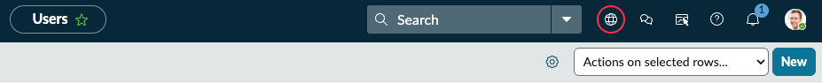
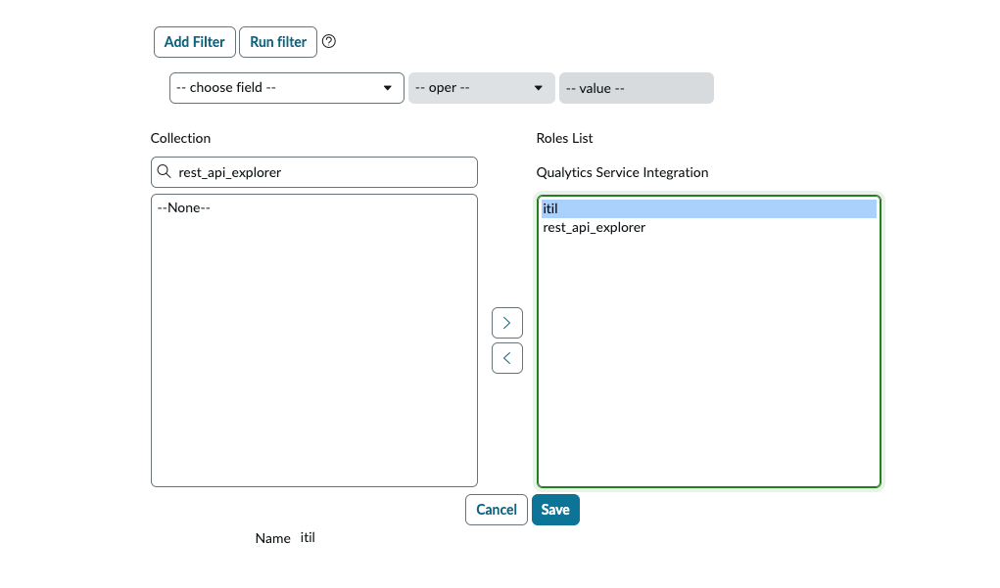
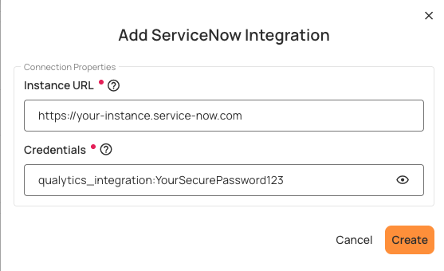
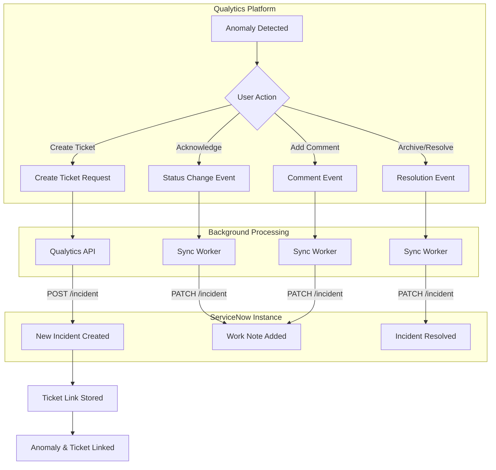
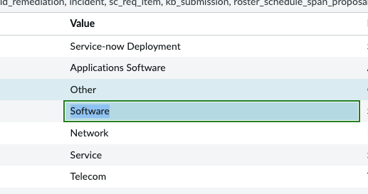
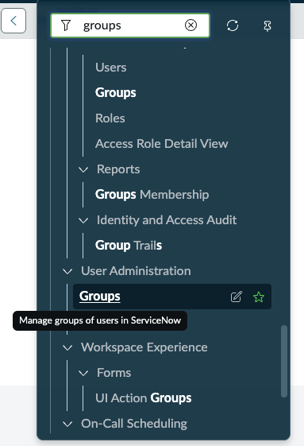

# ServiceNow

The **ServiceNow** integration enables data quality teams to create and link ServiceNow Incident tickets directly from data anomalies detected in **Qualytics**. This streamlines the issue resolution workflow by eliminating the need to manually create tickets in ServiceNow and then reference them back in Qualytics.


## Key Benefits

- **Create Incidents Directly**: Create ServiceNow Incidents directly from Qualytics anomalies without leaving the platform
- **Automatic Linking**: Automatic linking between anomalies and tickets for complete traceability
- **Bidirectional Navigation**: Hyperlink from ServiceNow ticket back to the source anomaly in Qualytics
- **Status Synchronization**: Anomaly status changes (acknowledge, archive) sync to ServiceNow
- **Comment Syncing**: Comments added in Qualytics are pushed to ServiceNow incident work notes

!!! info "Integration Type"
    The current release supports **one-way synchronization** (Qualytics → ServiceNow). Changes made directly in ServiceNow (e.g., ticket state changes, comments) are not reflected back in Qualytics at this time.

---

## Prerequisites

Before configuring the ServiceNow integration, ensure the following requirements are met.

### ServiceNow Requirements

| Requirement | Details |
|-------------|---------|
| **ServiceNow Instance** | Active ServiceNow instance accessible via HTTPS |
| **Instance URL Format** | `https://[instance-name].service-now.com` |
| **ITSM Module** | Incident Management module must be active |
| **API Access** | REST API must be enabled for the instance |
| **Network Access** | Qualytics cloud must be able to reach your ServiceNow instance (firewall/allowlist may be required) |

### Service Account Requirements

A dedicated service account is required for the integration. This account will be used by Qualytics to authenticate and create/update incidents.

| Setting | Recommendation |
|---------|----------------|
| **Username** | `qualytics_integration` or similar identifiable name |
| **Password** | Strong password, stored securely |
| **Web Service Access** | Enabled (check "Web service access only" if no UI login needed) |
| **Active Status** | Active (not locked or disabled) |

### Required ServiceNow Roles

Assign the following roles to the service account:

| Role | Purpose |
|------|---------|
| `itil` | Allows creation and modification of Incident records |
| `rest_api_explorer` (optional) | Useful for testing/troubleshooting API calls |

!!! note
    Additional roles may be required if your organization has custom access controls on the Incident table.

---

## ServiceNow Configuration

Complete the following steps in your ServiceNow instance before configuring the integration in Qualytics.

### Step 1: Create the Service Account

1. Navigate to **User Administration → Users**
2. Click **New** to create a new user



3. Enter the **User ID** (e.g., `qualytics_integration`)
4. Set a secure password
5. Check **"Web service access only"** if the account should not have UI access
6. Save the user record


7. Navigate to the **Roles** tab and assign the `itil` role



### Step 2: Verify API Access

Confirm that the REST API is enabled for your instance:

1. Navigate to **System Web Services → REST API Explorer**


2. Verify you can access the Incident table API
3. Test a simple GET request to confirm connectivity


4. Verify the response returns successfully


### Step 3: Network/Firewall Configuration

If your ServiceNow instance has IP restrictions, you may need to allowlist Qualytics IP addresses. Contact Qualytics support for the current list of egress IPs used by the Qualytics cloud platform.

### Step 4: Gather Configuration Values

Collect the following values needed for Qualytics configuration:

| Value | How to Find | Example |
|-------|-------------|---------|
| **Instance URL** | Your ServiceNow URL | `https://your-instance.service-now.com` |
| **Credentials** | Service account username and password combined with a colon | `qualytics_integration:YourPassword` |
| **Category Names** | Incident → Right-click Category → Show choice list | Software, Network |
| **Subcategory Names** | Same process, filter by Category | Email, Database |
| **Assignment Group SysID** | User Administration → Groups → Copy sys_id | `a1b2c3d4e5f6...` |

---

## Qualytics Configuration

### Navigation to Integration

**Step 1:** Log in to your Qualytics account and click the **"Settings"** button on the left side panel of the interface.

**Step 2:** Click on the **Integrations** tab.


### Connect ServiceNow Integration

**Step 1:** Click on the **Connect** button next to ServiceNow to connect to the ServiceNow Integration.

A modal window titled **"Add ServiceNow Integration"** appears. Fill in the connection properties.



**Step 2:** Enter the following connection properties:

| REF. | Field | Description |
|------|-------|-------------|
| 1 | **Instance URL** (Required) | Enter the complete ServiceNow instance URL (e.g., `https://your-instance.service-now.com`). Do not include a trailing slash. |
| 2 | **Credentials** (Required) | Enter the service account credentials in the format `username:password` (username and password separated by a colon). For example: `qualytics_integration:YourSecurePassword123` |

!!! warning "Credentials Format"
    The credentials must be entered as `username:password` with a colon separator. This format is used for Basic Authentication. OAuth 2.0 and HashiCorp Vault credential storage are planned for future releases.

**Step 3:** Click the **Create** button to validate and store the credentials.

Once the integration is successfully created, a confirmation message will appear stating **"The Integration has been successfully created."**


### Test the Connection

After saving, the connection status should show as **Connected**. If you encounter errors, verify:

- Instance URL is correct and includes `https://` (no trailing slash)
- Credentials are in the correct format (`username:password`)
- Service account has required roles
- Network connectivity allows Qualytics to reach ServiceNow

When the integration is created, Qualytics validates the connection by making a test request to the ServiceNow API (`GET /api/now/table/incident?sysparm_limit=1`).

---

## Integration Behavior & Data Flow

### Data Flow Direction

The current release supports one-way synchronization from Qualytics to ServiceNow:

| Action in Qualytics | Result in ServiceNow |
|---------------------|----------------------|
| Create ticket from anomaly | New Incident record created |
| Acknowledge anomaly | Incident work notes updated with status change |
| Archive anomaly (resolve) | Incident marked as Resolved |
| Add comment to anomaly | Comment pushed to Incident work notes |
| Link existing ticket | Association created (anomaly details appended to description) |

### Integration Flow Diagram

The following diagram illustrates how data flows from Qualytics to ServiceNow:



### What Gets Synced

| Direction | What | How | Status |
|-----------|------|-----|--------|
| Qualytics → ServiceNow | New ticket | Creates incident with anomaly details | :white_check_mark: Active |
| Qualytics → ServiceNow | Anomaly status change | Adds work note (doesn't change incident state) | :white_check_mark: Active |
| Qualytics → ServiceNow | Anomaly comment | Adds work note | :white_check_mark: Active |
| ServiceNow → Qualytics | Ticket status | Manual sync only (updates link status) | :warning: Limited |
| ServiceNow → Qualytics | Ticket comments | Not synced | :x: Not supported |
| ServiceNow → Qualytics | Ticket closure | Not synced | :x: Not supported |

### Current Limitations

The following actions in ServiceNow are **not** reflected in Qualytics:

| Action in ServiceNow | Effect in Qualytics |
|----------------------|---------------------|
| Change Incident state (e.g., In Progress, Resolved) | Not reflected - anomaly status unchanged |
| Add comments or work notes | Not reflected - comments do not appear in Qualytics |
| Reassign Incident | Not reflected |
| Close or cancel Incident | Not reflected - anomaly remains in current state |

---

## ServiceNow State Mappings

ServiceNow uses numeric state values for incidents. Understanding these states helps when working with the integration:

| State Code | State Name | Description |
|------------|------------|-------------|
| **1** | New | Incident has been created but not yet worked on |
| **2** | In Progress | Work is actively being done on the incident |
| **3** | On Hold | Incident is waiting for external input or resources |
| **6** | Resolved | The issue has been fixed/addressed |
| **7** | Closed | Incident is complete and verified |
| **8** | Canceled | Incident was canceled without resolution |

!!! info "One-Way State Updates"
    Qualytics does not automatically update anomaly status based on ServiceNow state changes. This design prevents synchronization loops and maintains clear ownership: ServiceNow is the "ticket of record" while Qualytics is the "anomaly of record."

---

## Field Mapping Reference

### Incident Fields Supported

When creating a ticket from Qualytics, the following ServiceNow Incident fields can be populated:

| Field Name | ServiceNow Field | Required | Notes |
|------------|------------------|----------|-------|
| **Short Description** | `short_description` | Yes | Brief summary of the issue |
| **Description** | `description` | No | Detailed description; auto-populated with anomaly details |
| **Priority** | `priority` | No | Values: Critical, High, Moderate, Low, Planning |
| **Urgency** | `urgency` | No | Standard ServiceNow urgency values |
| **Impact** | `impact` | No | Standard ServiceNow impact values |
| **Category** | `category` | No | Must match exact category name in ServiceNow |
| **Subcategory** | `subcategory` | No | Must match exact subcategory name |
| **Assignment Group** | `assignment_group` | No | Requires `sys_id` of the group (not name) |
| **Assigned To** | `assigned_to` | No | Username of the assignee |

### Auto-Populated Fields

The following fields are automatically populated by Qualytics when creating a ticket:

| Field | Auto-Populated Value |
|-------|----------------------|
| **Description (body)** | Anomaly ID, type, status at detection, field/check message, failed checks, hyperlink back to Qualytics anomaly |
| **Caller** | Currently uses service account (user-based caller not yet supported) |
| **Work Notes (on updates)** | Status changes (acknowledge, archive) and comments from Qualytics with timestamps |

### How to Find Category, Subcategory, and Assignment Group Values

#### Category / Subcategory

1. Open any existing Incident in ServiceNow
2. Right-click on the **Category** field
3. Select **"Show choice list"**


4. Copy the exact **Name** value (case-sensitive)



#### Assignment Group sys_id

1. Navigate to **User Administration → Groups**



2. Locate the desired group
3. Right-click on the group row
4. Select **"Copy sys_id"** and paste into Qualytics


!!! warning "Important"
    Category and Subcategory names are **case-sensitive** and must match exactly as they appear in ServiceNow. Assignment Group requires the `sys_id`, not the display name.

---

## Ticket Creation Workflow

### Creating a New Ticket from an Anomaly

**Step 1:** Navigate to a datastore in Qualytics

**Step 2:** Locate an anomaly you want to create a ticket for

**Step 3:** Click on the anomaly to open details

**Step 4:** Find the **"Linked Tickets"** section and click **"Add"** to link or create tickets


**Step 5:** A modal will appear with options to create a new ticket or link an existing one. Select **"New Ticket"**


**Step 6:** Fill in the required and optional fields:


| Field | Description |
|-------|-------------|
| **Short Description** | Brief summary of the data quality issue |
| **Description** | Detailed description (auto-populated with anomaly details) |
| **Priority** | Select the appropriate priority level |
| **Urgency** | Select the urgency level |
| **Impact** | Select the impact level |
| **Category** | Select or enter the category (must match ServiceNow exactly) |
| **Subcategory** | Select or enter the subcategory |
| **Assignment Group** | Enter the `sys_id` of the assignment group |


**Step 7:** Click **Create** to submit the ticket

When the ticket is created, a link is established between the anomaly and the ServiceNow incident. The incident in ServiceNow will contain the anomaly details in the description, including:

- Anomaly ID and status
- Anomaly type and detection timestamp
- Failed checks information
- Direct link back to the anomaly in Qualytics


### Linking an Existing Ticket

If a ticket already exists in ServiceNow, you can link it to an anomaly:

**Step 1:** Open the anomaly in Qualytics

**Step 2:** Click **"Add"** in the Linked Tickets section

**Step 3:** Select **"Link Existing"**

**Step 4:** Search by Incident number or short description


**Step 5:** Select the matching Incident to link

When linking an existing ticket:

- Anomaly details are appended to the existing incident description
- A work note is added documenting the linkage

!!! tip
    Multiple tickets can be linked to a single anomaly if needed.

### Viewing Linked Tickets

Once linked, tickets appear in the **"Linked Tickets"** section of the anomaly:


- Click **"View"** to open the ticket directly in ServiceNow
- The Incident number, status, and last sync timestamp are displayed

---

## Key Integration Operations

### Create Ticket

Creates a ServiceNow incident from a Qualytics anomaly with:

- **Required fields:** `short_description`, `description`, `priority`, `urgency`, `impact`
- **Optional fields:** `category`, `subcategory`, `assigned_to`, `assignment_group`
- **Auto-included:** Anomaly ID, status, type, failed checks, and link to Qualytics

### Link Existing Ticket

Links an existing ServiceNow incident to an anomaly:

- Appends anomaly details to the existing description
- Adds a work note about the linkage

### Sync Anomaly Status

When anomaly status changes in Qualytics:

- Adds a timestamped work note to the linked ServiceNow incident
- Example: `[2024-01-15 10:30:00 UTC] Qualytics Anomaly Status: Acknowledged`

**Example:** Acknowledging an anomaly in Qualytics:


The status change is reflected in ServiceNow as a work note:


!!! note
    Status changes add work notes but do **not** change the incident's state. This preserves ITSM workflow control.

### Sync Comments

When comments are added to anomalies in Qualytics:

- The comment text is synced to linked tickets as work notes
- Example: `Comment from Qualytics: <user's comment>`

---

## Supported Features & Capabilities

### Current Release Features

| Feature | Status |
|---------|--------|
| Create Incident from anomaly | :white_check_mark: Supported |
| Link existing Incident to anomaly | :white_check_mark: Supported |
| Link multiple tickets to one anomaly | :white_check_mark: Supported |
| Sync anomaly acknowledge to ServiceNow | :white_check_mark: Supported |
| Sync anomaly archive (resolve) to ServiceNow | :white_check_mark: Supported |
| Push comments to ServiceNow work notes | :white_check_mark: Supported |
| Hyperlink from ServiceNow back to Qualytics anomaly | :white_check_mark: Supported |
| Basic Authentication (username/password) | :white_check_mark: Supported |
| Search existing ServiceNow tickets | :white_check_mark: Supported |

### Known Limitations

| Feature | Status |
|---------|--------|
| Two-way sync (ServiceNow → Qualytics) | :x: Not yet supported |
| See ServiceNow ticket state changes in Qualytics | :x: Not yet supported |
| Drop-down fields populated from ServiceNow | :x: Manual entry required |
| Multiple ServiceNow instances | :x: Single instance only |
| Ticket types other than Incident (Defect, Enhancement, etc.) | :x: Incident only |
| Auto-populate caller from logged-in user | :x: Uses service account |
| OAuth 2.0 authentication | :x: Basic auth only |
| HashiCorp Vault credential storage | :x: Credentials stored in Qualytics |
| Automatic ticket creation from Flows | :x: Not yet available |

---

## API Reference

This section provides technical details for administrators and developers who need to understand the underlying API operations.

### Qualytics API Endpoints

For programmatic integration management, the following Qualytics API endpoints are available:

#### Ticketing Integration Endpoints

| Operation | Method | Endpoint | Description |
|-----------|--------|----------|-------------|
| Get Ticketing Form Specification | GET | `/api/integrations/ticketing/form-specification` | Get the form specification for creating tickets |
| Search Tickets | GET | `/api/integrations/ticketing/tickets/search` | Search for tickets in ServiceNow |
| Get Ticket By Id | GET | `/api/integrations/ticketing/tickets/{ticket_id}` | Get a specific ticket by its ID |
| Create Ticket For Anomaly | POST | `/api/integrations/ticketing/anomalies/{anomaly_id}/tickets` | Create a new ticket linked to an anomaly |

#### Anomaly Ticket Link Endpoints

| Operation | Method | Endpoint | Description |
|-----------|--------|----------|-------------|
| Get Anomaly Ticket Links | GET | `/api/anomalies/{anomaly_id}/ticket-links` | Retrieve all ticket links for an anomaly |
| Create Anomaly Ticket Link | POST | `/api/anomalies/{anomaly_id}/ticket-links` | Create a new ticket link for an anomaly |
| Delete Anomaly Ticket Link | DELETE | `/api/anomalies/{anomaly_id}/ticket-links/{link_id}` | Delete a specific ticket link |

---

## Troubleshooting

### Common Issues

| Issue | Resolution |
|-------|------------|
| **Connection failed** | Verify instance URL format (`https://your-instance.service-now.com`), check credentials format (`username:password`), confirm service account is active |
| **401 Unauthorized** | Incorrect credentials; verify the `username:password` format is correct and that account is not locked |
| **403 Forbidden** | Service account lacks required roles; add `itil` role |
| **Ticket created but missing fields** | Category/Subcategory names must match exactly (case-sensitive); verify names in ServiceNow choice list |
| **Assignment Group not set** | Must use `sys_id`, not group name; copy `sys_id` from User Administration → Groups |
| **Network timeout** | Firewall may be blocking; ensure Qualytics IPs are allowlisted |
| **Work notes not appearing** | Verify the service account has permission to add work notes to incidents |

### Getting Support

If you encounter issues not covered above, contact Qualytics support:

- **Email**: support@qualytics.co
- **Slack**: Your dedicated customer Slack channel

Please include: Instance URL (masked if needed), error messages, and steps to reproduce.

---

## Appendix: Sample Payloads

### Create Ticket Request

When creating a ticket from Qualytics, the following request is sent:

```json
POST /api/integrations/ticketing/anomalies/{anomaly_id}/tickets

{
  "title": "My ticket description",
  "priority": "3",
  "urgency": "3",
  "impact": "3"
}
```

### Create Ticket Response

```json
{
  "ticket": {
    "ticket_id": "7a62213283aef210f9e89780deaad366",
    "ticket_number": "INC0010006",
    "title": "My ticket description",
    "description": "## Qualytics Anomaly Linked [2026-01-23 19:51:23 UTC]\n\n**Anomaly ID:** 824\n**Status:** Acknowledged\n**Type:** record\n**Detected:** 2026-01-22 13:22:40.780346+00:00\n\n**Failed Checks:**\n- The field 'max_value' has a value that falls outside the declared limits\n\n**View in Qualytics:** https://your-qualytics-instance.qualytics.io/datastores/23/anomalies?id=824\n",
    "status": "New",
    "priority": "5",
    "urgency": "3",
    "impact": "3",
    "category": "inquiry",
    "subcategory": "",
    "created_at": "2026-01-23T19:51:24",
    "updated_at": "2026-01-23T19:51:24",
    "resolved_at": null,
    "closed_at": null,
    "assigned_to": null,
    "assigned_group": null,
    "requester": null,
    "url": "https://your-instance.service-now.com/nav_to.do?uri=incident.do?sys_id=7a62213283aef210f9e89780deaad366",
    "comments_count": null,
    "metadata": {
      "work_notes": "",
      "close_notes": ""
    }
  },
  "anomaly_id": 824,
  "integration_id": 1,
  "message": "Ticket INC0010006 created and linked to anomaly 824"
}
```

### Search Tickets Response

```json
GET /api/integrations/ticketing/tickets/search?query=shared+folder

{
  "items": [
    {
      "ticket_id": "57af7aec73d423002728660c4cf6a71c",
      "ticket_number": "INC0009009",
      "title": "Unable to access the shared folder.",
      "description": "Unable to access the shared folder. Please provide access.",
      "status": "Unknown (New)",
      "priority": "4 - Low",
      "created_at": "2018-08-30T01:06:52",
      "updated_at": "2018-12-12T23:30:24",
      "assigned_to": null,
      "url": "https://your-instance.service-now.com/nav_to.do?uri=incident.do?sys_id=57af7aec73d423002728660c4cf6a71c"
    }
  ],
  "total": 1,
  "page": 1,
  "size": 50,
  "pages": 1
}
```
