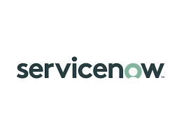

# Ticketing Integrations

The **Qualytics** platform integrates with enterprise ticketing systems to help teams track and resolve data quality issues using their existing issue and incident management workflows.

These integrations enable teams to:

- Track and manage data quality issues within familiar ticketing tools  
- Create tickets from data quality failures for investigation and resolution  
- Assign ownership and monitor progress using standard workflows  
- Align data quality remediation with existing operational processes  
- Maintain visibility into data quality issues alongside other work items  

This approach helps make data quality management a natural extension of your team’s established workflows rather than a separate process to manage.

## Available Integrations

**Qualytics** currently supports the following ticketing integrations:

### Jira

Integrate **Qualytics** with **Jira** to create and manage issues related to data quality failures. This allows teams to triage, assign, and track resolution progress using their existing Jira workflows.

For more details, refer to the [Jira integration](jira.md){target="_blank"} documentation.

### ServiceNow

Connect **Qualytics** with ServiceNow to route data quality incidents into your IT service management processes. This helps organizations handle data quality issues using established ServiceNow incident and change management workflows.

For more details, refer to the [ServiceNow integration](servicenow.md){target="_blank"} documentation.

