# Directory Sync

Directory Sync, also known as User and Group Provisioning, automates the synchronization of users and groups between your identity provider (IDP) and the Qualytics platform. This ensures that your user data is consistent across all systems, improving security and reducing the need for manual updates.

## Directory Sync Overview

Directory Sync automates the management of users and groups by synchronizing information between an identity provider (IDP) and your application. This ensures that access permissions, user attributes, and group memberships are consistently managed across platforms, eliminating the need for manual updates.

### **How Directory Sync Works with SCIM**

SCIM is an open standard protocol designed to simplify the exchange of user identity information. When integrated with Directory Sync, SCIM automates the creation, updating, and de-provisioning of users and groups. SCIM communicates securely between the IDP and your platform’s API using OAuth tokens to ensure only authorized actions are performed.

### General Setup Requirements

To set up Directory Sync, the following are required:

* Administrative access to both the identity provider and Qualytics platform  
* A SCIM-enabled identity provider or custom integration  
* The OAuth client set up in your IDP  
* SCIM URL and OAuth Bearer Token generated from the Qualytics platform

## Getting Started

### Prerequisites for Setting Up Directory Sync

Before setting up Directory Sync, ensure you have the following:

* A SCIM-supported identity provider  
* Administrative privileges for both your IDP and Qualytics  
* A SCIM URL and OAuth Bearer Token, which will be generated from your Qualytics instance

### Quick Start Guide

1. Set up an OAuth client in your IDP.  
2. Configure the SCIM endpoints with the SCIM URL and OAuth Bearer Token.  
3. Assign users and groups to provision in the IDP.  
4. Monitor the synchronization to ensure proper operation.

## What is SCIM?

SCIM is a standardized protocol used to automate the exchange of user identity information between IDPs and service providers. Its goal is to simplify the process of user provisioning and management.

SCIM improves efficiency by automating user lifecycle management (creation, updating, and de-provisioning) and ensures that data remains consistent across platforms. It also enhances security by minimizing manual errors and ensuring proper access control.

SCIM includes endpoints that are configured within your IDP and your platform. It uses OAuth tokens for secure communication between the IDP and the Qualytics API, ensuring that only authorized users can manage identity data.

## Benefits of Using SCIM for User and Group Provisioning

By leveraging **SCIM (System for Cross-domain Identity Management)**, Directory Sync simplifies user management with:

* Automated user provisioning and de-provisioning  
* Reduced manual intervention, improving efficiency and security  
* Real-time updates of user data, ensuring accuracy and compliance
* Support for scaling user management across organizations of any size

**Supported Providers**

Our API supports SCIM 2.0 (System for Cross-domain Identity Management) as defined in RFC 7643 and RFC 7644. It is designed to ensure seamless integration with any SCIM-compliant identity management system, supporting standardized user provisioning, de-provisioning, and lifecycle management. Additionally, we have verified support with the following providers:

* **Microsoft Entra (Azure Active Directory)**  
* **Okta**  
* **OneLogin**  
* **JumpCloud**

**Unsupported Providers**

We do not support **Google Workspace**, as it does not offer SCIM support. Organizations using Google Workspace must use alternate methods for user provisioning.

## Providers

## 1. Microsoft Entra

### Creating an App Registration

**Step 1:** Log in to the Microsoft Azure Portal, and select **“Microsoft Entra ID”** from the main menu.

**Step 2:** Click on **“Enterprise Applications”** from the left navigation menu.

**Step 3:** If your application is already created, choose it from the list and move to the section [Configuring SCIM Endpoints](#configuring-scim-endpoints). If you haven't created your application yet, click on the **New Application** button.

**Step 4:** Click on the **“Create your own application”** button to create your application.

**Step 5:** Give your application a name (e.g., "Qualytics OAuth Client" or "Qualytics SCIM Client").

**Step 6:** After entering the name for your application, click the **Create** button to finalize the creation of your app.

#### Configuring SCIM Endpoints

**Step 1:** Click on **Provisioning** from the left-hand menu.

**Step 2:** A new window will appear, click on the **Get Started** button.

**Step 3:** In the **Provisioning Mode** dropdown, select **“Automatic”** and enter the following details in the **Admin Credentials** section:

1. **Provisioning Mode**: Select **Automatic**.

2. **Tenant URL:**  `https://your-domain.qualytics.io/api/scim/v2` 

3. **Secret Token:** Generate this token from the Qualytics UI when logged in as an admin user. For more information on how to generate tokens in Qualytics, refer to the documentation on [Tokens](https://userguide.qualytics.io/settings/tokens/overview-of-tokens/).

**Step 4:** Click on the **Test Connection** button to test the connection to see if the credentials are correct.

**Step 5:** Expand the **Mappings** section and enable your app to enable group and user attribute mappings. The default mapping should work.

**Step 6:** Expand the Settings section and make the following changes:

1. Select **Sync only assigned users and groups** from the **Scope** dropdown.  
2. Confirm the **Provisioning Status** is set to **On.**

**Step 7:** Click on the **Save** to save the credentials. Now you've successfully configured the Microsoft Entra ID SCIM API integration.

### Assigning Users and Groups for Provisioning

**Step 1:** Click on the **Users and groups** from the left navigation menu and then click **Add user/group**.

**Step 2:** Click on the **None Selected** under the Users and Groups.

**Step 3:** From the right side of the screen, select the users and groups you want to assign to the app.

**Step 4:** Once you selected the group and users for your app, click the **“Select”** button.

**Step 5:** Click on the **Assign** button to assign the users and groups to the application.

!!! warning 
    When you assign a group to an application, only users directly in the group will have access. The assignment does not cascade to nested groups.

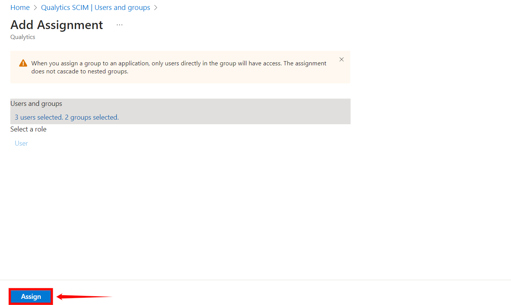

## 2. Okta

###  Setting up the OAuth Client in Okta

**Step 1**: Log in to your Okta account using your administrator credentials. From the left-hand navigation menu, click **Applications**, then select **Browse App Catalog**.

**Step 2**: In the search bar, type **SCIM 2.0 Test App (OAuth Bearer Token)**, and select the app called **SCIM 2.0 Test App (OAuth Bearer Token)** from the search results.

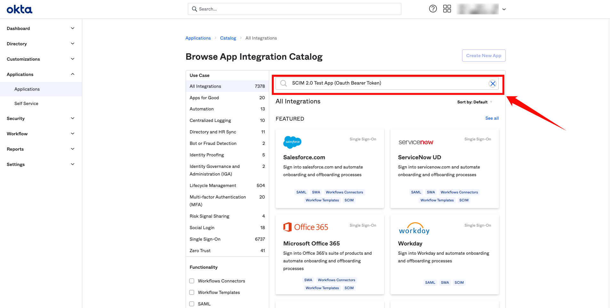

**Step 3**: On the app’s details page, click **Add Integration**.

**Step 4**: Enter a name for your application (e.g., "Qualytics SCIM Client").

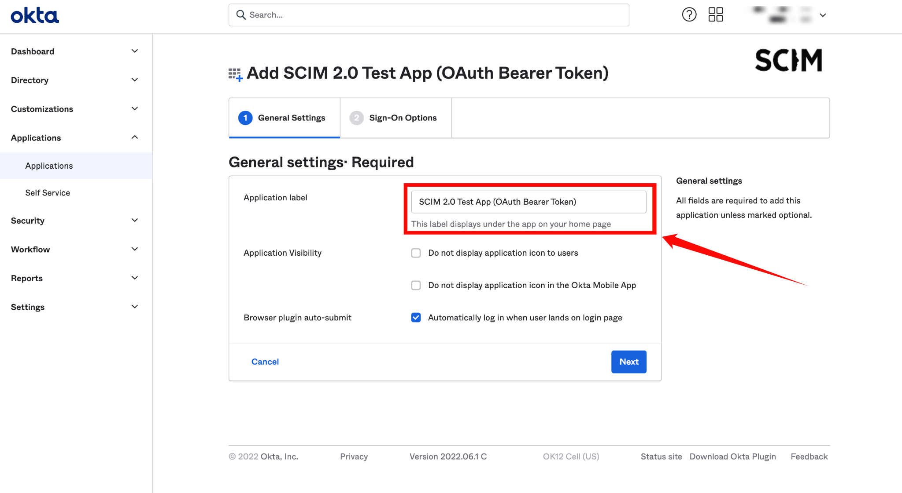

**Step 5:** Click on the **Next** button.

### Configuring SCIM Endpoints

**Step 1**: In the newly created app, go to the **Provisioning** tab and click **Configure API Integration**.

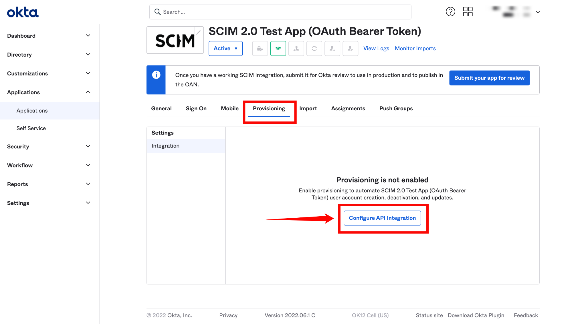

**Step 2**: Check the box labeled **Enable API Integration**, and enter the following details:

* **SCIM 2.0 Base URL:**  `https://your-domain.qualytics.io/api/scim/v2`  

* **OAuth Bearer Token:** Generate this token from the Qualytics UI when logged in as an admin user. For more information on how to generate tokens in Qualytics, refer to the documentation on [Tokens](https://userguide.qualytics.io/settings/tokens/overview-of-tokens/).

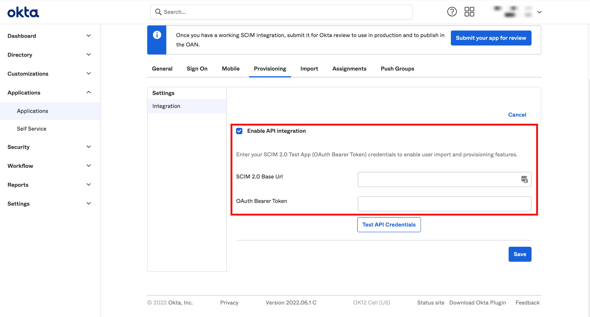

**Step 3**: Click **Test API Credentials** to verify the connection. Once the credentials are validated, click **Save**.

**Step 4**: A new settings page will appear. Under the **To App** section, enable the following settings:

* **Create Users**  
* **Update User Attributes**  
* **Deactivate Users**

After enabling these settings, your Okta SCIM API integration is successfully configured.

### Assigning users for provisioning

**Step 1:** Click the **Assignments** tab and select **Assign to People** from the dropdown **Assign**.

**Step 2:** Select the users you want to assign to the app and click the **Assign** button.

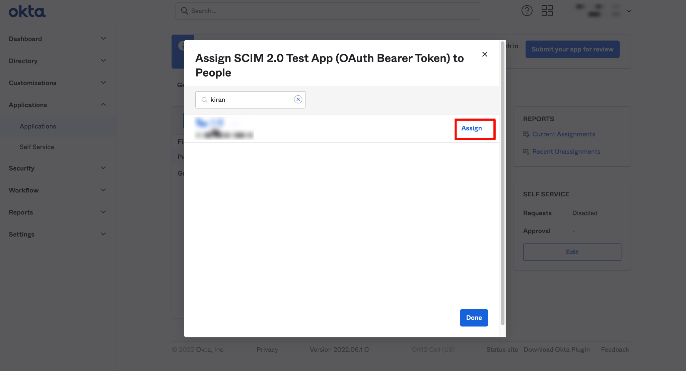

**Step 3:** After you click the **Assign** button, you'll see a new popup window with various fields. Confirm the field values and click the **Save and Go Back** buttons.

### Assigning groups for provisioning

**Step 1:** Navigate to the tab **Push Groups** and select **Find group by name** from the dropdown Push **Groups**.

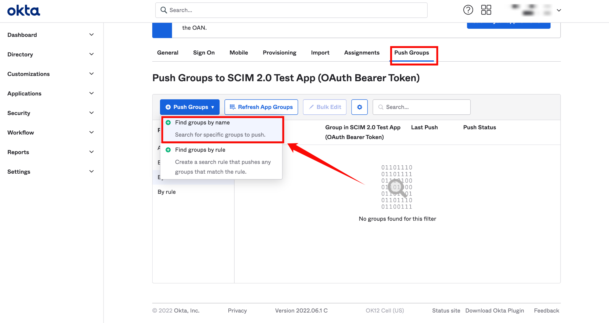

**Step 2:** Search for the group you want to assign to the app.

**Step 3:** After assigning the group name, then click on the **Save** button.

## 3. OneLogin

### Setting up the OAuth Client in OneLogin

**Step 1**: Log in to your OneLogin account using your administrator credentials. From the top navigation menu, click **Applications**, then select **Add App**.

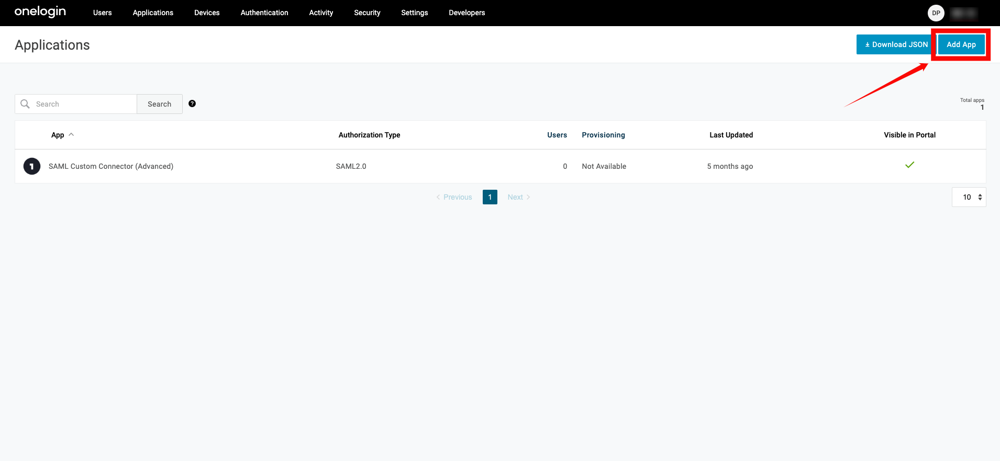

**Step 2**: In the search bar, type **SCIM** and select the app called **SCIM Provisioner with SAML (SCIM V2 Enterprise)** from the list of apps.

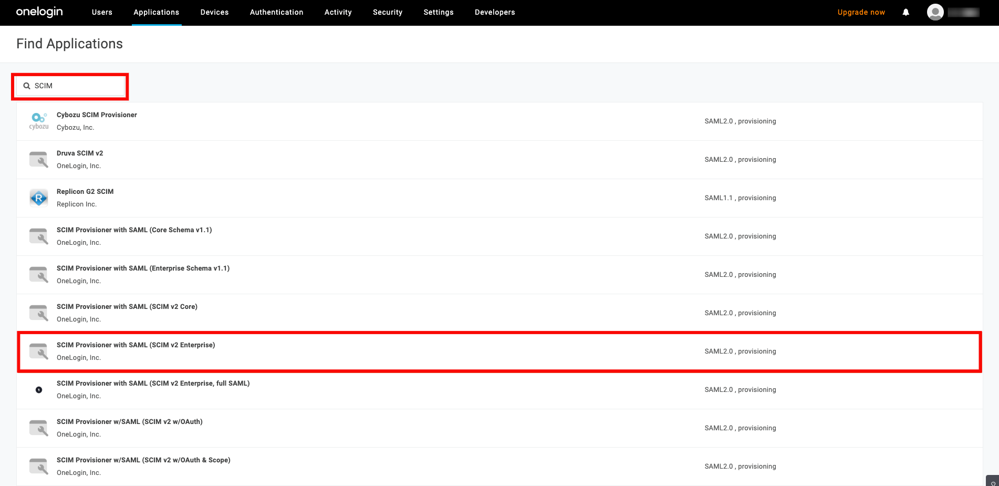

**Step 3**: Enter a name for your app, then click **Save**. You have successfully created the SCIM app in OneLogin.

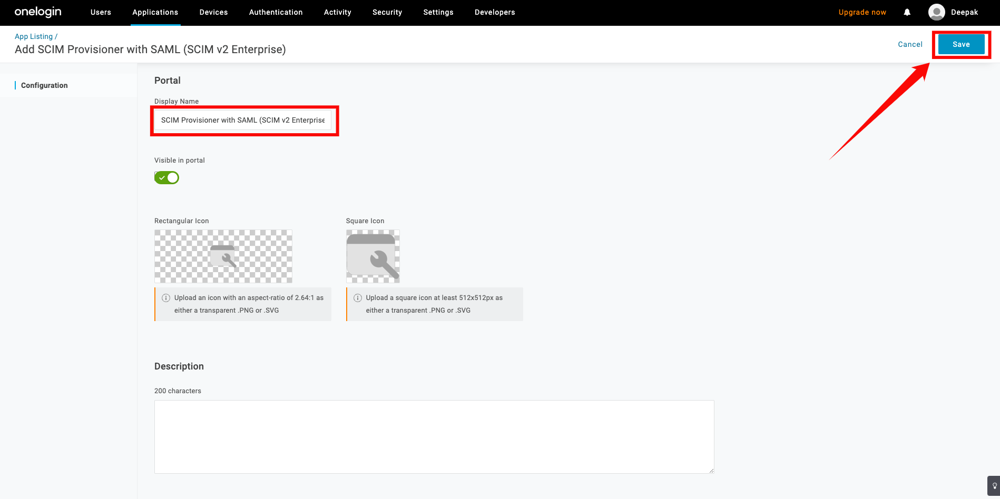

### Configuring SCIM Endpoints

**Step 1**: In your created application, navigate to the **Configuration** tab on the left and enter the following information:

* **API Status**: Enable the API status for the integration to work properly. 

* **SCIM Base URL:**  `https://your-domain.qualytics.io/api/scim/v2` 

* **SCIM Bearer Token:** Generate this token from the Qualytics UI when logged in as an admin user. For more information on how to generate tokens in Qualytics, refer to the documentation on [Tokens](https://userguide.qualytics.io/settings/tokens/overview-of-tokens/).

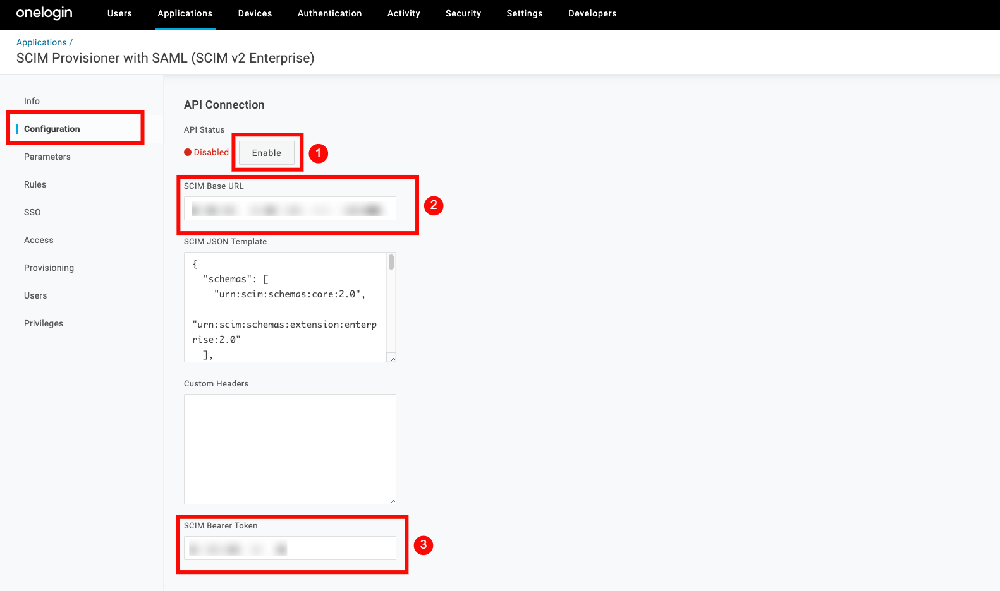

**Step 2**: Click on the **Save** button to store the credentials.

**Step 3**: Navigate to the **Provisioning** tab, and check the box labeled **Enable Provisioning**.

**Step 4:** Click on **Save** to apply the changes.

**Step 5**: Navigate to the **Parameters** tab and select the row for **Groups**.

**Step 5**: A popup window will appear, check the box **Include in User Provisioning**, then click the **Save** button.

### Assigning Users for Provisioning

**Step 1**: To assign users to your app, go to **Users** from the top navigation menu, and select the user you want to assign to the app.

From the User page, click the **Applications** tab on the left, and click the **+ (plus)** sign.

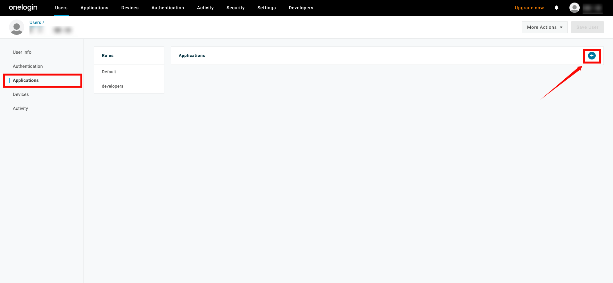

**Step 3**: A popup window will show a list of apps. Select the app you created earlier and click **Continue**.

**Step 4**: A new modal window will appear, click on the **Save** to confirm the assignment.

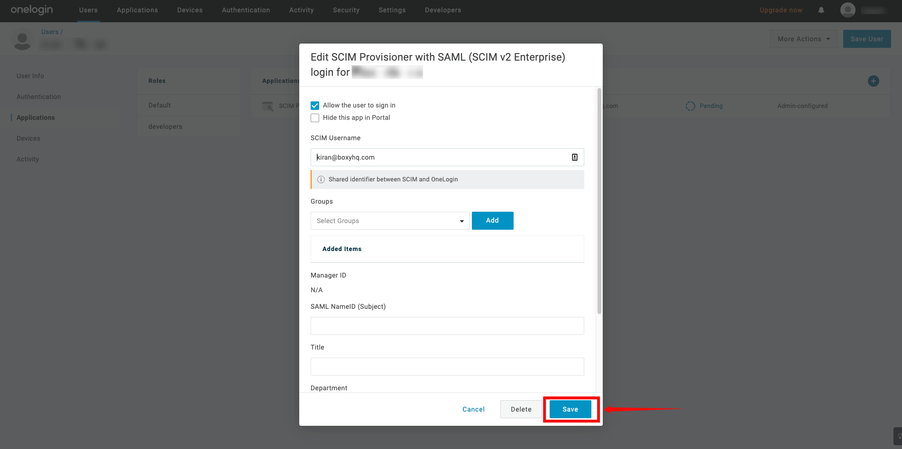

**Step 5**: If you see the status **Pending** in the table, click that text. A modal window will appear, where you can click **Approve** to confirm the assignment.

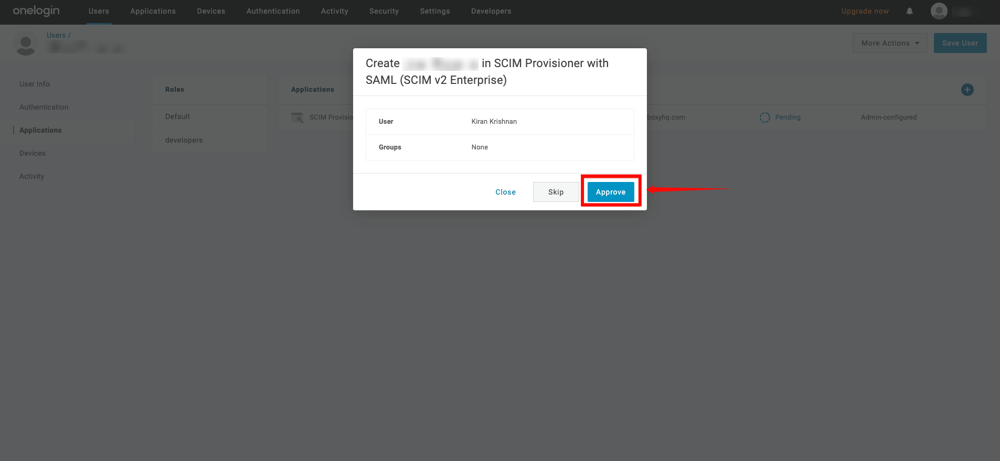

### Assigning Groups for Provisioning

**Step 1:** To push groups to your app, go to the top navigation menu, click **Users**, select **Roles** from the dropdown, and click **New Role** to create the role.

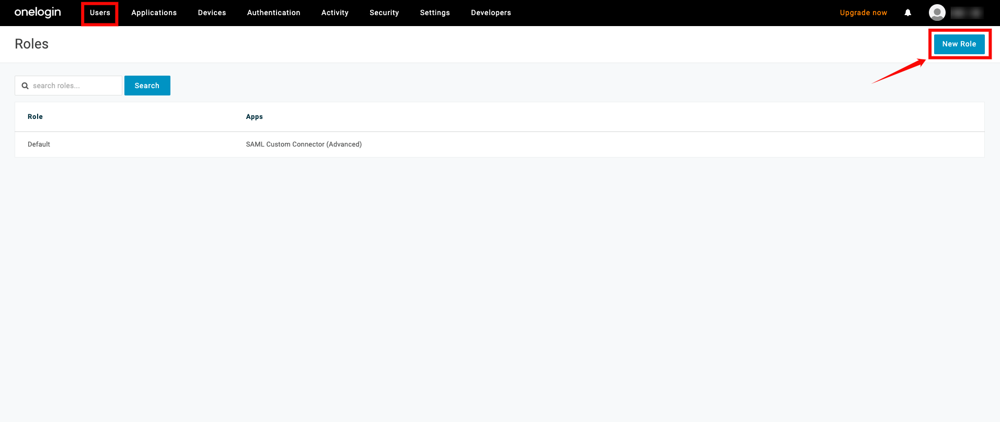

**Step 2**: Enter a name for the role, select the app you created earlier

**Step 3:** Click on the **“Save”** button.

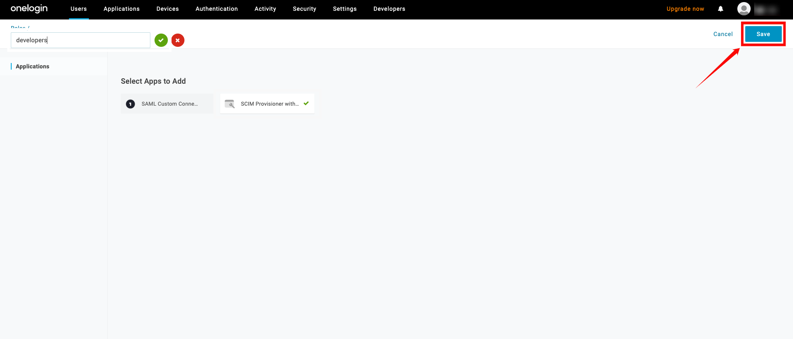

**Step 4**: Click the **Users** tab for the role and search for the user you want to assign to the role.

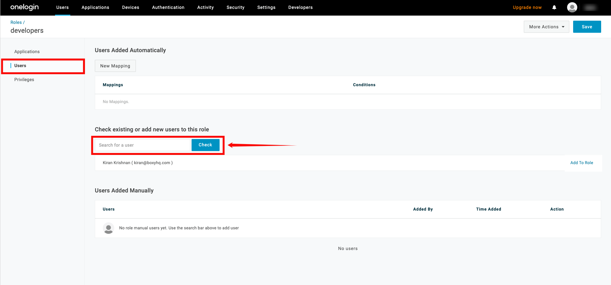

**Step 5:** Click the **Add To Role** button to assign the user, then click **Save** to confirm the assignment.

**Step 6:** A modal window will appear, click on the **“Save”** button to confirm the assignment.

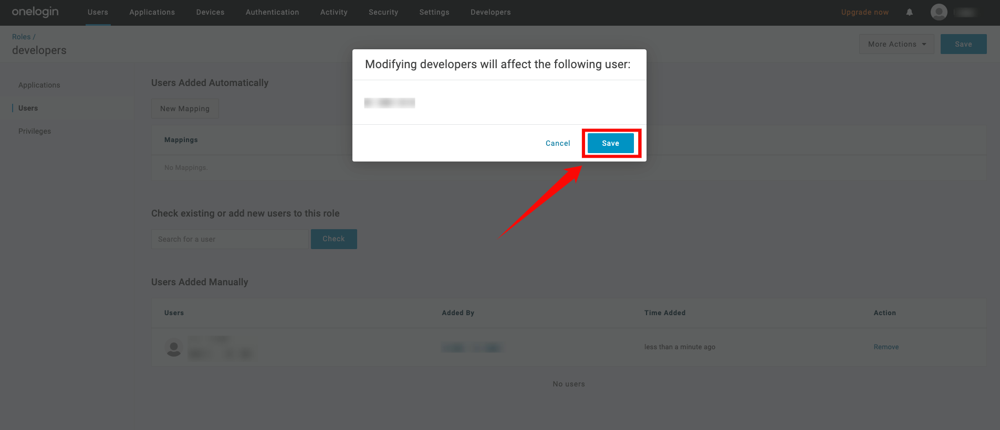

**Step 7**: Go back to your app and click the **Rule** tab on the left and click the **Add Rule** button.

Give the rule a name. Under the **Actions**, select the **Set Groups in your-app-name** from the dropdown, then select each **role** with values that match **your-app-name**.

**Step 8:** Click on the **Save** button.

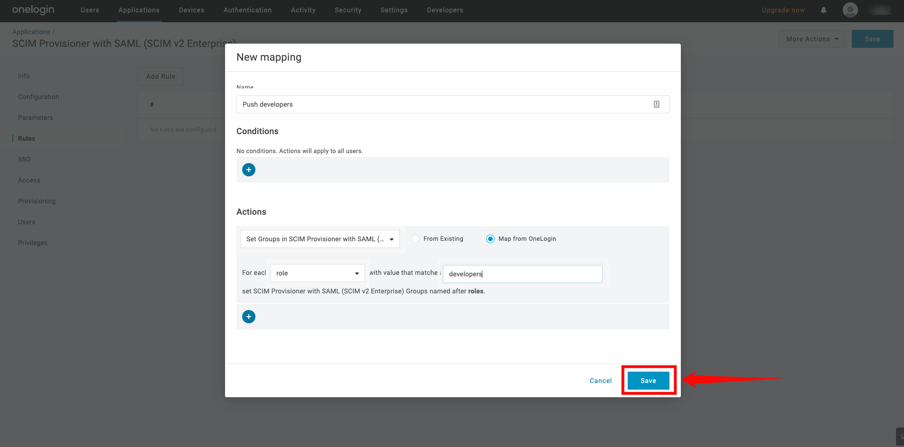

**Step 9**: Click on the **Users** tab on the left, you may see **Pending** under the provisions state. Click on it to approve the assignment.

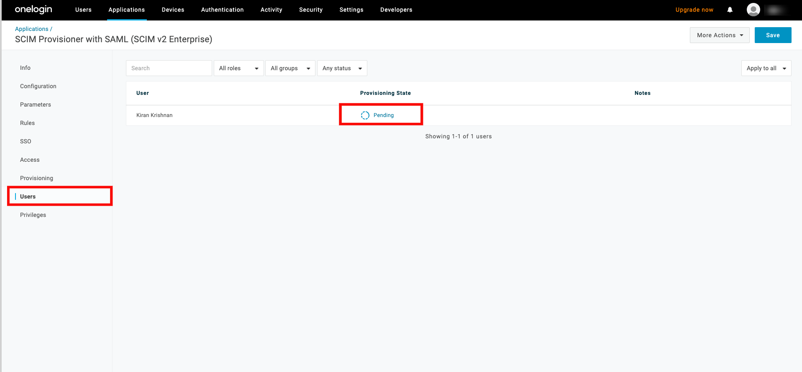

**Step 10**: A modal window will appear, click on the **Approve** to finalize the assignment.

## 4. JumpCloud

### Configuring SCIM Endpoints

JumpCloud supports SCIM provisioning within an existing SAML application. Follow these steps to configure SCIM provisioning:

**Step 1**: Log in to JumpCloud and either choose an existing SAML application or create a new one. From the left navigation menu, click **SSO** and select your **Custom SAML App.**

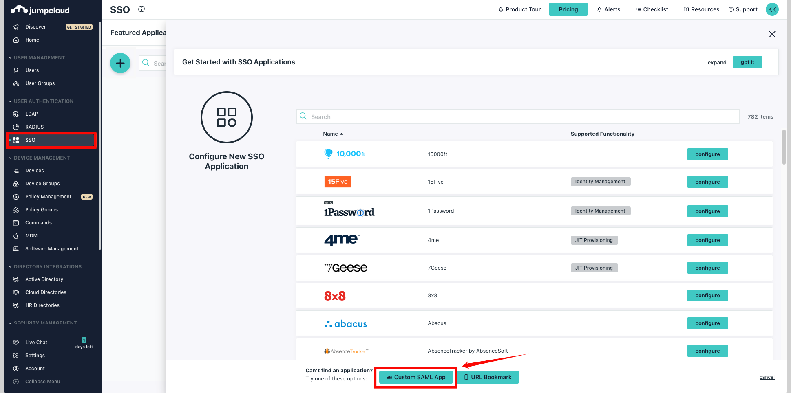

**Step 2**: Click on the tab **Identity Management** within your SAML application.

Under the **SCIM Version**, choose **SCIM 2.0** and enter the following information:

1. **Base URL:** `https://your-domain.qualytics.io/api/scim/v2`

2. **Token Key:** Generate this token from the Qualytics UI when logged in as an admin user. For more information on how to generate tokens in Qualytics, refer to the documentation on [Tokens](https://userguide.qualytics.io/settings/tokens/overview-of-tokens/).  

3. **Test User Email**

**Step 4**: Click **Test Connection** to ensure the credentials are correct, then click **Activate** to enable SCIM provisioning.

**Step 5**: Click **Save** to store your settings. Once saved, SCIM provisioning is successfully configured for your JumpCloud SAML application.

## Assigning Users for Provisioning

**Step 1**: Click the tab **User Groups** within your SAML application. You can see all the available groups, select the groups you want to sync, and click **Save**.

If no existing groups are available, click User Groups from the left navigation menu and click on the plus **(+)** icon to create a new group.

**Step 2**: Select the Users tab and choose the users you want to assign to the group.

**Step 3**: Select the **Applications** tab and choose the app you want to assign the group to.

