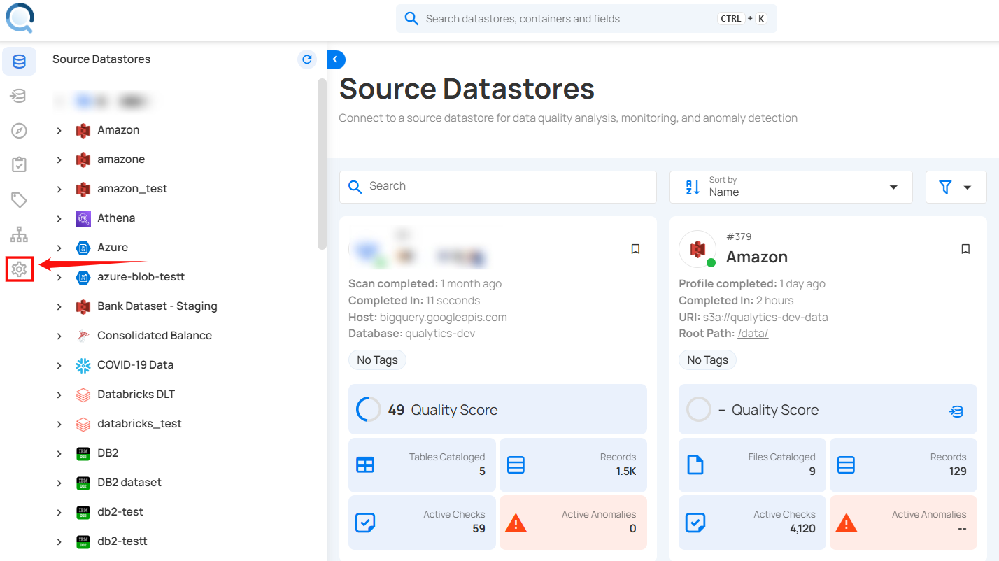
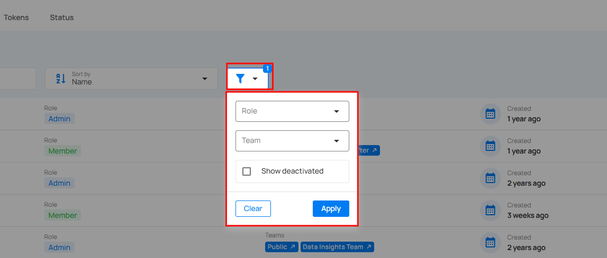
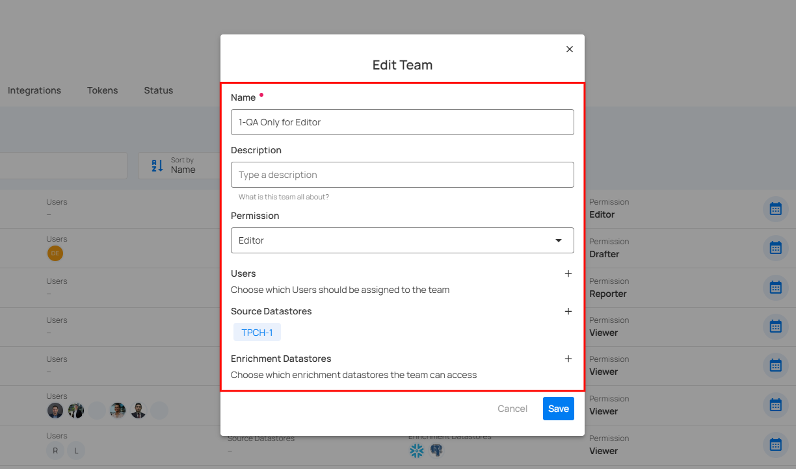
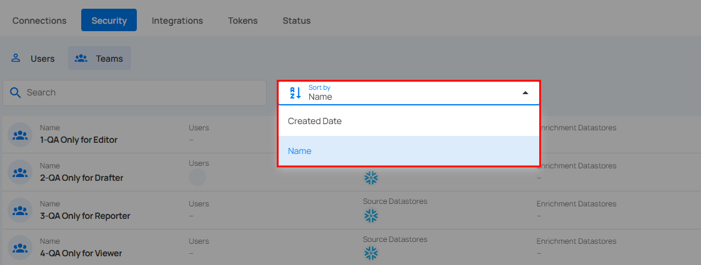

# Security

You can easily manage user and team access by assigning roles and permissions within the system. This includes setting up specific access levels and roles for different users and teams. By doing so, you ensure that data and resources are accessed securely and appropriately, with only authorized individuals and groups having the necessary permissions to view or modify them. This helps maintain the integrity and security of your system.

!!! note 
    Only users with the Admin role have the authority to manage global platform settings, such as user permissions and team access controls.

Let’s get started 🚀

## Navigation to Security

**Step 1**: Log in to your Qualytics account and click the **Settings** button on the left side panel of the interface. 



**Step 2**: By default, you will be navigated to the **Tags** section. Click on the **Security** tab.


## User Roles

In Qualytics, every user is assigned a role: ```Admin```,```Manager``` or ```Member```. Admins have the ability to edit any User selected from the user listing and change that User's role.  

- **Admin**: Admin users have full access to the system and can manage datastores, teams, and users. This means they can access everything in the application, as well as manage user accounts and team permissions.

| Category              | Functionality   | Description |
|-----------------------|-----------------|-------------|
| Source Datastore      | Delete          | Permanently remove a source datastore from the system. |
| Enrichment Datastore  | Delete          | Permanently remove an enrichment datastore from the system. |
| Global Settings       | Settings        | Manage global system configurations and preferences. |
|                       | Security        | Manage user access and team permissions within the system. |
|                       | User (Manage)   | Add, modify, or delete user accounts, assign roles, and control access levels. |
|                       | Team (Manage) | Manage teams by adding or removing members, and setting team-specific permissions. |
|                       | Health          | Monitor the system’s health status and performance metrics.                 |
|                  | Restart Analytical Engine | Restart the analytics engine to refresh data processing or resolve issues.  |

- **Manager**: Manager role has limited administrative access over global assets but remains subject to team permissions when interacting with datastores. Managers cannot manage user roles or teams. They can list all datastores (but cannot view their content without explicit team permission) and create datastores for teams where they have Editor permission. Additionally, Managers on a team with Editor permission can manage datastore teams. They can manage global assets such as Tags, Templates, and Notifications but do not have the ability to manage user accounts or team permissions like Admins.

| Category              | Functionality   | Description |
|-----------------------|-----------------|-------------|
| Source Datastore      | Create          | Managers can create new source datastores for data integration. |
|                       | List            | Managers can view all source datastores that are listed in the system. |
|                       | Add Enrichment  | Add enrichment processes to source datastores to enhance data quality. |
| Teams                 | Manage          | Managers on a team with Editor permission can manage datastore teams.  |
| Enrichment Datastore  | Create | Managers can create enrichment datastores and assign them to teams with an "Editor" role. |
|                       | List            | Managers can view all enrichment datastores available in the system. |
| Global Settings       | DataStore (Source &Enrichment) |                                                       
|                       | Create | Managers can create new source and enrichment datastores and assign them to teams with an "Editor" role.          |
|                       | List           | Managers can view all datastores (source and enrichment) listed in the system. |
| Library               | View           | View the checks, or assets available in the library.                        |
|                       | Manage         | Manage library content, such as adding, modifying, or removing checks.      |
| Tags                  | View           | View tags assigned to datastores, records, or other elements in the system. |
|                       | Manage | Manage the tags themselves — create, update (name, color, description), or delete tags. Assigning tags to assets such as datastores, fields, checks, and anomalies depends on the user’s role and team permissions.<br><br>**Note:** For Flows, only Admin and Manager roles can assign tags. |
| Notifications Rules   | View          | View existing notification rules and actions configured for alerts.          |
|                       | Manage         | Configure and manage notification rules for different actions or triggers.  |
| Settings              | Connections             |                                                                             |
|                       | Create         | Create new connections for integrating external systems or databases.       |
|                       | Update         | Update existing connections to modify their settings or credentials.        |
|                       | Delete         | Remove existing connections that are no longer needed.                      |
|                       | Security                |                                                                             |
|                       | View Users     | View the list of users in the system and their access details.              |
|                       | View Teams     | View the teams and their roles/permissions within the system.               |
|                       | Integration             |                                                                             |
|                       | Add            | Add new integrations to the system for external systems or data sources.    |
|                       | Sync           | Sync external data with the system to ensure the most up-to-date information.|
| Health                | View           | View the health status of the system to monitor performance and stability.   |
| API only (ATM)        | Transaction History | View the history of transactions made via the API for auditing and tracking.|

- **Member**: Members are normal users with access explicitly granted to them, usually inherited from the teams they are assigned to.

| Category              | Functionality   | Description |
|-----------------------|-----------------|------- -----|
| Library               | View            | Access and browse available checks.|
| Tags                  | View            | View tags associated with datastores, records, or other system elements. |
| Actions               | View            | View existing notification rules and action configurations.                 |
| Settings              | Connection              |                                                                             |
|                       | Read            | Access connection details without modification permissions.                 |
|                       | Tokens                  |                                                                             |
|                       | Generate Token  | Create new tokens for secure access or integrations.      |
|                       | Revoke          | Disable existing tokens to restrict access.               |
|                       | Restore         | Reactivate previously revoked tokens.                     |
|                       | Delete          | Permanently remove tokens.                                |
|                       | View            | Access and review all token details.                      |

## Manage Users

You can easily manage users by assigning roles, teams, and deactivating users who are not active. This ensures that access control is streamlined, security is maintained, and only active users have access to resources.

The **Security** section, visible only to Admins, allows for granting and revoking permissions for Member users.

Access controls in Qualytics are assigned at the datastore level. A non-administrator user (Member) can have one of three levels of access to any datastore connected to Qualytics:

- **Editor**: [Editor](./team-permissions.md#editor) role has the most advanced permissions, enabling users to manage datastore functions comprehensively. Editors can control enrichment, scoring, computed fields, operations, and more. However, they cannot add teams outside their access; only administrators can perform this task.

- **Author**: [Author](./team-permissions.md#author) role focuses on managing checks and their associated metadata. This role is essential for tasks like activating, validating, and editing checks but has limited access to datastore functionalities.

- **Drafter**: [Drafter](./team-permissions.md#drafter) role is designed for users who need to create and prepare checks without performing or finalizing them. This role focuses on adding and organizing content for future use.

- **Viewer**: [Viewer](./team-permissions.md#viewer) role provides read-only access to anomalies and allows users to add comments or create notes. This role is ideal for those who need to monitor activities without making changes.

- **Reporter**: [Reporter](./team-permissions.md#reporter) role has extensive access to all app report information, including dashboards, overviews, and anomalies. Reporters can view various data contexts and generate analytical insights.

!!! note
    Permissions are assigned to Teams rather than directly to users. Users inherit the permissions of the teams to which they are assigned.

All users are part of the default Public team, which provides access to all Public Datastores. Admins can create and manage additional teams, assigning both users and datastores to them. When a datastore is assigned to a team, the team is granted either Read or Write access, and all team members inherit this permission.

### View Users

Whenever new users are added to the system, they will appear in the Users list. Click the **Users** tab to view the list of users.


### Edit Users

You can edit user details to update their role, and team assignments, ensuring their access and team information are current and accurate.

**Step 1**: Click the **vertical ellipsis (⋮)** next to the user name that you want to edit, then click on **Edit** from the dropdown menu.


**Step 2**: Edit the user details as needed, including:

1. Updating their role
2. Assigning them additional teams

!!! note
    All users are inside the Public team by default and that can't be changed. If users have no default access to any datastore, then no datastores should be assigned to the Public team.


**Step 3**: Once you have made the necessary changes, then click on the **Save** button.


After clicking the **Save** button, your changes will be updated, and a success message will appear.

### Deactivate Users

You can deactivate users to revoke their access to the system while retaining their account information for future reactivation if needed.

**Step 1**: Click the **vertical ellipsis (⋮)** next to the user name that you want to deactivate, then click on **Deactivate** from the dropdown menu.


**Step 2**: A modal window **Deactivate User** will appear.


**Step 3**: Enter **deactivate** in the given field (confirmation check) and then click on the **I’M SURE, DEACTIVATE THIS USER** button to deactivate the user.


### Sort Users

You can sort users by various criteria, such as **Created date**, **Name**, **Role**, and **Teams**, to easily manage and organize user information.


### Filter Users

You can filter the users by their roles, deactivated and team, to quickly find and manage particular groups of users.



## Manage Teams

You can manage teams by editing their permissions, adding or removing users, and adjusting access to source and enrichment datastores. If a team is no longer needed, you can delete it from the system. This ensures that team configurations are always up-to-date and relevant, enhancing overall data management and security.

### View Team

Whenever new teams are added to the system, they will appear in the Teams list. Click the **Teams** tab to view the list of teams.


### Edit Team

You can edit a team to update its permissions, name, manage users within the team, and adjust access to source and enrichment datastores, ensuring the team's configuration is current and effective.

!!! note
    The **name** and **users** of a public team cannot be edited.

**Step 1**:  Click on the **vertical ellipsis (⋮)** next to the team name that you want to edit, then click on **Edit** from the dropdown menu.


**Step 2**:  Edit the [team details](team-permissions.md#add-team) as needed, including updating their permissions, users, source, and enrichment datastores.



**Step 3**: Once you have made the necessary changes, then click on the **Save** button.


After clicking on the **Save** button, your team is successfully updated, and a success message will appear.

### Delete Team

You can delete a team from the system when it is no longer needed, removing its access and permissions to streamline management and maintain security.

**Step 1**: Click the **vertical ellipsis (⋮)** next to the team name that you want to delete, then click on **Edit** from the dropdown menu.


A modal window **Delete Team** will appear.


**Step 2**: Click on the **Delete** button to delete the team from the system.


### Sort Team

You can sort teams by various criteria, such as name or creation date, to easily organize and manage team information.




- [Team Permissions](./team-permissions.md)
- [Directory Sync](./directory-sync.md)

