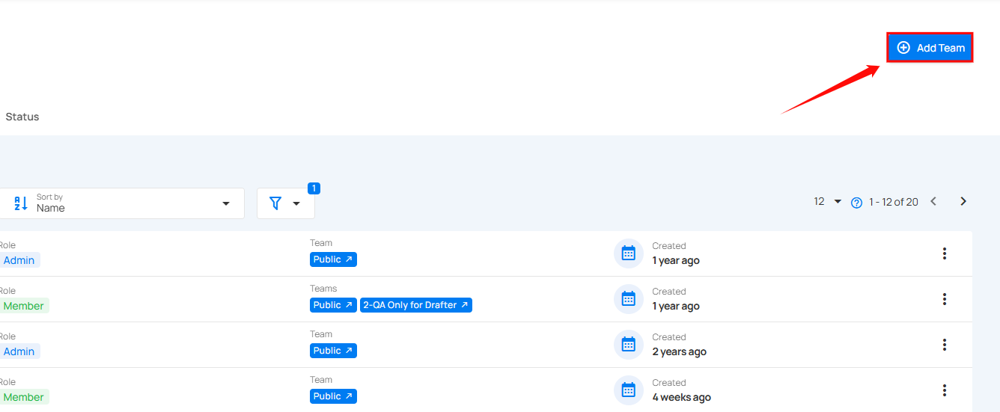
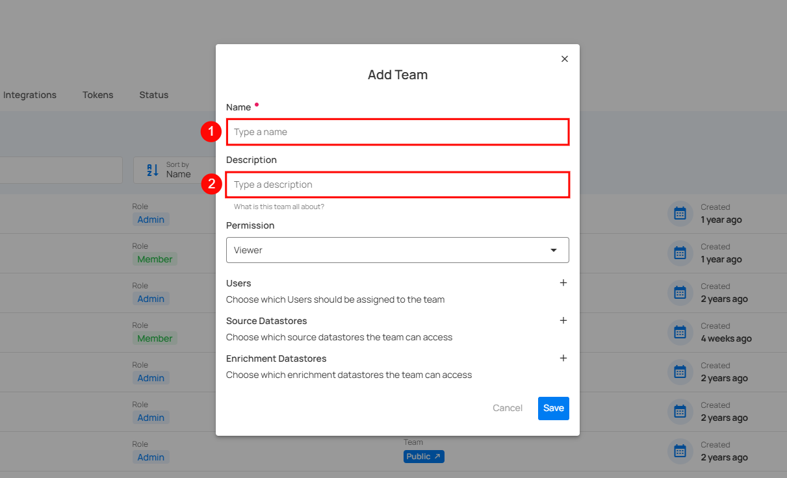
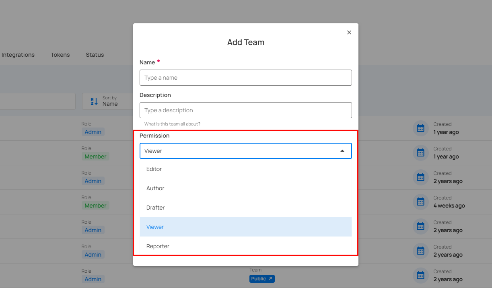
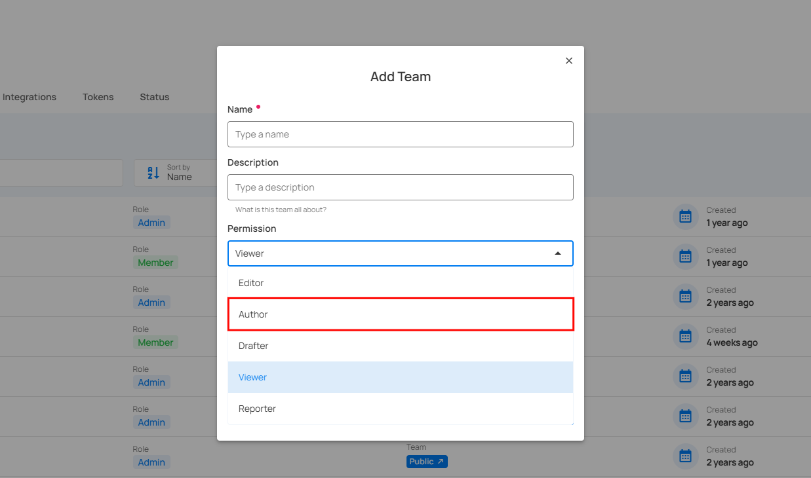
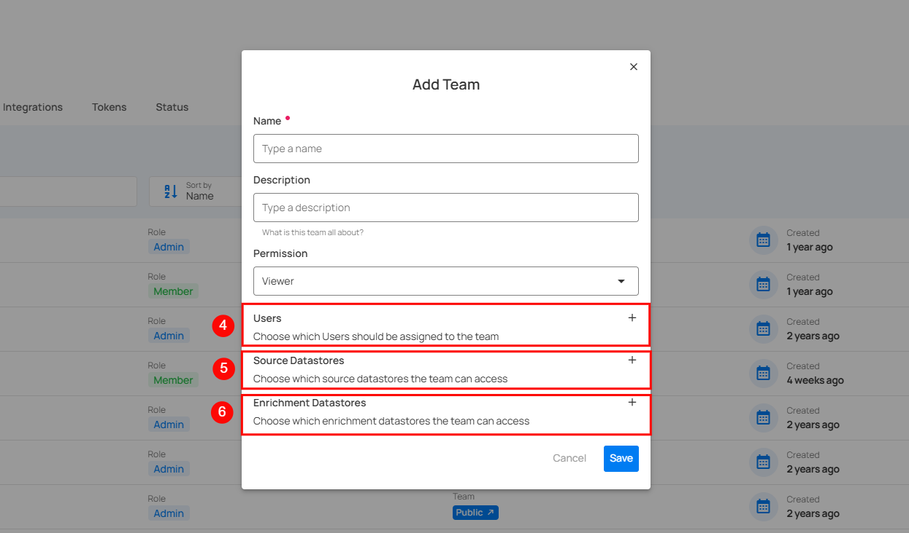
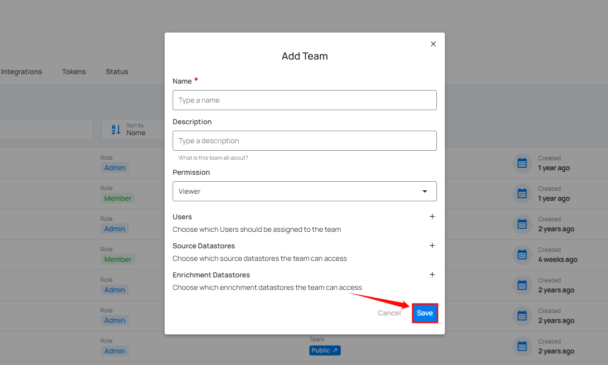

---
# We need as much horizontal space as possible
hide:
  - toc
---

# Team Permissions

Admins are not subject to Team permissions and can therefore access all data assets. By contrast, users assigned the Member and Manager roles are subject to Team permissions which control the data assets they can interact with.

Team permissions are granted at the Datastore level and extend to all data assets under that Datastore (Tables/View/Files, Fields, Quality Checks, Anomalies, etc...)

## Permission Matrix

Legend:

* `✅` The given Team permission grants the ability to perform the Action on associated Datastores
* `❌` The given Team permission does not grant the ability to perform the Action on associated Datastores

| Action                       | Reporter   | Viewer   | Drafter   | Author   | Editor        |
|:-----------------------------|:-----------|:---------|:----------|:---------|:--------------|
| Delete Source Datastore      | ❌          | ❌        | ❌         | ❌        | ❌             |
| View Source Datastore        | ✅          | ✅        | ✅         | ✅        | ✅             |
| Edit Datastore Settings      | ❌          | ❌        | ❌         | ❌        | ✅             |
| Preview Source Datastore     | ❌          | ✅        | ✅         | ✅        | ✅             |
| Create/Delete Computed Asset | ❌          | ❌        | ❌         | ❌        | ✅             |
| View Activity                | ✅          | ✅        | ✅         | ✅        | ✅             |
| Run & Manage Operations      | ❌          | ❌        | ❌         | ❌        | ✅             |
| Schedule Operations          | ❌          | ❌        | ❌         | ❌        | ✅             |
| View Profiles                | ✅          | ✅        | ✅         | ✅        | ✅             |
| Delete Profiles              | ❌          | ❌        | ❌         | ❌        | ✅             |
| View Checks                  | ✅          | ✅        | ✅         | ✅        | ✅             |
| Create Checks                | ❌          | ❌        | ✅         | ✅        | ✅             |
| Save Check to draft          | ❌          | ❌        | ✅         | ✅        | ✅             |
| Restore Check to draft       | ❌          | ❌        | ✅         | ✅        | ✅             |
| Activate / Validate Check    | ❌          | ❌        | ❌         | ✅        | ✅             |
| Edit Check Metadata          | ❌          | ❌        | ❌         | ✅        | ✅             |
| View Anomalies               | ✅          | ✅        | ✅         | ✅        | ✅             |
| View Anomaly Source Records  | ❌          | ✅        | ✅         | ✅        | ✅             |
| Change Anomaly Status        | ❌          | ❌        | ❌         | ✅        | ✅             |
| Add Comment to Anomaly       | ❌          | ✅        | ✅         | ✅        | ✅             |
| Delete Enrichment Datastore  | ❌          | ❌        | ❌         | ❌        | ❌             |
| View Enrichment Datastore    | ❌          | ✅        | ✅         | ✅        | ✅             |
| Preview Enrichment Datastore | ❌          | ✅        | ✅         | ✅        | ✅             |

## Add Team

You can create a new team for efficient and secure data management. Teams make it easier to control who has access to what, help people work together better, keep things secure with consistent rules, and simplify managing and expanding user groups. You can assign permissions to the team, such as Editor, Author, Drafter, Viewer and Reporter access, by selecting the datastore and enrichment datastore to which you want them to have access. This makes data management easier.

**Step 1**: Click on the **Add Team** button located in the top right corner.

**Step 2**: A modal window will appear, providing the options for creating the team. Enter the required values to get started.

| REF.     | FIELD        | ACTION     | EXAMPLE          |
|----------|--------------|------------|------------------|
|  1.      | Name         | Enter the name of the team  |   Data Insights Team  |
|  2.      | Description  |  Provide a brief description of the team.  |  Analyzes data to provide actionable insights, supporting data-driven decisions  |

### Permissions

Permissions decide what users can see, create, or manage based on their role. Each role is designed for specific tasks, giving users access to the tools and information they need without going beyond their limits. From Editors who manage advanced settings to Viewers with read-only access, these roles make it easy to use the system while keeping everything secure.

#### Editor

Editor role allows users to manage datastore functions comprehensively. They can handle tasks such as controlling enrichment, scoring, computed fields, and operations.

| Feature                | Operation                   | Can View/Can Run   | Can Manage   |
|:-----------------------|:----------------------------|:------------------|:-------------|
| **Datastores**         | Add Datastore               | ❌                 | ✅            |
|                        | Edit Settings               | ❌                 | ✅            |
| **Enrichment**         | Add Enrichment              | ❌                 | ✅            |
|                        | Edit Enrichment             | ❌                 | ✅            |
| **Scoring**            | Edit Scoring                | ❌                 | ✅            |
| **Computed Field**     | Add Computed                | ❌                 | ✅            |
| **Operation**          | Run Operation               | ✅                 | ✅            |
|                        | Manage Operation            | ❌                 | ✅            |
|                        | Manage Scheduled Operation  | ❌                 | ✅            |
| **Profiles**           | Add Computed                | ❌                 | ✅            |
|                        | Delete Computed             | ❌                 | ✅            |
| **Field Context**      | Edit Field Context          | ❌                 | ✅            |
|                        | Delete Field Context        | ❌                 | ✅            |

#### Author

Author role focuses on managing checks within the system. Users can activate, validate, change the status of checks, and edit their metadata. It is specifically designed for handling these functions efficiently.

| Feature               | Functionality              | Can View/ Can Run   | Can Edit   |
|:----------------------|:---------------------------|:--------------------|:-----------|
| **Source Datastore**  | Checks                     | ❌                   | ✅          |
|                       | Activate Checks            | ❌                   | ✅          |
|                       | Validate Checks            | ❌                   | ✅          |
|                       | Change Status of Checks    | ❌                   | ✅          |
|                       | Edit Metadata              | ❌                   | ✅          |
|                       | Anomalies                  | ❌                   | ✅          |
| **Anomalies**         | Change Status of Anomalies | ❌                   | ✅          |

#### Drafter

Drafter role is designed specifically for adding and saving data within the system. Users can create new, make edits to existing ones, and save their progress as drafts. It is focused on these basic functions without access to advanced features or management tasks.

| Feature               | Functionality          | Can View   | Can Edit   |
|:----------------------|:-----------------------|:----------|:-----------|
| **Source Datastore**   | Open Datastore        | ✅         | ❌          |
|                        | Add Checks            | ❌         | ✅          |
| **Profiles**           | Add Check             | ❌         | ✅          |
| **Checks**             | Create as Draft       | ❌         | ✅          |
| **Field Context**      | Add Check             | ❌         | ✅          |

#### Viewer

Viewer role is focused on viewing anomalies within the system and creating notes as needed. It offers read-only access while allowing users to add comments to document their observations.

| Features               | Functionality         | Can View   | Can Edit   |
|:-----------------------|:----------------------|:----------|:-----------|
| **Source Datastore**   | Anomalies             | ✅         | ❌          |
|                        | Add Comment           | ✅         | ❌          |
|                        | Preview (Container)   | ✅         | ❌          |
| **Enrichment Datastore**| View                 | ✅         | ❌          |
|                        | Preview               | ✅         | ❌          |
| **Explore**            | Anomalies             | ✅         | ❌          |
|                        | Source Records        | ✅         | ❌          |

#### Reporter

Reporter role provides access to all report-related information, including dashboards, overviews, checks, anomalies, fields, containers, and datastores. It is intended for users who need to view and analyze data to generate reports.

| Feature               | Operation              | Can View   | Can Edit   |
|:----------------------|:-----------------------|:----------|:-----------|
| **Source Datastore**  | List                   | ✅         | ❌          |
|                       | View                   | ✅         | ❌          |
|                       | Overview               | ✅         | ❌          |
|                       | Activity               | ✅         | ❌          |
|                       | Profiles               | ✅         | ❌          |
|                       | Observability          | ✅         | ❌          |
|                       | Checks                 | ✅         | ❌          |
|                       | Anomalies              | ✅         | ❌          |
|                       | Fields (Containers)    | ✅         | ❌          |
| **Enrichment Datastores**| List                | ✅         | ❌          |
| **Explore**            | Insights              | ✅         | ❌          |
|                       | Activity               | ✅         | ❌          |
|                       | Profiles               | ✅         | ❌          |
|                       | Observability          | ✅         | ❌          |
|                       | Checks                 | ✅         | ❌          |
|                       | Anomalies              | ✅         | ❌          |

| REF.     | FIELD        | ACTION     | EXAMPLE          |
|----------|--------------|------------|------------------|  
|  4.      | Users | Add users to the team | John, Michael |
|  5.      | Source Datastores | Grant access to specific source datastores (single or multiple) for the team | Athena |
|  6.      | Enrichment Datastores | Add and grant access to additional enrichment datastores (single or multiple) for the team  | Bank Enrichment |

**Step 3**: Click on the **Save** button to save your team.

After clicking on the **Save** button, your team is created, and a success message will appear saying, **The Team has been successfully created**.

