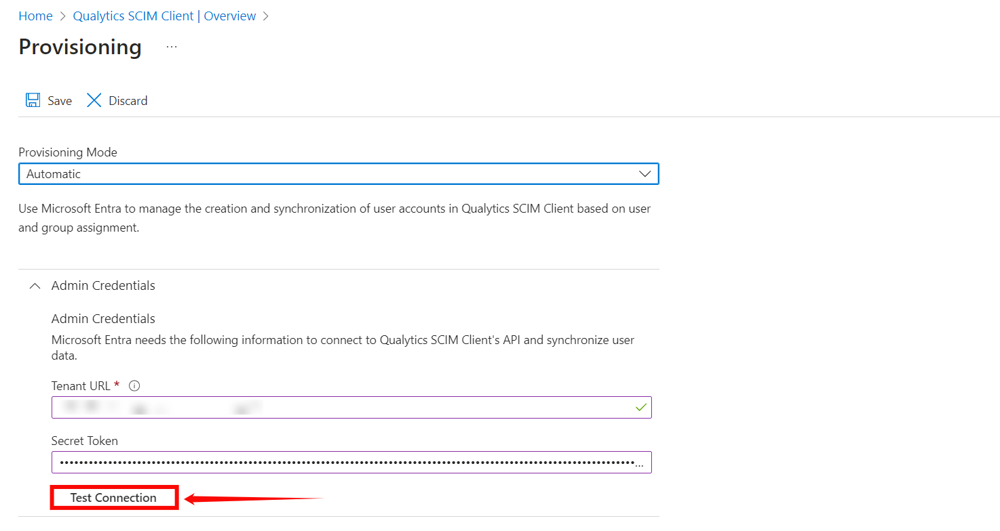
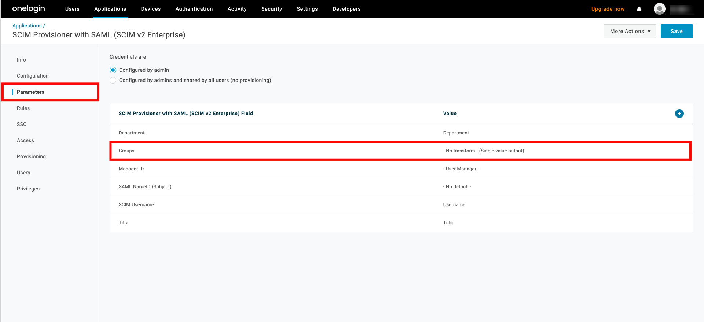

# Security

You can easily manage user and team access by assigning roles and permissions within the system. This includes setting up specific access levels and roles for different users and teams. By doing so, you ensure that data and resources are accessed securely and appropriately, with only authorized individuals and groups having the necessary permissions to view or modify them. This helps maintain the integrity and security of your system.

!!! note 
    Only users with the Admin role have the authority to manage global platform settings,  such as user permissions and team access controls.

Let’s get started 🚀

## Navigation to Security

**Step 1**: Log in to your Qualytics account and click the **Settings** button on the left side panel of the interface. 


**Step 2**: By default, you will be navigated to the **Tags** section. Click on the **Security** tab.


## Add Team

You can create a new team for efficient and secure data management. Teams make it easier to control who has access to what, help people work together better, keep things secure with consistent rules, and simplify managing and expanding user groups. You can assign permissions to the team, such as Editor, Author, Drafter, Viewer and Reporter access, by selecting the datastore and enrichment datastore to which you want them to have access. This makes data management easier.

In Qualytics, every user is assigned roles: ```Admin```,```Manager``` and ```Member```.

- **Admin**: Admin users have full access to the system and can manage datastores, teams, and users. This means they can access everything in the application, as well as manage user accounts and team permissions.

| Category              | Functionality             | Description                                                                 |
|-----------------------|---------------------------|-----------------------------------------------------------------------------|
| Source Datastore      | Delete                   | Permanently remove a source datastore from the system.                      |
| Enrichment Datastore  | Delete                   | Permanently remove an enrichment datastore from the system.                 |
| Global Settings       | Settings                 | Manage global system configurations and preferences.                        |
|                       | Security                 | Manage user access and team permissions within the system.                  |
|                       | User(Manage)           | Add, modify, or delete user accounts, assign roles, and control access levels. |
|                       | Team(Manage)           | Manage teams by adding or removing members, and setting team-specific permissions. |
|                       | Health                   | Monitor the system’s health status and performance metrics.                 |
|                       | Restart Analytical Engine | Restart the analytics engine to refresh data processing or resolve issues.  |

- **Manager**: Manager role has limited administrative access, can view all datastores, even without a team role, and create datastores for teams where they have Editor permissions. However, they cannot manage global settings, user accounts, or override team role restrictions like Admins.

| Category              | Functionality             | Description                                                                 |
|-----------------------|---------------------------|-----------------------------------------------------------------------------|
| Source Datastore      | Create                   | Managers can create new source datastores for data integration.             |
|                       | List                     | Managers can view all source datastores that are listed in the system.      |
|                       | Open                     | Open and access details of the selected source datastore.                   |
|                       | Add Enrichment           | Add enrichment processes to source datastores to enhance data quality.      |
| Enrichment Datastore  | Create                   | Managers can create enrichment datastores and assign them to teams with an "Editor" role. |
|                       | List                     | Managers can view all enrichment datastores available in the system.        |
| Global Settings       | DataStore (Source & Enrichment) |                                                                         |
|                       | Create                   | Managers can create new source and enrichment datastores and assign them to teams with an "Editor" role. |
|                       | List                     | Managers can view all datastores (source and enrichment) listed in the system. |
| Library               | View                     | View the checks, or assets available in the library.                        |
|                       | Manage                   | Manage library content, such as adding, modifying, or removing checks.      |
| Tags                  | View                     | View tags assigned to datastores, records, or other elements in the system. |
|                       | Manage                   | Manage the tags, including adding, removing, or modifying tags for elements        |
| Notifications Rules   | View                     | View existing notification rules and actions configured for alerts.         |
|                       | Manage                   | Configure and manage notification rules for different actions or triggers.  |
| Settings              | Connections              |                                                                             |
|                       | Create                   | Create new connections for integrating external systems or databases.       |
|                       | Update                   | Update existing connections to modify their settings or credentials.        |
|                       | Delete                   | Remove existing connections that are no longer needed.                      |
|                       | Security                 |                                                                             |
|                       | View Users               | View the list of users in the system and their access details.              |
|                       | View Teams               | View the teams and their roles/permissions within the system.               |
|                       | Integration              |                                                                             |
|                       | Add                      | Add new integrations to the system for external systems or data sources.    |
|                       | Sync                     | Sync external data with the system to ensure the most up-to-date information.|
| Health                | View                     | View the health status of the system to monitor performance and stability.   |
| API only (ATM)        | Transaction History      | View the history of transactions made via the API for auditing and tracking.|

- **Member**: Members are normal users with access explicitly granted to them, usually inherited from the teams they are assigned to.

| Category              | Functionality             | Description                                                                 |
|-----------------------|---------------------------|-----------------------------------------------------------------------------|
| Library               | View                     | Access and browse available checks.                                         |
| Tags                  | View                     | View tags associated with datastores, records, or other system elements.    |
| Actions               | View                     | View existing notification rules and action configurations.                 |
| Settings              | Connection               |                                                                             |
|                       | Read                     | Access connection details without modification permissions.                 |
|                       | Tokens                   |                                                                             |
|                       | Generate Token           | Create new tokens for secure access or integrations.                        |
|                       | Revoke                   | Disable existing tokens to restrict access.                                 |
|                       | Restore                  | Reactivate previously revoked tokens.                                       |
|                       | Delete                   | Permanently remove tokens.                                                  |
|                       | View                     | Access and review all token details.                                        |

**Step 1**: Click on the **Add Team** button located in the top right corner.


**Step 2**: A modal window will appear, providing the options for creating the team. Enter the required values to get started. 

| REF.     | FIELD        | ACTION     | EXAMPLE          |
|----------|--------------|------------|------------------|
|  1.      | Name         | Enter the name of the team  |   Data Insights Team  |
|  2.      | Description  |  Provide a brief description of the team.  |  Analyzes data to provide actionable insights, supporting data-driven decisions  |


### Permissions

System uses permissions to ensure tasks are managed securely and efficiently. Each role is designed with specific capabilities based on what the user needs to do. Roles range from full access for advanced management to basic, read-only access for monitoring. 


#### Editor

Editor role has the most advanced permissions, enabling users to manage datastore functions comprehensively. Editors can control enrichment, scoring, computed fields, operations, and more. However, they cannot add teams outside their access; only administrators can perform this task.


| Categories            | Functionality                                         |
|-----------------------|-------------------------------------------------------|
| Source Datastore      | Open, Add Datastore, Edit Settings, Switch Enrichment |
| Enrichment            | Add Enrichment, Edit Enrichment, Edit Scoring, Add Computed |
| Operations            | Run Operation, Manage Operations, Manage Scheduled Operations |
| Field Context         | Edit, Delete                                         |

#### Author

Author role focuses on managing checks and their associated metadata. This role is essential for tasks like activating, validating, and editing checks but has limited access to datastore functionalities.


| Categories            | Functionality                                                   |
|-----------------------|-----------------------------------------------------------------|
| Source Datastore      | Checks, Activate, Validate, Change Status, Edit Metadata, Anomalies, Change Status |
| Global Settings       | API only (ATM)                                           |

#### Drafter

Drafter role is designed for users who need to create and prepare checks without performing or finalizing them. This role focuses on adding and organizing content for future use.


| Category            | Functionality           |
|---------------------|-------------------------|
| Source Datastore    | Open, Add Check         |
| Profiles            | Add Check              |
| Checks              | Create as Draft        |
| Field Context       | Add Check              |

#### Viewer

Viewer role provides read-only access to anomalies and allows users to add comments or create notes. This role is ideal for those who need to monitor activities without making changes.


| Category            | Functionality                        |
|---------------------|--------------------------------------|
| Source Datastore    | Anomalies, Add Comment, Preview (container) |
| Enrichment Datastore| View, Preview                       |
| Explore             | Anomalies, Source Records           |

#### Reporter

Reporter role has extensive access to all app report information, including dashboards, overviews, and anomalies. Reporters can view various data contexts and generate analytical insights.


| Category            | Functionality                                                         |
|---------------------|---------------------------------------------------------------------|
| Source Datastore    | List, View, Overview, Activity, Profiles, Observability, Checks, Anomalies, Fields (container) |
| Enrichment Datastore| List                                                                 |
| Explore             | Insights, Activity, Profiles, Observability, Checks, Anomalies     |


| REF.     | FIELD        | ACTION     | EXAMPLE          |
|----------|--------------|------------|------------------|  
|  4.      | Users | Add users to the team | John, Michael |
|  5.      | Source Datastores | Grant access to specific source datastores (single or multiple) for the team | Athena |
|  6.      | Enrichment Datastores | Add and grant access to additional enrichment datastores (single or multiple) for the team  | Bank Enrichment |

**Step 3**: Click on the **Save** button to save your team.


After clicking on the **Save** button, your team is created, and a success message will appear saying, **Team successfully created**.


## Directory Sync

Directory Sync, also known as User and Group Provisioning, automates the synchronization of users and groups between your identity provider (IDP) and the Qualytics platform. This ensures that your user data is consistent across all systems, improving security and reducing the need for manual updates.

### Directory Sync Overview

Directory Sync automates the management of users and groups by synchronizing information between an identity provider (IDP) and your application. This ensures that access permissions, user attributes, and group memberships are consistently managed across platforms, eliminating the need for manual updates.

#### **How Directory Sync Works with SCIM**

SCIM is an open standard protocol designed to simplify the exchange of user identity information. When integrated with Directory Sync, SCIM automates the creation, updating, and de-provisioning of users and groups. SCIM communicates securely between the IDP and your platform’s API using OAuth tokens to ensure only authorized actions are performed.

#### General Setup Requirements

To set up Directory Sync, the following are required:

* Administrative access to both the identity provider and Qualytics platform  
* A SCIM-enabled identity provider or custom integration  
* The OAuth client set up in your IDP  
* SCIM URL and OAuth Bearer Token generated from the Qualytics platform

### Getting Started

#### Prerequisites for Setting Up Directory Sync

Before setting up Directory Sync, ensure you have the following:

* A SCIM-supported identity provider  
* Administrative privileges for both your IDP and Qualytics  
* A SCIM URL and OAuth Bearer Token, which will be generated from your Qualytics instance

#### Quick Start Guide

1. Set up an OAuth client in your IDP.  
2. Configure the SCIM endpoints with the SCIM URL and OAuth Bearer Token.  
3. Assign users and groups to provision in the IDP.  
4. Monitor the synchronization to ensure proper operation.

### What is SCIM?

SCIM is a standardized protocol used to automate the exchange of user identity information between IDPs and service providers. Its goal is to simplify the process of user provisioning and management.

SCIM improves efficiency by automating user lifecycle management (creation, updating, and de-provisioning) and ensures that data remains consistent across platforms. It also enhances security by minimizing manual errors and ensuring proper access control.

SCIM includes endpoints that are configured within your IDP and your platform. It uses OAuth tokens for secure communication between the IDP and the Qualytics API, ensuring that only authorized users can manage identity data.

### Benefits of Using SCIM for User and Group Provisioning

By leveraging **SCIM (System for Cross-domain Identity Management)**, Directory Sync simplifies user management with:

* Automated user provisioning and de-provisioning  
* Reduced manual intervention, improving efficiency and security  
* Real-time updates of user data, ensuring accuracy and compliance
* Support for scaling user management across organizations of any size

**Supported Providers**

Our API supports SCIM 2.0 (System for Cross-domain Identity Management) as defined in RFC 7643 and RFC 7644. It is designed to ensure seamless integration with any SCIM-compliant identity management system, supporting standardized user provisioning, de-provisioning, and lifecycle management. Additionally, we have verified support with the following providers:

* **Microsoft Entra (Azure Active Directory)**  
* **Okta**  
* **OneLogin**  
* **JumpCloud**

**Unsupported Providers**

We do not support **Google Workspace**, as it does not offer SCIM support. Organizations using Google Workspace must use alternate methods for user provisioning.

### Providers

### 1. Microsoft Entra

#### Creating an App Registration

**Step 1:** Log in to the Microsoft Azure Portal, and select **“Microsoft Entra ID”** from the main menu.


**Step 2:** Click on **“Enterprise Applications”** from the left navigation menu.


**Step 3:** If your application is already created, choose it from the list and move to the section [Configuring SCIM Endpoints](#configuring-scim-endpoints). If you haven't created your application yet, click on the **New Application** button.


**Step 4:** Click on the **“Create your own application”** button to create your application.


**Step 5:** Give your application a name (e.g., "Qualytics OAuth Client" or "Qualytics SCIM Client").


**Step 6:** After entering the name for your application, click the **Create** button to finalize the creation of your app.


#### Configuring SCIM Endpoints

**Step 1:** Click on **Provisioning** from the left-hand menu.


**Step 2:** A new window will appear, click on the **Get Started** button.


**Step 3:** In the **Provisioning Mode** dropdown, select **“Automatic”** and enter the following details in the **Admin Credentials** section:

1. **Provisioning Mode**: Select **Automatic**.

2. **Tenant URL:**  `https://fhlbny.qualytics.io/api/scim/v2` 

3. **Secret Token:** Generate this token from the Qualytics UI when logged in as an admin user. For more information on how to generate tokens in Qualytics, refer to the documentation on [Tokens](https://userguide.qualytics.io/settings/tokens/overview-of-tokens/).


**Step 4:** Click on the **Test Connection** button to test the connection to see if the credentials are correct.



**Step 5:** Expand the **Mappings** section and enable your app to enable group and user attribute mappings. The default mapping should work.


**Step 6:** Expand the Settings section and make the following changes:

1. Select **Sync only assigned users and groups** from the **Scope** dropdown.  
2. Confirm the **Provisioning Status** is set to **On.**


**Step 7:** Click on the **Save** to save the credentials. Now you've successfully configured the Microsoft Entra ID SCIM API integration.


#### Assigning Users and Groups for Provisioning

**Step 1:** Click on the **Users and groups** from the left navigation menu and then click **Add user/group**.


**Step 2:** Click on the **None Selected** under the Users and Groups.


**Step 3:** From the right side of the screen, select the users and groups you want to assign to the app.


**Step 4:** Once you selected the group and users for your app, click the **“Select”** button.


**Step 5:** Click on the **Assign** button to assign the users and groups to the application.

!!! warning 
    When you assign a group to an application, only users directly in the group will have access. The assignment does not cascade to nested groups.


### 2. Okta

####  Setting up the OAuth Client in Okta

**Step 1**: Log in to your Okta account using your administrator credentials. From the left-hand navigation menu, click **Applications**, then select **Browse App Catalog**.


**Step 2**: In the search bar, type **SCIM 2.0 Test App (OAuth Bearer Token)**, and select the app called **SCIM 2.0 Test App (OAuth Bearer Token)** from the search results.


**Step 3**: On the app’s details page, click **Add Integration**.


**Step 4**: Enter a name for your application (e.g., "Qualytics SCIM Client").


**Step 5:** Click on the **Next** button.


#### Configuring SCIM Endpoints

**Step 1**: In the newly created app, go to the **Provisioning** tab and click **Configure API Integration**.


**Step 2**: Check the box labeled **Enable API Integration**, and enter the following details:

* **SCIM 2.0 Base URL:**  `https://fhlbny.qualytics.io/api/scim/v2`  

* **OAuth Bearer Token:** Generate this token from the Qualytics UI when logged in as an admin user. For more information on how to generate tokens in Qualytics, refer to the documentation on [Tokens](https://userguide.qualytics.io/settings/tokens/overview-of-tokens/).


**Step 3**: Click **Test API Credentials** to verify the connection. Once the credentials are validated, click **Save**.


**Step 4**: A new settings page will appear. Under the **To App** section, enable the following settings:

* **Create Users**  
* **Update User Attributes**  
* **Deactivate Users**

After enabling these settings, your Okta SCIM API integration is successfully configured.


#### Assigning users for provisioning

**Step 1:** Click the **Assignments** tab and select **Assign to People** from the dropdown **Assign**.


**Step 2:** Select the users you want to assign to the app and click the **Assign** button.


**Step 3:** After you click the **Assign** button, you'll see a new popup window with various fields. Confirm the field values and click the **Save and Go Back** buttons.


#### Assigning groups for provisioning

**Step 1:** Navigate to the tab **Push Groups** and select **Find group by name** from the dropdown Push **Groups**.


**Step 2:** Search for the group you want to assign to the app.


**Step 3:** After assigning the group name, then click on the **Save** button.


### 3. OneLogin

#### Setting up the OAuth Client in OneLogin

**Step 1**: Log in to your OneLogin account using your administrator credentials. From the top navigation menu, click **Applications**, then select **Add App**.


**Step 2**: In the search bar, type **SCIM** and select the app called **SCIM Provisioner with SAML (SCIM V2 Enterprise)** from the list of apps.


**Step 3**: Enter a name for your app, then click **Save**. You have successfully created the SCIM app in OneLogin.


#### Configuring SCIM Endpoints

**Step 1**: In your created application, navigate to the **Configuration** tab on the left and enter the following information:

* **API Status**: Enable the API status for the integration to work properly. 

* **SCIM Base URL:**  `https://fhlbny.qualytics.io/api/scim/v2` 

* **SCIM Bearer Token:** Generate this token from the Qualytics UI when logged in as an admin user. For more information on how to generate tokens in Qualytics, refer to the documentation on [Tokens](https://userguide.qualytics.io/settings/tokens/overview-of-tokens/).


**Step 2**: Click on the **Save** button to store the credentials.


**Step 3**: Navigate to the **Provisioning** tab, and check the box labeled **Enable Provisioning**.


**Step 4:** Click on **Save** to apply the changes.


**Step 5**: Navigate to the **Parameters** tab and select the row for **Groups**.



**Step 5**: A popup window will appear, check the box **Include in User Provisioning**, then click the **Save** button.


#### Assigning Users for Provisioning

**Step 1**: To assign users to your app, go to **Users** from the top navigation menu, and select the user you want to assign to the app.

From the User page, click the **Applications** tab on the left, and click the **+ (plus)** sign.


**Step 3**: A popup window will show a list of apps. Select the app you created earlier and click **Continue**.


**Step 4**: A new modal window will appear, click on the **Save** to confirm the assignment.


**Step 5**: If you see the status **Pending** in the table, click that text. A modal window will appear, where you can click **Approve** to confirm the assignment.


#### Assigning Groups for Provisioning

**Step 1:** To push groups to your app, go to the top navigation menu, click **Users**, select **Roles** from the dropdown, and click **New Role** to create the role.


**Step 2**: Enter a name for the role, select the app you created earlier


**Step 3:** Click on the **“Save”** button.


**Step 4**: Click the **Users** tab for the role and search for the user you want to assign to the role.


**Step 5:** Click the **Add To Role** button to assign the user, then click **Save** to confirm the assignment.


**Step 6:** A modal window will appear, click on the **“Save”** button to confirm the assignment.


**Step 7**: Go back to your app and click the **Rule** tab on the left and click the **Add Rule** button.

Give the rule a name. Under the **Actions**, select the **Set Groups in your-app-name** from the dropdown, then select each **role** with values that match **your-app-name**.


**Step 8:** Click on the **Save** button.


**Step 9**: Click on the **Users** tab on the left, you may see **Pending** under the provisions state. Click on it to approve the assignment.


**Step 10**: A modal window will appear, click on the **Approve** to finalize the assignment.


### 4. JumpCloud

#### Configuring SCIM Endpoints

JumpCloud supports SCIM provisioning within an existing SAML application. Follow these steps to configure SCIM provisioning:

**Step 1**: Log in to JumpCloud and either choose an existing SAML application or create a new one. From the left navigation menu, click **SSO** and select your **Custom SAML App.**


**Step 2**: Click on the tab **Identity Management** within your SAML application.

Under the **SCIM Version**, choose **SCIM 2.0** and enter the following information:

1. **Base URL:** `https://fhlbny.qualytics.io/api/scim/v2`

2. **Token Key:** Generate this token from the Qualytics UI when logged in as an admin user. For more information on how to generate tokens in Qualytics, refer to the documentation on [Tokens](https://userguide.qualytics.io/settings/tokens/overview-of-tokens/).  

3. **Test User Email**


**Step 4**: Click **Test Connection** to ensure the credentials are correct, then click **Activate** to enable SCIM provisioning.


**Step 5**: Click **Save** to store your settings. Once saved, SCIM provisioning is successfully configured for your JumpCloud SAML application.


#### Assigning Users for Provisioning

**Step 1**: Click the tab **User Groups** within your SAML application. You can see all the available groups, select the groups you want to sync, and click **Save**.


If no existing groups are available, click User Groups from the left navigation menu and click on the plus **(+)** icon to create a new group.


**Step 2**: Select the Users tab and choose the users you want to assign to the group.


**Step 3**: Select the **Applications** tab and choose the app you want to assign the group to.


## Manage Users

You can easily manage users by assigning roles, teams, and deactivating users who are not active. This ensures that access control is streamlined, security is maintained, and only active users have access to resources.

The **Security** section, visible only to Admins, allows for granting and revoking permissions for Member users.

Access controls in Qualytics are assigned at the datastore level. A non-administrator user (Member) can have one of three levels of access to any datastore connected to Qualytics:

- **Editor**: [Editor](#editor) role has the most advanced permissions, enabling users to manage datastore functions comprehensively. Editors can control enrichment, scoring, computed fields, operations, and more. However, they cannot add teams outside their access; only administrators can perform this task.

- **Author**: [Author](#author) role focuses on managing checks and their associated metadata. This role is essential for tasks like activating, validating, and editing checks but has limited access to datastore functionalities.

- **Drafter**:[Drafter](#drafter) role is designed for users who need to create and prepare checks without performing or finalizing them. This role focuses on adding and organizing content for future use.

- **Viewer**:[Viewer](#viewer) role provides read-only access to anomalies and allows users to add comments or create notes. This role is ideal for those who need to monitor activities without making changes.

- **Reporter**:[Reporter](#reporter) role has extensive access to all app report information, including dashboards, overviews, and anomalies. Reporters can view various data contexts and generate analytical insights.

!!! note 
    Permissions are assigned to Teams rather than directly to users. Users inherit the permissions of the teams to which they are assigned.

All users are part of the default Public team, which provides access to all Public Datastores. Admins can create and manage additional teams, assigning both users and datastores to them. When a datastore is assigned to a team, the team is granted either Read or Write access, and all team members inherit this permission.

### View Users

Whenever new users are added to the system, they will appear in the Users list. Click the **Users** tab to view the list of users.


### Edit Users

You can edit user details to update their role, and team assignments, ensuring their access and team information are current and accurate. 

**Step 1**: Click the **vertical ellipsis (⋮)** next to the user name that you want to edit, then click on **Edit** from the dropdown menu.


**Step 2**: Edit the user details as needed, including:

1. Updating their role
2. Assigning them additional teams

!!! note 
    All users are inside the Public team by default and that can't be changed. If users have no default access to any datastore, then no datastores should be assigned to the Public team.


**Step 3**: Once you have made the necessary changes, then click on the **Save** button.


After clicking the **Save** button, your changes will be updated, and a success message will display saying, **User successfully updated.


### Deactivate Users

You can deactivate users to revoke their access to the system while retaining their account information for future reactivation if needed.

**Step 1**: Click the **vertical ellipsis (⋮)** next to the user name that you want to deactivate, then click on **Deactivate** from the dropdown menu.


**Step 2**: A modal window **Deactivate User** will appear.


**Step 3**: Enter **deactivate** in the given field (confirmation check) and then click on the **I’M SURE, DEACTIVATE THIS USER** button to deactivate the user.


### Sort Users

You can sort users by various criteria, such as **Created date**, **Name**, **Role**, and **Teams**, to easily manage and organize user information.


### Filter Users

You can filter the users by their roles, deactivated and team, to quickly find and manage particular groups of users. 


## Manage Teams

You can manage teams by editing their permissions, adding or removing users, and adjusting access to source and enrichment datastores. If a team is no longer needed, you can delete it from the system. This ensures that team configurations are always up-to-date and relevant, enhancing overall data management and security. 

### View Team

Whenever new teams are added to the system, they will appear in the Teams list. Click the **Teams** tab to view the list of teams.


### Edit Team

You can edit a team to update its permissions, name, manage users within the team, and adjust access to source and enrichment datastores, ensuring the team's configuration is current and effective.

!!! note
    The **name** and **users** of a public team cannot be edited.

**Step 1**:  Click on the **vertical ellipsis (⋮)** next to the team name that you want to edit, then click on **Edit** from the dropdown menu.


**Step 2**:  Edit the [team details](#add-team) as needed, including updating their permissions, users, source, and enrichment datastores. 


**Step 3**: Once you have made the necessary changes, then click on the **Save** button.


After clicking on the **Save** button, your team is successfully updated, and a success message will be displayed saying, **Team successfully updated**


### Delete Team 

You can delete a team from the system when it is no longer needed, removing its access and permissions to streamline management and maintain security.

**Step 1**: Click the **vertical ellipsis (⋮)** next to the team name that you want to delete, then click on **Edit** from the dropdown menu. 


A modal window **Delete Team** will appear.


**Step 2**: Click on the **Delete** button to delete the team from the system.


### Sort Team

You can sort teams by various criteria, such as name or creation date, to easily organize and manage team information.


