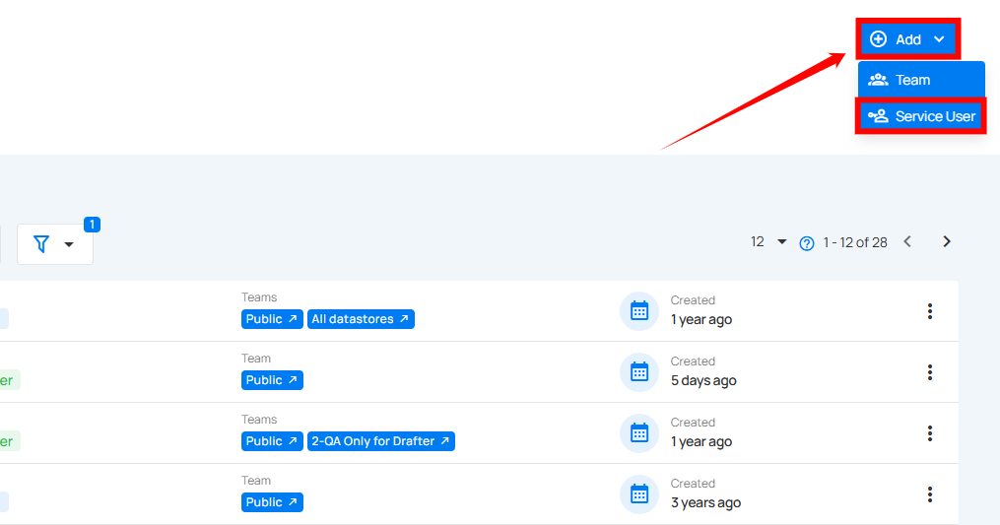
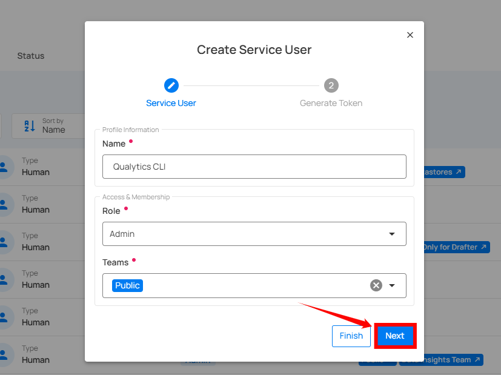
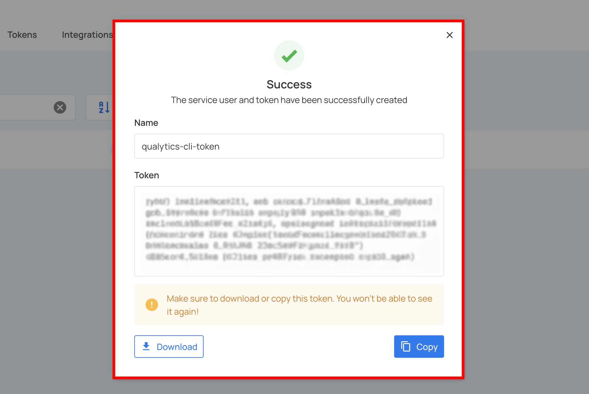

# Create a Service Account

Service Accounts allow automated or shared systems to securely interact with Qualytics without depending on individual user credentials. They must be created by **Administrators** and can be managed through both the **Qualytics UI** and **API**.

!!! note
    Only users with the **Administrator** role can create and manage Service Accounts. For detailed information about **permissions**, refer to the [**Teams Permissions**](../security/team-permissions.md){target="_blank"} documentation.

Let’s get started 🚀

**Step 1:** Log in to your Qualytics account and click the **Settings** button on the left side panel of the interface.


**Step 2:** By default, you will be navigated to the **Connections** section. Click on the **Security** tab.


**Step 3:** Click on the **Add** button located in the top right corner and select the **Service User** button.



A modal window will appear with a two-step wizard to create the service account and generate its token.


**Step 4:** Enter the following values in the service user form:

| **No.** | **Field** | **Description** | **Required** |
|-----|--------|-------------|-----------|
| **1** | **Name** | Provide a descriptive name for the service account (e.g., "Pipeline Automation", "Alation Sync", "API Access") – this will be used as the service account ID. | Yes |
| **2** | **Role** | Choose the role for the service account (Admin, Manager, Editor, or Member) based on the permissions needed. Start with the least privileged role. | Yes |
| **3** | **Teams** | Select the teams the service account should belong to. The **Public** team is automatically included. | Optional |


**Step 5:** After entering the service user information, click on the **Next** button.



**Step 6:** In the second step, complete the **token** generation form:

| **No.** | **Field** | **Description** | **Required** |
|-----|--------|-------------|-----------|
| **1** | **Name** | Descriptive name for the token (e.g., "pipeline-production", "api-access-prod"). Token names must be unique per service account. | Yes |
| **2** | **Expiration** | Select the expiration period from dropdown: 30 days, 60 days, 90 days, 1 year, or Never. For production tokens, 1 year with a rotation plan is recommended. | Yes |
| **3** | **Type** | Automatically set to "Service" (pre-filled and non-editable). | N/A |
| **4** | **Service User** | Automatically populated with the service user created in Step 4 (pre-filled and non-editable). | N/A |
| **5** | **SCIM Administration Token** | Check this box if the token should be restricted to SCIM endpoints only. | Optional |


**Step 7:** After entering the token details, click on the **Finish** button.


Your service account and token have been successfully created.



!!! warning
    Make sure to **copy or download the token** right away. Once you navigate away from this page, you won’t be able to see it again.

You will see the newly created service account in the users list with a **"Service"** badge.


## API Reference

For administrators who prefer API-based management or need to automate service account creation, Qualytics provides comprehensive API endpoints.

### Creating a Service Account via API

**Endpoint:**

```bash
POST /users
Authorization: Bearer {admin_token}
Content-Type: application/json
```

**Request Body:**

```json
{
  "name": "API Access",
  "role": "Editor",
  "teams": ["Data Engineering", "Data Quality"]
}
```

**Response:**

```json
{
  "id": 123,
  "user_id": "api_access@service",
  "user_name": "api_access@service",
  "email": "service@example.com",
  "name": "API Access",
  "user_type": "Service",
  "role": "Editor",
  "teams": ["Public", "Data Engineering", "Data Quality"]
}
```