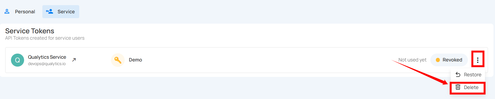
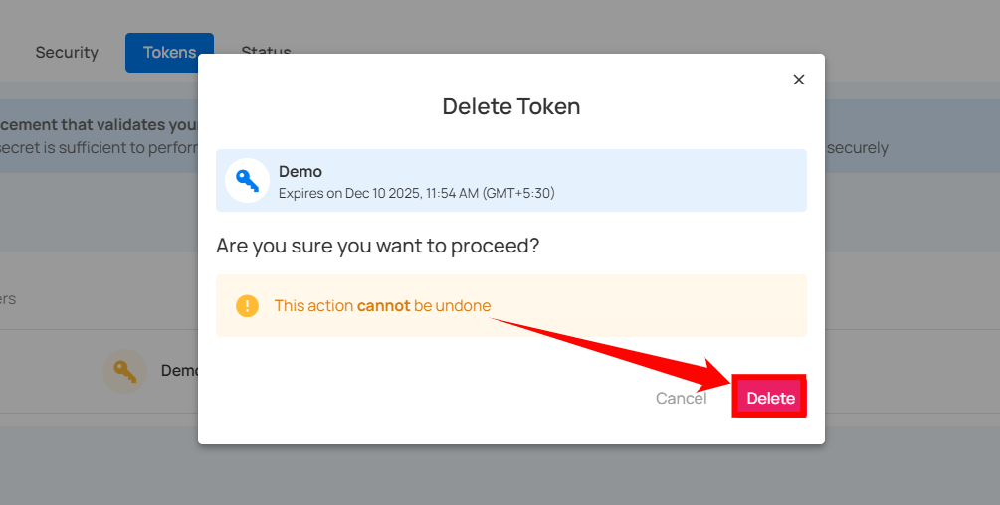

# Delete Service Token

You can delete a service token to permanently remove its access, ensuring it cannot be used again. This is important for maintaining security when a token is no longer needed, has been compromised, or to clean up unused tokens in your system.

!!! note 
    You can only delete revoked tokens, not active tokens. If you want to delete an active token, you must first revoke it before you can delete it.

**Step 1:** Click the **vertical ellipsis (⋮)** next to the revoked tokens, that you want to delete, then click on the **Delete** button from the dropdown menu.



After clicking the delete button, a confirmation modal window Delete Token will appear.


**Step 2:** Click on the **Delete** button to delete the token.



After clicking on the Delete button, your token will be deleted and a confirmation message will display saying User token successfully deleted.


# Deleting a Revoked Token via API

**Endpoint:**

```bash
DELETE /user-tokens/{token_id}
Authorization: Bearer {admin_token}
```

!!! note
    Can only delete tokens that are already revoked.


