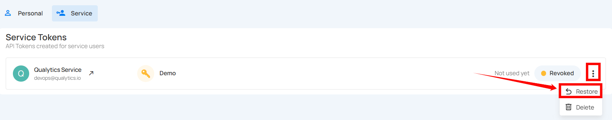

# Restore Service Token

You can restore a token to reactivate its access, allowing authorized use again. This is useful if the token was mistakenly revoked or if access needs to be temporarily re-enabled without generating a new token.

**Step 1:** Click the **vertical ellipsis (⋮)** next to the revoked tokens, that you want to restore, then click on the **Restore** button from the dropdown menu.

**Step 2:** After clicking on the **Restore** button, your secret token will be restored and a confirmation message will display saying **"The token has been successfully restored"**.

