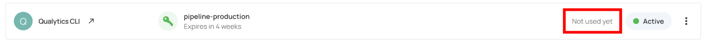
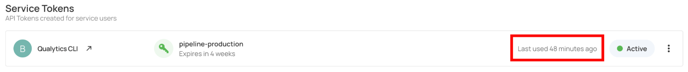

# Token Usage Status

Each service token includes a usage status to help you understand how and when it has been used for API authentication.

## Last Used

Shows the timestamp when the token was last used for API authentication.

## Not Used

The token has been generated but has not been used for any API requests since creation.

