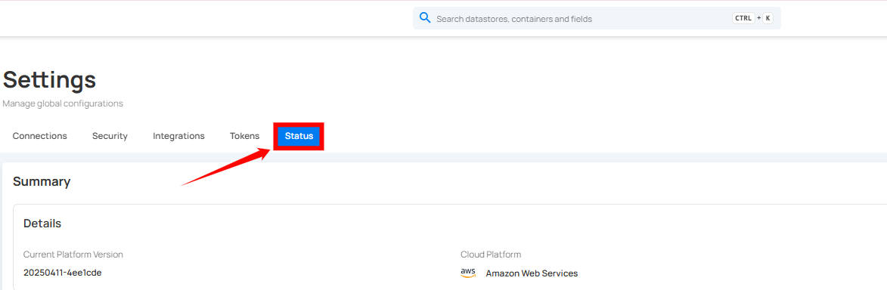
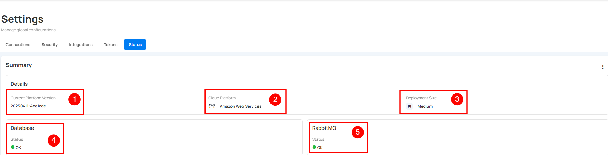
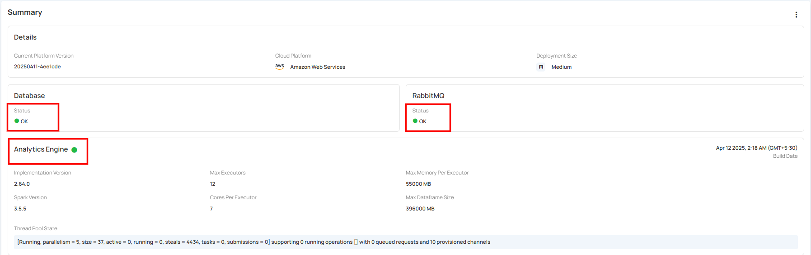
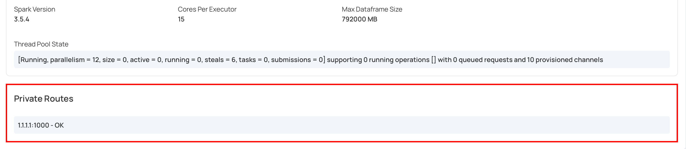
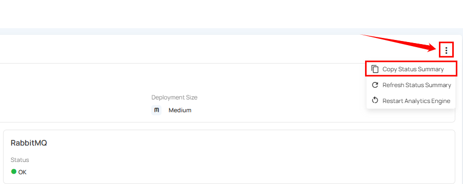
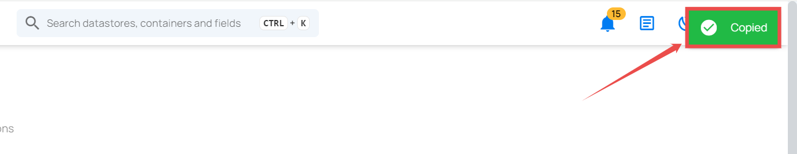
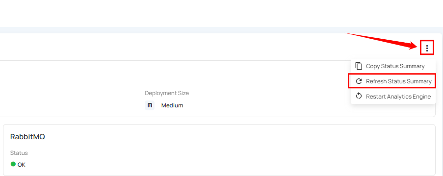
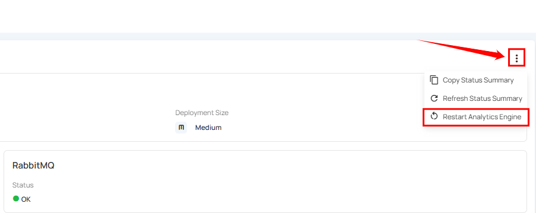
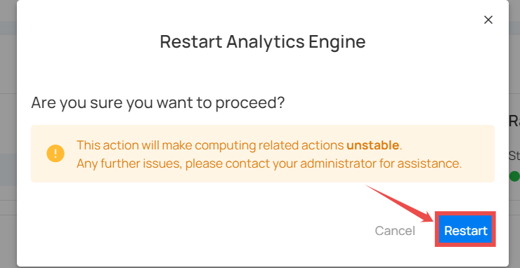
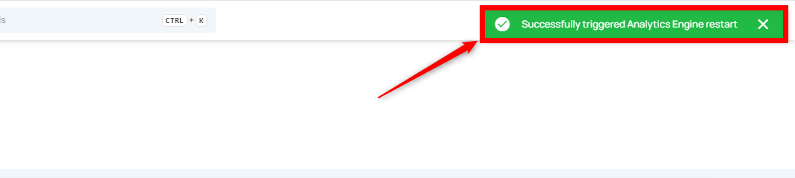

# Status

System status provides a real-time overview of your system's resources, essential for monitoring performance and diagnosing potential issues. It provides key indicators and status updates to help you maintain system health and quickly address potential issues.

## Navigation to Status

**Step 1:** Log in to your Qualytics account and click the **Settings** button on the left side panel of the interface. 

**Step 2:** You will be directed to the Settings page; then click on the **Status** section.

## Platform Status Section

The **Platform Status Section** displays the current platform version, along with the database status and RabbitMQ state.

| REF. | FIELD | ACTION | EXAMPLE |
|----- |-------|--------|---------|
| 1 | Version | Shows the current version of your platform's core software.  | 20260231-196460 |
| 2 | Cloud Platform | Indicates which cloud provider the platform is hosted on. | Amazon Web Services |
| 3 | Deployment Size | Indicates the size of the deployment that the client has contracted. | Medium |
| 4 | License Expiration Date | Displays the current license expiration date and status. | May 31 2026, 9:00 PM (BRT) |
| 5 | Database | Verifies your database connection. An "OK" status means it’s connected. | Status:OK |
| 6 | RabbitMQ | Confirms RabbitMQ (a message broker software) is running correctly with an "OK" state. | State:OK |

## Status Indicator

The status indicator reflects the overall system resources health. For example, in the image below, a green checkmark indicates that our system resources are healthy.

!!! note
    Status indicators are simple: a green checkmark indicates "Healthy," and a red exclamation mark means "Critical."

## Dataplane

The **Dataplane** section provides advanced information about the analytics engine's configuration and current state for technical users and developers.

| REF | FIELD | ACTION | EXAMPLE |
|-----|-------|--------|---------|
| 1 | Build Date | This shows the date and time when the Analytics Engine was built. | Feb 13 2026, 7:20 AM (IST) |
| 2 | Engine | Shows the platform used to run and manage workloads. | Kubernetes |
| 3 | Max Executors | Maximum number of executors allocated for processing tasks. | 12 |
| 4 | Max Memory Per Executor | This shows the maximum amount of memory allocated to each executor. | 55000 MB |
| 5 | Implementation Version | The version of the analytics engine implementation being used.  | 2.109.3-60de4a5 |
| 6 | Spark Version | The version of Apache Spark that the Analytics Engine uses for processing. | 4.0.2 |
| 7 | Core Per Executor | This shows the number of CPU cores assigned to each executor. | 7 |
| 8 | Max Dataframe Size | The maximum size of dataframes that can be processed.  | 396000 MB |
| 9 | Thread Pool State | Indicates the current state of the thread pool used for executing tasks.  | 0 running operations [] with 0 queued requests and 10 provisioned channels |

## Private Routes

Users can now utilize private routes to view their IP addresses along with relevant system messages in the Analytics Engine, ensuring greater transparency and visibility into network activity.

## License Management

The **License section** allows administrators to monitor, renew, and update platform licensing directly from the Status page.

!!! warning 
    The License section is available only for non-SaaS (self-hosted) customers. SaaS environments will not display a License.

### Viewing License Status

The License panel displays:

- Expiration date  

- Remaining days  

- Restriction alerts if expired  

### Generate License Request

If your license is nearing expiration or has already expired, you can request a renewal by clicking the **Generate License Request** button. This will generate a license request code that you can share with your Qualytics account representative to receive a renewed license key.

### Apply a New License

Once you receive a valid license key from your Qualytics representative, follow these steps:

**Step 1:** Click on the **Update License** button to apply a new or renewed license to your system.

A modal window will appear. Paste the provided license key into the input field and click **Submit** to apply the new license.

## Manage Status Summary

You can perform essential tasks such as copying the status summary, refreshing it, and restarting the analytics engine. These functionalities help maintain an up-to-date overview of system performance and ensure accurate analytics.

### Copy Status Summary

The **Copy Status Summary** feature lets you duplicate all data from the Health Section for easy sharing or saving.

**Step 1:** Click the **vertical ellipsis** from the right side of the summary section and choose **Copy Status Summary** from the drop-down menu.

**Step 2:** After clicking on **Copy Status Summary**, a success message appears saying **Copied.**

### Refresh Status Summary

The **Refresh Status Summary** option updates the Health Section with the latest data. This ensures that you see the most current performance metrics and system status.

**Step 1:** Click the **vertical ellipsis** from the right side of the summary section and choose **Refresh Status Summary** to update the latest data.  

## Restart Analytics Engine

The **Restart Analytics Engine** option restarts the analytics processing system. This helps resolve issues and ensures that analytics data is accurately processed.

**Step 1:** Click the **vertical ellipsis** from the right side of the summary section and choose **Restart Analytics Engine** from the drop-down menu. 

**Step 2:** A modal window will pop up. Click the **Restart** button in this window to restart the analytics engine. Restarting the engine helps resolve any issues and ensures that your analytics data is up-to-date and accurately processed.

**Step 3:** After clicking on the **Restart** button, a success message appears saying **Successfully triggered Analytics Engine restart.**

