# Tokens

A token is a secure way to access the Qualytics API instead of using a password. Qualytics provides two types of tokens to meet different authentication needs:

## Token Types

### Personal Access Tokens (PATs)

Personal Access Tokens are designed for individual users to authenticate and interact with the Qualytics API. These tokens are:

- **User-specific**: Each user creates and manages their own tokens
- **Self-service**: Can be generated through the Qualytics UI
- **Ideal for**: Personal development, testing, and ad-hoc API exploration

!!! note
    Tokens are created only once, so you need to copy and store them safely because they cannot be retrieved again.

### Service Tokens

Service Tokens are designed for automated systems and integrations. These tokens are:

- **Administrator-managed**: Only administrators can create and manage service tokens
- **Organization-level**: Created for service accounts rather than individual users
- **Ideal for**: Data pipeline automation, Qualytics API/CLI access, data catalog integrations, and shared automation

!!! tip
    For detailed information about creating and managing Service Accounts and Service Tokens, see the [**Service Accounts**](../service-account/service-account.md){target="_blank"} documentation.

Let's get started 🚀

## Navigation to Tokens

**Step 1**: Log in to your Qualytics account and click the **Settings** button on the left side panel of the interface. 

**Step 2**: By default, you will be navigated to the **Tags** section. Click on the **Tokens** tab.

## Generate Personal Access Tokens (PATs)  

Generating a token provides a secure method for authenticating and interacting with your platform, ensuring that only authorized users and applications can access your resources. Personal Access Tokens (PATs) are particularly useful for automated tools and scripts, allowing them to perform tasks without needing manual intervention. By using PATs, you can leverage our Qualytics CLI to streamline data management and operations, making your workflows more efficient and secure.

**Step 1**: Click on the **Generate Token** button located in the top right corner.

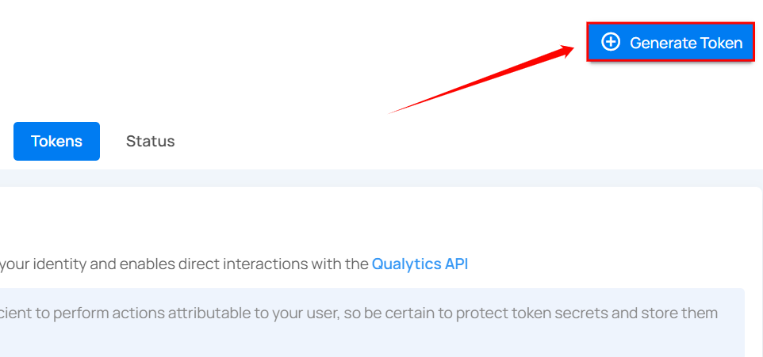

A modal window will appear providing the options for generating the token.

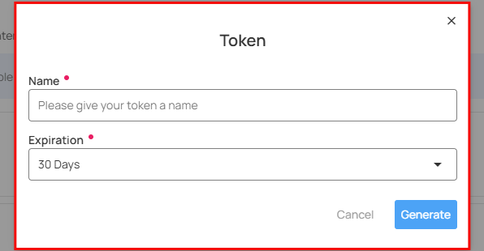

**Step 2**: Enter the following values:

1. **Name**: Enter the name for the Token (e.g., DataAccessToken). 
2. **Type**: Select "Personal" from the dropdown.
3. **Expiration**: Set the expiration period for the token (e.g., 30 days).
4. **SCIM Administration Token**: Enable this option if the token should only be used for SCIM-related operations, such as provisioning or managing user identities.

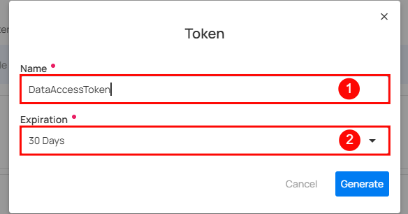

**Step 3**: Once you have entered the values, then click on the **Generate** button.

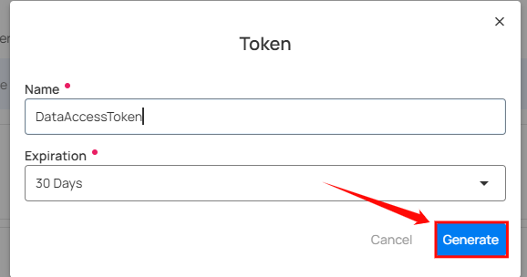

**Step 4**: After clicking on the **Generate** button, your token is successfully generated.

!!! warning 
    Make sure to download or copy this token. You won't be able to see it again. Keep your token confidential and avoid sharing them with anyone. Use a password manager or an encrypted vault to store your tokens.

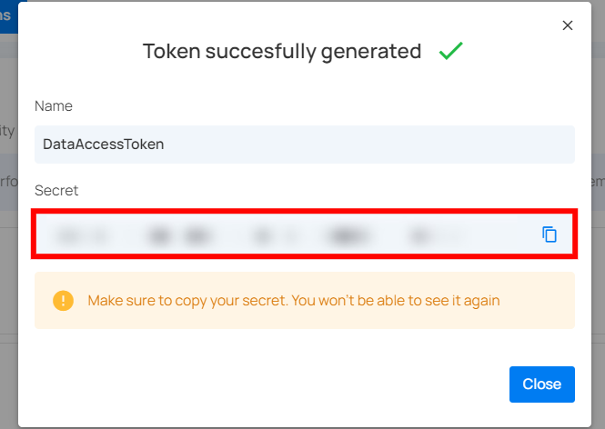

## Token Expiration

Tokens include an expiration period that defines how long they remain valid. When a token reaches its expiration date, it automatically stops working and must be regenerated.

**Available expiration options:**

- 30 Days
- 60 Days
- 90 Days
- 1 Year
- Never

Choosing a time-bound expiration helps maintain security and ensures unused tokens do not stay active indefinitely.

!!! warning
    Avoid using the **Never** expiration option, as tokens that never expire can create security risks.

## Token Usage Status

Each personal API token displays a usage status to indicate whether it has been used for interaction with the Qualytics API:

**Last Used**: This shows the token has been successfully used recently and is actively in use.

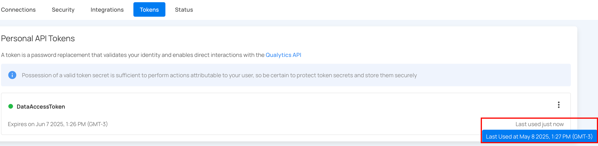

**Not Used**: The token has been generated but has not been used for any API requests since creation.

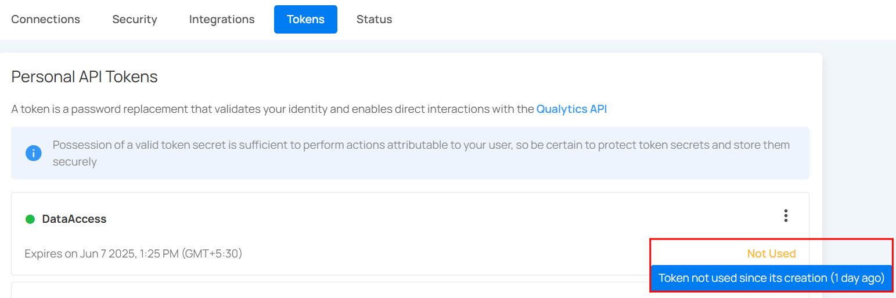

## Revoke Token

You can revoke your token to prevent unauthorized access or actions, especially if the token has been compromised, is no longer needed, or to enhance security by limiting the duration of access.

**Step 1**: Click the **vertical ellipsis (⋮)** next to the user token, that you want to revoke, then click on **Revoke** from the dropdown menu.

**Step 2**: After clicking the **Revoke** button, your user token will be successfully revoked. A success message will display saying **The token has been successfully revoked**. Following revocation, the token's status color will change from green to orange.

## Restore Token

You can restore a token to reactivate its access, allowing authorized use again. This is useful if the token was mistakenly revoked or if access needs to be temporarily re-enabled without generating a new token.

**Step 1**: Click the **vertical ellipsis (⋮)** next to the revoked tokens, that you want to restore, then click on the **Restore** button from the dropdown menu.

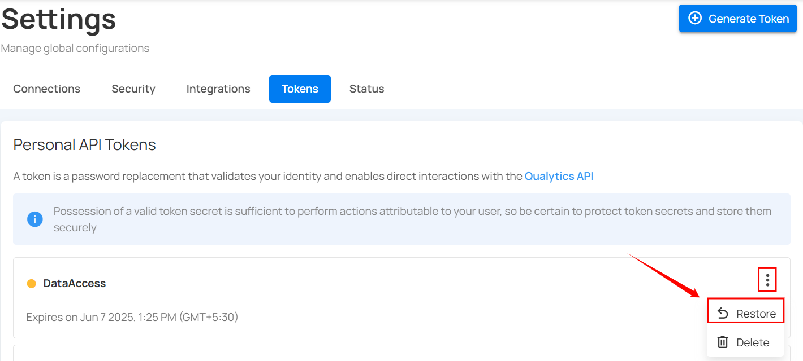

**Step 2**: After clicking on the **Restore** button, your secret token will be restored and a confirmation message will display saying **"The token has been successfully restored"**.

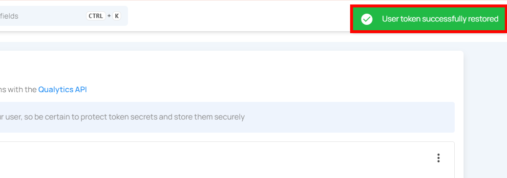

## Delete Token

You can delete a token to permanently remove its access, ensuring it cannot be used again. This is important for maintaining security when a token is no longer needed, has been compromised, or to clean up unused tokens in your system.

!!! note 
    You can only delete revoked tokens, not active tokens. If you want to delete an active token, you must first revoke it before you can delete it.

**Step 1**: Click the **vertical ellipsis (⋮)** next to the revoked tokens, that you want to delete, then click on the **Delete** button from the dropdown menu.

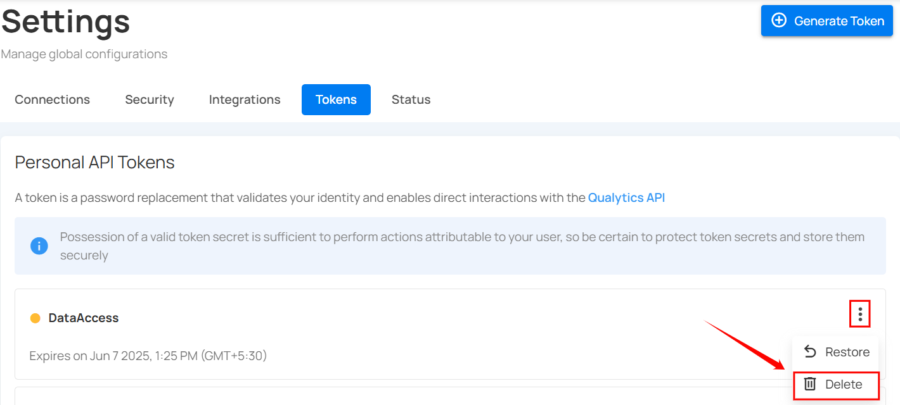

After clicking the delete button, a confirmation modal window **Delete Token** will appear.

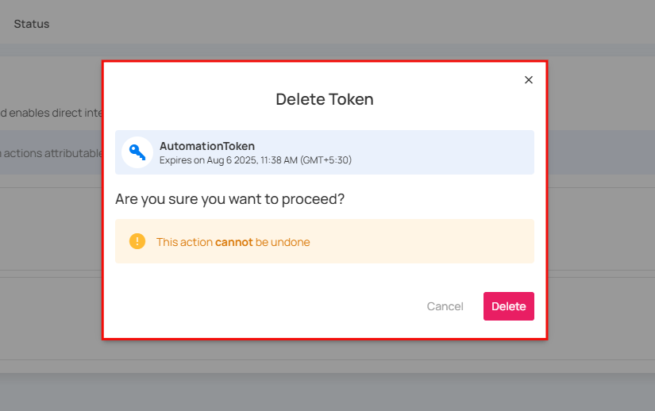

**Step 2**: Click on the **Delete** button to delete the token.

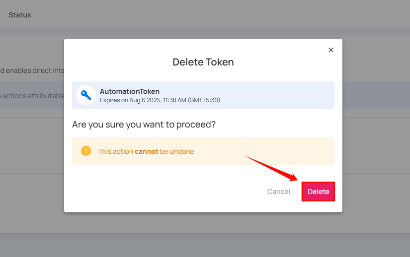

After clicking on the **Delete** button, your token will be deleted and a confirmation message will display saying **User token successfully deleted**.

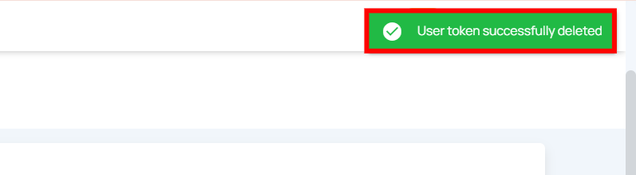